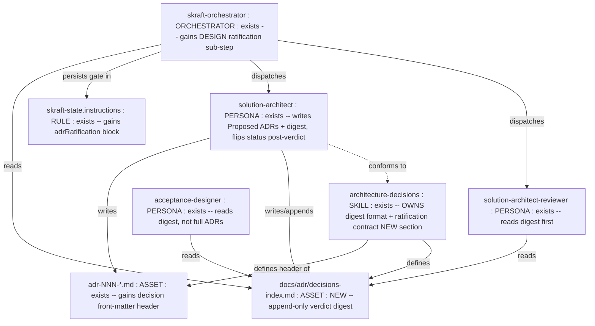
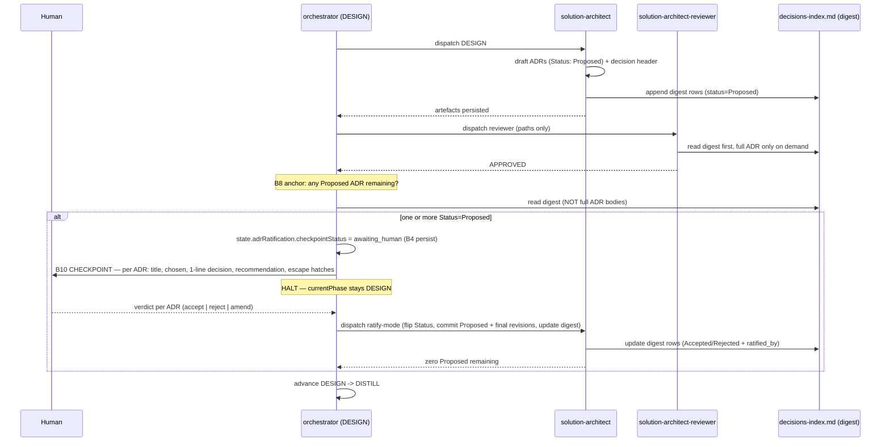
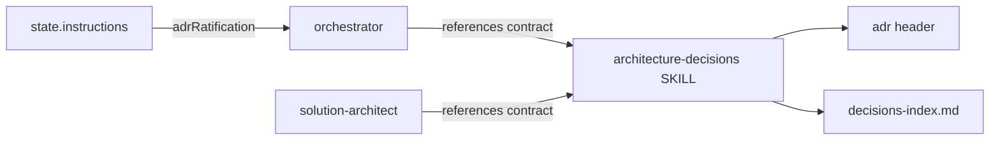

<!-- markdownlint-disable-file -->
# Genesis Handoff Packet — ADR Ratification Gate + Decision Ledger

> Design artifact (genesis step 6). Source of truth for the refactor.
> DESIGN ends here; module bodies are drafted in step 7b (separate step).

## Step 1 — Intent + scope

**Capability.** When the DESIGN phase produces ADRs, the pipeline MUST
halt and let a human ratify each `Proposed` ADR **before** advancing to
DISTILL — because the ADR set IS the future trajectory and the human owns
that choice. Separately, no reader (orchestrator checkpoint, reviewer,
DISTILL, Phase-1 blocker re-grounding) should need to re-read a full ADR
body to learn its verdict: a compact, append-only **decision digest**
carries the verdict-bearing fields.

**Boundary — what it does NOT do.** It does not change ADR authoring
quality rules, does not let the agent decide the verdict, does not add a
new reviewer, does not touch DELIVER. Two distinct capabilities → but they
share one artifact (the digest is both the human-checkpoint payload AND the
cheap re-read surface), so they are designed together, not split.

**Cost stance.** `balanced`. No cap. Net cost is NEGATIVE: the gate adds
one human round-trip (~0 tokens); the digest replaces N full-ADR re-reads
with one ~15-line read at every re-grounding boundary.

## Step 2 — Component diagram



## Step 3 — Thread / sequence diagram

Pattern selection (tier order):
- **Refactor**: R3 EXTRACT — the ratification contract is currently
  scattered (prose in the skill + the persona) and unenforced by the
  orchestrator. Extract it into `architecture-decisions` as the single
  source; orchestrator + persona reference it.
- **Tier 3 (architectural)**: ORCHESTRATOR-SAGA with an added GATE stage
  (no PANEL — the reviewer already is the panel).
- **Tier 2 (design)**: **B10 HUMAN CHECKPOINT** (the gate) + **B4 PLAN
  MEMENTO** (digest + `state.adrRatification` survive turns) + **B13
  CACHE-AWARE PREFIX** (digest = stable cheap re-read; full ADR = variable
  body read only on demand) + **B8 ATTENTION ANCHOR** (pre-advance
  checklist).



### 3.1 Tradeoff check — checkpoint placement

Matrix: gate-type / placement. Two options fit the slot:

| Placement | Failure mode guarded | Verdict |
|---|---|---|
| Gate BEFORE reviewer | Human ratifies a draft that may fail adversarial review → wasted human attention → trains rubber-stamping (`CHATTY GATE`) | rejected |
| **Gate AFTER reviewer-APPROVED** | Human only ratifies a quality-checked decision; reviewer filters quality, human owns trajectory | **chosen** |

Cite: B10 anti-patterns `CHATTY GATE` + `POST-HOC CHECKPOINT`. The current
pipeline advances to DISTILL with no verdict = `POST-HOC` (DISTILL acts on
an un-ratified trajectory). The fix makes the verdict a hard pre-condition
for the phase advance.

### 3.2 Cost check

No `task()` spawns added. Role classes unchanged (`solution-architect` =
planner; reviewer unchanged). Output-volume band: the digest is **S**
(bounded, ~1 row/ADR). The digest is a **cache-stable prefix** (B13): place
the decision header at the TOP of each ADR so a reader greps the first ~10
lines instead of the whole body. Re-grounding read drops from O(sum of ADR
bodies) to O(digest). Net: cost-negative. Skip deeper projection (stance
balanced, savings obvious).

### 3.5 Composition decision

| Box | Mode | Rationale |
|---|---|---|
| Decision header format | INLINE in `architecture-decisions` SKILL | ADR artifact convention, unique to that skill |
| `decisions-index.md` ledger format | INLINE in `architecture-decisions` SKILL | sibling of existing `supersessions.md` registry — same append-only doctrine |
| Ratification contract (gate semantics) | INLINE in `architecture-decisions` SKILL (single source) referenced by orchestrator + persona | R3 EXTRACT: remove scatter |
| `adrRatification` state block | edit `skraft-state.instructions` (RULE) | state schema owner |
| DESIGN ratification sub-step | edit `skraft-orchestrator.agent.md` | orchestrator owns phase routing |
| Persona write of header+ledger; ratify-mode | edit `solution-architect.agent.md` Phase 7.5 + Phase 10 | persona owns artefact production |
| Reviewer/DISTILL read digest first | one-line note in each | readers, low blast radius |

No EXTERNAL modules. No module-system adapter needed at step 7b.



## Step 4 — SoC pass

- Existing module already does this? The ratification is *described* in
  `architecture-decisions` + `solution-architect` Phase 7.5 but **not
  enforced** by the orchestrator → not duplication, it is a missing wire +
  an EXTRACT of the contract to one owner. PASS.
- Trigger collision? None — no new dispatch description; edits are to
  existing primitives. PASS.
- R1 SPLIT? No conjunction split needed; the two capabilities share the
  digest artifact (coherent unit). PASS.
- S7 DETERMINISTIC TOOL BRIDGE? The status flip + the two commits
  (`Proposed`, final) are CONSEQUENTIAL SIDE EFFECTS and FACTS-THAT-MUST-BE-
  TRUE (git history). They already cross the terminal (`git commit`) via the
  persona — keep that bridge; the orchestrator must NOT assert "ratified" in
  prose, it must read the digest status written by the persona's tool call.
  PASS (bridge already present; reinforce in step 8).

## Step 5 — Compliance check

| Axis | Finding | Severity |
|---|---|---|
| Progressive disclosure | Header (cheap) before body (full) — B13 honored | OK |
| Reduced scope | No DELIVER/DISTILL behavior change beyond a read-source swap | OK |
| Safety boundaries | Verdict owned by human; agent cannot self-ratify; commits land in git | OK |
| Explicit hierarchy | Contract single-sourced in the SKILL | OK |
| B10 anti-patterns | `POST-HOC` (current bug) fixed; `CHATTY` avoided (gate after reviewer); `FALSE-CHOICE` avoided (accept/reject/amend genuinely diverge); not `POST-HOC` (advance blocked until verdict) | OK |
| B4 | digest + `state.adrRatification` reloaded at the checkpoint and on resume — not WRITE-ONCE | OK |

No BLOCKER. Design proceeds.

## Step 6 — Handoff packet

### Interface sketches

**Decision header (top of every `adr-NNN-*.md`)** — the stable digest:
```yaml
---
adr: 7                       # int, matches filename NNN
title: Conformist mapping Eligibility -> Policy
status: Proposed             # Proposed|Accepted|Rejected|Deprecated|Superseded
chosen: Conformist           # the picked option, one token/phrase
decision: >                  # one sentence, the verdict in plain words
  Eligibility conforms to Policy's RiskProfile VO; ACL dropped.
supersedes: ADR-3            # or null
date: 2026-06-23
ratified_by: null            # "{human} {YYYY-MM-DD}" set on Accept/Reject
---
```
Readers grep ONLY this frontmatter for the verdict; load the body solely
when decision *rationale* is needed.

**`docs/adr/decisions-index.md`** (NEW, append-only digest, sibling of
`supersessions.md`):
```markdown
<!-- markdownlint-disable-file -->
# ADR decision index (append-only digest)

| ADR | Title | Status | Chosen | Decision (1 line) | Ratified by | Date |
|---|---|---|---|---|---|---|
| 007 | Conformist Eligibility->Policy | Proposed | Conformist | Eligibility conforms to RiskProfile VO; ACL dropped | — | 2026-06-23 |
```
- Inputs: each ADR's decision header.
- Outputs: one row per ADR; updated in place on status flip (the only
  mutable column triplet is Status / Ratified by while the row stays).
- Readers: orchestrator checkpoint, reviewer, acceptance-designer,
  Phase-1 blocker re-grounding.

**`state.adrRatification`** (NEW block in state schema):
```json
"adrRatification": {
  "checkpointStatus": "none | awaiting_human | resolved",
  "pending": [
    { "adr": "007", "title": "...", "recommended": "accept", "status": "Proposed" }
  ],
  "ratified": [
    { "adr": "006", "verdict": "Accepted", "by": "alice 2026-06-23" }
  ]
}
```
Persists the gate across turns; on resume the orchestrator re-enters the
checkpoint instead of advancing.

**Orchestrator DESIGN sub-step** (inserted between reviewer-APPROVED and
phase-advance):
1. On DESIGN reviewer = APPROVED → read `docs/adr/decisions-index.md`
   (NOT full ADR bodies).
2. If any row Status = `Proposed` → set
   `adrRatification.checkpointStatus = "awaiting_human"`, copy those rows to
   `pending`, keep `currentPhase = DESIGN`, write state, emit B10 prompt,
   HALT.
3. Next turn with a human verdict → dispatch `solution-architect`
   **ratify-mode**: flip each `Status`, set `ratified_by`, commit the
   `Proposed` and final revisions, update the digest rows; move rows
   `pending → ratified`; set `checkpointStatus = "resolved"`.
4. Only when zero `Proposed` remain → advance DESIGN → DISTILL.

**B10 checkpoint prompt template** (orchestrator → human):
```markdown
## DESIGN — ratification required (N ADRs await your decision)

Reviewer verdict: APPROVED. The trajectory below is YOUR call.

For each, reply: accept | reject | amend "<note>".

1. ADR-007 — Conformist mapping Eligibility -> Policy
   - Decision: Eligibility conforms to RiskProfile VO; ACL dropped.
   - Recommended: accept  (reviewer found no blocker)
   - Full rationale: docs/adr/adr-007-*.md (read only if needed)

Escape hatches: "reject all", "accept all", "pause — I'll read first".
Nothing advances to DISTILL until every ADR is Accepted or Rejected.
```

### Module composition table

See step 3.5 — all LOCAL edits to existing primitives + one new INLINE
asset (`decisions-index.md`). No EXTERNAL modules.

### Declared target set

`common-only`. No harness-specific syntax. Markdown + JSON + prose only.

### Invocation modes

Unchanged. No new dispatchable module; edits ride existing FORCED dispatch
(orchestrator → solution-architect / reviewer).

### Open compliance findings

None at BLOCKER/HIGH. One MEDIUM to verify at step 8: ensure the orchestrator
reads the digest (not full ADRs) — guard against a reader regressing to full
re-read (defeats B13).

### Todo list (step 7b drafting order)

1. `architecture-decisions/SKILL.md` — add **Decision Header** + **Decision
   Index** sections (formats above) and the **Ratification Contract**
   (single source of the gate semantics). [no deps]
2. `skraft-state.instructions.md` — add `adrRatification` block to schema +
   field semantics + transition rule "DESIGN advances only when zero
   Proposed ADRs remain". [dep: 1 for vocabulary]
3. `skraft-orchestrator.agent.md` — DESIGN phase: insert the ratification
   sub-step + B10 prompt template + ratify-mode re-dispatch. [dep: 1,2]
4. `solution-architect.agent.md` — Phase 7.5 write decision header; Phase 10
   write/append `decisions-index.md`; add ratify-mode (flip + commit +
   digest update). [dep: 1]
5. `solution-architect-reviewer` + `acceptance-designer` — one line each:
   "read `docs/adr/decisions-index.md` for verdicts; load full ADR only for
   rationale". [dep: 1]
6. VALIDATE (step 8).

### Cost projection

- Per module: planner class unchanged; no cache invalidator introduced
  (digest header is stable, no timestamp in a persona prefix).
- Workflow: +1 human round-trip per DESIGN pass (token ~0). Re-grounding
  reads: from O(Σ ADR bodies) to O(digest). S/M/L all net-negative.
- Stance `balanced`; no cap; no halt.

### Evals plan

- CONTENT EVAL 1 (gate fires): given a DESIGN pass that produced one
  `Proposed` ADR and a reviewer APPROVED, the pipeline HALTS at the
  checkpoint and does NOT write DISTILL artefacts. `without` the change it
  advances to DISTILL → visible delta.
- CONTENT EVAL 2 (cheap verdict): given 3 ADRs, a reader obtains all 3
  verdicts from `decisions-index.md` alone (no full ADR body loaded).
- CONTENT EVAL 3 (resume): kill the session at `awaiting_human`; on resume
  the orchestrator re-enters the checkpoint (reads `state.adrRatification`),
  not DISTILL.

## DESIGN ENDS HERE

Next: step 7b drafts the 5 module edits in the todo order above. Reload this
packet before each edit (B4).
