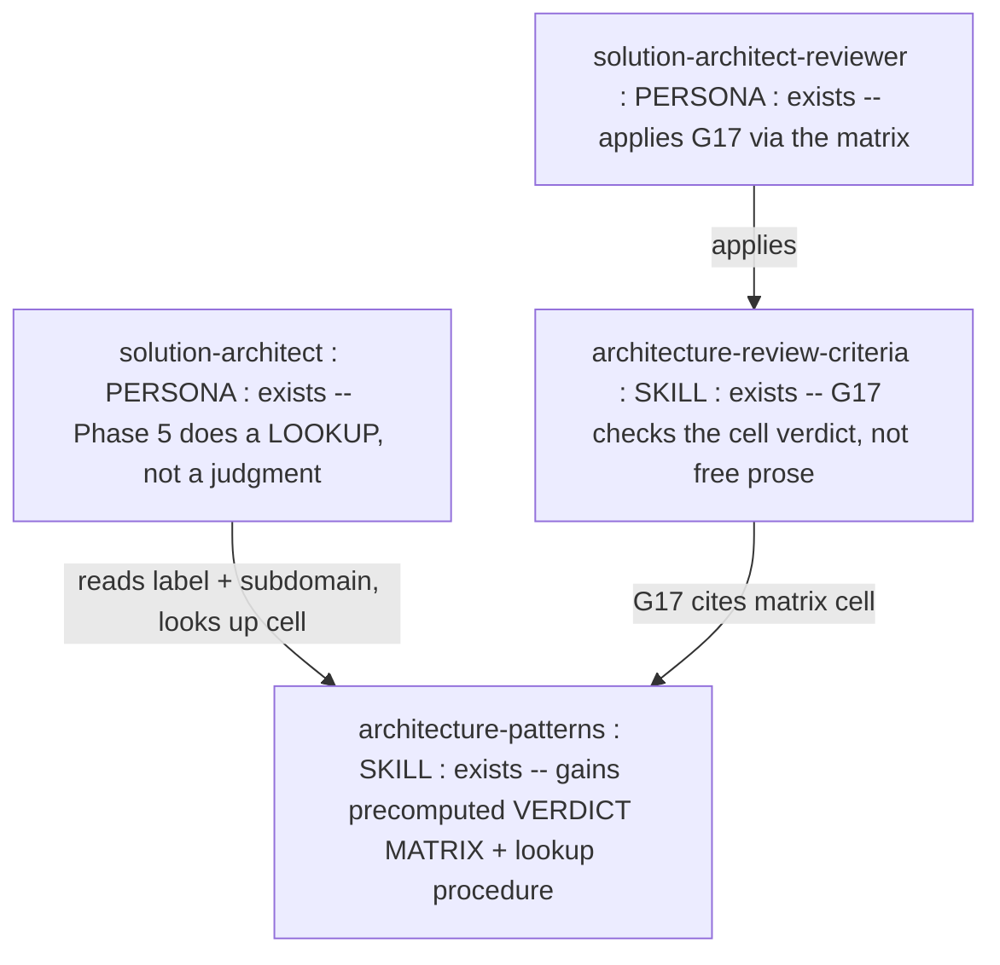
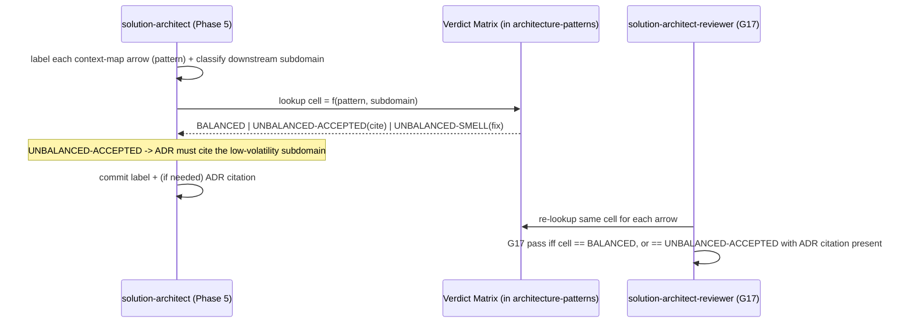

<!-- markdownlint-disable-file -->
# Genesis Handoff Packet — Balanced Coupling Autonomy (verdict matrix)

> Design artifact (genesis step 6). Source of truth for the refactor.
> DESIGN ends here; module bodies drafted in step 7b (same session).

## Step 1 — Intent + scope

**Capability.** Make the Balanced Coupling principle applicable
*autonomously and correctly by a small / low-reflection agent*. The
previous edit encoded the principle as PROSE reasoning ("classify
integration strength, classify distance, compute `STRENGTH XOR
DISTANCE`, factor volatility"). That is a multi-step judgment — reliable
for a planner-class model, fragile for a weak one. This design removes the
reasoning: because in SKRAFT every coupling decision is already an
enumerated LABEL (a context-map pattern: Conformist / ACL / OHS+PL /
Shared Kernel / Partnership / Separate Ways) crossed with an enumerated
SUBDOMAIN CLASS (Core / Supporting / Generic → volatility), the balance
verdict is a **total function over a finite domain**. Precompute it into a
verdict matrix. The agent reads the arrow label + the downstream subdomain
class off the artefacts it already produced, then looks up ONE cell. Zero
arithmetic, zero classification reasoning.

**Boundary — what it does NOT do.** Does not add a runtime hook or CLI
(the verdict is not a consequential state mutation — it is advisory input
to an ADR; a precomputed table IS the deterministic bridge here, see Step
4 S7). Does not change any context-mapping pattern definition. Does not
touch DELIVER/DISTILL. Does not attempt to auto-classify strength/distance
from raw code — it consumes the LABEL the architect already committed.

**Cost stance.** `balanced`, no cap. Cost-negative: replaces a per-arrow
reasoning chain with a single table lookup — fewer tokens AND lower model
tier sufficient.

## Step 2 — Component diagram

## Step 3 — Thread / sequence diagram

Pattern selection (tier order):
- **Refactor**: R3-adjacent — extract the *reasoning* into a *precomputed
  artefact*. The prose stays as the WHY (for humans / strong models); the
  matrix is the deterministic HOW (for any model).
- **Tier 3**: none (no new topology).
- **Tier 2**: **S7 DETERMINISTIC TOOL BRIDGE (table form)** — the verdict
  is resolved by lookup, not asserted from recall. **B13 CACHE-AWARE
  PREFIX** — the matrix is a small stable table, cheap to reload every
  DESIGN session. **C-class autonomy**: a low-tier model pattern-matches a
  concrete table far better than it executes a boolean-algebra chain
  (genesis: "agents pattern-match against concrete structure better than
  against prose description").

### 3.1 Tradeoff check — matrix vs. CLI (both fit the S7 slot)

Matrix: gate-type. Two S7 realizations compete:

| Realization | Failure mode guarded | Verdict |
|---|---|---|
| Runtime CLI (`coupling-policy.mjs` + hook) | Would deterministically compute the XOR — but the XOR is trivial; the hard input (the label) is still human/LLM-authored, and the verdict is advisory (feeds an ADR, mutates no state). A hook here = `S4 WRAPPING WITHOUT BLOCKING` theatre + over-engineering. | rejected |
| **Precomputed verdict matrix in the always-loaded skill** | The real risk is a weak model mis-reasoning the classification chain. A finite precomputed table removes the chain entirely — lookup, not compute. | **chosen** |

The domain is finite and closed (6 patterns × 3 subdomain classes = 18
cells), so a table is TOTAL and needs no runtime evaluation. Cited so a
future reader does not "upgrade" this into a hook by reflex.

### 3.2 Cost check

No spawns, no role-class change (`solution-architect` stays planner; the
POINT is that G17 no longer *requires* planner-class reasoning — a cheaper
model could execute the lookup). Output band **S** (one table). No cache
invalidators. Net negative.

### 3.5 Composition decision

| Box | Mode | Rationale |
|---|---|---|
| Verdict matrix + lookup procedure | INLINE in `architecture-patterns` (already always-loaded by solution-architect) | The prose "Balanced Coupling" section it precomputes lives there; single owner |
| G17 wording | edit `architecture-review-criteria` | gate owner; point it at the matrix cell |
| Phase 5 lookup step | edit `solution-architect.agent.md` | persona owns phase procedure; make it a lookup |

No EXTERNAL modules. No module-system adapter. `common-only`.

## Step 4 — SoC pass

- Duplicate? No — extends the existing Balanced Coupling section; the
  matrix is the deterministic projection of the same rule already stated
  in prose. PASS.
- S7 DETERMINISTIC TOOL BRIDGE trigger? The verdict is a FACT the ADR
  relies on. Is it a CONSEQUENTIAL SIDE EFFECT or a hard FACT-THAT-MUST-BE-
  TRUE warranting a terminal/CLI? NO — it mutates no state and is derivable
  by a total table lookup with no external input. Per the S7 selection
  rule, the precomputed table IS the deterministic bridge (no terminal
  needed when the fact is a closed-domain lookup). Building a CLI/hook
  would be PREMATURE and would trip `S4 wrapping without blocking`. PASS.
- R1 SPLIT? No conjunction. PASS.
- Overlap with G6? G6 forbids `Conformist` on a Core downstream
  categorically; G17 is the *general* balance rule of which G6 is the
  sharpest single instance. Kept distinct: G6 = one hard-illegal label;
  G17 = the matrix that also flags the *accepted-but-must-cite* cells. No
  merge (they fire different verdict shapes). PASS.

## Step 5 — Compliance check

| Axis | Finding | Severity |
|---|---|---|
| Autonomy for weak models | Judgment → lookup; no boolean-algebra chain executed at runtime | OK (this is the whole point) |
| Progressive disclosure | Matrix in already-loaded skill, read only at Phase 5 | OK |
| Explicit hierarchy | Rule single-sourced; matrix is its deterministic face | OK |
| Safety boundaries | Advisory verdict; no state mutation; human still ratifies the ADR | OK |
| Totality | 6 patterns × 3 subdomains fully enumerated — no undefined cell | OK |
| Pattern-match over prose | Concrete table beats prose for low-tier models | OK |

No BLOCKER.

## Step 6 — Handoff packet

### The verdict matrix (the deliverable)

Each context-mapping pattern carries a fixed (strength, distance)
signature; each subdomain class carries a fixed volatility. Rule
`BALANCE = (STRENGTH XOR DISTANCE) OR NOT VOLATILITY` is precomputed:

| Pattern (arrow label) | Strength | Distance | Core downstream (volatile) | Supporting / Generic downstream (low volatility) |
|---|---|---|---|---|
| Shared Kernel | High | Low | BALANCED | BALANCED |
| Partnership | High | Low | BALANCED | BALANCED |
| Anti-Corruption Layer | Contract | High | BALANCED | BALANCED |
| Open Host Service / Published Language | Contract | High | BALANCED | BALANCED |
| Separate Ways | None | High | BALANCED | BALANCED |
| Conformist | High | High | **UNBALANCED-SMELL** (fix: ACL/OHS+PL) | **UNBALANCED-ACCEPTED** (ADR must cite low volatility) |

- `BALANCED` → nothing to justify.
- `UNBALANCED-ACCEPTED` → admissible ONLY if the ADR cites the
  Supporting/Generic subdomain as the low-volatility trade-off.
- `UNBALANCED-SMELL` → G17 HIGH finding; also already G6 for the Conformist
  ⊕ Core case (the two gates agree on that one cell).

### Interface sketches

- `architecture-patterns` "Balanced Coupling" section gains the matrix +
  a 3-step lookup procedure (read label → read downstream subdomain →
  read cell).
- `architecture-review-criteria` G17 reworded: "look up the cell; fail on
  UNBALANCED-SMELL; require ADR citation on UNBALANCED-ACCEPTED."
- `solution-architect` Phase 5 step reworded from "check against the rule"
  to "look up the matrix cell."

### Declared target set

`common-only`.

### Invocation mode

DISCOVERY-loaded (Phase 5 of solution-architect) + reviewer gate. Not
user-invocable, not hook-forced.

### Todo list

1. Add verdict matrix + lookup procedure to `architecture-patterns`. [7b]
2. Reword G17 to a cell lookup in `architecture-review-criteria`. [7b]
3. Reword Phase 5 hook in `solution-architect` to a lookup. [7b]

### Evals plan (abbreviated)

- Content eval: give a low-tier model a context map with a
  `Conformist` arrow into a Core context. With the matrix → it returns
  `UNBALANCED-SMELL` by lookup. Without → it must reason the XOR chain
  (fragile). Delta = autonomy.
- No trigger evals (DISCOVERY-loaded by one named agent).

### Cost projection

Qualitative: role class unchanged in metadata, but effective floor drops
(lookup executable below planner tier); output band S; no invalidators;
net-negative.

DESIGN ENDS HERE. Bodies drafted next (step 7b, common-only).
