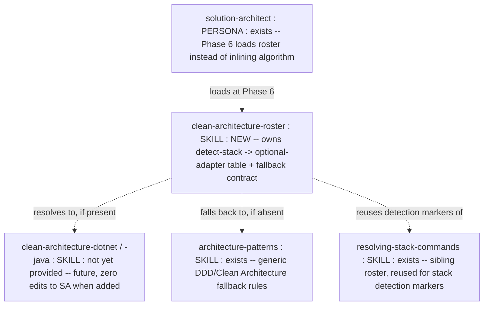
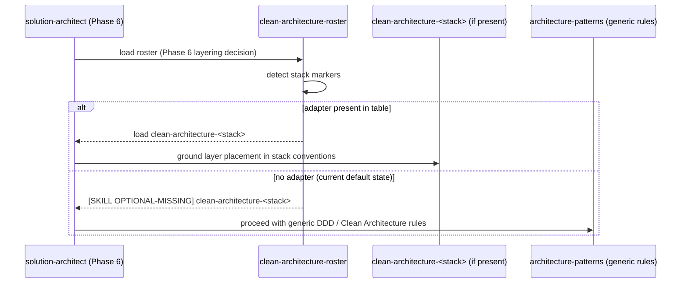
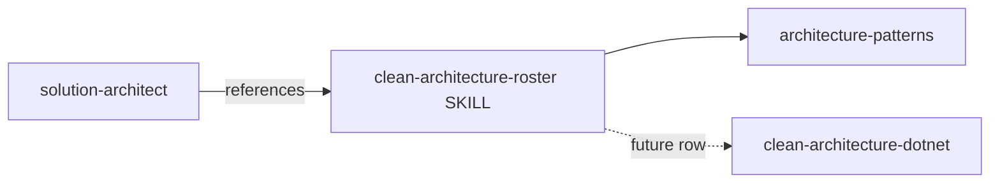

<!-- markdownlint-disable-file -->
# Genesis Handoff Packet — Clean Architecture Roster (skill modularity consistency)

> Design artifact (genesis step 6). Source of truth for the refactor.
> DESIGN ends here; module bodies are drafted in step 7b (separate step).

## Step 1 — Intent + scope

**Capability.** `solution-architect` currently INLINES a detect-stack ->
load-optional-adapter -> fallback algorithm in its own prose (frontmatter
"Load on demand (Phase 6...)" section) to ground DDD layer-placement
decisions in stack-native conventions (`clean-architecture-<language>`).
Every other "which adapter for this stack" decision in the plugin
(`contract-testing-roster`, `mocking-strategy-roster`,
`resolving-stack-commands`) is factored into a dedicated ROSTER skill that
owns the detection table and the fallback contract, so the agent body says
only "load the roster". This design extracts the same algorithm into a new
`clean-architecture-roster` skill, so all four "stack -> adapter" decisions
in the plugin share one composition shape.

**Boundary — what it does NOT do.** It does not author any
`clean-architecture-<stack>` adapter skill (none exist yet in this plugin;
the roster's table stays `not yet provided` until one ships). It does not
change DDD/tactical design rules, ADR rules, or any other Phase in
`solution-architect`. It does not touch DISTILL/DELIVER rosters.

**Cost stance.** `balanced`. No cap. Net cost is NEGATIVE-to-neutral: the
roster load replaces ~5 lines of inline algorithm with a link; the roster
body itself is read only when Phase 6 needs stack grounding (progressive
disclosure unchanged).

## Step 2 — Component diagram

Existing sibling rosters (for SoC comparison, not modified):
`contract-testing-roster`, `mocking-strategy-roster`, `resolving-stack-commands`.

## Step 3 — Thread / sequence diagram

Pattern selection (tier order):
- **Refactor**: R3 EXTRACT — the body inlines a detect/fallback algorithm
  that belongs in a separate skill; three sibling instances of this exact
  algorithm already exist as dedicated rosters (duplication-by-divergence
  risk: the 4th copy could drift from the established contract).
- **Tier 3 (architectural)**: none needed — single skill addition, no new
  orchestration topology.
- **Tier 2 (design)**: **S7 DETERMINISTIC TOOL BRIDGE variant** (roster
  resolves a fact — "does an adapter exist" — via table lookup, not
  LLM guess) + **B13 CACHE-AWARE PREFIX** (roster body is a short, stable
  table; cheap to reload every DESIGN session).

### 3.1 Tradeoff check — gate shape (blocking vs non-blocking roster)

Matrix: gate-type / severity-on-miss. Two shapes exist among sibling
rosters:

| Shape | Used by | Failure mode guarded |
|---|---|---|
| STOP on unsupported stack (blocking) | `contract-testing-roster`, `mocking-strategy-roster`, `resolving-stack-commands` | Missing adapter means the REQUIRED test harness cannot be built — proceeding would hand-roll a fake harness (HAND-ROLLED HALLUCINATION). |
| **Proceed on missing adapter (non-blocking)** | **`clean-architecture-roster` (chosen)** | Layer-placement grounding is an ENHANCEMENT over an already-complete generic rule set (`architecture-patterns` + DDD rules already in `solution-architect`). Blocking DESIGN on a missing style adapter would be a `CHATTY GATE` — halting for a decision that has a safe, already-authored default. |

Cited: this is a deliberate, documented deviation from the sibling rosters'
STOP contract — recorded so a future reader does not "fix" it into a
blocking gate by copy-paste.

### 3.2 Cost check

No `task()` spawns added; no new agent. Role class unaffected
(`solution-architect` stays `planner`). Output-volume band of the new
skill: **S** (table + short contract, mirrors `contract-testing-roster`
size). Cache impact: neutral — replaces inline prose of similar size with
a link + occasional roster-body read. Stance `balanced`: no further
projection needed.

### 3.5 Composition decision

| Box | Mode | Rationale |
|---|---|---|
| `clean-architecture-roster` SKILL.md | **LOCAL SIBLING** (`plugins/skills/clean-architecture-roster/`) | Reused only within this plugin; matches the 3 sibling rosters' placement. `apm.yml` uses `includes: auto` — no manifest edit needed (confirmed: sibling skills are not individually declared). |
| Detect-stack/fallback algorithm | moved OUT of `solution-architect.agent.md` INTO the roster | R3 EXTRACT |
| Generic DDD/Clean Architecture fallback rules | stay INLINE in `architecture-patterns` + `solution-architect` body (unchanged) | already the correct owner; roster only points at them on miss |
| Future `clean-architecture-<stack>` adapters | LOCAL SIBLING, added later, zero edits to `solution-architect` or the roster's callers | mirrors `contract-testing-dotnet` / `mocking-*-dotnet` precedent |

No EXTERNAL modules. No module-system adapter needed at step 7b.

## Step 4 — SoC pass

- Existing module already does this? No dedicated roster existed for this
  axis; the algorithm was duplicated ad hoc inline instead of reusing the
  established roster shape. Extract, do not duplicate further. PASS
  (post-fix).
- Dispatch description collision? None — new skill's trigger is scoped to
  "ground Clean Architecture layer-placement in stack" and is loaded only
  by `solution-architect`; no overlap with `contract-testing-roster` /
  `mocking-strategy-roster` (different artefact concerns: harness/mock vs.
  layer placement). PASS.
- R1 SPLIT trigger? No — single responsibility (stack -> adapter or
  fallback). PASS.
- R2 FUSE? Considered folding into `resolving-stack-commands` (same
  "detect stack" verb) — REJECTED: that roster resolves BUILD/TEST/MUTATION
  commands (a hard, always-required axis); this roster resolves an OPTIONAL
  style adapter with a soft fallback. Different failure-mode contracts
  (step 3.1) — fusing would force one gate shape onto both. Kept separate;
  cross-reference instead (roster reuses its detection markers by mention,
  not by inlining the table).
- R3 EXTRACT? Yes — this IS the R3 EXTRACT this design performs.
- R4 INLINE? Not applicable — no thin single-caller proxy is being removed.

## Step 5 — Compliance check

| Axis | Finding | Severity |
|---|---|---|
| Progressive disclosure | Roster loaded only at Phase 6, same trigger condition as before | OK |
| Reduced scope | No other phase or agent touched | OK |
| Orchestrated composition | Consistent with 3 sibling rosters — new module, not new orchestration layer | OK |
| Safety boundaries | No consequential side effect; pure resolution + prose fallback | OK |
| Explicit hierarchy | Algorithm single-sourced in the roster; `solution-architect` references it | OK |
| MODULE ENTRYPOINT spec | `name: clean-architecture-roster` matches directory, lowercase-hyphen, <=64 chars; description imperative, intent-first, indirect triggers named, <=1024 chars | OK |
| Size budget | SKILL.md body well under 500 lines / 5000 tokens (mirrors sibling roster size, ~90 lines) | OK |

No BLOCKER. Design proceeds.

## Step 6 — Handoff packet

### Interface sketch

**`plugins/skills/clean-architecture-roster/SKILL.md`** (NEW)
- Trigger: `solution-architect` Phase 6 (DDD tactical design / layer
  placement).
- Inputs: repo stack detection markers (reuse `resolving-stack-commands`
  markers by reference).
- Outputs: either "load `clean-architecture-<stack>`" or
  "`[SKILL OPTIONAL-MISSING] clean-architecture-<stack>`, proceed with
  generic rules".
- Dependencies: `architecture-patterns` (fallback rules owner),
  `resolving-stack-commands` (detection markers, referenced not duplicated).

**`plugins/agents/solution-architect.agent.md`** (EDIT)
- Frontmatter `metadata.skills` gains `clean-architecture-roster`.
- "Load on demand (Phase 6 — language-specific layering)" body line
  replaced with a roster reference (mirrors how `software-engineer`
  references `mocking-strategy-roster` / `contract-testing-roster` via its
  worker table, and how `resolving-stack-commands` is referenced by
  `acceptance-designer` / `software-engineer`).
- Phase 6 body's parenthetical `If a clean-architecture-<language> skill
  was loaded...` line is unchanged (still correct — it consumes whatever
  the roster resolved).

### Module composition table

See Step 3.5 table above (duplicated here per template — LOCAL SIBLING,
no external modules).

### Declared target set

`common-only` — no per-harness syntax; pure markdown skill + link edit.

### Invocation mode

DISCOVERY-loaded by `solution-architect` at Phase 6 (not user-invocable,
not FORCED by a hook).

### Compliance findings still open

None (Step 5 clean).

### Todo list

1. Create `plugins/skills/clean-architecture-roster/SKILL.md`. [done at
   step 7b of this session]
2. Edit `plugins/agents/solution-architect.agent.md`: add roster to
   `metadata.skills`, replace inline algorithm with roster reference.
   [done at step 7b of this session]
3. (Deferred, not in this session's scope) Reconcile `docs/site/` via the
   `skraft-docs-orchestrator` agent — the handbook's derived skill pages
   and reviewer-lens sibling rosters may need a new
   `clean-architecture-roster` reference page for FR/EN parity. Flagged
   as a follow-up, not executed here (docs drift reconciliation owns its
   own dedicated pipeline; hand-editing docs/site risks breaking its
   citation/parity contract).

### Evals plan (abbreviated — module is a small link/table skill)

- Content eval: with roster loaded, `solution-architect` on a repo with no
  `clean-architecture-*` adapter emits
  `[SKILL OPTIONAL-MISSING] clean-architecture-dotnet` and proceeds
  (not a HALT). Without the roster (pre-refactor), same behavior expected
  — this is a structure refactor, not a behavior change; the eval exists
  to prove NO REGRESSION.
- Trigger evals: not needed — this skill is DISCOVERY-loaded by one
  named agent at one named phase, not description-matched against open
  user text.

### Cost projection

Qualitative only (stance `balanced`, no cap declared): role class
unaffected; output-volume band S; no cache invalidators introduced;
net token cost neutral-to-negative versus the inlined algorithm it
replaces.

DESIGN ENDS HERE per genesis step 6. Module bodies drafted next (step 7b,
same session, common-only substrate, no per-harness adapter needed).
