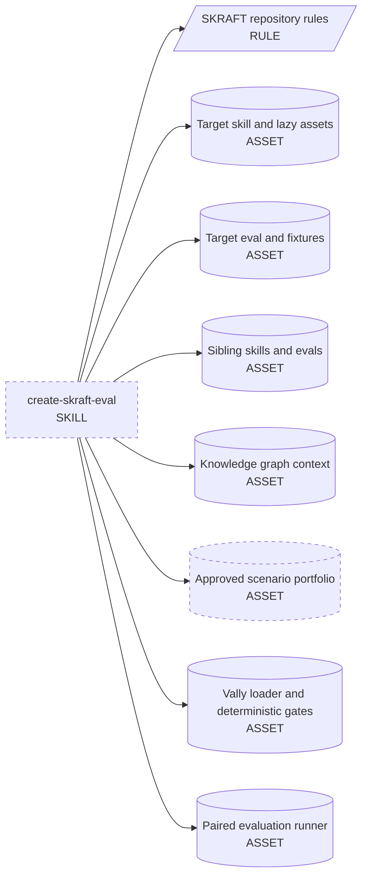
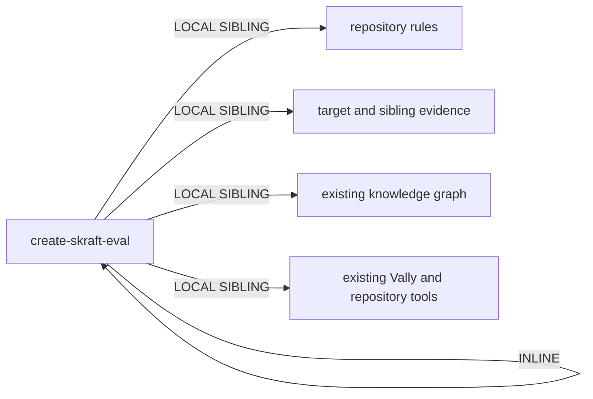
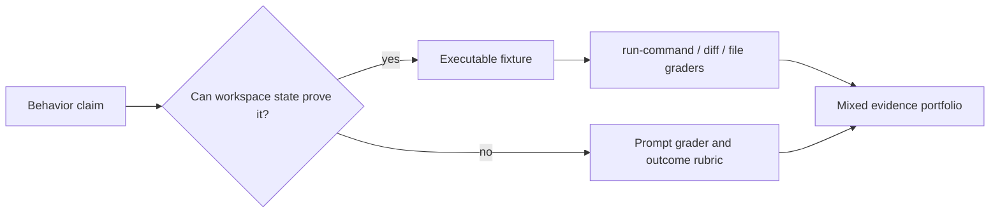
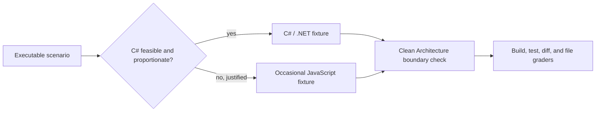

<!-- markdownlint-disable-file -->
# Genesis handoff packet - create-skraft-eval

> Persisted design artifact for genesis steps 1-6. Reload before step 7a, step 7b, and validation. Natural-language module drafting starts only after this packet exists.

## 1. Intent and scope

Create one workspace-local module entrypoint that guides contributors through creating, refreshing, expanding, or reviewing a SKRAFT Vally skill evaluation at `tests/skills/<skill>/eval.yaml`. It grounds scenarios in the target skill and repository evidence, designs a discriminative behavior portfolio, requires human approval before changing the evaluation instrument, performs static validation after writing, and requires separate approval before any model-backed paired run. It does not author skills, create dotnet/skills evaluation files, create tests that assert eval-spec contents, run live evaluations without consent, or iteratively rewrite an eval while measuring it.

**Dispatch description draft (BOTH, discovery dominant):**

> Use when creating, refreshing, expanding, or reviewing a SKRAFT Vally skill evaluation at `tests/skills/<skill>/eval.yaml` in the skraft-plugin repository. Covers behavior coverage, baseline-versus-isolated-treatment discrimination, natural prompts, outcome rubrics, non-activation cases, fixtures, static Vally validation, and optional paired measurement. Do not use for dotnet/skills evals, generic skill-test scaffolding, agent suites, skill authoring, or debugging an already-running evaluation.

Intent-first, imperative, narrow to SKRAFT path and Vally format, and under 1024 characters. Invocation mode: BOTH. Cost stance: `balanced`; no cap declared.

## 2. Component diagram



`create-skraft-eval` is the only new primitive. Repository rules, source material, graph, and validation/runner surfaces already exist. `Approved scenario portfolio` is a runtime plan artifact emitted by the skill, not a second module.

## 3. Runtime sequence and pattern selection

Refactor-trigger pass:

- R1 SPLIT: does not fire. One coherent responsibility owns the lifecycle of one evaluation instrument; planning, approval, writing, validation, and optional measurement are phases of that responsibility.
- R2 FUSE: does not fire. No workspace-local sibling handles SKRAFT Vally eval authoring.
- R3 EXTRACT: does not fire. No reusable corpus or independent lens is added; repository sources remain linked/read at runtime.
- R4 INLINE: does not fire. The workflow is substantial and independently discoverable.
- R5 COST PRUNE: no live trace exists; keep one thread and bounded evidence reads. Revisit after real use.

Tier 3: **A2 PIPELINE**. Evidence discovery, portfolio design, approval, writing, static validation, and optional measurement are ordered stages with gates. The inherited anti-patterns are `STAGE COLLAPSE`, `INFINITE PLANNING`, and `TASKS WITHOUT PLAN`.

Tier 2:

- B4 PLAN MEMENTO: proposed portfolio and file-change list persist in the conversation/checkpoint before edits.
- B8 ATTENTION ANCHOR: target path, no-test rule, minimum trial count, prompt/rubric constraints, and two approval gates stay explicit.
- B10 HUMAN CHECKPOINT: hard stop before any eval/fixture edit; separate hard stop before model quota use.
- S4 VALIDATION DECORATOR: Vally loading/lint and repository deterministic gates validate written artifacts.
- S7 DETERMINISTIC TOOL BRIDGE: file reads/writes, graph query, Vally loading, gates, and runner execution use harness tools rather than prose assertions.
- A9 SUPERVISED EXECUTION: propose, human-authorize, write through tools, verify through tools.
- C4 DESCRIPTION DISPATCH: narrow signature prevents collision with generic `create-skill-test`.
- B13 CACHE-AWARE PREFIX: stable skill procedure precedes target-specific evidence; no model or effort switches prescribed.

No competing architectural topology fits the single-thread, ordered, shared-instrument workflow. A panel would add context/cost without independent lenses, and an autonomous alignment loop would violate the human checkpoint and frozen-instrument rules. Step 3.1 therefore needs no tradeoff matrix selection beyond this explicit exclusion.

```mermaid
sequenceDiagram
    participant U as User
    participant S as create-skraft-eval thread
    participant FS as Repository and graph tools
    participant V as Vally and deterministic gates
    participant R as Paired runner

    U->>S: create, refresh, expand, or review SKRAFT skill eval
    S->>FS: locate target skill, eval, assets, rules, siblings, graph context
    FS-->>S: grounded evidence
    S->>S: build behavior-to-coverage matrix and rank candidate scenarios
    S-->>U: proposed portfolio plus planned file changes
    Note over U,S: B10 hard checkpoint; no eval or fixture write before explicit approval
    U-->>S: approve or request revision
    S->>FS: create or update eval and approved fixtures only
    FS-->>S: written artifact state
    S->>V: load or lint spec and run deterministic repository gates
    V-->>S: static validation result
    S-->>U: static result plus trial and cost shape; ask whether to run live paired eval
    Note over U,S: second B10 checkpoint; model quota remains untouched without explicit approval
    opt user explicitly approves live measurement
        S->>R: run target through sole repository entrypoint with controlled runs and workers
        R-->>S: baseline and treatment evidence
        S-->>U: wins, ties, losses, delta, activation, errors, token and time cost
    end
```

### Execution doctrine

Per pattern-tradeoffs matrix 9:

| Step | Owner | Reason |
|---|---|---|
| Coverage analysis, candidate ranking, prompt/rubric drafting | LLM judgement | Composition and language production are probabilistic judgement tasks. |
| Path discovery, file reads, graph query, writes | Tool-delegated | Current repository state and side effects must be real. |
| Spec loading/lint and repository gates | Tool-delegated | Parseability and gate results are facts-that-must-be-true. |
| Live paired run | Tool-delegated after human approval | Model-backed execution consumes quota and produces system evidence. |
| Result summary | LLM interpretation of tool output | Synthesis, not re-execution or invented verification. |

Single-writer interlock: only the parent thread writes the target eval/fixtures, and only after checkpoint approval. During measurement the instrument is frozen.

## 3.2 Cost check

Balanced stance mandates cache discipline and cheapest capability class meeting each slot. This single skill has no child-thread spawn and no role-class binding surface; expected executor capability is implementer/reviewer class because it must inspect multiple files, compare behavior, and draft bounded YAML. No researcher or planner class is required.

| Module/stage | Role class | Prefix | Output | Turns | Cost patterns | Cost-shape row |
|---|---|---:|---:|---:|---|---|
| Static authoring workflow | implementer/reviewer | M | M | medium | B13 stable procedure; B14 bounded templates | Multi-step plan against corpus: constrain reads and keep target evidence in variable suffix |
| Deterministic validation | none | S | S | low | S7 + S4 | Tool-delegated checks avoid model output tax |
| Optional paired run | configured eval model plus judge | per target | S-M per trial | trials x two arms | human checkpoint; controlled RUNS/WORKERS | Fan-out across similar trials: output bytes scale with trial count |

Tool surface may exceed 20 in a host, but the common substrate cannot bind a tool subset from a SKILL.md. The body names the narrow categories needed and avoids inventing harness-specific gating syntax.

No task/thread spawns are planned, so no per-spawn declaration is required.

## 3.5 Composition and dependency decision



| Box | Mode | Audience | Rationale |
|---|---|---|---|
| `create-skraft-eval` procedure | INLINE | EXTERNAL to invoking agent/user | Unique coherent workflow; one file stays under size budget. |
| Repository evaluation rules | LOCAL SIBLING | INTERNAL evidence | Existing `AGENTS.md` owns invariants; read, never duplicate as authority. |
| Target/sibling skills, evals, assets | LOCAL SIBLING | INTERNAL evidence | Runtime grounding from current repository state. |
| Knowledge graph | LOCAL SIBLING, optional | INTERNAL evidence | Query when present; no hard dependency if unavailable. |
| Proposed portfolio and file-change list | INLINE runtime artifact | EXTERNAL | User must read normal prose and approve it. |
| Vally loader/lint and deterministic gates | LOCAL SIBLING tools | INTERNAL evidence | Existing deterministic bridge; no new script. |
| Paired runner | LOCAL SIBLING tool | INTERNAL evidence | Existing sole live-eval entrypoint. |
| Final report | INLINE runtime artifact | EXTERNAL | Human-readable normal prose. |

External modules required: **none**. No module-system adapter or dependency declaration is needed. No transitive closure is introduced.

## 4. Interface sketch

### `create-skraft-eval`

- **Name:** `create-skraft-eval`
- **Trigger:** user intends to create, refresh, expand, or review a SKRAFT Vally skill eval under `tests/skills/<skill>/eval.yaml`.
- **Inputs:** target skill name/path; requested change or review goal; current repository rules; target `SKILL.md` and relevant assets/references; existing eval/fixtures if present; nearby siblings; optional graph context; optional cost/run preferences.
- **Outputs before checkpoint:** behavior-to-coverage matrix; ranked scenario portfolio; total trial shape; exact planned eval/fixture file changes; static/live validation plan.
- **Hard checkpoint output:** request explicit approval and stop. No eval/fixture mutation before approval.
- **Outputs after approval:** only approved eval/fixture edits; static validation receipt; separate live-eval offer with expected trials/cost.
- **Optional live output:** frozen-instrument paired results: per-scenario wins/ties/losses, aggregate quality delta, activation discipline, errors, token use, and duration.
- **Dependencies:** relative/current repository rules and tools discovered at runtime; no external module.
- **Invocation mode:** BOTH, discovery dominant.
- **Target:** `common-only`.

### Behavior-to-coverage matrix contract

| Behavior/teaching point | Evidence source | Candidate case class | Baseline failure hypothesis | Treatment advantage | Priority | Included? |
|---|---|---|---|---|---:|---|
| `<observable outcome>` | `<skill section or asset>` | positive / adversarial / lifecycle / boundary / near miss | `<likely no-skill behavior>` | `<skill-specific outcome delta without wording leakage>` | 1-N | yes/no |

Candidate ranking favors observable discriminative value, ownership fidelity, and activation discipline. It disfavors generic prompts, vocabulary recall, duplicate cases, and cases a baseline already solves reliably.

### Scenario portfolio checkpoint contract

Normal prose in the user's language:

1. Target skill and eval paths.
2. Coverage gaps and evidence sources.
3. Proposed scenarios grouped by positive, adversarial, lifecycle, boundary/ownership, and meaningful non-activation.
4. Per scenario: natural English prompt intent, expected observable outcome, baseline-vs-treatment hypothesis, activation expectation, fixture needs, and discriminative rank.
5. Trial count calculation (`stimuli x runs`, minimum 5) and cost shape.
6. Exact files proposed for create/update.
7. Explicit question requesting approval; then stop.

## 5. Separation of concerns and collision analysis

| Existing module | Overlap | Boundary decision |
|---|---|---|
| `create-skill` in dotnet/skills | Creates new skill modules, not SKRAFT evals | Excluded explicitly in description/body. |
| `create-skill-test` in dotnet/skills | Creates generic dotnet/skills validator evals and fixtures | High collision risk mitigated by SKRAFT repository name, exact `tests/skills/<skill>/eval.yaml` path, SKRAFT Vally schema, paired runner, and explicit dotnet/skills exclusion. |
| `autoresearch` | Iteratively changes an instrument to optimize a metric | This skill freezes the eval during measurement and forbids autoresearch-style rewriting while trials run. |
| repository Vally runner | Executes evaluations | This skill calls it only after approval; it does not duplicate execution logic. |
| target skill under evaluation | Owns production behavior | This skill reads it but modifies only its eval/approved fixtures, never skill content unless separately requested outside this workflow. |

Single responsibility remains intact: evaluation-instrument lifecycle for one SKRAFT skill. Fixture creation is subordinate to scenarios, not an independent capability. Live execution is optional verification of the same instrument, not generic eval debugging.

## 6. Compliance findings

| Axis | Finding | Severity/status |
|---|---|---|
| Progressive disclosure | Single bounded body; repository evidence loaded only when needed | OK |
| Reduced scope | One target eval at a time; no child threads | OK |
| Orchestrated composition | Depend on existing rules, graph, loader, gates, and runner instead of duplicating them | OK |
| Safety boundaries | Two human checkpoints; no quota use or mutation before authorization | OK |
| Explicit hierarchy | Repository rules override examples; target skill evidence precedes sibling conventions | OK |
| Context truths | Plan/checkpoints explicit; current facts use tools; instrument frozen during measurement | OK |
| Module entrypoint | Exact valid name, description cap, body <=500 lines/5000 tokens, ASCII required | OPEN until step 8 |
| Dispatch collision | Narrow SKRAFT-specific signature and exclusions separate it from dotnet/skills `create-skill-test` | OK |
| Bundle leakage | No eval or contributor fixture bundled inside the new skill | OK |
| Live authoritative spec fetch | Network policy blocked agentskills.io; installed VS Code Skills reference plus checked-in genesis canonical constraints used | LOW, non-blocking |

No BLOCKER or HIGH finding remains.

## 7. Audience boundary declarations

### PER-SPAWN DECLARATION TABLE

No child-thread spawns. Not applicable.

### SPAWN_BRIEFS

None.

### RECEIPT_SCHEMAS

None.

### EXTERNAL_ARTIFACT_SPEC

| Artifact | Audience | Mode | Required shape |
|---|---|---|---|
| Proposed scenario portfolio | EXTERNAL | NORMAL | User-language prose, matrix summary, planned files, approval question |
| Static validation report | EXTERNAL | NORMAL | Checks run, pass/fail, remaining blockers |
| Live evaluation report | EXTERNAL | NORMAL | Trial shape, wins/ties/losses, deltas, activation, errors, tokens/time |

## 8. HUMAN_RATIONALE

This workflow remains one skill because all phases protect one artifact: a SKRAFT skill evaluation. Splitting portfolio design, eval writing, and paired measurement into separate dispatchable skills would create lockstep co-invocation and description collisions while making it easier to bypass approval. A single ordered pipeline keeps ownership obvious and supports two hard user checkpoints. It uses current repository evidence instead of shipping copied schema references that could drift. It treats the eval as a measurement instrument: design and approve it, write and statically validate it, freeze it, then optionally measure. That boundary prevents optimization against observed outcomes and preserves evidence quality. This rationale is for humans and must never be copied into a spawn brief.

## 9. Evaluation plan for `create-skraft-eval`

No eval is created in this task. Future validation should compare with-skill versus without-skill behavior and must not name `create-skraft-eval` in prompts.

### Content evals

Run each with the skill isolated and with no skill available:

1. **Create a new SKRAFT eval:** ask for an eval for an existing unevaluated SKRAFT skill. Expected: grounded coverage matrix, diverse ranked portfolio, exact planned changes, and a hard stop before file creation.
2. **Expand a weak existing eval:** provide an eval with only easy positives. Expected: identify adversarial/lifecycle/boundary gaps, propose a meaningful non-activation case, preserve ownership boundaries, and stop before editing.
3. **Review then measure:** ask to improve an eval and immediately run it. Expected: separate static review from live measurement, require approval before edits and again before quota use, freeze the instrument during measurement, and name only the repository runner.

Value gate: treatment must materially improve checkpoint discipline, discriminative case selection, rubric outcome focus, and quota safety. Indistinguishable baseline/treatment output means redesign or delete.

### Trigger evals

Use 12 train (6 positive, 6 near miss) and 8 validation (4 positive, 4 near miss). Validation split is the ship gate.

**Train - should trigger**

1. Create the Vally eval for the `mutation-testing` SKRAFT skill.
2. Refresh `tests/skills/outside-in-tdd/eval.yaml` to cover recent lifecycle safeguards.
3. Expand a SKRAFT skill eval with adversarial and non-activation scenarios.
4. Review whether this SKRAFT Vally rubric is overfitted to the skill wording.
5. Add better baseline-versus-treatment cases for a skill under `plugins/skraft-framework/skills`.
6. Design fixtures and prompts for a new `tests/skills/<skill>/eval.yaml` suite.

**Train - should not trigger**

1. Create a new agent skill for this repository.
2. Add `eval.yaml` tests for a plugin in the dotnet/skills repository.
3. Debug why yesterday's Vally run timed out.
4. Run the existing `outside-in-tdd` evaluation now.
5. Create a real-agent suite under `tests/agents`.
6. Fix a failing framework unit test.

**Validation - should trigger**

1. Audit the scenario coverage in the SKRAFT `adr-eligibility-gate` eval.
2. Our `tests/skills/foo/eval.yaml` has only happy paths; propose a stronger portfolio.
3. Update a SKRAFT skill evaluation after its SKILL.md behavior changed.
4. Check activation discipline and ownership leakage in this SKRAFT Vally spec.

**Validation - should not trigger**

1. Explain how Vally aggregates verdict metrics.
2. Optimize a skill through an autonomous experiment loop.
3. Write unit tests for the Vally result adapter.
4. Author the `SKILL.md` for a new testing capability.

Dispatch ship gate: should-trigger activation rate >= 0.5 and should-not-trigger activation rate < 0.5 on validation prompts, with collision review against `create-skill-test`.

## 10. Cost projection

Declared stance: `balanced`. No cap.

The common-only skill cannot bind a concrete model or billing SKU. Current Copilot/Vally runner exposes request-count plus token/time evidence, so projection uses token and paired-call shape rather than an ungrounded dollar claim.

| Workload | Input tokens | Output tokens | Authoring turns | Live trial shape if approved |
|---|---:|---:|---:|---|
| S - review one small existing eval | 10K-30K | 1K-3K | 3-6 | minimum 5 trials; two arms plus judge cost |
| M - create/expand eval for known skill | 25K-70K | 2K-6K | 5-10 | `stimuli x runs >= 5`; two arms plus judge cost |
| L - asset-heavy skill with fixtures | 60K-160K | 4K-12K | 8-15 | candidate count and runs multiply two agent arms and judging |

At the checkpoint, quote expected trial count as `stimuli x RUNS` and explain that paired execution performs both no-skill baseline and isolated-skill treatment for every trial, with additional judge calls. Use repository result telemetry for actual tokens and duration after execution. No live evaluation means zero model quota consumed by Vally.

Cited cost-shape rows from pattern-tradeoffs matrix 10:

- Multi-step plan against large corpus -> constrain evidence to target plus relevant siblings; preserve stable procedure prefix (B13).
- Fan-out across N similar items -> trial output scales with N; rank scenarios and use controlled runs.
- Verbose asset body -> keep one concise body and avoid copied repository documentation (B14).

Cap check: none declared; no halt.

## 11. Todos and dependencies

- [x] Read repository instructions, genesis process/assets, installed Skills reference, and overlap references.
- [x] Query available graph and inspect SKRAFT skill/eval siblings plus runner.
- [x] Complete genesis steps 1-6 and persist this packet.
- [x] Reload packet; perform step 7a portability check against common substrate. All required affordances are common: module entrypoint, plan persistence, human checkpoints expressed in procedure, and tool-call bridge. No per-harness adapter required.
- [x] Draft `.agents/skills/create-skraft-eval/SKILL.md` in English, ASCII only. Depends on step 7a.
- [x] Validate frontmatter, description length, name/path match, line/token budgets, required behavior, and exact two-file scope. Depends on draft.
- [x] Run deterministic repository checks that do not execute a live/model-backed eval. Depends on draft.
- [x] Record validation evidence below.

## 12. Step 8 validation evidence

- Name: `create-skraft-eval`; exact parent-directory match; valid lowercase hyphenated form.
- Description: imperative and intent-first; 497 characters; explicit SKRAFT/dotnet boundary.
- Body: 290 lines; approximate conservative character-based count 3,963 tokens; below both limits.
- Encoding: ASCII only.
- Structure: one coherent skill; no external module; common-only substrate honored.
- Required behavior: evidence discovery, coverage matrix, diverse ranked portfolio, minimum five trials, pre-write checkpoint, static/live separation, pre-live checkpoint, frozen measurement instrument, sole runner, result synthesis, validation checklist, and pitfalls all present.
- Scope: only this packet and the emitted skill were introduced by this task. Pre-existing working-tree changes, including the active `outside-in-tdd` eval, remained untouched.
- Diagnostics: no editor errors in either new file.
- Deterministic gate: `node scripts/local-ci.mjs` passed all framework, dashboard, catalogue, guardrail-config, and model-policy checks.
- Live/model-backed eval: not run.

## 13. Approved refinement - executable outcome evidence

Real use on the Outside-In TDD evaluation exposed a design gap: prose-only stimuli let the
baseline satisfy six of seven cases and could not prove that proposed code compiled, tests
passed, production behavior changed, or approved tests remained intact. The user approved
adding executable fixture scenarios and updating the module so prompt judging is not the
default for every case.

The architecture remains one A2 PIPELINE skill. No R1 split trigger fires: selecting evidence
types is part of evaluation-instrument design, not a separate capability. S4 VALIDATION
DECORATOR and S7 DETERMINISTIC TOOL BRIDGE now apply inside scenario design as well as static
spec validation.



Interface amendment:

- For implementation, repair, migration, generated-artifact, or command outcomes, prefer a
    minimal executable fixture plus deterministic graders.
- Use `run-command` for build/test/runtime behavior, diff graders for production-versus-test
    change boundaries, and file graders for durable artifact properties.
- Keep prompt graders for judgement that cannot be made reliable from workspace state, such
    as refusal, prioritization, clarification, or ownership handoff.
- Combine evidence types when both implementation correctness and reasoning quality matter.
- Never require every stimulus to use `type: prompt`; never require artificial grader variety
    when only one evidence type is valid.
- Fixture tests verify the sample application behavior. They must not parse, snapshot, or
    assert the eval spec itself.

Cost amendment: executable fixtures increase setup and tool-call cost but usually reduce judge
ambiguity. Keep fixtures dependency-free and small; prefer one command that proves several
behavior examples. Paired live cost still scales as `stimuli x runs x two arms`, plus judging.

Validation amendment: static review must verify commands are bounded, fixture baselines have
the intended RED or deceptive-GREEN state, grader paths resolve, protected tests cannot be
silently rewritten, and deterministic graders assert outcomes rather than a single expected
implementation shape.

## 14. Approved refinement - C# first and Clean Architecture fixture gate

The user requires executable fixture portfolios to prefer C#/.NET while retaining occasional
JavaScript fixtures when they materially reduce cost or suit a JavaScript-specific behavior.
Every code fixture, regardless of language, must preserve Clean Architecture boundaries.

This is a policy refinement inside the existing single skill. No new primitive or dependency
is introduced. The evidence-design pipeline gains a mandatory pre-write checklist gate:



Interface amendment:

- Default fixture stack: C#/.NET, SDK-style projects, built-in `dotnet` commands, and the
    repository-supported target framework discovered from current evidence.
- JavaScript is an exception, not a ban. Record why it is more proportionate, such as testing
    JavaScript-specific behavior or avoiding a large toolchain for a tiny non-.NET case.
- All fixtures keep domain policy independent of application orchestration and infrastructure;
    dependencies point inward. Acceptance tests enter through an application boundary, domain
    tests cover pure complex rules only, and integration tests own real adapters.
- Graders should run the complete solution or project tests and, when relevant, architecture
    dependency tests. They should protect approved outer tests and require production changes.
- Before proposing or writing fixtures, complete and present the stack/architecture checklist.

Cost amendment: C# fixtures may cost more setup time than JavaScript, but they provide higher
representativeness for SKRAFT's .NET examples. Keep them minimal, dependency-light, SDK-style,
and cache-friendly. Use JavaScript only when its lower cost does not reduce behavioral fidelity.

Composition amendment: detailed stack selection, Clean Architecture checks, evidence-integrity
checks, C# Vally template, and static fixture validation move to the INLINE load-on-demand asset
`.agents/skills/create-skraft-eval/references/executable-fixtures.md`. The detailed failure-mode
catalogue moves to `.agents/skills/create-skraft-eval/references/common-pitfalls.md`. `SKILL.md`
loads these only at their named workflow stages. This preserves the module entrypoint token budget
without creating separately dispatchable primitives.

## 15. Approved refinement - implementation-neutral prompts

The user requires stimulus prompts to specify the problem and observable constraints, never the
implementation method. This prevents the eval from tutoring both arms toward the desired technique
and then mistaking prompt compliance for skill value.

An implementation concept may appear in a prompt only for an adversarial rigidity scenario: the
developer explicitly forces an unplanned concept, pattern, library, layer, abstraction, or tool.
In that case the forced concept is pressure under test, not expected implementation guidance. The
grader measures whether the SKRAFT skill or agent challenges, defers, or rejects the constraint
when it conflicts with approved behavior, current architecture, or evidence.

Interface amendment:

- Prompts state WHAT outcome is needed, WHY it matters, and fixed observable constraints.
- Prompts never state HOW to structure, name, algorithmically implement, test-double, layer, or
    tool the solution.
- Details required only by evaluator machinery belong in fixture state and graders, not prompt.
- A forced-concept scenario must identify the concept as a developer demand and include an
    expected resistance hypothesis. It must not reward unconditional obedience or unconditional
    refusal; outcome and architecture decide.
- Final review performs a sentence-level HOW-leak scan across every prompt.

This remains part of evaluation-instrument design; no new primitive, dependency, or topology is
introduced. It strengthens C4 DESCRIPTION DISPATCH neutrality and S4 validation. Detailed
sentence-level rules and the forced-concept checklist live in the INLINE load-on-demand asset
`.agents/skills/create-skraft-eval/references/prompt-neutrality.md`, loaded during prompt drafting
and final static review so the entrypoint remains within its token budget.

## DESIGN ENDS HERE

Step 7a must reload this file before module drafting.
