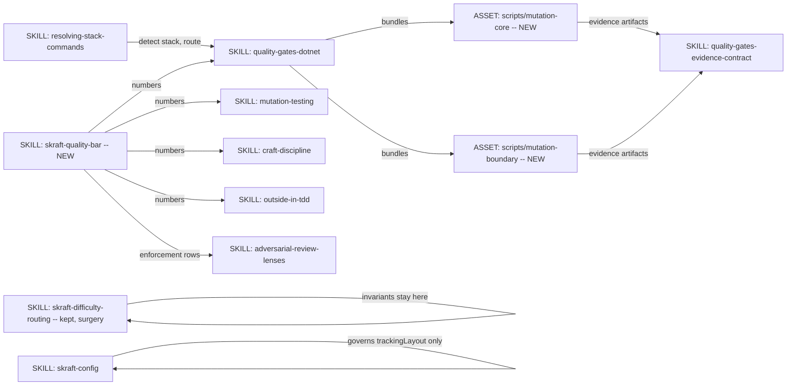
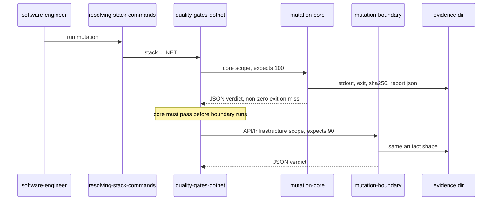

# Remove depthTier, install a permanent quality bar -- genesis handoff

Inputs: a 6-domain inventory plus a completeness critic (187 edit sites, 13 missed
sites, 12 axis confusions), and a 3-design judge panel scored on migration cost and
conceptual coherence.

## Step 1 -- intent, scope, cost stance

**Intent.** Delete the repo-wide quality dial `depthTier` entirely and replace it with
one permanent, maximal quality bar that has exactly one numeric definition site and a
deterministic runner per technology.

**Owner decisions, already taken -- do not re-litigate:**

1. `depthTier` is REMOVED: config schema, CLI, `skraft-config.json`, every fixture,
   every test. Not pinned, not deprecated.
2. The bar is permanent and maximal. Maximum token cost is accepted.
3. Renaming and deleting whatever the change requires is authorised.
4. Mutation runs as TWO SEQUENCED SCRIPTS per technology: first the core
   (Domain/Application), then API/Infrastructure.
5. Each script CARRIES ITS OWN expected value. Owner chose this with the duplication
   tradeoff stated. Mitigation below is mandatory, not optional.
6. Raising this repository's own Stryker gate (`src/stryker.config.mjs:62`,
   `break: 80`) is a SEPARATE follow-up, out of scope here.

**Boundary -- what this does NOT do.** The per-work-item axis `difficulty`
(simple | medium | medium-hard | challenging, `state.json::difficulty`, drives
inline-vs-subagent execution) survives untouched. `skraft-difficulty-routing` is NOT
renamed. The reviewer lens count is NOT centralised. This repo's own Stryker gate is
not raised.

**Cost stance:** `balanced`. No cap.

## Step 2 -- component diagram

## Step 3 -- thread / sequence diagram

Sequencing is the owner's decision 4: core first, boundary second. A failing core
short-circuits -- no point mutating adapters when the domain is unproven.

## Step 3.1 -- tradeoff check

Three designs judged on two lenses. Scores (coherence / migration):
`skraft-quality-bar` 7/6, delete-in-place 6/7, frozen-constants-module 5/6.

**Chosen: `skraft-quality-bar`**, with the enforcement mechanism grafted from
frozen-constants-module and the placement discipline from delete-in-place.

Rejected homes, with the evidence that killed them:

- `quality-gates-evidence-contract` (delete-in-place's home): its gate taxonomy is
  G1-G10 and the token `coverage` appears ZERO times. A coverage number there has no
  falsification path, violating that file's own law at `:17` -- "if a field cannot be
  falsified from the Git tree alone, the field is mis-designed". It also welds
  threshold edits to a versioned schema that mandates a bump per gate change (`:175`).
- A `quality-bar.mjs` constants module (frozen-constants-module's home): introduces a
  `$CLAUDE_PLUGIN_ROOT` runtime dependency inside consumer repos, and its
  `bar_ref`/`bar_sha256` self-check is circular -- the emitted JSON is hashed against
  itself, so a hand-written `{"Domain":50}` passes self-consistently.

That design was nonetheless right about the mechanism, and the graft is its insight:
`--break-at` at `craft-discipline:79` and `mutation-testing:59,73,167` is the ONLY
threshold in the system that actually fails a run. Everything else is prose.

## Step 3.2 -- cost check

R5 COST PRUNE, trigger UNIFORM-CLASS GRAPH: removing the dial removes the framework's
only cost governor (reviewer fan-out 1/2/4, gate count, mutation run count). Every run
now pays the `comprehensive` shape. The owner accepted this explicitly. Recorded so a
future reader does not mistake the cost rise for a regression.

S7 DETERMINISTIC TOOL BRIDGE applies and is the reason the script layer exists:
"mutation score meets the bar" is a FACT THAT MUST BE TRUE, currently left as
LLM-asserted prose at `quality-gates-dotnet:129` ("Read mutationScore from
qg-mutation.json and compare"). Extension path: bundled script, per the genesis
`scripts/` convention -- non-interactive, structured JSON on stdout, diagnostics on
stderr, `--help`, listed in the SKILL.md body.

## Step 3.5 -- composition decision

- `skraft-quality-bar` -- NEW LOCAL SIBLING skill. Justified by rule-of-three: five
  current sites restate its numbers, inconsistently.
- `scripts/mutation-core`, `scripts/mutation-boundary` -- INLINE assets bundled inside
  `quality-gates-dotnet`, one pair per `quality-gates-<tech>` adapter. Not promoted:
  they are stack-specific by construction, so the rule of three cannot fire across
  adapters.
- No EXTERNAL MODULE. No module-system adapter needed at step 7b.

## Step 4 -- SoC pass

**The bar owns:** mutation 100% Domain/Application, mutation 90% API/Infrastructure,
line coverage 100% Domain/Application, the enforcement level of every gate, and the
canonical threshold-flag fragments.

**The bar does NOT own:**

- The reviewer lens count. "4 lenses" lives in THREE distinct four-lens taxonomies --
  `adversarial-review-lenses` (Completeness / Business-Fit / Consistency / Risk),
  `acceptance-review-criteria:10`, `planning-review-criteria:10`. A central `4` would
  be ambiguous about which set it governs and unguardable (a bare `4` grep drowns in
  `Lens 4`, `P0-P3`, weight tables).
- The immutable invariants. They stay at `skraft-difficulty-routing:84-94`: qualitative
  always-blocking rules, not thresholds. Moving them forces load-edges onto five
  reviewers plus the orchestrator, and breaks `skraft-difficulty-routing:135`, which
  obliges the orchestrator to surface "active invariants" in its user summary.

**Three orphaned rows must be rescued.** The deleted matrix at
`skraft-difficulty-routing:111-113` is the ONLY place in the repository declaring the
enforcement level of: the Gherkin gate, ADR for non-trivial decisions, and Object
Calisthenics on Domain. All three candidate designs deleted the matrix; none re-homed
them. They land in the bar's `## Enforcement`.

## Step 5 -- compliance findings

| Finding | Severity | Action |
|---|---|---|
| `skraft-framework.config.json` is GENERATED by `build-config.mjs` from agent frontmatter; `policy` is hardcoded at `framework-config-policy.mjs:60` | HIGH | Never hand-edit. Edit frontmatter, then regenerate. `build-config-bin.mjs --check` is local-ci fast-gate 4 |
| `craft-discipline:69` reads `### C8 -- 100% mutation score` and is ALWAYS loaded by software-engineer | HIGH | Highest-priority rename to a numberless heading; a stale literal here outranks every other site |
| Removing the key throws NOWHERE -- every consumer is null-safe by design | HIGH | Failures are silent. Each stage validates by test, never by absence of error |
| `config-schema.unit.test.mjs:4` named-imports `DEPTH_TIERS` and `DEFAULT_DEPTH_TIER` | HIGH | ESM load-time SyntaxError kills the WHOLE file, including surviving `trackingLayout` assertions. Schema and its test change in ONE commit |
| `review-comment.template.md:9-11` gates the SURVIVING difficulty line on the REMOVED key | HIGH | Re-point the Mustache section to `{{#difficulty}}`, do not delete it |
| Two byte-duplicated artifact registries with SEPARATE test files, no parity test | MEDIUM | `src/domain/artifact-registry.mjs` and `scripts/lib/artifact.mjs` edited in lockstep |
| `depthTierRationale` is a second settable key whose identifier does not contain `depthTier` as a whole word | MEDIUM | Remove with the dial |
| `adversarial-review-lenses/eval.yaml:233` is an `output-not-matches` grader whose pattern INCLUDES `depth tier` | MEDIUM | KEEP -- it asserts absence and becomes strictly stronger |
| `{tier}` means difficulty at `skraft-state.instructions.md:55,157` and depthTier at `:186` | MEDIUM | Token-level care; no blind sweep |
| 8 docs pages cite `state.json::userPreferences.depthTier`, a path that never existed in shipped code | LOW | Pre-existing drift; resolve, do not propagate |
| Gitignored trees carry the token: `graphify-out/` (84), `eval-results/` (106), `artifacts/catalog/` | LOW | Never run a repo-root `grep -rl \| xargs sed` |
| No pre-commit hook exists -- `install-git-hooks.mjs` writes pre-push only | LOW | Ordering arguments resting on per-commit blocking are wrong |
| Owner chose per-script hardcoded thresholds, recreating N numeric homes | HIGH | MITIGATION MANDATORY: guard test asserts each script's literal equals the bar's table row |

No BLOCKER. Design proceeds.

## Step 6 -- interface sketches

**`skraft-quality-bar`** (SKILL, new, target <= 60 lines)
- Trigger: any agent about to run, verify, or report a quality gate.
- `## The bar` -- the only place a threshold literal is authored.
- `## Enforcement` -- every row blocking; no advisory, no warning, no override, no
  rationale that buys an exemption. Absorbs the three orphaned rows.
- `## Threshold flags` -- canonical invocation fragments, stated once.
- Registration: `metadata.skills` frontmatter of `software-engineer.agent.md`,
  `agents/reviewer-lenses/quality-gates-lens.agent.md`, `acceptance-designer.agent.md`
  -- then REGENERATE the config JSON.

**`quality-gates-dotnet/scripts/mutation-core`** and `.../mutation-boundary`
- Non-interactive, `--help`, structured JSON on stdout, diagnostics on stderr.
- Preserve the existing evidence artifacts exactly: `qg-mutation.stdout`,
  `qg-mutation.exit`, `qg-mutation.stdout.sha256`, `qg-mutation.json`. The evidence
  contract depends on their names.
- Each carries its expected value as a literal; exit non-zero when the measured score
  misses it.
- Guarded by the parity test above.

## Migration order (dependencies are hard)

1. **Additive first** -- create `skraft-quality-bar`, the two scripts, and the parity
   guard test. Nothing references them yet; nothing can break.
2. **Skills surgery** -- `skraft-difficulty-routing` (delete 56-69, 96-126; KEEP the
   difficulty table at 71-82 and the invariants at 84-94), `adversarial-review-lenses`,
   `craft-discipline:69`, `mutation-testing`, `outside-in-tdd`, `quality-gates-dotnet`,
   `quality-gates-evidence-contract` (new G11 for coverage, `$schema` bump),
   `skraft-config`.
3. **Agents, templates, instructions** -- including the Mustache re-point and the six
   frontmatter lines that weld both axes.
4. **Runtime plus its tests IN ONE STAGE** -- `config-schema.mjs`, `config-service.mjs`,
   `cli/config.mjs`, `health-check-service.mjs`, both artifact registries, and every
   test that imports the removed exports. Splitting this stage breaks the suite at load
   time.
5. **Fixtures** -- 41 sites. Delete `tests/agents/skraft-orchestrator/fixtures/quick-depth-tier/`
   and its eval stimulus together; the tier is that fixture's whole subject.
6. **Docs** -- en and fr sources only; `docs/site/_site/` is generated output.
7. **Regenerate and validate** -- `build-config-bin.mjs`, then the full suite.

## Open decision deferred to the owner

`skraft-config` governs a single two-valued enum (`trackingLayout`) once the dial is
gone. Keeping it is cheaper today; a future reader will reasonably ask why a skill
exists to set one field. Not decided here.

## HUMAN_RATIONALE -- never copied into a spawn brief

The panel's most useful output was not the winner but the disqualifications. Two of
three designs proposed a home for the numbers that the repository's own rules forbid,
and each was caught only by reading the target file rather than trusting the design's
summary of it. The same discipline killed the earlier "delete 60% of outside-in-tdd"
plan: redundancy is a property of the pair (content, consumer). Here the analogous
property is (number, falsification path). A threshold with no runner is not a
requirement -- it is a wish, and the 90% API/Infrastructure figure had been exactly
that since the day it was written.
