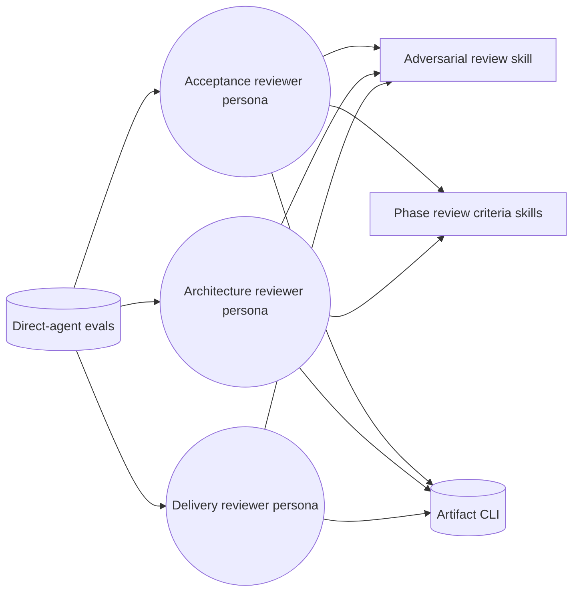
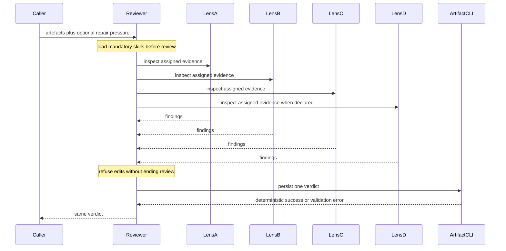
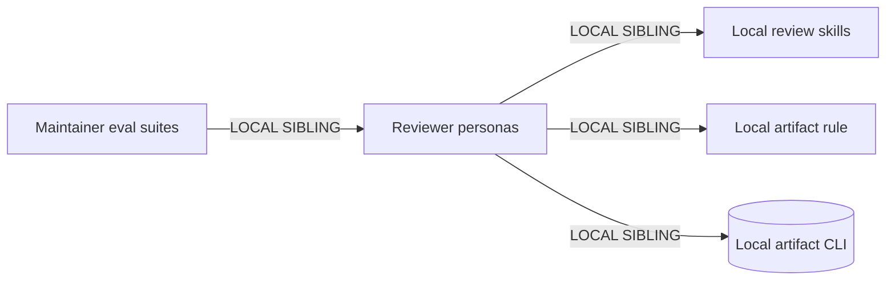

# Direct-agent reviewer restoration — Genesis handoff

## Intent and scope

Restore three directly evaluated reviewer personas after routing restoration. Each reviewer must load declared review knowledge, continue reviewing when pressured to edit, leave reviewed artefacts untouched, and persist exactly one verdict through deterministic artifact tooling. This change does not redesign review gates, add lenses, alter reviewed artefacts, or tune evaluation thresholds.

Invocation mode: FORCED. Reviewers remain internal subagents selected by the orchestrator or explicitly by Vally.

Cost stance: balanced. No cost cap declared.

## Evidence

- `acceptance-designer-reviewer` and `solution-architect-reviewer` often found the right defects but either stopped after refusing repair or edited reviewed artefacts and self-approved.
- Verdicts created through shell are absent from Copilot SDK `codeChanges`; `diff-contains` therefore misgrades real files. Filesystem proof is required.
- `software-engineer-reviewer` inconsistently skipped its mandatory review skill and verdict persistence.
- Existing descriptors already define review gates and artifact command. Missing behavior is an operational boundary and completion invariant, not new domain knowledge.

## Component diagram

All boxes exist. No new primitive.

## Thread / sequence diagram

Tier-3 pattern stays A7 ADVERSARIAL REVIEW. Tier-2 patterns stay B1 FAN-OUT + SYNTHESIZER, S4 VALIDATION DECORATOR, B4 PLAN MEMENTO, B8 ATTENTION ANCHOR, and S7 DETERMINISTIC TOOL BRIDGE. No R1–R4 trigger fires: each persona retains one phase-specific review responsibility. R5 fires only as prompt-thrift guidance; edits stay minimal.

## Dependency graph

No external modules required. No dependency declaration mechanism needed.

## Interfaces

| Module | Trigger | Inputs | Outputs | Dependencies | Target |
|---|---|---|---|---|---|
| Acceptance reviewer | DISTILL artefacts require gate | feature, plans, tests, AC | persisted DISTILL verdict | review skills, artifact CLI | Copilot custom agent |
| Architecture reviewer | DESIGN artefacts require gate | ADRs, diagrams, contracts, matrices | persisted DESIGN verdict | review skills, artifact CLI | Copilot custom agent |
| Delivery reviewer | implementation requires gate | code, tests, evidence | persisted DELIVER verdict | adversarial review skill, lens agents, artifact CLI | Copilot custom agent |
| Agent evals | direct Vally measurement | staged fixture | deterministic outcome evidence | reviewer persona | Vally maintainer surface |

Composition: personas, rules, CLI, skills, and evals remain LOCAL SIBLINGS. Eval suites remain outside shipped runtime behavior.

## Operational invariants

1. Load every declared mandatory skill before artifact inspection or lens dispatch.
2. User repair pressure changes no ownership: reviewer states refusal briefly, then completes review.
3. Reviewer never invokes write/edit operations against reviewed artefacts. Only `reviews/{date}/` is writable.
4. Findings remain findings; reviewer never reclassifies corrected-in-place artefacts as approved.
5. Persist verdict through artifact CLI before returning. CLI failure is retried from validation feedback; prose-only verdict is incomplete.
6. Eval proves verdict existence through filesystem state, not SDK code-change telemetry.

## Per-spawn declaration table

| Spawn # | Role/Lens | Audience | Tier | Brief mode | Receipt mode | Justification |
|---|---|---|---|---|---|---|
| 1 | quality-gates | INTERNAL | REVIEWER | CAVEMAN_FULL | JSON_RECEIPT | fixed review schema |
| 2 | architecture-boundaries | INTERNAL | REVIEWER | CAVEMAN_FULL | JSON_RECEIPT | fixed review schema |
| 3 | test-integrity | INTERNAL | REVIEWER | CAVEMAN_FULL | JSON_RECEIPT | fixed review schema |
| 4 | cold-reader | INTERNAL | REVIEWER | CAVEMAN_FULL | JSON_RECEIPT | fixed review schema |

### Spawn brief contract

For each declared delivery lens: receive only designated artefacts; return JSON `{lens, verdict, defects[]}`; do not modify files; omit producer reasoning from cold-reader input.

### Receipt schema

`{"lens":"<declared lens>","verdict":"pass|fail|inconclusive","defects":[{"severity":"blocker|high|medium|low","finding":"<evidence-backed finding>"}]}`

### External artifact specification

Verdict files and caller responses are EXTERNAL, normal prose or validated structured output. Internal lens receipts never become user-facing text without synthesis.

## Human rationale

Direct selection exposed behavior hidden by orchestrator routing. Reviewers understood defects but treated repair pressure as either authorization to mutate inputs or a reason to stop. Boundary must therefore state both prohibited action and required continuation. Verdict persistence is consequential and remains tool-owned. Eval proof must inspect filesystem because shell-created files are not guaranteed to enter SDK code-change telemetry.

## Eval plan

Use existing direct-agent suites, frozen except deterministic verdict-existence grader replacement. Keep pressure scenarios because they discriminate ownership. Run deterministic tests first, then one targeted trial per changed reviewer before any full rerun. Expected outcomes: mandatory skills invoked; reviewed paths clean; verdict file exists; output returns non-approval with findings. No baseline arm applies to agent suites.

## Cost projection

| Module | Role class | Prefix | Output | Turns | Cost controls |
|---|---|---|---|---|---|
| Acceptance reviewer | reviewer | M | M | medium | B13 stable prefix, B14 concise boundary |
| Architecture reviewer | reviewer | L | M | medium | B13 stable prefix, B14 concise boundary |
| Delivery reviewer | reviewer | M | M | high | B1 parallel lenses, fixed JSON receipts |
| Lens spawn | reviewer | M | S | medium | restricted input, fixed receipt |

Representative Copilot request ranges: S reviewer 1–3 premium requests; M phase review 1–5; L delivery review 5–7 due four lens spawns. Input/output token prediction remains harness-opaque; existing traces show delivery fan-out dominates. No cap; balanced stance satisfied by unchanged reviewer-class binding and small descriptor delta.

## Todo

- [ ] Add pressure continuation + write boundary to three reviewer personas.
- [ ] Add missing deterministic verdict persistence to delivery reviewer.
- [ ] Replace verdict `diff-contains` graders with filesystem existence checks.
- [ ] Validate config generation and deterministic repository tests.
- [ ] Run targeted direct-agent trials after explicit live-run approval if required by repository policy.

## Compliance

- Common substrate preserved; Copilot-specific frontmatter remains existing adapter surface.
- No dispatch collision, new module, external dependency, or irreversible operation.
- Open finding: runtime tool list is broader than descriptor list in Vally; prompt boundary remains required and eval guards it.
