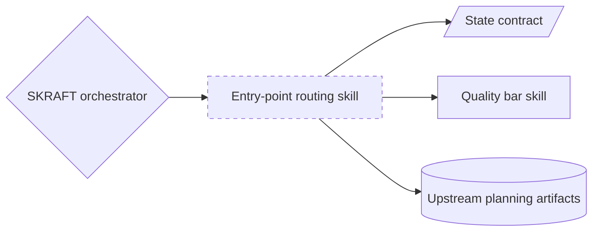
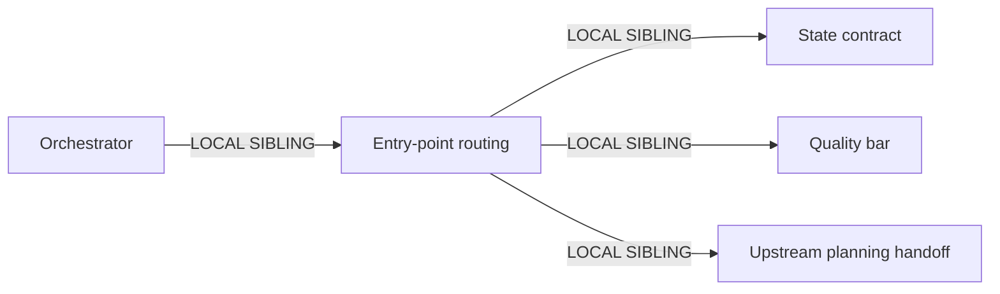

<!-- markdownlint-disable-file -->
# Entry-point routing restoration

## 1. Intent and scope

Keep one user-facing capability: detect an upstream planning handoff and derive which engineering phases are already satisfied. Remove the unrelated difficulty-tier classification and every downstream branch, state field, event, command, payload, template field, test, fixture, and active explanation that depends on it. Do not vary engineering rigor, gates, agents, or quality thresholds. Preserve `entryPoint` as pipeline routing evidence. Invocation mode: FORCED by the orchestrator at pipeline start.

Dispatch description: Use at pipeline start to detect an upstream backlog or sprint handoff, validate immutable engineering invariants, and persist the phases that may be skipped. Do not classify work difficulty or vary delivery rigor.

Cost stance: balanced. No extra model calls; removal reduces prompt and state volume.

## 2. Component diagram



`Entry-point routing skill` replaces existing mixed-responsibility routing skill. Existing orchestrator, state contract, quality bar, and upstream planning artifacts remain.

## 3. Thread sequence

```mermaid
sequenceDiagram
    participant Operator
    participant Orchestrator
    participant Routing
    participant Specialist
    Operator->>Orchestrator: start or resume engineering pipeline
    Orchestrator->>Routing: inspect upstream handoff
    Routing-->>Orchestrator: entryPoint and invariant result
    Note over Orchestrator: persist state; single writer
    Orchestrator->>Specialist: dispatch first required phase
    Specialist-->>Orchestrator: phase artifact
```

No fan-out: one bounded classification with one caller and one state write.

## 3.1 Pattern choice

R1 SPLIT fires because existing skill joins entry-point detection and difficulty classification. Delete obsolete capability rather than leave a second module. Resulting runtime shape remains A2 PIPELINE with B4 PLAN MEMENTO and S4 gate; routing is B2 CONDITIONAL DISPATCH. B8 ATTENTION ANCHOR is state reload at pipeline start.

## 3.2 Cost check

| Module | Role class | Prefix | Output | Tools | Cost effect |
|---|---|---:|---:|---|---|
| Orchestrator | planner | M | S | bounded existing set | Lower: difficulty branch and payload removed |
| Entry-point routing | trivial | S | S | read + state CLI | One existing invocation, shorter output |
| Phase specialists | unchanged | unchanged | unchanged | unchanged | No quality or rigor change |

No child-thread spawn added. Typical run stays at same request count and sends fewer tokens. No new cache invalidator.

## 3.5 Composition

| Box | Mode | Audience | Rationale |
|---|---|---|---|
| Entry-point routing skill | LOCAL SIBLING | INTERNAL | Runtime capability reused only inside plugin |
| State contract | LOCAL SIBLING | INTERNAL | Existing shared pipeline contract |
| Quality bar skill | LOCAL SIBLING | INTERNAL | Existing invariant source |
| Upstream planning artifacts | LOCAL SIBLING input | INTERNAL | Existing evidence read by routing |
| Handbook explanations | INLINE editorial docs | EXTERNAL | Human narrative mirrors shipped behavior |



No external modules or transitive dependency changes.

## 4. Separation of concerns

- Routing skill owns only upstream handoff detection, skip-phase derivation, and invariant validation.
- State domain owns accepted persisted keys and transitions.
- Orchestrator owns sequencing and state writes.
- Quality-bar skill owns permanent quality thresholds.
- Handbook owns explanation, never runtime truth.

## 5. Compliance

- Single responsibility restored by deleting second capability.
- No dynamic tier can weaken TDD, review, tests, architecture, or quality gates.
- Deterministic state/schema changes remain in source and tests, not prompt convention alone.
- Historical changelog, released specifications, and prior plans remain untouched.
- Active FR/EN explanations retain mirrored structure.

## 6. Interface sketch

Input:

```yaml
stateFile: path
upstreamArtifacts:
  backlog: optional path
  sprint: optional path
```

Output:

```yaml
entryPoint:
  skipPhases: [RESEARCH, DESIGN, DISTILL]
  handoffSource: optional path
  handoffType: optional backlog | sprint
invariants:
  valid: boolean
  violations: [string]
```

Forbidden output: difficulty, tier, depth, reduced rigor, optional quality gate.

## 7. Implementation todo

- [ ] Rename mixed routing skill to entry-point routing; remove all difficulty prose and outputs.
- [ ] Update orchestrator dependency and remove RESEARCH/DELIVER difficulty branches.
- [ ] Remove `difficulty` from state schema, initial state, transition event, service, and CLI.
- [ ] Remove `difficulty` from review-comment registry/template and dispatch payloads.
- [ ] Update active rules and todo synchronization instructions.
- [ ] Remove active descriptor/config references; regenerate framework config.
- [ ] Replace difficulty eval proof with focused entry-point routing proof.
- [ ] Remove difficulty from active unit/acceptance tests, experiments, and fixtures.
- [ ] Update mirrored FR/EN handbook explanations and roadmap current-state text.
- [ ] Preserve historical changelog, released specs, prior plans, and generated ignored results.
- [ ] Run config check, full deterministic tests, citation check, docs build, and relevant Vally suite.
- [ ] Run graph update.

## 8. Validation contract

- Active source search returns no difficulty concept outside explicitly historical paths.
- `entryPoint` still detects upstream planning handoffs and skips only phases proved by upstream artifacts.
- Fresh pipeline starts at RESEARCH; valid upstream handoff starts at first unsatisfied engineering phase.
- Quality gates and delivery workflow are identical for all stories.
- Generated config matches descriptors.
- Framework/dashboard tests, citations, handbook build, and focused direct-agent eval pass.
