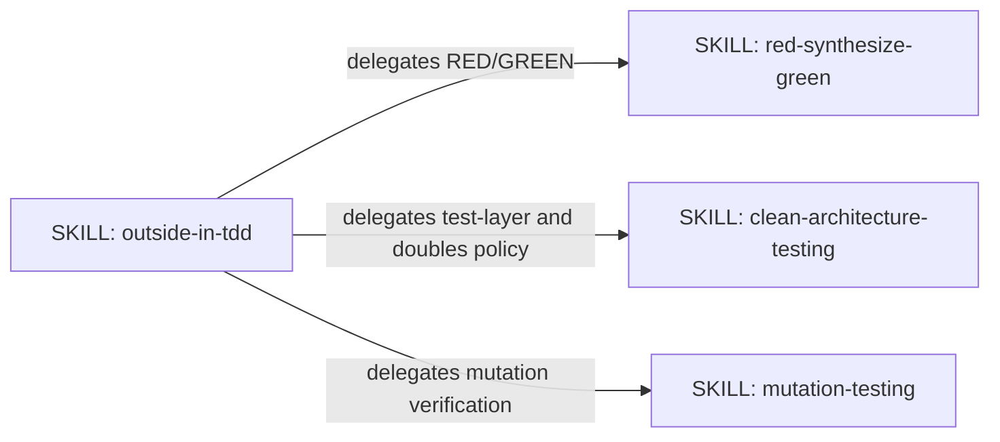
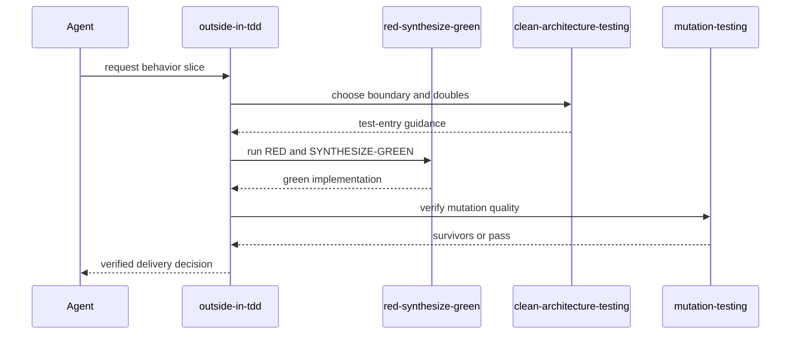
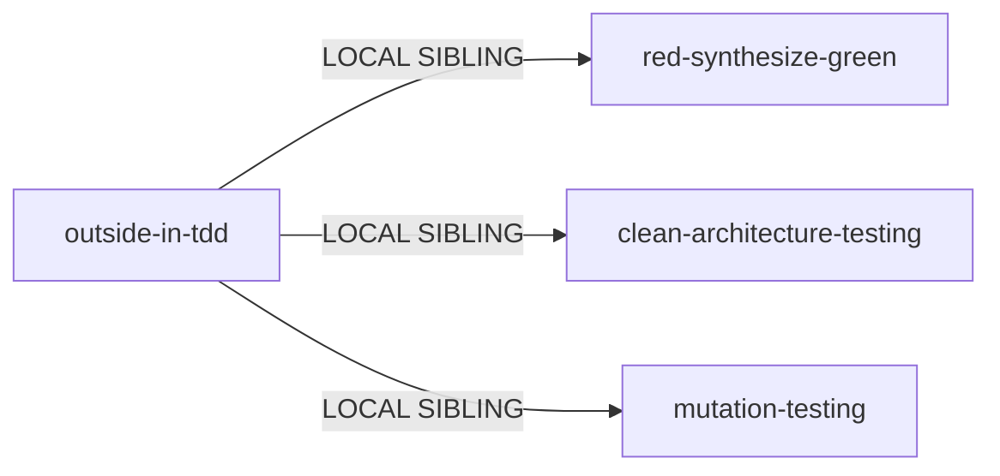

# Outside-In TDD simplification — genesis handoff

## Intent and boundary

Reduce `outside-in-tdd` to one coherent outside-in delivery contract: approved behavior drives an application-boundary test, the domain emerges from observable failure, and green code is verified before commit. Remove duplicated guidance and content owned by sibling skills. Do not redesign the evaluation instrument, runner, sibling skills, fixtures, or workflow.

## Component diagram

All nodes existing. No new primitive. Inline body retains only the outside-in sequence and its unique guardrails.

## Thread / sequence diagram

No fan-out: dependencies are sequential phase owners, not independent lenses. No shared sink beyond the caller's worktree; commit remains caller-controlled.

## Dependency graph and composition

Content unique to the outside-in sequence stays inline. Sibling skills remain local dependencies because they already own their respective mechanics. No external module is introduced.

## Interface sketch

- Name: `outside-in-tdd`
- Trigger: behavior-first feature work, approved scenarios, outside-in tests, domain emergence.
- Inputs: approved observable scenario, repository state, current test boundary.
- Outputs: ordered delivery guidance, test boundary choice, post-green verification decision.
- Dependencies: `red-synthesize-green`, `clean-architecture-testing`, `mutation-testing`.
- Audience: external guidance for the coding agent; concise body, lazy references only when needed.

## First controlled experiment

Hypothesis: remove the repeated mutation-testing section and repeated mutation reminder while preserving one phase-4 handoff and the integration link. This reduces body size without removing a unique target behavior; the frozen with/without eval should retain quality and lower treatment tokens.

Metric: paired evaluator quality delta (`skilled - baseline`) from `eval-results/outside-in-tdd/results.json`, with critical executable graders as hard gates. Secondary metrics: target body word count, treatment tokens, treatment duration, activation discipline.

Cost stance: frugal. One model, one judge, one run per stimulus, one worker, one concurrent job. The existing corrected run is the pre-edit baseline; no eval or fixture changes during measurement. Budget: 20 XP, used as an upper bound for controlled experiment attempts, not an instruction to spend all quota.

Scope: only `plugins/skraft-framework/skills/outside-in-tdd/SKILL.md` plus this handoff artifact. Read-only: `tests/skills/outside-in-tdd/eval.yaml`, all fixtures, runner, workflow, sibling skills, and unrelated worktree changes.

Acceptance: keep only if the corrected eval has no critical regression, paired quality delta is not worse than baseline beyond noise, and body size/token cost improves. Otherwise reset experiment commit.
