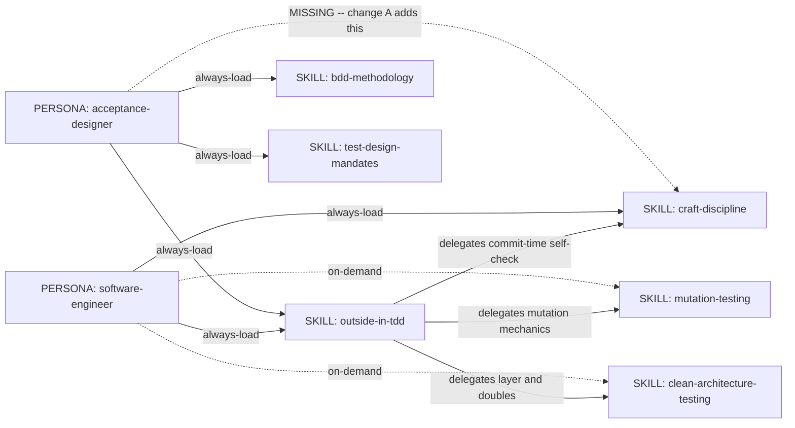
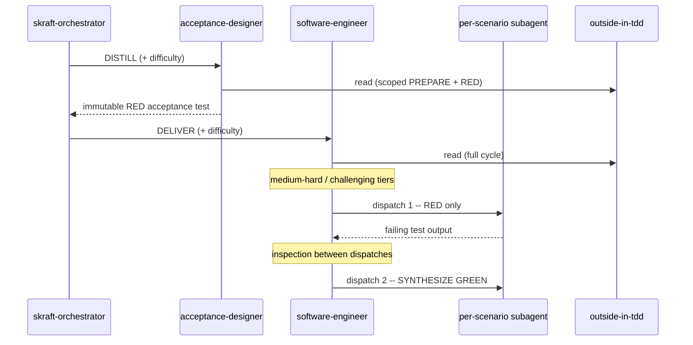

# Outside-In TDD SoC pass -- genesis handoff

Supersedes `../outside-in-tdd-simplification/plan.md`, whose design delegates
RED/GREEN to a `red-synthesize-green` skill that no longer exists in the
36-skill set. That packet is stale; do not execute it.

## Step 1 -- intent, scope, cost stance

Two refactors of existing primitives. No new module.

- **A (wiring).** `acceptance-designer` cites `craft-discipline` C1/C5 in its
  own body but never loads it. Add the dependency at its distribution surface
  (skills array + startup block).
- **D (content).** `outside-in-tdd` restates content its siblings own. Remove
  what is genuinely duplicated AND whose owner is already loaded by every
  consumer that needs it. Replace each removal with a depend-on pointer.

**Boundary -- what this does NOT do.** No rename or move of `outside-in-tdd`
(resolved by literal folder name in `skraft-framework.config.json:47,151`, two
agent descriptors, four eval graders, `clean-architecture-testing:14`,
`acceptance-review-criteria:60`, `references/gate-definitions.md:125`, and
`src/domain/skill-policy.mjs:4`). No R1 SPLIT. No change to the eval spec, the
runner, fixtures, or sibling skill bodies. No touching `references/`.

**Cost stance:** `balanced` (default -- operator declared none for this pass).
No cap declared.

## Step 2 -- component diagram

All nodes exist. The only new edge is `acceptance-designer -> craft-discipline`.

## Step 3 -- thread / sequence diagram

No fan-out redesign. The dispatched subagent has NO descriptor of its own, so
`outside-in-tdd` is the only sequence-carrying artifact that reaches it. This
is why change D must not touch the subagent-orchestration section.

## Step 3.1 -- tradeoff check

R1 SPLIT triggers DO fire on `outside-in-tdd`:

- DESCRIPTION CONJUNCTION -- the description chains capabilities with repeated
  "Also use ...".
- FRAGMENT CALLERS -- `acceptance-designer` needs only PREPARE + RED and says so
  in its own startup block; it pays for the whole body on every dispatch.

**Decision: SPLIT DEFERRED, not skipped.** The name-resolution fan-out above
makes a split a multi-file breaking change across two eval suites. Recorded as
an open finding rather than silently dropped. Mitigation this pass: shrink the
body (reduces fragment-caller cost) and leave the description rewrite to a
later pass so this one changes exactly one variable.

## Step 3.2 -- cost check

R5 COST PRUNE fires: **PROSE BLOAT**. Body is 370 lines against a 500-line
budget, and the audit attributes roughly a third of it to restatement rather
than capability. Direct evidence: the paired eval measured `tokens +46646` on
the treatment arm. Apply B14 PROMPT THRIFT. No role-class, prefix, or tool-
surface change -- this pass edits static module bodies only, so no spawn table
applies.

## Step 3.5 -- composition decision

Every box is an existing LOCAL SIBLING in the same source tree. No INLINE
promotion, no EXTERNAL MODULE, therefore no module-system adapter at step 7b
and no PHANTOM DEPENDENCY risk.

## Step 4 -- SoC pass (the load-bearing step)

Each removal candidate is checked against what its consumers actually load.

Load sets, verified from source:

- `software-engineer` -- always: `outside-in-tdd`, `craft-discipline`.
  On-demand: `clean-architecture-testing`, `test-design-mandates`,
  `test-refactoring-catalog`, `mutation-testing`, `quality-gates-*`,
  `resolving-stack-commands`. **`bdd-methodology` is absent entirely.**
- `acceptance-designer` -- `bdd-methodology`, `test-design-mandates`,
  `outside-in-tdd` (scoped PREPARE + RED), `resolving-stack-commands`.
  **`craft-discipline` and `clean-architecture-testing` are absent.**

| # | Candidate | Owner | Consumer gap | Verdict |
|---|---|---|---|---|
| D1 | `:250` "100% code coverage" | none -- self-contradicted at `:257` | -- | REMOVE (internal contradiction, not duplication) |
| D2 | `:251-253` mutation bullets 2-4 | `mutation-testing` | none | REPLACE with pointer |
| D3 | `:138` conventional-commit format | `craft-discipline` C9 | none | REPLACE with pointer |
| D4 | `:67-72` vs `:179-194` boundary rules | duplicated INSIDE this file | none | COLLAPSE to one copy |
| D5 | `:87-90` placeholder enumeration | `craft-discipline` C5 | acceptance-designer -- **closed by change A** | REPLACE with pointer, keep the unique replacement procedure |
| -- | `:67-72` boundary rules (delete outright) | `clean-architecture-testing` | acceptance-designer does not load it, and its startup block names "the boundary rules" as a reason it reads this skill | **DEFERRED** -- needs wiring first |
| -- | `:355-356` Gherkin hygiene | `bdd-methodology` | software-engineer never loads it | **DEFERRED** -- needs wiring first |
| -- | `## When Orchestrating Subagents` | sole-source | dispatched subagent has no descriptor | **KEEP -- do not touch** |
| -- | `references/` (751 lines) | mixed | not analysed for consumers | OUT OF SCOPE this pass |

R3 EXTRACT is NOT applied: every owner primitive already exists, so the move is
"replace inlined block with a relative-path reference", R3 procedure step 2,
without the promotion.

## Step 5 -- compliance findings

| Finding | Severity | Action |
|---|---|---|
| `name` matches parent directory and parses | -- | PASS (fixed this session) |
| Body 370 lines / budget 500 | -- | PASS |
| Description 919 chars / budget 1024 | -- | PASS, but near cap |
| Description is imperative and names indirect triggers | -- | PASS |
| Description ASCII-only | -- | PASS (fixed this session) |
| **Body contains non-ASCII: en dash, em dash, ellipsis, arrow, check mark** | MEDIUM | PRE-EXISTING -- out of scope; introduce no new non-ASCII |
| **R1 SPLIT triggers fire but split deferred** | HIGH | Recorded in step 3.1; revisit once name fan-out is addressed |
| **`:98` claims to be "the single reference for the whole framework"** | MEDIUM | False -- `craft-discipline` C5 carries the same list. Fixed by D5 |
| **`:250` contradicts `:257` within seven lines** | HIGH | Fixed by D1 |

No BLOCKER. Design proceeds.

## Step 6 -- interface sketches

**acceptance-designer** (PERSONA, modified)
- Trigger: DISTILL phase dispatch from the orchestrator.
- Dependencies after change A: `bdd-methodology`, `test-design-mandates`,
  `outside-in-tdd` (scoped), `resolving-stack-commands`, **`craft-discipline`**.
- Declaration mechanism: both surfaces -- frontmatter `skills:` array AND the
  "Always load at startup" block, matching how its four existing dependencies
  are declared.

**outside-in-tdd** (SKILL, modified)
- Trigger, inputs, outputs: unchanged this pass.
- Dependencies: unchanged set; the pointers added by D2/D3/D5 make three of
  them explicit at the point of use rather than implied.
- Invocation mode: FORCED for both agents (roster-injected by
  `subagent-start-service.mjs`), DISCOVERY for ad-hoc callers.

## Todo list

1. A -- add `craft-discipline` to `acceptance-designer` (both surfaces).
2. D1 -- remove the 100% coverage line.
3. D2 -- mutation bullets 2-4 to a pointer.
4. D3 -- conventional-commit format to a pointer.
5. D4 -- collapse the intra-file boundary duplication.
6. D5 -- placeholder enumeration to a pointer; keep the replacement procedure;
   drop the false "single reference" claim. Depends on 1.
7. Validate: `npm run test:dashboard`, frontmatter guard, line/ASCII budgets.

## Evals plan

The instrument already exists: `tests/skills/outside-in-tdd/eval.yaml`, 9
stimuli, one tagged `intent: non-activation`. It is the with/without pair
genesis asks for, and this session repaired the two defects that made it
unreadable (unparseable frontmatter, mapping-valued rubric entry).

Ship gate for this pass: the paired run shows no critical regression on the
deterministic graders, and the treatment token delta improves against the
`+46646` recorded on 2026-08-23. Trigger evals are NOT run this pass because
the description is deliberately unchanged -- one variable at a time.

## Cost projection

Static body edits; no agent spawns. Cost is the eval re-run only: same shape as
the 2026-08-23 run (2 arms x 9 stimuli x 4 trials, one model, one judge). The
expected direction is a reduction in treatment tokens, since B14 PROMPT THRIFT
removes body without removing capability. Stance `balanced`, no cap declared,
no halt condition triggered.

## HUMAN_RATIONALE -- never copied into a spawn brief

The reason this pass is narrower than the audit's "roughly 60% is restatement"
is that redundancy is a property of the PAIR (content, consumer), not of the
content alone. Two of the audit's confidently-listed duplications are the only
copy their consumer can reach: `software-engineer` never loads
`bdd-methodology`, and `acceptance-designer` never loads
`clean-architecture-testing`. Deleting them because a sibling "owns" them would
have removed working guidance from a live agent, and no test in the repository
would have caught it. Wire the dependency first, delete second.
