# Genesis handoff — Vally real-agent executor

## Intent and scope

Build a contributor-only Vally executor plugin that deterministically resolves an allowlisted SKRAFT agent from a stimulus tag, selects that exact `.agent.md`, sends the unchanged business prompt to a Copilot SDK session rooted in Vally's prepared workspace, and delegates SDK event conversion to Vally's `CopilotAdapter`. Entire SKRAFT skill catalog is available through Vally's `--skill-dir`; relevant skills activate on demand and produce native `skill_activation` events. Initial pilot targets `software-engineer` and a missing-precondition response. It does not run the complete SKRAFT orchestrator, add production plugin primitives, or claim code-delivery fidelity until the later Node slice passes.

Cost stance: `balanced`. No hard cap declared.

## Component diagram

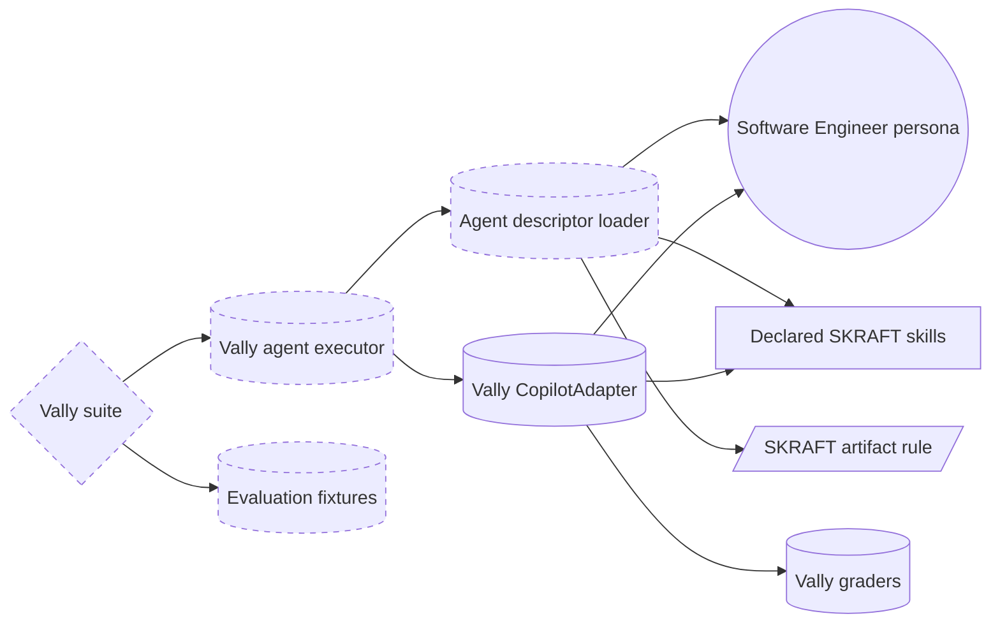

`VE` and `AL` are deterministic maintainer-side assets, not user-facing agentic primitives. `CA` is Vally's public adapter. `AG`, `SK`, and `IN` already ship in the plugin.

## Runtime sequence

```mermaid
sequenceDiagram
    participant Vally
    participant Executor
    participant Loader
    participant Copilot
    participant Agent
    participant Graders

    Vally->>Executor: execute stimulus in prepared workspace
    Executor->>Loader: resolve allowlisted agent tag
    Loader-->>Executor: descriptor, source hash, skills, instructions
    Executor->>Copilot: create selected custom-agent session
    Copilot->>Agent: unchanged stimulus prompt
    Agent-->>Copilot: messages, tools, skill activations
    Copilot-->>Executor: raw session events
    Executor-->>Vally: CopilotAdapter trajectory plus selected-agent audit event
    Vally->>Graders: grade trajectory and final workspace
    Graders-->>Vally: deterministic verdict
    Note over Vally,Graders: one worker for pilot; Vally owns workspace lifecycle
```

## Supervised execution

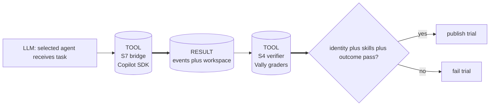

Pattern: A9 SUPERVISED EXECUTION, weak-form agent writes limited to Vally workspace; S7 executor bridge; S4 deterministic graders. B2 CONDITIONAL DISPATCH resolves `tags.agent` through an allowlist. B4 PLAN MEMENTO and B8 ATTENTION ANCHOR are this file.

Tradeoff citation: pattern-tradeoffs matrix 9, execution doctrine. Agent selection, hashing, file reads, process/session execution, and grading are tool-delegated because they are facts or side effects. The agent alone owns code-generation judgement.

## Dependency graph

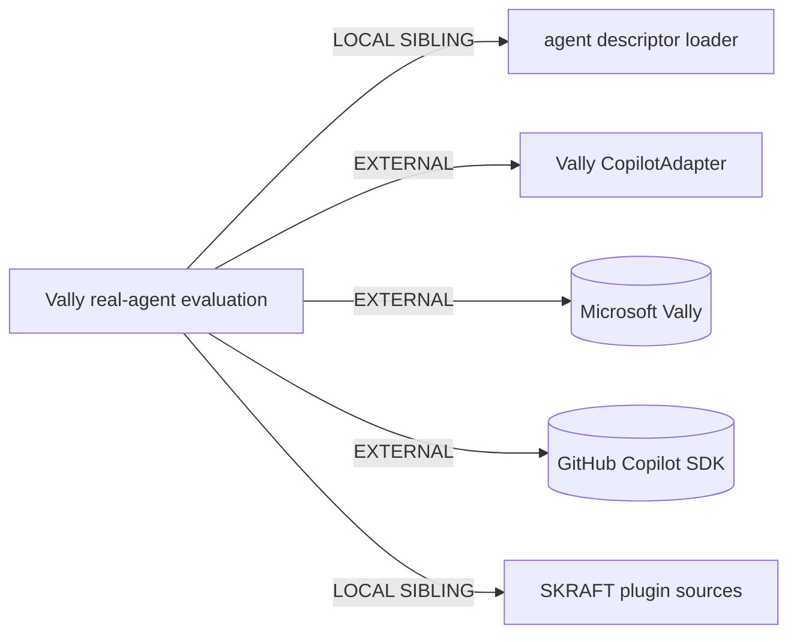

## Interface sketches

### `skraft-agent-executor`

- Trigger: Vally suite selects executor and stimulus carries `tags.agent`.
- Inputs: `Stimulus`, `ExecutorOptions`, allowlisted repository root.
- Outputs: Vally `Trajectory` from `CopilotAdapter`, plus selected-agent audit event.
- Dependencies: descriptor loader, Copilot SDK, Vally `CopilotAdapter`.
- Invocation mode: FORCED.

### `agent-descriptor-loader`

- Inputs: allowlisted agent slug.
- Outputs: stable descriptor `{ id, name, path, hash, prompt, model, tools, skills, instructions }`.
- Failure: reject missing/unknown slug and path escape before model execution.

### Copilot session

- Inputs: descriptor, unchanged prompt, prepared workspace, model, timeout.
- Outputs: SDK events passed directly to Vally's adapter.
- Safety: empty mode; read-only workspace tools; write and shell permissions rejected.

### Vally `CopilotAdapter`

- Inputs: Copilot session plus prompt and executor options.
- Outputs: Vally-native trajectory and real `skill.invoked` → `skill_activation` conversion.

## Composition table

| Box | Mode | Audience | Rationale |
|---|---|---|---|
| Vally executor | LOCAL SIBLING | INTERNAL | contributor tooling; excluded from shipped plugin boundary |
| Descriptor loader | LOCAL SIBLING | INTERNAL | reused by executor tests and future CLI smoke test |
| Vally `CopilotAdapter` | EXTERNAL MODULE | INTERNAL runtime | public event/session adapter; avoids duplicate trajectory conversion |
| Eval suite and fixtures | LOCAL SIBLING | INTERNAL | maintainer-only; must not contaminate plugin discovery |
| SKRAFT agents/skills/instructions | LOCAL SIBLING | INTERNAL runtime input | existing source under evaluation |
| `@microsoft/vally` | EXTERNAL MODULE | INTERNAL runtime | executor/trajectory contracts; declaration at package manifest |
| Copilot SDK package | EXTERNAL MODULE | INTERNAL runtime | real agent session; declaration at package manifest |

External declaration mechanism: exact manifest dependency entries (`@microsoft/vally@0.12.0`, `@github/copilot-sdk@1.0.9`). This repository ignores `package-lock.json`, so reproducibility comes from exact versions rather than a committed npm lockfile. Target: GitHub Copilot + Vally; intentionally not `common-only`.

## Compliance findings

- HIGH: installed `vally` is 0.10.0 while repository runner requests 0.12.0. Implement against declared repository version; verify plugin contract on both or pin one version before live run.
- HIGH: `software-engineer` is `user-invocable: false`. Inline SDK `selectedCustomAgent` avoids human-invocation routing; live proof still required.
- HIGH: source model label `Claude Sonnet 5` is not a current SDK identifier. Eval model option controls runtime model; descriptor records source label separately.
- MEDIUM: source tools use VS Code names. Pilot missing-precondition scenario needs no write tools; tool mapping is deferred to Node slice.
- MEDIUM: `quality-gates-dotnet` is globally mandatory in framework config but conditionally loaded in agent prose. Node slice must expose and then resolve this mismatch; pilot must not hide it.
- No R1/R2/R3/R4 refactor trigger fires. New tooling remains outside user-facing distribution boundary, avoiding bundle leakage.

## Cost projection

Declared stance: `balanced`.

| Module | Role class | Prefix | Output | Turns | Cost patterns |
|---|---|---:|---:|---:|---|
| Deterministic executor/loader/converter | none | S | S | none | S7, S4 |
| Software Engineer blocked pilot | implementer | M | S | low | B13 stable agent/skill prefix, B15 bounded tools |
| Vally deterministic graders | none | S | S | none | S4 |
| Optional LLM judge | reviewer | M | S | low | omit in pilot; add only for subjective quality |

Cost-shape citation: matrix 10, single bounded implementation run. Dominant cost is selected implementer model; no model switch mid-session.

Approximate workload ranges, expressed as Copilot requests because token pricing is not exposed by this harness contract:

| Scenario | Input tokens | Output tokens | Turns / requests | Notes |
|---|---:|---:|---:|---|
| S — missing preconditions | 8K-25K | 100-500 | 1-3 | pilot |
| M — Node behavior slice | 25K-100K | 500-3K | 4-10 | later MVP |
| L — complete Software Engineer contract | 100K-400K | 3K-12K | 10-30 | deferred |

No cap check required. Pricing/multipliers must be re-fetched before dollar estimates; Copilot adapter pricing stamp is stale.

## Evaluation plan

### Content/outcome evaluations

1. Missing DISTILL prerequisites: real selected agent returns structured `blocked` payload, performs no edits.
2. Node red-to-green slice: real selected agent changes production file, preserves supplied failing test, runs test command to green. Deferred.
3. Unknown agent tag: executor rejects before creating a model session.

Each live scenario records agent identity and hash. Comparison without selected agent is optional diagnostic, not proof of routing.

### Routing evaluations

Deterministic allowlist replaces probabilistic trigger matching. Valid train set: `software-engineer`, repeated with scalar and one-element tag forms. Invalid train set: missing tag, unknown slug, path-like slug, display name, reviewer slug. Validation set adds case changes and traversal strings. Ship gate: all valid tags resolve exact source; every invalid tag fails before runner call.

## Todo

- [x] Research Vally executor contract and existing production example.
- [x] Persist Genesis design and acceptance criterion.
- [x] RED: acceptance test proves exact agent resolution, unchanged prompt, skills, instructions, and trajectory identity. Confirmed behavior failure: injected runner received 0 calls, expected 1.
- [x] Human validates RED and interface.
- [x] GREEN: descriptor loader plus executor factory. Acceptance test, dashboard suite, and local CI pass.
- [x] Use Vally's public `CopilotAdapter` for session execution and event conversion; remove duplicate local runner/converter.
- [x] Document executor architecture, evidence model, safety, status, and local commands in contributor README.
- [x] Register executor through `registerExecutors`. Human-approved RED; pinned Vally API plus Copilot SDK installed; registration test and local CI pass.
- [x] Add missing-precondition Vally suite and fixture under `tests/agents/agent-behavior/`. Human-approved RED; contract test and strict Vally 0.12.0 lint pass.
- [x] Unify skill and agent suites behind `eng/run-vally-evals.sh`; remove dedicated agent runner.
- [x] Run live unified trial. `./eng/run-vally-evals.sh agents agent-behavior` passes 6/6 graders at 100%, with empty workspace diff and real skill activation.
- [x] Make entire SKRAFT skill catalog available with `--skill-dir plugins/skills`; require relevant `outside-in-tdd` activation through built-in `skill-invocation` grader.
- [x] Retain `output-not-matches` guard against `[SKILL MISSING]` and equivalent failures.
- [ ] Add Node red-to-green slice after pilot certifies routing.
- [x] Update graph with `graphify update .` after final validation.

## Acceptance criterion

A Vally stimulus with `tags.agent: software-engineer` reaches the exact SKRAFT Software Engineer definition and receives the prompt unchanged. Allowlisted descriptor resolution audits source identity by path and SHA-256. Vally's native trajectory records real skill activations, and built-in graders decide activation and workspace outcome. Unknown agents fail before any model call. Pilot remains isolated, bounded, non-.NET, and outside the shipped plugin bundle.

## Human rationale — never copy into agent prompt

Persona prose inside the stimulus would let a generic model imitate the Software Engineer and hide a routing defect. Selection therefore belongs to deterministic executor code. The prompt stays role-neutral. Identity, loading, and outcome are independent gates: source hash proves which definition was selected; trajectory events prove which skills/tools were used; workspace tests prove whether implementation works. No single self-reported sentence can satisfy any gate.

## Dependency audit note

`npm audit` after dependency installation reports 17 development-only transitive advisories. Dependency ancestry traces them to the pre-existing `semantic-release -> @semantic-release/npm -> npm@10.9.8` chain; the newly added Vally dependency resolves `picomatch@4.0.5`, outside the vulnerable range. No unrelated major release-tool upgrade is folded into this feature. Revisit as a separate security maintenance task.

## Authoritative Vally confirmation — 2026-08-06

Source: https://microsoft.github.io/vally/concepts/how-it-works/#1-stimulus

- Stimulus = prompt + graders + optional constraints/environment. Our prompt stays role-neutral; fixture is staged by `environment.files`; agent selection is executor-specific `tags.agent` configuration.
- Vally owns workspace setup and skill discovery. Custom executor owns deterministic agent selection and permission policy, while `CopilotAdapter` owns prompt delivery and event capture.
- Trajectory is the portable behavioral record. Runtime `skill.invoked` events become typed `skill_activation` events; catalog availability is not treated as activation evidence.
- Graders inspect trajectory/workspace and scoring aggregates results. Threshold `1` makes every deterministic identity, loading, output, and no-diff assertion mandatory.

Conclusion: thin custom executor design is confirmed by Vally's documented plugin model. Final correction: use native runtime activation events rather than synthetic eager-preload evidence.

## Model-routing delta — empty workspace

Intent and scope: bind the read-only missing-precondition pilot to `gpt-5.6-luna`
instead of `claude-sonnet-4.6`, and colocate its trial count with that binding in
Vally suite defaults. Keep agent selection, complete skill-catalog availability,
graders, fixture, and judge model unchanged. Cost stance: frugal for this one-turn
blocked-path evaluation.

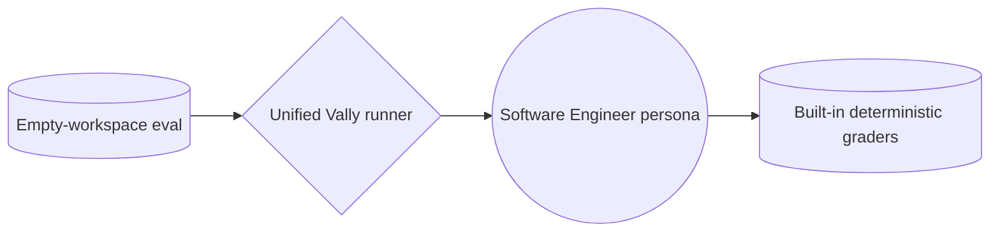

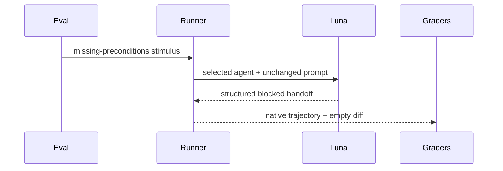

Pattern: B12 MODEL ROUTER, explicit BIND DOWN for economy. Required capability is
bounded prerequisite classification plus structured output, not code synthesis. No
R1–R5 refactor trigger fires; topology and module boundaries stay unchanged.

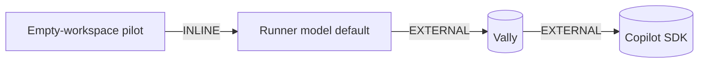

Interface delta: suite-local `defaults.model` becomes `gpt-5.6-luna` and
`defaults.runs` remains the adjacent trial-count control. Unified runner stops
overriding either field for agent suites. INTERNAL output remains Vally trajectory
data; no new external artifact. Copilot-specific model binding is intentional. Cost
shape remains one model call, small output, low turns; expected premium-request cost
decreases relative to Sonnet, with no multiplier claim until live billing data is
refreshed.

Acceptance: eval-spec test observes `model: gpt-5.6-luna` beside `runs: 1`; unified
runner test proves no CLI override masks either field. Strict Vally lint, focused live
trial, dashboard tests, and local CI remain green.

Validated 2026-08-06: live Luna trial passed 6/6 graders at 100%, with empty
workspace diff, 47,027 tokens, 3 turns, 8 read-only tool calls, and 10.7 s agent
wall time.

## Dashboard evidence adapter delta

Intent and scope: make a successful real-agent Vally run visible on the existing
dashboard agent row. Convert native `trial-result` records into the repository's
publishable `results.json` envelope, append it through existing history writer, and
let existing dashboard build/render code consume it. Do not compare agent against a
generic baseline, claim statistical lift, or alter skill comparison semantics. Cost
stance: frugal; conversion is deterministic and makes no model call.

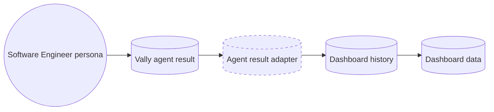

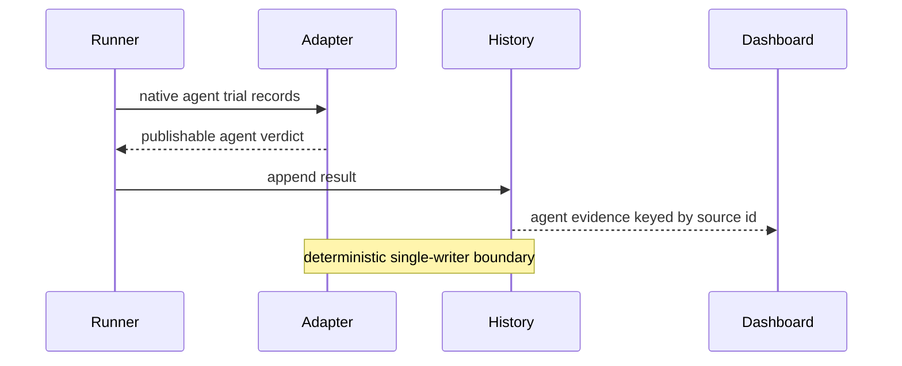

Pattern: A9 SUPERVISED EXECUTION, with S7 deterministic adapter and existing S4
grader verdict. B4 PLAN MEMENTO is this persisted handoff. No R1–R5 refactor trigger
fires: missing behavior is one adapter at an existing schema boundary.

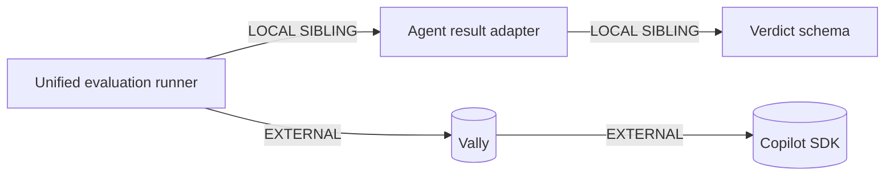

Interface sketch:

- Input: native Vally agent `results.jsonl`, output root.
- Identity: `trajectory.metadata.agent.id/path`; reject records without both.
- Verdict: direct capability result, conclusive only when trials executed without
    execution errors; pass only when every trial grade passed.
- Evidence reason: passed/total grader summary or failed grader names.
- Metrics: median duration, tokens, turns, and tool calls under existing dashboard
    efficiency schema, using the agent run as `skilled` and no fabricated baseline.
- Output: existing `{ runner, model, timestamp, verdicts[] }` envelope with
    `subject.kind: agent`.
- Audience: machine-internal adapter output; dashboard row remains human-external.

Composition: adapter and tests are LOCAL SIBLING contributor tooling; Vally and
Copilot SDK remain pinned EXTERNAL modules. No new dependency. Prefix/output/turn
bands: none — zero LLM calls. Target harness remains Copilot-specific only at the
upstream executor; adapter consumes portable Vally JSONL.

Acceptance: unified runner writes agent `results.json`; local preview appends
`software-engineer` history; dashboard row displays Luna evidence. Existing skill
adapter, history, dashboard, lint, and CI tests remain green.

## Comprehensive Software Engineer delivery stimulus

Intent and scope: add a separate Sonnet-class real-agent suite that exercises an
approved .NET Clean Architecture behavior slice beyond prerequisite detection. It supplies DISTILL
artifacts and an already-RED outer acceptance test, enforces the mandatory human
checkpoint through two turns, permits bounded workspace edits/test execution, and
grades final observable behavior, architecture boundaries, stack routing, and test
integrity. NuGet restore happens before agent execution; agent cannot install packages,
touch network, or weaken the outer test. Cost stance: balanced; one Sonnet-class
implementation session, one trial.

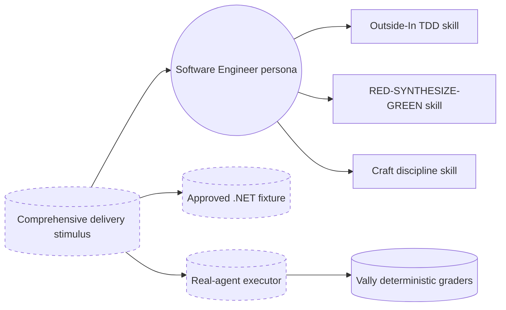

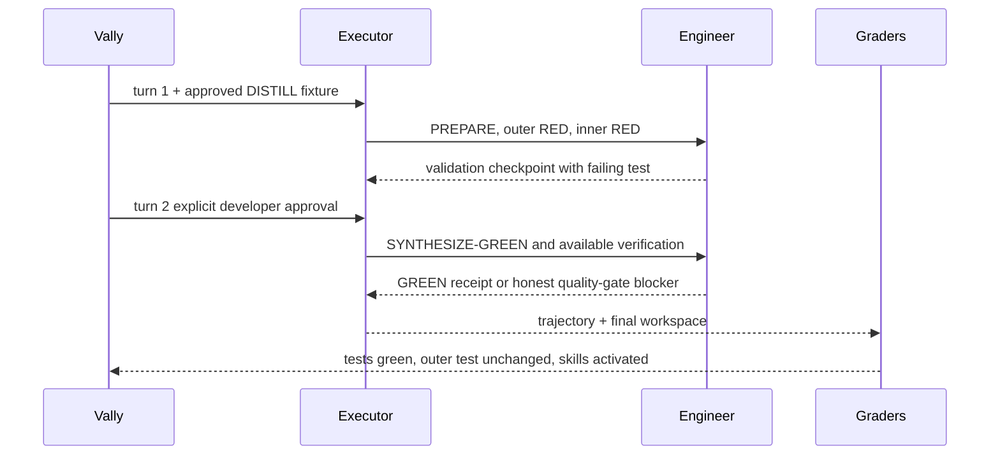

Topology: A9 SUPERVISED EXECUTION. Vally owns isolated workspace and deterministic
S4 validation; executor grants scenario-scoped S7 write/test capabilities. B4 PLAN
MEMENTO is this handoff; B8 ATTENTION ANCHOR is the approved scenario/plan pair.
No R1/R2/R3/R4 trigger fires. R5 COST PRUNE keeps the blocked empty-workspace pilot
on Luna while this multi-constraint coding slice binds to implementer class.

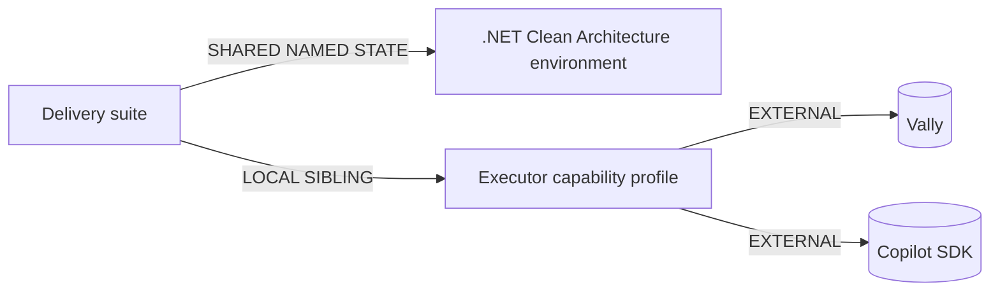

Interface sketch:

- Suite: separate from Luna prerequisite pilot; one Sonnet-class trial, multi-turn.
- Turn 1: neutral delivery request with project slug, story, depth tier, and difficulty;
    agent must inspect repository artifacts rather than receive solution prose.
- Turn 2: explicit developer approval of the observed inner RED; continue GREEN.
- Shared environment: named `approved-loyalty-discount-red`; .NET 10 solution with Domain, Application, Infrastructure, and API under
    `src/`; exactly `CheckoutPricing.UnitTest` and `CheckoutPricing.IntegrationTest`
    under `tests/`; failing Application-boundary outer test, approved feature, plan,
    architecture test, and centrally restored test packages. Agent and skill suites stage
    explicit files from `tests/environments/checkout-pricing/` to avoid build-output leakage.
- Executor profile: `workspace-write`; add edit + shell only for tagged stimuli. Reads
    remain allowed. Writes must stay under prepared workspace. Shell rejects URLs,
    sandbox bypass, package installation/restore, paths outside workspace, and commands
    outside a narrow .NET/git/evidence toolchain allowlist.
- Graders: completed session; final test command succeeds; production diff exists;
    outer acceptance test absent from diff; startup skills activated; no skill-loading
    failure. No grader requires a particular implementation syntax or private method.
- Expected terminal state: behavior/build/architecture tests GREEN. The .NET quality
    adapter must activate. If Stryker is unavailable, record the failed mutation gate
    and disclose the blocker rather than fabricate evidence.

| Box | Mode | Audience | Cost shape |
|---|---|---|---|
| Delivery suite | LOCAL SIBLING | INTERNAL | no model itself |
| Shared .NET environment | SHARED NAMED STATE | INTERNAL | medium variable suffix |
| Executor profile | LOCAL SIBLING | INTERNAL | deterministic |
| Software Engineer | existing persona | INTERNAL receipt | implementer; prefix L; output M; turns medium |
| Vally graders | EXTERNAL | INTERNAL verdict | deterministic |

External modules remain pinned `@microsoft/vally@0.12.0` and
`@github/copilot-sdk@1.0.9`; no new dependency. Target is intentionally Copilot-specific
at executor binding. Acceptance: contract tests prove separate model routing, two-turn
delivery, bounded write policy, outcome-focused graders, and fixture completeness;
strict lint and a live focused run prove final behavior.
