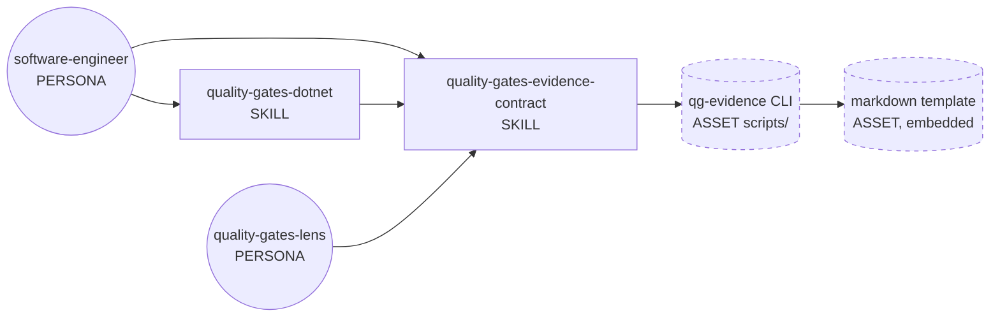
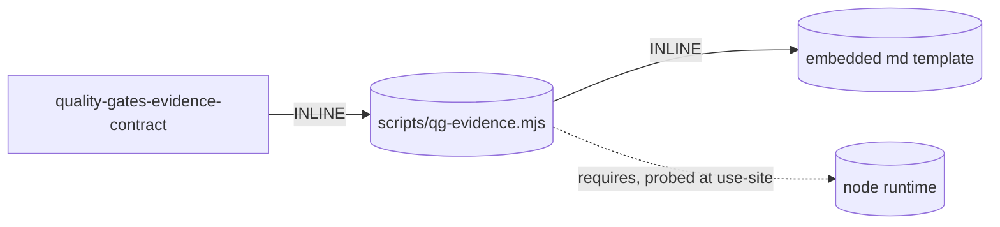

# Handoff packet — qg-evidence deterministic toolchain

Genesis design session, 2026-07-05. Status: DESIGN COMPLETE (step 6).
Coder step (7a/7b/8) NOT started.

## 1. Intent + scope

Replace the two LLM-asserted links in the quality-gates evidence chain
with a deterministic CLI. Today the software-engineer runs gate commands
via terminal redirects (already S7-compliant) but then ASSEMBLES
`qg-{story}.json` by hand (transcribing hashes, exit codes, TRX metrics,
git data into JSON) and would write any markdown summary as prose. Both
are HAND-ROLLED HALLUCINATION surfaces. The new capability: a bundled
CLI `qg-evidence` with two subcommands —

- `assemble` — reads the raw captured outputs on disk
  (`qg-*.stdout`, `qg-*.exit`, TRX, stryker `mutation-report.json`,
  snapshots), recomputes every fact itself (sha256, exit codes, metric
  parsing, `git rev-parse` / `git log`), self-validates against the
  `quality-gates-evidence/v1` schema, and writes `qg-{story}.json`.
  Non-zero exit on any contradiction (missing ref, failed parse,
  hash impossible).
- `render` — reads `qg-{story}.json`, refuses non-conforming input,
  and emits `qg-{story}.md` from an embedded template. The markdown is
  a DERIVED VIEW, never authoritative; the lens keeps falsifying the
  JSON only.

Boundary (does NOT do): does not run the TDD cycle; does not run the
gate commands themselves (terminal redirects stay as-is per the tech
adapters); does not replace the quality-gates-lens verifier; does not
decide policy beyond the mechanical rules already in the contract.

LLM owns: parameter binding (a small `qg-manifest.json` naming story,
projectSlug, date, gate entries → command strings + raw-file refs +
cycle metadata) and interpretation of the tool's exit/report.
Tool owns: every fact and both emitted artifacts.

Dispatch description draft (for the updated contract skill frontmatter,
<= 1024 chars, imperative, intent-first):

> Use when producing or verifying the structured evidence log that
> attests quality gates (tests, build, mutation, commits, RED/GREEN
> integrity). Tech-agnostic schema. The evidence JSON and its markdown
> report are emitted by the bundled `scripts/qg-evidence.mjs` tool —
> never assembled by hand. Loaded by software-engineer (writer) at
> COMMIT phase and by quality-gates-lens (reader) during review.

Invocation mode: DISCOVERY (loaded by software-engineer per its skill
table) — unchanged.

Cost stance: `balanced` (default; operator declared none). No cap.

## 2. Component diagram



Existing modified: `quality-gates-evidence-contract` (producer rules →
tool-first), `quality-gates-dotnet` (producer flow step 6 → tool
invocation). Existing unchanged: `software-engineer`,
`quality-gates-lens` (still falsifies the JSON independently — the
verifier NEVER trusts the producer's tool). New: the CLI + its embedded
template.

## 3. Thread / sequence diagram

Single thread. No new spawns → no per-spawn declaration table needed.

```mermaid
sequenceDiagram
    participant SE as software-engineer (LLM)
    participant T as Terminal (S7 bridge)
    participant FS as Evidence dir / Git

    Note over SE: COMMIT phase, all commits landed
    SE->>T: gate commands with redirects (per tech adapter)
    T->>FS: qg-*.stdout / qg-*.exit / trx / mutation-report.json / snapshots
    SE->>FS: write qg-manifest.json (parameters only)
    SE->>T: node scripts/qg-evidence.mjs assemble --manifest ...
    T->>FS: recompute sha256, parse metrics, git rev/log, schema self-check
    T-->>SE: exit 0 + result envelope | exit !=0 + diagnostics
    Note over SE: S4 gate — interpret exit; on failure fix inputs, retry (budget 2)
    SE->>T: node scripts/qg-evidence.mjs render --input qg-{story}.json
    T->>FS: qg-{story}.md (derived view)
    SE->>T: git add evidence && commit chore(evidence)
```

Pattern selection (tier order):

1. Refactor triggers: **R3 EXTRACT** fires — mechanical assembly
   procedure currently inlined as prose in two skills moves into a
   deterministic script. No R1 (no split), no R2/R4.
2. Tier 3: **A9 SUPERVISED EXECUTION** (LLM plans via manifest,
   deterministic tool executes, S4 verifies, bounded retry). Not A1
   (no independent lenses), not A11 (no queue).
3. Tier 2: **S7 DETERMINISTIC TOOL BRIDGE, extension route 2**
   (custom CLI with documented contract); **S4 VALIDATION DECORATOR**
   twice (assembler self-validation gate; renderer refuses
   non-conforming JSON); B4/B8 already provided by the pipeline
   (state.json + plan artifacts) — inherited, not new.

### 3.1 Tradeoff check

Two S7 routes fit the slot. Cited: S7 EXTENSION PATHS selection rule
(design-patterns.md §S7).

| Option | Verdict |
|---|---|
| Route 1 — ad-hoc terminal (jq/shell per run) | rejected: JSON shape re-synthesized each run = HAND-ROLLED HALLUCINATION on the artifact the whole review chain depends on |
| Route 2 — custom CLI script (chosen) | stable named contract, reused across every story and every tech adapter |
| Route 3 — MCP server | rejected: single consumer (one skill), no cross-harness typed-schema need; infrastructure unwarranted |

### 3.2 Cost check

Stance `balanced`. No new LLM role — the new module is CPU substrate.

- OUTPUT TAX: drops. LLM no longer emits ~150–300 lines of JSON plus a
  markdown report; it emits 2 short tool invocations + one small
  manifest. Output band at COMMIT phase: M → S.
- Turn count: −3 to −5 turns (no transcription/repair loop on malformed
  hand-built JSON).
- CACHE: no new invalidators; script path and --help contract are
  static prose in the skill body (cacheable prefix unchanged).
- No spawn → no audience-boundary table; internal artifacts
  (manifest, result envelope) are structured JSON, not prose.

### 3.5 Composition decision

| Box | Mode | Rationale |
|---|---|---|
| qg-evidence CLI | INLINE (bundled `scripts/` of quality-gates-evidence-contract) | runtime-needed by the user-facing bundle in target repos; canonical agentskills.io `scripts/` layout; single consumer skill |
| markdown template | INLINE (embedded in the script) | one renderer, one template; separate asset file = thin proxy (R4 shape) |
| TRX / stryker parsers | INLINE (modules inside the script file or scripts/lib) | rule of three not met; new tech adapter = new parser added here |
| contract schema | INLINE (already in SKILL.md; script enforces it) | script is the mechanical enforcement; SKILL.md stays the human-readable spec; shared version string `quality-gates-evidence/v1` |



External modules required: NONE → step 7b loads no module-system
adapter. Node availability is a fact-that-must-be-true: use-site probe
`node --version` before first invocation (A9); the plugin harness
already ships mjs hooks, so node is present wherever the plugin runs.

## 4. SoC pass

- Contract skill remains schema owner; script duplicates nothing — it
  ENFORCES. Guard: one shared `$schema` version string; bumping the
  schema bumps both.
- quality-gates-dotnet keeps ONLY tech command recipes; its "assemble
  the JSON" prose step is deleted (R3 landed there). Other future tech
  adapters inherit the same tool invocation for free.
- quality-gates-lens untouched: independence of the verifier is the
  point of the contract. The lens MUST NOT read the markdown — the
  packet declares `qg-{story}.md` NON-AUTHORITATIVE DERIVED VIEW.
- No dispatch collision: the script has no description; the updated
  skill description stays within its existing trigger space.
- No premature split: one script, two subcommands, one coherent unit
  (produce evidence artifacts).

## 5. Compliance findings

| Finding | Severity | Disposition |
|---|---|---|
| Assembler MUST recompute sha256/exit itself; accepting pre-computed `.sha256` files as input would be TOOLLESS ASSERTION | HIGH | encoded in interface contract below; step 8 checks it |
| Script must be non-interactive, `--help` documented, structured stdout (result envelope JSON) / diagnostics stderr | HIGH | agentskills.io using-scripts spec; step 8 checks |
| SKILL.md must LIST the bundled script + its contract so the agent finds it | MEDIUM | todo 3 |
| Existing `.sha256` sidecar files in dotnet adapter recipes become redundant | LOW | keep recipes minimal; assembler recomputes regardless |
| SKILL.md body budget (<=500 lines / 5000 tokens) after adding tool section | MEDIUM | move producer CLI details to `references/` with load trigger if body overflows |

No BLOCKER. PROSE: Progressive Disclosure (script + references lazy),
Reduced Scope (tool owns facts), Safety Boundaries (S4 gates, non-zero
exits), Explicit Hierarchy (contract → adapters → tool) — satisfied.

## 6. Interface sketches

### scripts/qg-evidence.mjs (new, node >= 18, zero npm deps)

```
qg-evidence assemble --manifest <qg-manifest.json> [--evidence-dir <dir>]
  reads : manifest (LLM-authored parameters), raw captured files, git
  computes (never trusts input): sha256 of every stdout ref, exit codes
           from .exit files, tests_total/passed/failed from TRX,
           mutationScore from mutation-report.json, repo_root_rev,
           commits_covered[] from git log/show, stdout_tail (40 lines)
  writes : qg-{story}.json  (schema quality-gates-evidence/v1)
  stdout : {"ok":true,"output":"...","gates":{"pass":n,"fail":n,"na":n}}
  exit   : 0 ok | 1 contradiction/missing ref | 2 bad usage
qg-evidence render --input <qg-{story}.json> [--output <qg-{story}.md>]
  reads : the evidence JSON; refuses if $schema mismatch or malformed
  writes : qg-{story}.md from embedded template (gate table, metrics,
           commit list, cycle integrity table, refs + hashes)
  stdout : {"ok":true,"output":"qg-{story}.md"}
  exit   : same taxonomy
qg-evidence --help  → full contract
```

### qg-manifest.json (LLM-owned parameters, minimal)

```json
{
  "story": "...", "projectSlug": "...", "date": "YYYY-MM-DD",
  "tech_adapter": "quality-gates-dotnet",
  "commit_range": "<sha>..HEAD",
  "gates": [
    {"id": "G1", "command_executed": "…verbatim…",
     "stdout": "qg-tests.stdout", "exit": "qg-tests.exit",
     "metrics_source": {"type": "trx", "path": "qg-tests.trx"}},
    {"id": "G6", "command_executed": "…",
     "stdout": "qg-mutation.stdout", "exit": "qg-mutation.exit",
     "metrics_source": {"type": "stryker-json", "path": "qg-mutation.json"},
     "threshold": 90}
  ],
  "cycles": [
    {"cycle": 1, "behavior": "...", "test_files": ["..."],
     "red_commit": "sha", "green_commit": "sha"}
  ]
}
```

### quality-gates-evidence-contract SKILL.md (modified)

- Producer rules section: JSON and markdown are TOOL-EMITTED; manual
  assembly forbidden. Add "Bundled tool" section listing the script,
  its subcommands, exit taxonomy, and the manifest shape.
- Declare `qg-{story}.md` derived/non-authoritative for the lens.

### quality-gates-dotnet SKILL.md (modified)

- Producer flow steps 4–6 replaced by: write manifest → run
  `assemble` → run `render`. Command recipes (G1–G9 captures) stay.

## Evals plan

Content evals (2, with_skill vs without_skill):
1. Prompt: "produce the quality-gates evidence for story X from the
   captured outputs in $EV". Expected with: manifest + 2 tool calls,
   JSON identical to schema, md present. Without: hand-transcribed
   JSON (observable drift: wrong hash or tail) — delta visible.
2. Prompt: "summarize the quality gates for the reviewer". Expected
   with: render invocation, md cited. Without: prose summary.

Trigger evals (~20, 60/40 train/val) for the updated description:
should-trigger — "deposit the evidence log", "attest mutation score",
"generate the quality gates report", "prove tests passed", "COMMIT
phase evidence", fr variants ("preuve de réussite des tests",
"rapport markdown des gates"); should-NOT — "write unit tests",
"run stryker to kill mutants", "review the code", "configure CI",
"explain TDD", "fix a failing gate".

## Cost projection (balanced stance)

| Scenario | Shape | LLM tokens (in/out) | Note |
|---|---|---|---|
| S — 1 story, 3 gates | manifest + 2 tool calls | ~2k / ~0.3k | vs ~2k/~3k today (JSON+md emitted by LLM) (estimated) |
| M — 1 story, 9 gates + 3 cycles | same + larger manifest | ~3k / ~0.5k | output tax −80% (estimated) |
| L — sprint, 5 stories | ×5, no interaction between runs | ~15k / ~2.5k | linear; no fan-out (estimated) |

Bands (contract for step 8): no new LLM role class; producer output
band S at COMMIT; zero new cache invalidators. Cap: none declared;
L scenario trivially within any sane cap. Cited matrix: S7 extension
routes (design-patterns.md §S7); no cost-shape matrix conflict arose.

## Todos (coder step 7b/8)

1. [ ] `plugins/skills/quality-gates-evidence-contract/scripts/qg-evidence.mjs`
       — `assemble` subcommand (parsers: trx, stryker-json, raw-exit).
2. [ ] Same file — `render` subcommand + embedded md template
       (depends on 1 for shared schema module).
3. [ ] Update `quality-gates-evidence-contract/SKILL.md` (tool section,
       producer rules, derived-md declaration). Body-budget check.
4. [ ] Update `quality-gates-dotnet/SKILL.md` producer flow.
5. [ ] Tests in `tests/skraft-framework/qg-evidence.unit.test.mjs`
       (+ acceptance on a fixture evidence dir). Import path
       `../../plugins/skills/.../scripts/qg-evidence.mjs`.
       Stryker: APPEND script to `mutate` array (additive rule).
6. [ ] Evals per plan above.
7. [ ] Step 8 validation: interface match, non-interactive, --help,
       stdout/stderr split, sha256 recomputed not trusted, no
       per-harness syntax leaked (target: common-only).

Declared target set: common-only (script invoked via preloaded
terminal; no harness-specific syntax in any skill body).

## HUMAN_RATIONALE (never copied into any spawn brief)

The operator's requirement is precisely truth #6: proof artifacts must
come off the deterministic substrate. The existing contract already
forbade transcribing tool OUTPUT but still let the LLM hand-build the
evidence JSON — the highest-stakes artifact in the review chain, since
the lens falsifies against it. Moving assembly and rendering into one
bundled CLI closes both gaps at once and makes every future tech
adapter cheaper to write (recipes only, no assembly prose). The
markdown stays a derived view so there is exactly one source of truth
for the verifier.
