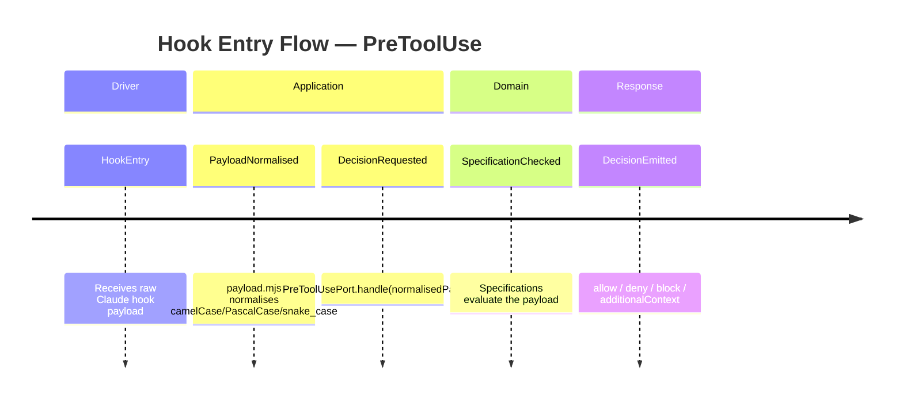

<!-- markdownlint-disable-file -->
# Event Model — US1 — Fondation Clean Architecture

US1 is a structural/foundational story — it creates modules and ports, not business flows. No domain events are emitted by the modules themselves. The event model documents the module activation flow for the hook entry point.

Note: US1 creates the skeleton. Business logic in the specifications is added by subsequent user stories.
