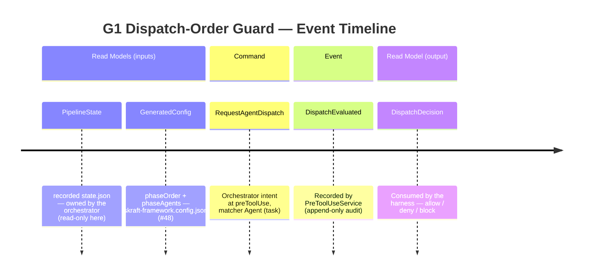
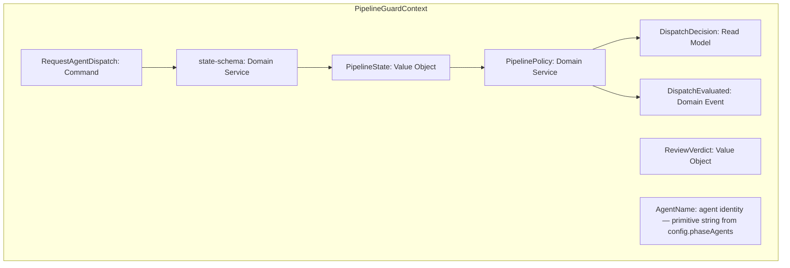
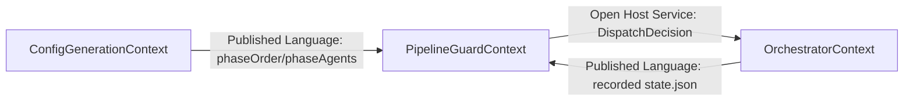

<!-- markdownlint-disable-file -->
# Event Model — US3 / G1 Dispatch-Order Guard (#49)

Phase: DESIGN · Date: 2026-06-28 · Project slug: us3-g1-dispatch-order-guard
Source: plans/2026-06-28/ac-draft-us3.md (AC-01..AC-04, 8 examples)

## Reuse analysis (Phase 3)

| Element | Source | Classification |
|---|---|---|
| Result type (`Ok/Err/isOk/isErr`) | `plugins/skraft-framework/src/domain/result.mjs` (ADR-001) | reuse as-is |
| Hexagonal layout | ADR-002 | conform |
| Generated config (`phaseOrder`, `phaseAgents`) | `plugins/skraft-framework/skraft-framework.config.json` (#48) | reuse as-is |
| State reader (`read(projectSlug)`, throws) | `plugins/skraft-framework/src/adapters/infrastructure/json-state-reader.mjs` (#47) | reuse as-is |
| Audit writer (`write(entry)`, append-only) | `plugins/skraft-framework/src/adapters/infrastructure/jsonl-audit-writer.mjs` | reuse as-is |
| Hook decision (`allow/deny/block`) | `plugins/skraft-framework/src/adapters/api/hooks/decision.mjs` | reuse as-is |
| PreToolUse port (`handle(payload)`) | `plugins/skraft-framework/src/ports/api/pre-tool-use.mjs` | extend (new handler) |
| Build-time `dispatch-policy.mjs` | `plugins/skraft-framework/src/domain/dispatch-policy.mjs` | **DO NOT TOUCH** — distinct module/lifecycle; already exports `validateDispatch(descriptors)` |
| `domain/pipeline-policy.mjs` | — | **create new** (pure Domain Service) |
| `domain/state-schema.mjs` | — | **create new** (Value Object + pure validator) |
| `application/pre-tool-use-service.mjs` | — | **create new** (use case) |

## Slice — Guarded agent dispatch (one slice = whole story)

The trigger is **`RequestAgentDispatch`** — a *Command*: the orchestrator's intent to run a
sub-agent. Per the GitHub Copilot hooks reference (hook-events runtime → Claude tool-name table),
a sub-agent dispatch is the runtime `task` tool, whose Claude tool name is `Agent` (literal `Task`
also accepted). The guard intercepts at the **`preToolUse`** event with matcher **`Agent`**
(equivalently **`task`**) — the only documented event that is both pre-execution and able to deny
(ADR-004). It is a Command (not a Query) because
each evaluation records an append-only audit fact (a state change), per AC-03.

### Timeline

## Tactical mapping (Phase 6)

| Concept | Label | Notes |
|---|---|---|
| `RequestAgentDispatch` | Command | intent to run a sub-agent at the gate |
| `PipelinePolicy` | Domain Service | pure; `expectedNextAgent` + `evaluateDispatch`; no IO |
| `state-schema` | Domain Service | pure validator producing the `PipelineState` VO |
| `PipelineState` | Value Object | `{currentPhase, specialistDone, reviewerVerdict, retries, skipPhases}` |
| `ReviewVerdict` | Value Object | `APPROVED \| CHANGES_REQUESTED \| null` |
| `AgentName` | agent identity (primitive string resolved from `config.phaseAgents`) | NOT a formal VO — modelled as a primitive `string` in the contracts, matching the existing `decision.mjs`/config conventions |
| `DispatchDecision` | Read Model | allow/deny/block + expectedAgent + reason (carried by Result) |
| `DispatchEvaluated` | Domain Event | append-only audit fact, one per evaluation |

**No new Aggregate, no new Repository.** The guard never owns or mutates an aggregate: it
*reads* externally-owned state through the existing `StateReader` driven port and *appends*
through the existing `AuditWriter` driven port. `state.json` remains orchestrator-owned (its
Value-Object shape and boundary validation are the hexagonal + DDD tactical baseline, not a
story-specific ADR).

### Component diagram

## Context map (Phase 5)

`PipelineGuardContext` is a **Core** subdomain (the anti-drift guard is the SKRAFT differentiator).

The guard consumes the generated config and the recorded state as **Published Languages**
(it reads published shapes, never the producers' internals — see ADR-005). It exposes the
`DispatchDecision` back to the orchestrator as an **Open Host Service** (the `allow/deny/block`
hook contract).

## Expected-next-agent derivation (heart of the model)

Retry budget `budget = config.retryBudget ?? 3` (not hardcoded — sourced from config, ADR-005).

| Validated state | Stage | `expectedNextAgent` result |
|---|---|---|
| `specialistDone = false` | SPECIALIST | `Ok` `phaseAgents[currentPhase].specialist` |
| `specialistDone = true`, verdict `null` | REVIEWER | `Ok` `phaseAgents[currentPhase].reviewer` |
| done + `CHANGES_REQUESTED`, `retries < budget` | RETRY | `Ok` `phaseAgents[currentPhase].specialist` |
| done + `CHANGES_REQUESTED`, `retries ≥ budget` | — | `Err RETRY_EXHAUSTED` (escalate) |
| done + `APPROVED`, next non-skip phase exists | ADVANCE | `Ok` `phaseAgents[nextNonSkipped].specialist` |
| done + `APPROVED`, current phase is last | — | `Err PIPELINE_COMPLETE` |
| `currentPhase ∉ phaseOrder` / agent unresolved | — | `Err INVALID_STATE` (fail-closed) |

**Single decision rule (AC-01, AC-03):** the runtime function `evaluateDispatch(requestedAgent, state, config)`
returns `ALLOW ⇔ requestedAgent === expectedNextAgent(state, config).agent`.
Any non-conforming, non-derivable, or error outcome → DENY/BLOCK (deny-by-default, ADR-004).

### AC-01 table reproduced by the one rule

| Row | Stage derived | Expected agent | Requested | Decision |
|---|---|---|---|---|
| a | ADVANCE | solution-architect | solution-architect | ALLOW |
| b | ADVANCE | solution-architect | acceptance-designer | DENY (OUT_OF_ORDER — skipped DESIGN) |
| c | SPECIALIST | solution-architect | solution-architect-reviewer | DENY (OUT_OF_ORDER — reviewer before specialist) |
| d | RETRY | backlog-planner | solution-architect | DENY (OUT_OF_ORDER — advance only on APPROVED) |
| e | ADVANCE (DESIGN skipped) | acceptance-designer | acceptance-designer | ALLOW |
| f | RETRY | acceptance-designer | acceptance-designer | ALLOW |
| g | — | — (RETRY_EXHAUSTED) | acceptance-designer | DENY/BLOCK (escalate) |

AC-02 (timing) ← the gate returns DENY *before* the sub-agent runs; the audit names `expectedAgent`.
AC-04 (fail-closed) ← unreadable/unparseable/schema-invalid state → `Err INVALID_STATE`/`UNREADABLE_STATE` → BLOCK.

## Consistency (Phase 9)

Reconciliation is recorded in the standalone matrix:
`details/2026-06-28/consistency-matrix-us3.md` — **consistency-gate: PASS · open blockers: 0 · supersessions: 0.**
