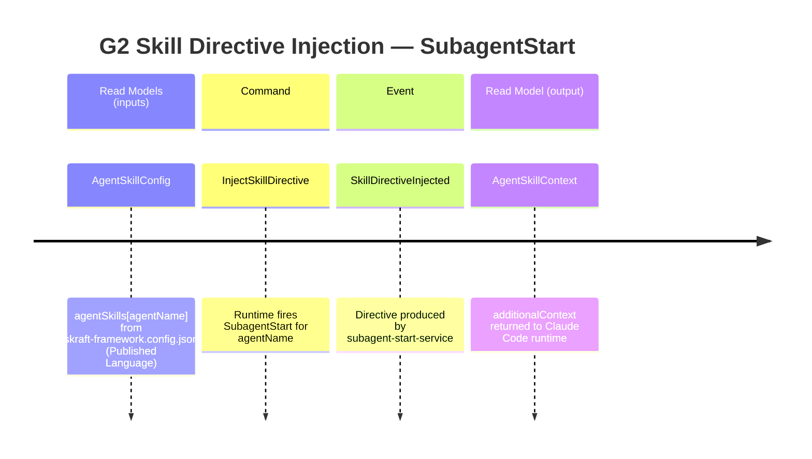
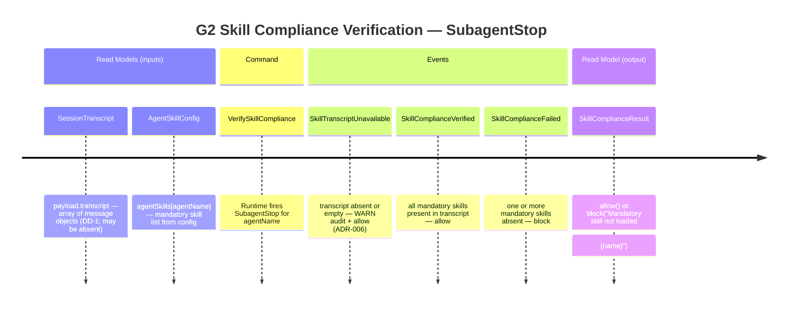
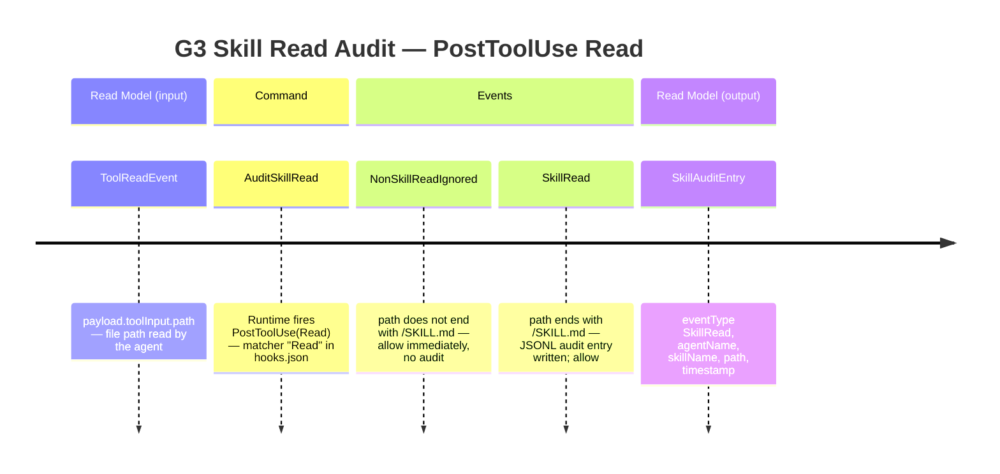
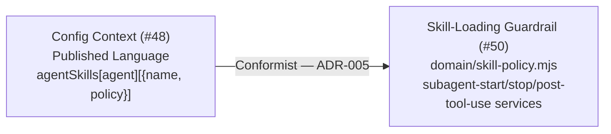

<!-- markdownlint-disable-file -->
# Event Model — US4 / G2+G3 Skill-Loading Guardrail (#50)

Phase: DESIGN · Date: 2026-06-29 · Project slug: us4-g2g3-skill-loading
Source: plans/2026-06-29/stories-2026-06-29.md (AC-01..AC-04, DD-1/DD-2/DD-3, 8 examples)

---

## Reuse analysis

| Element | Source | Classification |
|---|---|---|
| Result type (`Ok/Err/isOk/isErr`) | `plugins/skraft-framework/src/domain/result.mjs` (ADR-001) | reuse as-is |
| Hexagonal layout | ADR-002 | conform |
| Generated config (`agentSkills`) | `plugins/skraft-framework/skraft-framework.config.json` (#48, ADR-005 Published Language) | reuse as-is (Conformist) |
| Audit writer (`write(entry)`) | `plugins/skraft-framework/src/adapters/infrastructure/jsonl-audit-writer.mjs` | reuse as-is |
| Hook decision vocabulary (`allow/additionalContext/block`) | `plugins/skraft-framework/src/adapters/api/hooks/decision.mjs` | reuse as-is |
| Hook router | `plugins/skraft-framework/src/adapters/api/hooks/hook-router.mjs` | reuse as-is |
| Service factory (`createHookService`) | `plugins/skraft-framework/src/adapters/api/hooks/service-factory.mjs` | reuse as-is (slots already present) |
| Transcript reader port stub | `plugins/skraft-framework/src/ports/infrastructure/transcript-reader.mjs` | reuse as-is |
| SubagentStop port stub | `plugins/skraft-framework/src/ports/api/subagent-stop.mjs` | reuse as-is |
| SubagentStart port stub | **NEW** `plugins/skraft-framework/src/ports/api/subagent-start.mjs` | create new |
| Skill policy domain service | **NEW** `plugins/skraft-framework/src/domain/skill-policy.mjs` | create new |
| SubagentStart use case | **NEW** `plugins/skraft-framework/src/application/subagent-start-service.mjs` | create new |
| SubagentStop use case | **NEW** `plugins/skraft-framework/src/application/subagent-stop-service.mjs` | create new |
| PostToolUse Read use case | **NEW** `plugins/skraft-framework/src/application/post-tool-use-service.mjs` | create new |
| JSONL transcript reader adapter | **NEW** `plugins/skraft-framework/src/adapters/infrastructure/jsonl-transcript-reader.mjs` | create new |

---

## Slice A — SubagentStart: Skill Directive Injection (G2 inject — AC-01, AC-03)

`InjectSkillDirective` is a **Command**: it returns `additionalContext` that modifies the agent's execution context before any output is produced. The runtime always fires it at session start; it cannot be rejected.

**Slice notes (domain examples 1, 4):**
- `policy: 'verify'` (default): `additionalContext` text = `"The following skills are MANDATORY: {name-A}, {name-B}."`
- `policy: 'eager'` (ADR-007): additionally inlines the SKILL.md content for each eager skill. If SKILL.md unreadable: fall back to verify directive + WARN audit entry (ADR-006 fail-open).
- `additionalContext` is **always** returned (never block at SubagentStart).

---

## Slice B — SubagentStop: Skill Compliance Verification (G2 verify — AC-02)

`VerifySkillCompliance` is a **Command**: it may block the sub-agent and force a restart. The transcript is the primary input (DD-1).

**Slice notes (domain examples 2, 3, 7):**
- Transcript path extraction regex: `/(?:plugins\/skills|\.agents\/skills|\.github\/skills|\.copilot\/skills)\/([^/]+)\/SKILL\.md$/i`. Capture group 1 = skill name.
- `TRANSCRIPT_UNAVAILABLE` is fail-open (ADR-006): emit WARN audit + return `allow()`.
- G2 block fires **only** when transcript is readable AND a mandatory skill is confirmed absent.
- Every G2 decision (allow or block) writes one audit entry.

---

## Slice C — PostToolUse Read: Skill Read Audit (G3 audit — AC-04)

`AuditSkillRead` is a **Command** because it triggers a state change (append an immutable audit entry).

**Slice notes (domain examples 5, 6, 8):**
- Service-level filter (DD-2): only `toolInput.path` matching `/\/SKILL\.md$/` triggers an audit.
- Audit write failure is fail-open (ADR-006): exception swallowed, return `allow()`.
- `NonSkillReadIgnored` produces no JSONL output; it is a guard clause, not a domain event.

---

## Tactical mapping

| Concept | Label | Notes |
|---|---|---|
| `InjectSkillDirective` | Command | SubagentStart hook trigger; always produces `additionalContext` |
| `VerifySkillCompliance` | Command | SubagentStop hook trigger; may produce `allow()` or `block()` |
| `AuditSkillRead` | Command | PostToolUse(Read) hook trigger; always produces `allow()` |
| `skill-policy` | Domain Service | Pure: `mandatorySkillsFor`, `missingSkills`, `isEagerSkill`; no IO (ADR-002) |
| `subagent-start-service` | Application Service | Orchestrates: config → skill-policy → [skillFileReader] → [auditWriter] → `additionalContext` |
| `subagent-stop-service` | Application Service | Orchestrates: transcriptReaderFactory → skill-policy → auditWriter → `allow/block` |
| `post-tool-use-service` | Application Service | Orchestrates: path-filter → [auditWriter] → `allow` |
| `jsonl-transcript-reader` | Repository | Infrastructure adapter; implements `transcript-reader` port; per-invocation factory |
| `SkillDirectiveInjected` | Domain Event | Raised by subagent-start-service when directive is produced |
| `SkillComplianceVerified` | Domain Event | Raised by subagent-stop-service when all mandatory skills confirmed present |
| `SkillComplianceFailed` | Domain Event | Raised by subagent-stop-service when a mandatory skill is absent from transcript |
| `SkillTranscriptUnavailable` | Domain Event | Raised by subagent-stop-service when `payload.transcript` is absent or empty |
| `SkillRead` | Domain Event | Raised by post-tool-use-service when a `SKILL.md` file read is detected |
| `AgentSkillContext` | Read Model | `additionalContext` value returned to Claude Code runtime at SubagentStart |
| `SkillComplianceResult` | Read Model | `allow()` or `block(message)` returned to Claude Code runtime at SubagentStop |
| `SkillAuditEntry` | Read Model | JSONL audit row — `{ eventType, agentName, skillName, path, timestamp }` |

**No new Aggregate. No new Repository interface in Domain layer.**

---

## Context map (Phase 5)

**Inter-context relationship:**
- **Config Context → Skill-Loading Guardrail**: Config Context is the **Open Host Service / Published Language** upstream (established by ADR-005). The Skill-Loading Guardrail is a **Conformist** downstream consumer: it reads `agentSkills` from the generated config as-is, without an Anti-Corruption Layer.
- No new inter-context relationships are introduced by US4. The Conformist relationship was pre-established by ADR-005 and ratified by the human (2026-06-28).
- The JSONL audit log is a shared infrastructure sink (not a bounded context boundary).

