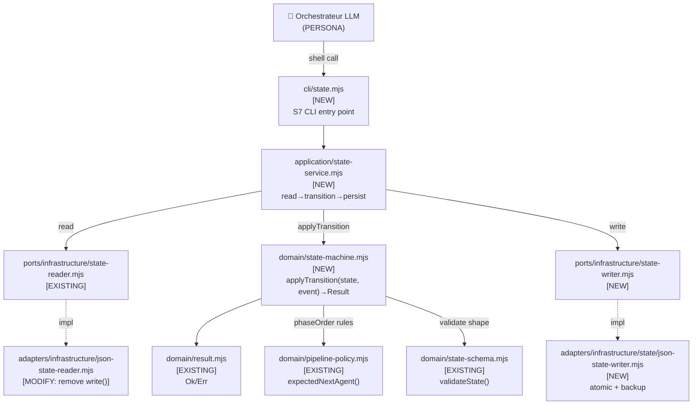
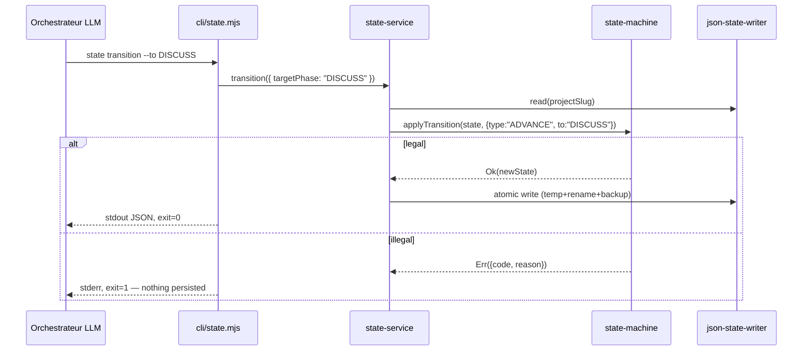

# Genesis Handoff Packet — State Transition Bridge (S7)
## Issue #60 · us5-state-transition-bridge · 2026-07-01

---

## Component Diagram



---

## Sequence Diagram (SUPERVISED EXECUTION — A9 strong form)



---

## Interface Sketch

### `domain/state-machine.mjs` [NEW]
- **Trigger:** imported by state-service
- **Inputs:** `(currentState: FrozenState, event: TransitionEvent) => Result<FrozenState>`
- **Event types:** `ADVANCE`, `RECORD_VERDICT`, `RECORD_ARTIFACT`, `SET_DIFFICULTY`, `INCR_RETRY`, `INIT`
- **Rules enforced:**
  - `currentPhase` advances only on `ADVANCE` event with prior `APPROVED` verdict
  - **SEQUENTIAL_ENFORCEMENT (NEW):** `ADVANCE` to `targetPhase` is legal only if
    `targetPhase === nextPhaseAfter(currentPhase, phaseOrder, skipPhases)` — no arbitrary phase jump;
    phases skipped by HVE handoff (`skipPhases`) are automatically bypassed by `nextPhaseAfter`
    but the LLM cannot jump past the immediately-next non-skipped phase.
    Error code: `ILLEGAL_PHASE_SKIP`, reason: `"expected {expectedNext}, got {targetPhase}"`
  - `retryCount[phase]++` on non-APPROVED, capped at `maxRetriesPerPhase`
  - `phasesCompleted`, `phaseArtifacts`, `reviewArtifacts` are append-only
  - `difficulty` set only once (Err on re-set)
  - Terminal: `DONE` phase rejects all events except reads
- **Reuses:** `nextPhaseAfter()` extracted from `pipeline-policy.mjs` (or imported via shared helper)
- **Dependencies:** `domain/result.mjs`, `domain/state-schema.mjs`, `domain/pipeline-policy.mjs`

### `ports/infrastructure/state-writer.mjs` [NEW]
- **Trigger:** imported by state-service
- **Interface:** `STATE_WRITER_PORT` constant + `{ write(projectSlug, state): Promise<Result> }`
- **Dependencies:** none (port only)

### `adapters/infrastructure/state/json-state-writer.mjs` [NEW]
- **Trigger:** wired in CLI/composition root
- **Inputs:** `createJsonStateWriter(basePath)` factory
- **Behavior:**
  1. Serialize `state` to JSON
  2. Write to temp file `{path}.tmp.{ts}`
  3. Rotate backup: `state.json.bak.{ts}` (keep last 3)
  4. `rename(tmp, state.json)` — atomic on POSIX
  5. On corruption detected: snapshot to `state.json.corrupted.{ts}`
- **Dependencies:** `node:fs/promises`, `node:path`

### `application/state-service.mjs` [NEW]
- **Trigger:** called by `cli/state.mjs` subcommand handlers
- **Operations:**
  - `init(projectSlug, initialState)` — **idempotent**: crée avec les defaults si absent, retourne l'état existant si présent (exit=0 dans les deux cas). Le LLM n'a pas à vérifier l'existence avant d'appeler.
  - `applyEvent(projectSlug, event)` — read → machine → write ; si `ENOENT` sur read : auto-init avec defaults puis rejoue l'événement
  - `get(projectSlug, field?)` — read only (no write path)
- **Dependencies:** `state-reader`, `state-writer`, `state-machine`, `state-schema`

### `cli/state.mjs` [NEW]
- **Trigger:** `node cli/state.mjs <subcommand> [options]`
- **Subcommands:**
  - `init --slug <slug>` — crée state.json si absent, no-op si présent ; **toujours exit=0** (idempotent)
  - `transition --to <phase> --slug <slug>` — advance phase
  - `record-verdict --phase <phase> --verdict <verdict> --slug <slug>`
  - `record-artifact --phase <phase> --path <path> --slug <slug>`
  - `set-difficulty --value <difficulty> --slug <slug>`
  - `incr-retry --phase <phase> --slug <slug>`
  - `get --field <field> --slug <slug>` — read a single field (no write)
- **Exit codes:** 0=success, 1=illegal transition/validation error, 2=IO error, 3=schema invalid
- **Stdout:** minimal JSON on success (only changed/relevant fields)
- **Stderr:** human-readable error + machine-readable code

---

## Module Composition Table

| Module | Mode | Ships in bundle? | Rationale |
|---|---|---|---|
| `domain/state-machine.mjs` | LOCAL SIBLING | Yes | Production domain rules |
| `ports/infrastructure/state-writer.mjs` | LOCAL SIBLING | Yes | Port interface |
| `adapters/infrastructure/state/json-state-writer.mjs` | LOCAL SIBLING | Yes | Runtime adapter |
| `application/state-service.mjs` | LOCAL SIBLING | Yes | Application use case |
| `cli/state.mjs` | LOCAL SIBLING | Yes | CLI runtime |
| `json-state-reader.mjs` | MODIFY (remove write) | Yes | R1 SPLIT applied |

---

## SoC Findings

| Finding | Severity | Resolution |
|---|---|---|
| `json-state-reader.mjs.write()` — TOOLLESS ASSERTION | BLOCKER | Remove; new `json-state-writer.mjs` |
| Transition rules inlined in orchestrator instructions | HIGH | Extract to `state-machine.mjs` |
| Orchestrator reads full `state.json` each turn | HIGH | `cli state get --field X` replaces `read_file` |
| `state-schema.mjs` lacks transition validation | MEDIUM | `state-machine.mjs` adds transition events |

---

## State Machine — Invariants complets

| # | Invariant | Événement | Code erreur |
|---|---|---|---|
| I1 | `ADVANCE` exige verdict `APPROVED` sur phase courante | ADVANCE | `VERDICT_NOT_APPROVED` |
| I2 | **`targetPhase` doit être le prochain non-skipé** (`nextPhaseAfter`) | ADVANCE | `ILLEGAL_PHASE_SKIP` |
| I3 | `retryCount[phase]` plafonné à `maxRetriesPerPhase` | INCR_RETRY | `RETRY_EXHAUSTED` |
| I4 | `phasesCompleted` append-only (jamais réduit) | tout | `APPEND_ONLY_VIOLATION` |
| I5 | `phaseArtifacts[phase]` append-only | RECORD_ARTIFACT | `APPEND_ONLY_VIOLATION` |
| I6 | `reviewArtifacts` append-only | RECORD_ARTIFACT | `APPEND_ONLY_VIOLATION` |
| I7 | `difficulty` posée une seule fois | SET_DIFFICULTY | `IMMUTABLE_FIELD` |
| I8 | Phase `DONE` rejette toute mutation | tout | `TERMINAL_STATE` |
| I9 | `INIT` **idempotent** : crée si absent, no-op si présent (jamais d'erreur) | INIT | — |

### Visualisation des transitions légales

```
DISCOVER ──ADVANCE──► DISCUSS ──ADVANCE──► DESIGN ──ADVANCE──► DISTILL ──ADVANCE──► DELIVER ──ADVANCE──► DONE
   │                    │                    │                    │                    │
   └── INCR_RETRY ──►  └── INCR_RETRY ──►  └── INCR_RETRY ──►  └── INCR_RETRY ──►  └── INCR_RETRY ──►
       (reste sur phase courante)

Saut interdit :  DISCOVER ─✗──► DESIGN   (code: ILLEGAL_PHASE_SKIP)
HVE skip OK :    DISCOVER skipé → nextPhaseAfter retourne directement DISCUSS
```


Components: S7 DETERMINISTIC TOOL BRIDGE (CLI) + B4 PLAN MEMENTO (state.json) + S4 VALIDATION DECORATOR (state-machine pure rules).

Anti-patterns to avoid:
- **TOOLLESS ASSERTION**: LLM assembles full JSON and calls `write_file` directly → blocked by removing `write()` from the reader adapter
- **UNSUPERVISED MUTATION**: State changes without going through the CLI → blocked by `#57` deny-write guardrail
- **PARTIAL WRITE**: crash during `writeFile` leaves corrupt state → blocked by temp+rename pattern

---

## Cost Projection

| Scenario | Before | After | Delta |
|---|---|---|---|
| Per-turn state read (orchestrator) | ~800 tokens (full JSON) | ~50 tokens (`get --field`) | **-750 tokens/turn** |
| State write (orchestrator) | ~500 tokens (JSON assembly) | ~30 tokens (CLI call) | **-470 tokens/turn** |
| Check-then-init pattern (LLM) | ~200 tokens (existence check + branch) | **0** (init idempotent) | **-200 tokens/init** |
| Typical pipeline (50 turns touching state) | ~65,000 tokens | ~4,000 tokens | **-61,000 tokens** |

Stance: `balanced`. Cap: not applicable (CLI, no LLM calls).

---

## Difficulty Assessment (SKRAFT pipeline)

- Domain state machine: pure functions, formal rules → testable
- Atomic FS writes: node:fs/promises rename (POSIX atomic) → straightforward
- CLI plumbing: argument parsing, exit codes → standard
- Cross-cutting: must update orchestrator instructions + remove `write()` from reader

**Difficulty tier: `medium-hard`** (multiple Clean Architecture layers + atomic I/O + breaking change to existing adapter)

---

## TODO List (ordered)

1. `domain/state-machine.mjs` — pure state machine (no I/O)
2. `ports/infrastructure/state-writer.mjs` — port contract
3. `adapters/infrastructure/state/json-state-writer.mjs` — atomic writer
4. `application/state-service.mjs` — orchestrate read→machine→write
5. `cli/state.mjs` — subcommand handlers + exit codes
6. **MODIFY** `adapters/infrastructure/json-state-reader.mjs` — remove `write()`
7. Update orchestrator mode instructions — replace `read_file(state.json)` with `cli state get`
8. Tests for each layer (unit → integration → acceptance)
9. Stryker config: add new modules to `mutate` array

---

## Declared Targets

- `common-only` (no harness-specific syntax in domain/ports/adapters/cli)
- Invocation mode: CLI (S7 bridge, FORCED by orchestrator conventions)

---

## External Modules Required

None. All deps are Node.js built-ins (`node:fs/promises`, `node:path`) or project-local siblings.
