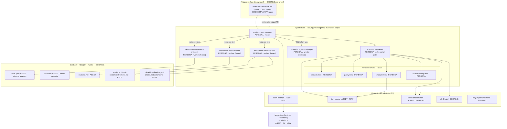
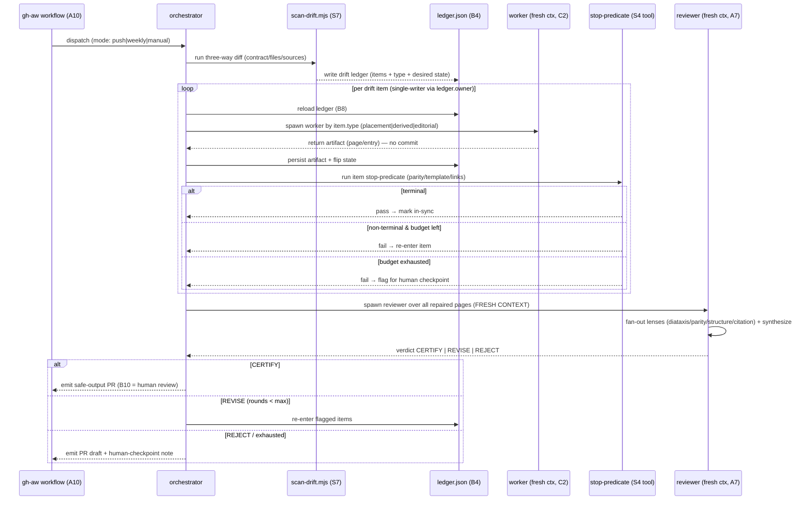
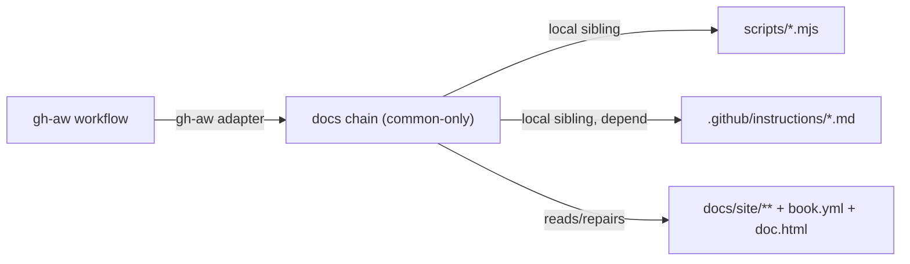

# Handoff packet — SKRAFT docs-drift reconciler (agent chain)

> Genesis design artifact (steps 1–6). This IS the plan. The coder thread
> reloads it before drafting each module (B4 PLAN MEMENTO + B8 ATTENTION ANCHOR).
> Design stops at step 6; natural-language modules are emitted at step 7b.
>
> **Storage split** (the docs chain never writes into `.copilot-tracking/`, which
> belongs to the SDLC pipeline): this design doc lives under `.specs/plans/`
> (tracked); the runtime drift ledger lives under `.skraft-docs/` (gitignored,
> ephemeral, also protected from the safe-output PR as a top-level dot folder).

## Step 1 — Intent + scope

**Capability.** A chain of agents that *reconciles* the SKRAFT handbook
(`docs/site/`) with the shipped plugin sources (`plugins/`, `.agents/`,
`.github/instructions/`): it **detects** every drift between the structure
contract (`docs/site/_data/book.yml`), the real pages, and the real sources,
then **repairs** the drifted pages and opens a pull request. It enforces the
Diátaxis invariant (one mode per sidebar section), a **multi-level** menu
(part → section → individual item), deterministic page **ordering**, FR/EN
parity, and valid citations.

**Boundary — what it does NOT do.**
- Never edits sources (`plugins/`, `.agents/`, code) — docs only.
- Never invents a sourced metric (qualitative + `(estimated)` only).
- Never merges its own PR (the PR *is* the human checkpoint, B10).
- Never asserts the three-way diff in prose — detection is a deterministic
  tool (S7), not an LLM claim.

**Single Responsibility.** "detect AND repair" is ONE capability under
A11 RECONCILIATION LOOP (drive each drifted page to a terminal in-sync state).
The Diátaxis / multi-level / ordering rules are not a second capability — they
are the *stop-predicate* (what "in-sync" means). SRP holds.

**Dispatch descriptions (function signatures).**
- `skraft-docs-orchestrator` (BOTH): "Use to reconcile the SKRAFT handbook with
  the shipped plugin sources — detect documentation drift (missing/empty/stale
  pages, FR/EN parity breaks, broken menu structure, ordering gaps, orphan
  sources, invalid citations) and repair it via PR. Triggered by the gh-aw
  docs workflows or invoked manually to sweep the book."
- workers (FORCED, `user-invocable: false`): each names ONE drift class it
  repairs; never discovery-dispatched.

## Step 2 — Component diagram



Legend: thin edges = control/dispatch; `-. .->` = buffered safe-output handed
back to the gh-aw post-stage (no write token in the agent).

## Step 3 — Thread / sequence diagram + pattern selection

**Pattern stack (review order):**
1. **Refactors first.** R2 FUSE the two monolithic workflow *brains*
   (`skraft-docs-sync` + `skraft-docs-gaps` both ran "read contract → LLM
   3-way diff → write pages → open PR") into ONE orchestrator. R1 SPLIT its
   multi-lens body into per-capability workers (placement / derived / editorial)
   — the MULTI-LENS BODY trigger fires. R3 EXTRACT the three-way diff into
   `scan-drift.mjs` (it is a FACT-THAT-MUST-BE-TRUE left as LLM prose today =
   HAND-ROLLED HALLUCINATION) and the nav structure check into `lint-nav.mjs`.
2. **Tier-3:** outer **A10 GOVERNED OUTER LOOP** (gh-aw: sandboxed, no write
   token, `safe-outputs:` post-stage, Actions audit) wrapping **A11
   RECONCILIATION LOOP** (drift ledger = state table; per-item sub-agents;
   per-item S4 stop-predicate; bounded retries; B11 fold-by-default). Per item:
   **A2 PIPELINE** (detect → place → write → review). Review stage: **A7
   ADVERSARIAL REVIEW + A1 PANEL** (fresh context, N lenses, weighted synthesis).
3. **Tier-2:** B1 fan-out+synthesizer (per item), B4 plan memento (ledger +
   book.yml), B8 attention anchor (reload ledger before each item/spawn),
   B11 fold-by-default, C2 persona preload (per worker/lens), C4 description
   dispatch, S4 validation decorator (stop-predicates = tools), S7 deterministic
   tool bridge (scan/lint/citations/build), B10 human checkpoint (the PR),
   S3 orchestrator facade.



**Interlock:** single-writer is **per ledger item** (a worker acquires an item
by flipping `owner`, releases on terminal/escalation), never per queue. The
orchestrator is the only writer to the PR (one safe-output).

## Step 3.5 — Composition decision + dependency graph

| Box | Mode | Rationale |
|-----|------|-----------|
| orchestrator, workers, reviewer, lenses, glossary-keeper | **LOCAL SIBLING** under `.github/agents/` | maintainer-scope tooling, reused only here; MUST live outside `plugins/` so the `sources` globs do not generate recursive reference pages (BUNDLE LEAKAGE guard) |
| `scan-drift.mjs`, `lint-nav.mjs` | **LOCAL SIBLING** under `scripts/` | bundled deterministic tools beside `check-citations.mjs` |
| `ledger.json` (runtime drift state, B4) | **LOCAL SIBLING** under `.skraft-docs/` (gitignored) | ephemeral per-run reconciliation state; NOT `.copilot-tracking/` (SDLC-owned); excluded from the PR as a top-level dot folder |
| `book.yml`, `doc.html`, `citations.yml` | **INLINE** (existing repo assets) | the contract + layout the chain reads/repairs |
| `skraft-handbook-content.instructions.md`, `skraft-handbook-agent-chains.instructions.md` | **LOCAL SIBLING (depend, do not duplicate)** | the editorial RULES already exist; writers + reviewer LOAD them |
| genesis skill | **NOT a runtime dep** | design-time only; the chain has no external-module dependency |

**Declared target set:** agent chain = `common-only` (needs only the three A11
substrate primitives: sub-agent dispatch, persistent state, completion signal).
Trigger workflows = **gh-aw trigger-surface adapter** (A10 strong-form, justified:
repo already runs gh-aw; governed doc-writing-to-PR is the textbook A10 case).
No external module ⇒ no manifest dependency / no PHANTOM DEPENDENCY risk.



## Step 4 — SoC pass

- **No duplication:** the Diátaxis / parity / "surface the chain in 4 places"
  rules already live in the two `*.instructions.md` files → writers + reviewer
  **depend** on them (link), never re-state them.
- **Detection de-duplicated to a tool:** both existing workflows re-implement
  the three-way diff in prose → extract once to `scan-drift.mjs`; both workflow
  brains collapse into one orchestrator (R2).
- **Worker boundaries don't collide:** placement (taxonomy/ordering) vs derived
  (mechanical regen from `source`) vs editorial (narrative authoring) are three
  distinct lenses (R1 keeps them split; matches the contract's own
  derived/editorial seam).
- **Reuse existing validators:** `check-citations.mjs`, jekyll build, playwright
  nav/smoke become the reviewer's deterministic lenses (S4), not re-coded.

## Step 5 — Compliance findings

| Check | Severity | Resolution |
|-------|----------|------------|
| HAND-ROLLED HALLUCINATION (LLM asserts the diff) | BLOCKER | `scan-drift.mjs` (S7) owns the diff; LLM only repairs |
| HARNESS-LLM CONFLATION (agent holds write token) | BLOCKER | gh-aw `safe-outputs:` strong-form A9; agent buffers, post-stage writes |
| PANEL-IN-ONE-CONTEXT (lenses sequential) | HIGH | reviewer fans out lenses; deterministic lenses are scripts |
| WARM-CONTEXT reviewer | HIGH | reviewer spawned FRESH; forbidden to read prior rounds/worker notes |
| UNBOUNDED LOOP | HIGH | per-item retry cap (2–3) + B10 on exhaustion |
| DISPATCH COLLISION (workers discovery-dispatched) | MEDIUM | workers `user-invocable: false`, FORCED only |
| `name` == parent + kebab, description ≤ 1024, ASCII | — | enforced at step 8 |

No open BLOCKER after resolution → design may proceed to step 7.

## Interface sketches

- **skraft-docs-orchestrator** — in: trigger mode + repo; reads `book.yml`,
  both `*.instructions.md`; calls `scan-drift.mjs`; out: ledger, per-item
  dispatch, one safe-output PR; deps: all workers + reviewer + scripts.
- **skraft-docs-placement-architect** (worker) — in: a STRUCTURAL/ORPHAN item;
  reads `book.yml` + page headers only; out: a `book.yml` entry/patch
  (`type`, `fr`/`en`, `section`, `sidebar_position`, `diataxis_mode`) +
  INSERT/REPLACE/NEW-SECTION/REJECT decision; refuses to write page prose.
- **skraft-docs-derived-writer** (worker) — in: a DERIVED item + its `source`;
  out: FR+EN page mirrored, vocabulary copied verbatim from the source SKILL;
  refuses to touch editorial pages / invent facts.
- **skraft-docs-editorial-writer** (worker) — in: an EDITORIAL item + template;
  loads both `*.instructions.md`; out: complete FR+EN page (no holes,
  `(estimated)` for untraceable figures); refuses to write without a placement.
- **skraft-docs-reviewer** — in: repaired page set (FRESH); fans out 4 lenses;
  out: verdict CERTIFY/REVISE/REJECT + audit table; read-only.
- **lenses** — diataxis (one mode per section), parity (FR/EN basename+structure),
  structure (`lint-nav.mjs`: 3-level menu, monotonic `sidebar_position`,
  individual items, no dangling links), citation-fidelity (`check-citations.mjs`
  + catalogue blocks). Read-only; return findings.
- **skraft-docs-glossary-keeper** (optional) — in: new terms from new pages;
  out: glossary entries; single target `glossaire.md`/`glossary.md`; human-confirmed.

## Contract upgrade (deterministic, one-time — the stop-predicate definition)

`book.yml` schema additions the reconciler reads:
- per `part`: `diataxis_mode: tutorial | how-to | explanation | reference`.
- new optional `sections:` level between `part` and `pages` (3-level menu);
  Reference → sections [Agents, Skills, Gates, Lenses, Patterns, Bibliography].
- per page/section: `sidebar_position: <int>` (deterministic ordering).
- individual reference items (one entry per persona / per skill) listed under
  their section, generated from the `sources` globs by the placement-architect.

`doc.html`: render the 3-level tree (part h3 → section h4/collapsible → page li).
APM install fix = the **first** drift repair (see grounded fact below).

## External facts (grounded — do not re-derive)

- APM install (verified live `github.com/microsoft/apm` README, 2026-06):
  - repo `https://github.com/microsoft/apm`; docs `microsoft.github.io/apm`.
  - macOS/Linux `curl -sSL https://aka.ms/apm-unix | sh`; Windows
    `irm https://aka.ms/apm-windows | iex`; then `apm install` (reads `apm.yml`).
  - CURRENT DOC IS WRONG: `npm install -g @anthropic/apm` +
    `anthropics/agent-package-manager` in `{fr,en}/tutorials/getting-started.md`.

## Evals plan (step 6)

- `evals/skraft-docs-orchestrator/triggers.yml` — ~16 (8 should-trigger:
  "reconcile the handbook", "fix docs drift", "the menu is out of date";
  8 near-miss: "write a new feature", "refactor the SDLC agents") 60/40 split.
- `evals/<each worker>/content.yml` — 2–3 fixtures with_skill vs without_skill
  (e.g. derived-writer: an agent SKILL changed → expect the matching reference
  page regenerated with verbatim vocabulary; without skill → generic paraphrase).
- reviewer content evals: a planted parity break / Diátaxis-mode mismatch →
  expect REVISE with the exact lens finding.

## Todo (codegen, step 7b — reload this plan before each)

1. [x] `scripts/lib/book.mjs` (zero-dep nested YAML reader + glob + generate expansion).
2. [x] `scripts/scan-drift.mjs` (deterministic three-way diff → ledger.json). Validated.
3. [x] `scripts/lint-nav.mjs` (3-level menu + ordering + dangling-link check). Validated.
4. [x] `book.yml` schema upgrade (`diataxis_mode`, `sections`, `sidebar_position`, `basename_exceptions`).
5. [x] `doc.html` 3-level render (built; individual per-agent links render under Reference > Agents).
6. [x] Agents (.github/agents/): orchestrator, placement-architect, derived-writer,
   editorial-writer, reviewer, 4 lenses (diataxis/parity/structure/citation-fidelity),
   glossary-keeper. All `name` == filename; workers `user-invocable: false`.
7. [x] Re-aimed both gh-aw workflows (sync push / gaps weekly) to run `scan-drift.mjs`
   + dispatch `skraft-docs-orchestrator` ("2 triggers, 1 orchestrator").
8. [x] Evals: `evals/skraft-docs-orchestrator/{triggers.yml (18, 60/40), content.yml (3)}`.
9. [x] APM install fix (FR+EN, grounded on github.com/microsoft/apm).

## Validation (step 8)

- `check-citations.mjs` → All citations valid.
- `scan-drift.mjs` → parses upgraded 3-level contract; reports 34 missing individual
  reference pages = the chain's incremental backlog (per-skill/worker/lens pages).
- `jekyll build` → green (0.7s); 3-level menu renders with per-persona links.
- `playwright handbook-nav` → 2/3 pass (both SIDEBAR tests pass). The 1 failure
  (`top menu reduced to 3 doors`) is PRE-EXISTING: `_data/nav.yml` has 4 doors
  (Dashboard is the 4th); test expects 3. Unrelated to this work (top nav, not sidebar).
- Agent frontmatter lint: all 10 `name` fields == filename; invocability correct.
```
