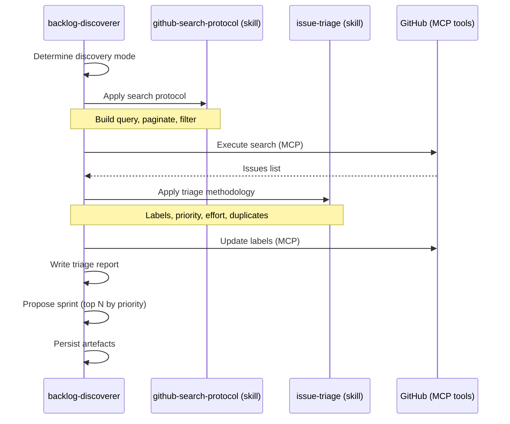

# Spec — Phase DISCOVER : backlog-discoverer

> Référence master : [`2026-05-12-skraft-sdlc-pipeline.md`](./2026-05-12-skraft-sdlc-pipeline.md)

## Contexte

La phase DISCOVER est le point d'entrée du pipeline SDLC. Elle identifie, trie et priorise les issues GitHub pour alimenter DISCUSS. Interaction GitHub native avec 3 modes de découverte (user-assigned, artifact-driven, search-based) et triage automatisé.

Aujourd'hui dans skraft, la sélection du travail est manuelle — l'utilisateur choisit une issue ou écrit un plan ad-hoc. Pas de priorisation systématique, pas de triage formalisé.

## Objectifs

1. Découvrir les issues pertinentes via 3 modes (assignation, artefacts, recherche).
2. Trier avec labels, priorité, et estimation d'effort préliminaire.
3. Proposer un sprint (sous-ensemble d'issues pour un milestone).
4. Détecter les doublons et les issues mal formées via un reviewer.

## Hors périmètre

- Création d'issues de zéro (l'utilisateur ou un processus externe crée les issues).
- Raffinement en stories (c'est DISCUSS).
- GitHub Projects boards (dépriorisé).
- Notifications ou webhooks (mode pull uniquement).

---

## Modules à produire

| Module | Type | Pattern Genesis |
|---|---|---|
| `backlog-discoverer` | Agent (PERSONA) | A3 ORCHESTRATOR-SAGA |
| `backlog-discoverer-reviewer` | Agent (PERSONA) | A7 ADVERSARIAL REVIEW + B1 FAN-OUT |
| `github-search-protocol` | Skill | B8 ATTENTION ANCHOR |
| `issue-triage` | Skill | B8 ATTENTION ANCHOR |
| `discovery-review-criteria` | Skill (RULE) | S6 RULE BRIDGE |

---

## Agent : `backlog-discoverer`

### Intent + scope (Genesis step 1)

**Capacité** : Découvrir et trier les issues GitHub pertinentes pour le projet courant, en utilisant 3 modes de découverte complémentaires.

**Triggers** : L'utilisateur demande de "découvrir le backlog", "trier les issues", "préparer le sprint", ou le SDLC orchestrator démarre le pipeline.

**Boundary** : NE PAS raffiner les issues (c'est DISCUSS). NE PAS créer d'issues. NE PAS modifier le corps des issues (seulement labels et milestone).

**Dispatch description** (draft) :
> Use when discovering, triaging, or prioritizing GitHub issues for a project. Supports three discovery modes: user-assigned issues, artifact-driven discovery from code changes, and search-based exploration. Activate on "discover backlog", "triage issues", "what should I work on", "find open issues", or when the SDLC pipeline starts.

### 3 modes de découverte

| Mode | Description | Quand utiliser |
|---|---|---|
| **User-assigned** | Issues assignées à l'utilisateur courant | Default quand l'utilisateur demande "quoi faire" |
| **Artifact-driven** | Issues liées aux fichiers récemment modifiés | Quand l'utilisateur travaille sur un domaine spécifique |
| **Search-based** | Recherche GitHub par labels, milestone, ou mots-clés | Quand exploration libre ou focus sur un thème |

### Inputs

| Source | Artefact | Obligatoire |
|---|---|---|
| GitHub | Issues du repository | ✅ |
| GitHub | Milestones existants | Recommandé |
| Git | Fichiers récemment modifiés (pour artifact-driven) | Optionnel |

### Outputs

| Artefact | Format | Localisation |
|---|---|---|
| Triage report | Markdown avec tableau issues | `.skraft/sdlc/discover/triage-{date}.md` |
| Sprint proposal | Sous-ensemble priorisé | `.skraft/sdlc/discover/sprint-proposal.md` |
| GitHub updates | Labels de triage ajoutés | GitHub Issues (via MCP) |

### Workflow interne



### Tools requis

- `readFile` / `createFile` / `editFile` — artefacts locaux
- `listDirectory` — scanner `.skraft/sdlc/`
- MCP GitHub tools : `mcp_github_search_issues`, `mcp_github_issue_write`
- `git log` / `git diff` — pour le mode artifact-driven

### Skills chargés

| Skill | Moment | Mode |
|---|---|---|
| `github-search-protocol` | Au démarrage | FORCED |
| `issue-triage` | Après récupération des issues | FORCED |

---

## Agent : `backlog-discoverer-reviewer`

### Intent + scope (Genesis step 1)

**Capacité** : Revue adversariale du triage et du sprint proposal produits par le backlog-discoverer.

**Triggers** : Dispatché par le SDLC orchestrator après production des artefacts DISCOVER, ou invoqué manuellement.

**Boundary** : NE PAS modifier le triage. Constater et reporter.

**Dispatch description** (draft) :
> Use when reviewing issue triage results, sprint proposals, or discovery coverage for completeness, prioritization accuracy, and duplicate detection. Dispatched after backlog-discoverer produces DISCOVER artefacts.

### Architecture (A7 + B1)

3 lenses parallèles :

| Lens | Responsabilité | Gates |
|---|---|---|
| **completeness-lens** | Pas d'issues importantes manquées. Les 3 modes de découverte ont été considérés. | G1: coverage check, G2: missed issues scan |
| **prioritization-lens** | La priorisation est cohérente. Les estimations d'effort sont réalistes. Sprint pas surchargé. | G3: priority consistency, G4: sprint capacity |
| **duplicate-detection-lens** | Pas de doublons dans le triage. Issues similaires identifiées et liées. | G5: no duplicates, G6: similar issues linked |

### Verdict

```yaml
verdict: approved | changes_requested | rejected
confidence: high | medium | low
lenses:
  completeness: {status, findings: [...]}
  prioritization: {status, findings: [...]}
  duplicate-detection: {status, findings: [...]}
synthesis:
  blocking_findings: [...]
  recommendations: [...]
  dissent: [...]
```

---

## Skill : `github-search-protocol`

### Intent + scope

**Capacité** : Protocole de recherche GitHub optimisé pour découvrir des issues pertinentes avec pagination, filtrage, et construction de requêtes.

**Dispatch description** :
> Use when building GitHub search queries, paginating through issue results, filtering by labels/milestones/assignees, or implementing artifact-driven discovery from git history. Covers GitHub search syntax, MCP tool usage patterns, and result ranking.

### Contenu attendu

- **GitHub search syntax** : qualifiers (is:issue, is:open, label:, milestone:, assignee:).
- **Query building** : combinaison de qualifiers, OR/AND logic.
- **Pagination** : comment gérer les résultats paginés avec MCP tools.
- **3 discovery modes** : implémentation de chaque mode.
  - User-assigned : `assignee:@me is:open`
  - Artifact-driven : extraire keywords des fichiers modifiés, chercher issues liées
  - Search-based : query libre + filtres
- **MCP tool patterns** : `mcp_github_search_issues` usage, rate limiting, result parsing.
- **Result ranking** : heuristiques de pertinence (récence, activité, labels).

### Références à inclure

- `references/github-search-syntax.md` — cheatsheet.
- `references/mcp-tool-patterns.md` — usage patterns MCP GitHub.
- `references/artifact-driven-heuristics.md` — algorithme de discovery depuis git.

---

## Skill : `issue-triage`

### Intent + scope

**Capacité** : Méthodologie de triage d'issues avec labeling, priorisation, estimation d'effort, et détection de doublons.

**Dispatch description** :
> Use when triaging GitHub issues by assigning labels, priority, effort estimates, or detecting duplicates. Covers triage methodology, label taxonomy, priority frameworks, and duplicate similarity assessment.

### Contenu attendu

- **Label taxonomy** : catégories (type, priority, effort, status, area).
- **Priority framework** : P0 (urgent) → P3 (nice-to-have), critères de classification.
- **Effort estimation** : T-shirt sizing (XS, S, M, L, XL) avec heuristiques.
- **Duplicate detection** : similitude titre/body, heuristiques de rapprochement.
- **Triage output format** : tableau standardisé (issue, labels, priority, effort, notes).
- **Sprint proposal** : sélection top-N par priorité × effort, respect de la capacité.

### Références à inclure

- `references/label-taxonomy.md` — arbre de labels recommandé.
- `references/priority-criteria.md` — grille de classification.
- `references/triage-template.md` — template de rapport de triage.

---

## Skill : `discovery-review-criteria`

### Intent + scope

**Capacité** : Critères de revue spécifiques aux artefacts DISCOVER, utilisés par le `backlog-discoverer-reviewer`.

**Dispatch description** :
> Use when reviewing DISCOVER artefacts (triage reports, sprint proposals) for completeness, prioritization quality, and duplicate handling. Contains gate definitions and scoring rubric for the backlog-discoverer-reviewer lenses.

### Contenu attendu

- **Gates** : G1-G6 (voir table des lenses).
- **Completeness scoring** : quand la découverte est suffisante.
- **Priority coherence** : règles de consistance entre issues.
- **Duplicate similarity threshold** : seuil de rapprochement.
- **Sprint capacity rules** : quand un sprint est surchargé.

### Références à inclure

- `references/gate-definitions.md` — G1-G6.
- `references/completeness-heuristics.md` — quand arrêter la découverte.
- `references/verdict-rubric.md` — table de décision.

---

## Intégration avec DISCUSS

L'artefact clé du handoff DISCOVER→DISCUSS :

```markdown
# Triage Report — {date}

## Discovery mode: {user-assigned | artifact-driven | search-based}

## Issues triaged

| # | Title | Labels | Priority | Effort | Notes |
|---|---|---|---|---|---|
| 42 | Add eligibility check | feature, domain | P1 | M | Core business logic |
| 43 | Fix validation error | bug, api | P0 | S | Blocking users |
| 44 | Add logging | tech-debt | P2 | S | Nice to have |

## Sprint proposal (capacity: 3M equivalent)
- #43 (P0, S) — must fix
- #42 (P1, M) — core feature
- Total: 1S + 1M = ~1.5M ✅ within capacity

## Duplicates detected
- #45 ≈ #42 (80% similar) — recommend merge

## Ready for DISCUSS
- [x] All issues labeled
- [x] Priority assigned
- [x] Sprint proposed
- [x] Reviewer approved
```

---

## Genesis execution plan

| Step | Action | Output |
|---|---|---|
| 1-6 | Design `backlog-discoverer` + reviewer + 3 skills | Handoff packet |
| 7-8 | Draft `backlog-discoverer.agent.md` | Agent file |
| 7-8 | Draft `backlog-discoverer-reviewer.agent.md` | Agent file |
| 7-8 | Draft `github-search-protocol/SKILL.md` + references | Skill folder |
| 7-8 | Draft `issue-triage/SKILL.md` + references | Skill folder |
| 7-8 | Draft `discovery-review-criteria/SKILL.md` + references | Skill folder |
