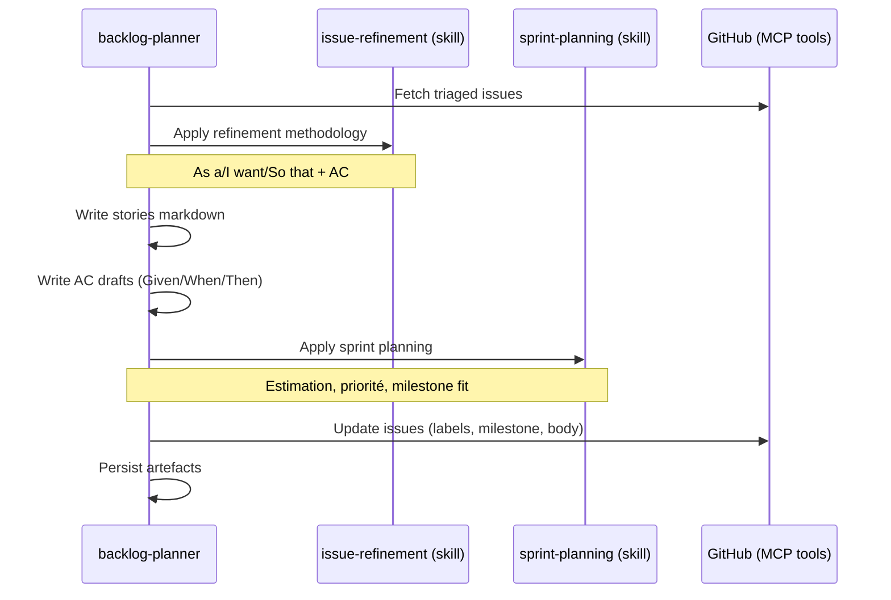

# Spec — Phase DISCUSS : backlog-planner

> Référence master : [`2026-05-12-skraft-sdlc-pipeline.md`](./2026-05-12-skraft-sdlc-pipeline.md)

## Contexte

La phase DISCUSS transforme les issues triées (DISCOVER) en **stories raffinées** avec acceptance criteria formalisés et assignation à des milestones. Interaction GitHub native avec MCP tools, refinement collaboratif, et sprint planning.

Aujourd'hui dans skraft, les issues GitHub restent brutes — pas de raffinement structuré, pas de découpage en stories, pas de milestone assignation formelle.

## Objectifs

1. Raffiner les issues brutes en stories structurées (As a/I want/So that).
2. Définir des acceptance criteria formels (Given/When/Then draft).
3. Assigner les stories à des milestones avec estimation d'effort.
4. Détecter les stories mal définies ou trop larges via un reviewer.

## Hors périmètre

- Création des issues (c'est DISCOVER qui les trouve/trie).
- Architecture ou design technique (c'est DESIGN).
- Écriture de code ou tests (c'est DELIVER).
- GitHub Projects boards (dépriorisé).

---

## Modules à produire

| Module | Type | Pattern Genesis |
|---|---|---|
| `backlog-planner` | Agent (PERSONA) | A3 ORCHESTRATOR-SAGA |
| `backlog-planner-reviewer` | Agent (PERSONA) | A7 ADVERSARIAL REVIEW + B1 FAN-OUT |
| `issue-refinement` | Skill | B8 ATTENTION ANCHOR |
| `sprint-planning` | Skill | B8 ATTENTION ANCHOR |
| `planning-review-criteria` | Skill (RULE) | S6 RULE BRIDGE |

---

## Agent : `backlog-planner`

### Intent + scope (Genesis step 1)

**Capacité** : Transformer des issues triées en stories raffinées avec acceptance criteria, estimation, et assignation milestone.

**Triggers** : L'utilisateur demande de "raffiner", "planifier le sprint", "découper les stories", ou le SDLC orchestrator entre en phase DISCUSS.

**Boundary** : NE PAS créer de nouvelles issues (remonter à DISCOVER). NE PAS designer l'architecture (passer à DESIGN). NE PAS modifier du code.

**Dispatch description** (draft) :
> Use when refining raw GitHub issues into well-structured user stories with acceptance criteria, effort estimation, and milestone assignment. Activate on "refine", "plan sprint", "write stories", "split issue", "milestone planning", or when the SDLC pipeline enters DISCUSS phase.

### Inputs

| Source | Artefact | Obligatoire |
|---|---|---|
| DISCOVER | `triage-{date}.md` | ✅ |
| DISCOVER | `sprint-proposal.md` | Recommandé |
| GitHub | Issues avec labels de triage | ✅ |

### Outputs

| Artefact | Format | Localisation |
|---|---|---|
| Stories raffinées | Markdown structuré | `.skraft/sdlc/discuss/stories-{milestone}.md` |
| AC drafts | Given/When/Then brut | `.skraft/sdlc/discuss/ac-draft-{story}.md` |
| GitHub updates | Labels, milestone, body enrichi | GitHub Issues (via MCP) |

### Workflow interne



### Tools requis

- `readFile` / `createFile` / `editFile` — artefacts locaux
- `listDirectory` — scanner `.skraft/sdlc/`
- MCP GitHub tools : `mcp_github_search_issues`, `mcp_github_issue_write` (pour labels/milestone)

### Skills chargés

| Skill | Moment | Mode |
|---|---|---|
| `issue-refinement` | Au démarrage | FORCED |
| `sprint-planning` | Après refinement | FORCED |

---

## Agent : `backlog-planner-reviewer`

### Intent + scope (Genesis step 1)

**Capacité** : Revue adversariale des stories et AC produits par le backlog-planner.

**Triggers** : Dispatché par le SDLC orchestrator après production des artefacts DISCUSS, ou invoqué manuellement.

**Boundary** : NE PAS modifier les stories. Constater et reporter.

**Dispatch description** (draft) :
> Use when reviewing refined user stories, acceptance criteria drafts, and sprint plans for INVEST quality, completeness, and feasibility. Dispatched after backlog-planner produces DISCUSS artefacts.

### Architecture (A7 + B1)

3 lenses parallèles :

| Lens | Responsabilité | Gates |
|---|---|---|
| **invest-lens** | Les stories respectent INVEST (Independent, Negotiable, Valuable, Estimable, Small, Testable). | G1: each INVEST criterion checked, G2: stories decomposable |
| **ac-quality-lens** | Les AC sont complets, non ambigus, testables. Draft Given/When/Then syntaxiquement correct. | G3: AC completeness, G4: no ambiguity |
| **planning-coherence-lens** | Le milestone est cohérent. Les estimations sont réalistes. Pas de dépendances circulaires. | G5: milestone fit, G6: dependency graph acyclic |
| **dor-compliance-lens** | Chaque story satisfait les 8 items de la Definition of Ready. Détection des 8 antipatterns. | G7: DoR 8-item hard gate, G8: zero critical antipatterns |

### Verdict

```yaml
verdict: approved | changes_requested | rejected
confidence: high | medium | low
lenses:
  invest: {status, findings: [...]}
  ac-quality: {status, findings: [...]}
  planning-coherence: {status, findings: [...]}
  dor-compliance: {status, findings: [...]}
synthesis:
  blocking_findings: [...]
  recommendations: [...]
  dissent: [...]
```

---

## Skill : `issue-refinement`

### Intent + scope

**Capacité** : Méthodologie de raffinement d'issues en stories structurées avec acceptance criteria.

**Dispatch description** :
> Use when transforming raw issues or feature requests into well-structured user stories with acceptance criteria. Covers user story format, INVEST criteria, acceptance criteria patterns, and story splitting techniques.

### Contenu attendu

- **Format user story** : As a {role} / I want {capability} / So that {benefit}.
- **INVEST criteria** : checklist de qualité par story.
- **Story splitting** : techniques (workflow steps, business rules, data variations, interfaces).
- **Acceptance criteria** : format Given/When/Then, quand utiliser des tables, quand lister.
- **Estimation** : T-shirt sizing ou story points, conventions.
- **Edge cases** : comment les capturer dans les AC sans surcharger la story.
- **Definition of Ready (DoR)** : gate bloquante à 8 items. Une story ne quitte DISCUSS que si TOUS les items sont satisfaits :
  1. **Problem statement** : problème utilisateur concret articulé (pas "implement X").
  2. **Persona** : persona spécifique nommée (pas "user" générique).
  3. **3+ domain examples** : au moins 3 exemples concrets du domaine métier.
  4. **UAT scenarios** : scénarios de test d'acceptation utilisateur (Given/When/Then draft).
  5. **AC derived from UAT** : chaque AC est dérivé d'un scénario UAT (traçabilité).
  6. **Right-sized** : story réalisable en 1-3 jours (pas de saga multi-sprint).
  7. **Technical notes** : contraintes techniques identifiées (intégrations, migrations, performances).
  8. **Dependencies** : dépendances inter-stories explicitées et résolues.
- **8 antipatterns à détecter** :
  - *Implement-X* (🚨 critical) : story formulant une solution au lieu d'un problème.
  - *Generic Data* (⚠️ high) : absence d'exemples concrets du domaine.
  - *Technical AC* (⚠️ high) : AC formulant des détails d'implémentation.
  - *Giant Stories* (🚨 critical) : story non décomposable en 1-3 jours.
  - *No Examples* (🚨 critical) : zéro exemple concret dans la story.
  - *Tests After Code* (⚠️ high) : AC qui supposent une implémentation existante.
  - *Vague Persona* (⚠️ high) : persona indéfinie ("the user", "someone").
  - *Missing Dependencies* (⚠️ high) : dépendances implicites non documentées.

### Références à inclure

- `references/story-template.md` — template vierge.
- `references/splitting-patterns.md` — techniques de découpage.
- `references/invest-checklist.md` — grille INVEST.
- `references/dor-checklist.md` — gate à 8 items Definition of Ready.
- `references/antipatterns.md` — 8 antipatterns de story avec exemples et corrections.

---

## Skill : `sprint-planning`

### Intent + scope

**Capacité** : Planification de sprint avec priorisation, assignation milestone, et gestion des dépendances.

**Dispatch description** :
> Use when planning sprint content, prioritizing stories within milestones, estimating capacity, or analyzing dependency graphs between stories. Covers milestone management, velocity tracking, and dependency resolution for GitHub-based workflows.

### Contenu attendu

- **Priorisation** : MoSCoW ou valeur/effort matrix.
- **Milestone management** : convention de nommage, scope, deadline.
- **Dependency graph** : comment détecter et résoudre les dépendances entre stories.
- **Capacity** : heuristiques de capacité pour un sprint (nombre de stories, complexité).
- **GitHub conventions** : labels pour état (ready, in-progress, done), sub-issues pour découpage.

### Références à inclure

- `references/prioritization-matrix.md` — framework de priorisation.
- `references/milestone-conventions.md` — naming et scope.

---

## Skill : `planning-review-criteria`

### Intent + scope

**Capacité** : Critères de revue spécifiques aux artefacts DISCUSS, utilisés par le `backlog-planner-reviewer`.

**Dispatch description** :
> Use when reviewing DISCUSS artefacts (stories, acceptance criteria, sprint plans) for quality and planning coherence. Contains gate definitions and scoring rubric for the backlog-planner-reviewer lenses.

### Contenu attendu

- **Gates** : G1-G8 (voir table des lenses).
- **INVEST scoring** : rubrique par critère.
- **AC quality rules** : ambiguïté, complétude, testabilité.
- **DoR validation** : 8-item hard gate comme condition bloquante pour le verdict. Si un item DoR manque, verdict = `changes_requested` minimum.
- **Antipattern detection** : 8 antipatterns avec sévérité (critical = auto-reject, high = changes_requested).
- **Planning red flags** : stories trop larges, estimations irréalistes, milestones surchargés.
- **Verdict derivation** : combinaison des 3 lenses.

### Références à inclure

- `references/gate-definitions.md` — G1-G8.
- `references/invest-scoring.md` — grille détaillée.
- `references/dor-scoring.md` — rubrique DoR par item.
- `references/antipattern-severity.md` — table sévérité × verdict impact.
- `references/verdict-rubric.md` — table de décision.

---

## Intégration avec DESIGN

L'artefact clé du handoff DISCUSS→DESIGN :

```markdown
# Story Package — {milestone}

## Stories (refined)
1. **{story-id}**: {title}
   - As a {role}, I want {capability}, so that {benefit}
   - AC: 3 scenarios (see ac-draft-{story-id}.md)
   - Effort: M
   - Dependencies: none

2. **{story-id}**: {title}
   ...

## Milestone scope
- Name: v0.2-eligibility
- Stories: 4
- Total effort: L
- Dependencies resolved: ✅

## Ready for DESIGN
- [x] All stories INVEST-compliant
- [x] All AC written in Given/When/Then
- [x] No circular dependencies
- [x] Reviewer approved
```

---

## Genesis execution plan

| Step | Action | Output |
|---|---|---|
| 1-6 | Design `backlog-planner` + reviewer + 3 skills | Handoff packet |
| 7-8 | Draft `backlog-planner.agent.md` | Agent file |
| 7-8 | Draft `backlog-planner-reviewer.agent.md` | Agent file |
| 7-8 | Draft `issue-refinement/SKILL.md` + references | Skill folder |
| 7-8 | Draft `sprint-planning/SKILL.md` + references | Skill folder |
| 7-8 | Draft `planning-review-criteria/SKILL.md` + references | Skill folder |
