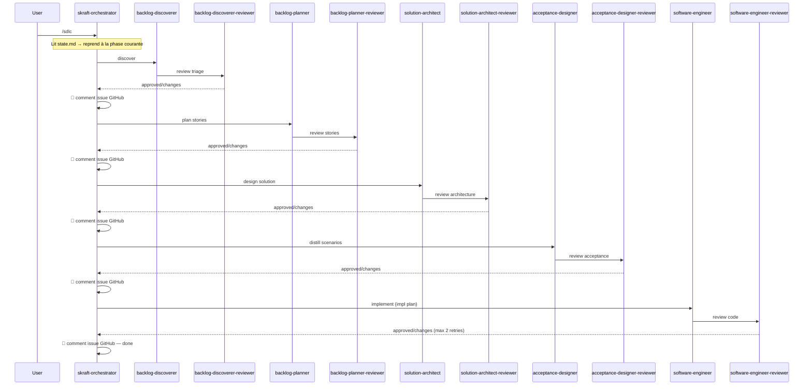

# Spec — skraft SDLC Pipeline

## Contexte

Le plugin `skraft` ne couvre aujourd'hui que la phase DELIVER (implémentation TDD via `software-engineer` + `software-engineer-reviewer` + orchestrateur). Les phases amont du cycle de développement — découverte, planification, architecture, design de tests d'acceptation — sont manuelles ou absentes.

Cette spec définit le **pipeline SDLC complet** de skraft : 5 phases couvrant de la découverte d'issues GitHub jusqu'à la livraison de code testé.

## Objectifs

1. Couvrir les 5 phases du SDLC avec des agents spécialisés + reviewers adversariaux.
2. Garantir la traçabilité : chaque phase produit des artefacts consommés par la suivante.
3. Utiliser Genesis comme méthodologie de design pour chaque agent/skill.
4. Rester dans le périmètre GitHub natif : Issues + Milestones + Sub-issues (pas de Projects).
5. Construire progressivement : DISTILL → DESIGN → DISCUSS → DISCOVER → orchestrateur.

## Hors périmètre

- GitHub Projects API (API board/kanban — dépriorisé).
- Déploiement et DevOps (pas de phase DEVOPS dédiée).
- Agents de spike/prototype (pas de phase SPIKE).
- Migration des agents existants (DELIVER reste tel quel : `software-engineer` + `software-engineer-reviewer` absorbés par l'orchestrateur unifié).

## Pipeline

```
DISCOVER → DISCUSS → DESIGN → DISTILL → DELIVER
   │          │         │         │         │
   ▼          ▼         ▼         ▼         ▼
 Issues    Refined    ADRs +    Gherkin   Code +
 triées    stories   diagrams  scenarios  tests
```

### Vue d'ensemble des phases

| Phase | Agent | Reviewer | Skills (3) |
|---|---|---|---|
| DISCOVER | `backlog-discoverer` | `backlog-discoverer-reviewer` | `github-search-protocol`, `issue-triage`, `discovery-review-criteria` |
| DISCUSS | `backlog-planner` | `backlog-planner-reviewer` | `issue-refinement`, `sprint-planning`, `planning-review-criteria` |
| DESIGN | `solution-architect` | `solution-architect-reviewer` | `architecture-patterns`, `architecture-decisions`, `architecture-review-criteria` |
| DISTILL | `acceptance-designer` | `acceptance-designer-reviewer` | `bdd-methodology`, `test-design-mandates`, `acceptance-review-criteria` |
| DELIVER | `software-engineer` ✅ | `software-engineer-reviewer` ✅ | existants ✅ |

### Skills cross-cutting

| Skill | Phases concernées | Rôle |
|---|---|---|
| `contract-testing` | DESIGN → DISTILL → DELIVER | Contract-first Microcks : authoring samples + dispatchers, Testcontainers mocks, contract verification, AsyncAPI, artifact bridging |
| `playwright-evidence` | DELIVER + orchestrateur | Capture screenshots/rapports, upload en commentaire GitHub issue |

### Patterns Genesis par type

| Type de module | Pattern architectural | Pattern de design |
|---|---|---|
| Agent spécialiste | A3 ORCHESTRATOR-SAGA (sous-tasks) | B4 PLAN MEMENTO, B8 ATTENTION ANCHOR |
| Agent reviewer | A7 ADVERSARIAL REVIEW | B1 FAN-OUT + SYNTHESIZER |
| Skill domain | — | B8 ATTENTION ANCHOR (mandatory reload) |
| Skill cross-cutting | — | B8 ATTENTION ANCHOR (mandatory reload) |
| Orchestrateur SDLC | A5 PIPELINE | B4 PLAN MEMENTO, B8 ATTENTION ANCHOR |

---

## Contrats inter-phases

Chaque phase produit des artefacts structurés consommés par la suivante. Les artefacts sont persistés dans `.skraft/sdlc/`.

### DISCOVER → DISCUSS

| Artefact | Format | Localisation |
|---|---|---|
| Issues triées | Liste markdown avec labels, priorité, effort estimé | `.skraft/sdlc/discover/triage-{date}.md` |
| Sprint proposal | Tableau issues/milestone | `.skraft/sdlc/discover/sprint-proposal.md` |

### DISCUSS → DESIGN

| Artefact | Format | Localisation |
|---|---|---|
| Stories raffinées | Markdown structuré (As a/I want/So that + AC) | `.skraft/sdlc/discuss/stories-{milestone}.md` |
| Acceptance criteria | Liste Given/When/Then draft | `.skraft/sdlc/discuss/ac-draft-{story}.md` |

### DESIGN → DISTILL

| Artefact | Format | Localisation |
|---|---|---|
| ADR | Markdown template ADR | `.skraft/sdlc/design/adr-{number}-{slug}.md` |
| Component diagram | Mermaid dans markdown | `.skraft/sdlc/design/diagrams-{story}.md` |
| Interface contracts | Signatures, DTOs, boundaries | `.skraft/sdlc/design/contracts-{story}.md` |
| API contracts (Microcks) | OpenAPI / AsyncAPI / Protobuf | `.skraft/sdlc/design/contracts/{api-name}.yaml` |

### DISTILL → DELIVER

| Artefact | Format | Localisation |
|---|---|---|
| Scénarios Gherkin | `.feature` ou markdown Gherkin | `.skraft/sdlc/distill/{feature}.feature` |
| Test plan | Matrice de couverture | `.skraft/sdlc/distill/test-plan-{story}.md` |
| Implem plan | Étapes ordonnées pour l'engineer | `.skraft/sdlc/distill/impl-plan-{story}.md` |
| Microcks samples | `.apiexamples.yaml` + `.apimetadata.yaml` | `.skraft/sdlc/distill/contracts/{api-name}.*` |

---

## Contract-first workflow (skill `contract-testing`)

Les contrats d'API traversent les phases. Le skill `contract-testing` couvre le workflow complet :

```
DESIGN                       DISTILL                          DELIVER
  │                            │                               │
  ▼                            ▼                               ▼
OpenAPI / AsyncAPI    →   Microcks samples           →   Testcontainers mocks
(contracts/{api}.yaml)    (.apiexamples.yaml            (MicrocksContainer)
                           .apimetadata.yaml             + contract verification
                           dispatchers)
```

### Contenu attendu du skill

| Section | Contenu |
|---|---|
| **Authoring** | Génération `.apiexamples.yaml` + `.apimetadata.yaml` avec dispatchers (JSON_BODY, JS, Groovy). Absorbé depuis le skill existant `generate-microcks-openapi-samples`. |
| **Testcontainers** | Setup `MicrocksContainer` / `MicrocksContainersEnsemble` pour .NET, pattern `IAsyncLifetime`, injection dans `WebApplicationFactory`. |
| **Contract verification** | `MicrocksContainer.VerifyAsync()` pour vérifier que TON implémentation respecte LE contrat (provider-side testing). |
| **AsyncAPI** | Kafka / RabbitMQ contract testing sur messages (consumer + producer). |
| **Artifact bridging** | Comment les contrats DESIGN deviennent les fixtures DELIVER : convention de nommage, localisation, import automatique. |
| **Multi-service** | Docker Compose / Testcontainers Ensemble avec N services mockés. |

### Structure du skill

```
plugins/skills/contract-testing/
├── SKILL.md                                ← workflow contract-first complet
├── references/
│   ├── microcks-testcontainers-setup.md    ← .NET MicrocksContainer patterns
│   ├── openapi-samples-authoring.md        ← génération examples + dispatchers (ex-skill)
│   ├── asyncapi-contract-workflow.md       ← Kafka/RabbitMQ patterns
│   ├── contract-verification.md            ← provider-side verification
│   ├── dispatchers-reference.md            ← JSON_BODY, JS, Groovy reference (ex-skill)
│   └── artifact-bridging.md                ← DESIGN→DELIVER convention
└── examples/
    ├── 01-openapi-json-body.md             ← simple REST mock
    ├── 02-openapi-js-dispatcher.md         ← complex routing
    ├── 03-testcontainers-dotnet.md         ← MicrocksContainer in xUnit
    └── 04-asyncapi-kafka.md                ← async contract test
```

---

## Tracking et état

### Structure de fichiers

```
.skraft/sdlc/
├── state.md                    ← état courant du pipeline
├── discover/
│   ├── triage-{date}.md
│   └── sprint-proposal.md
├── discuss/
│   ├── stories-{milestone}.md
│   └── ac-draft-{story}.md
├── design/
│   ├── adr-{n}-{slug}.md
│   ├── diagrams-{story}.md
│   ├── contracts-{story}.md
│   └── contracts/              ← API contracts pour Microcks
│       └── {api-name}.yaml
├── distill/
│   ├── {feature}.feature
│   ├── test-plan-{story}.md
│   ├── impl-plan-{story}.md
│   └── contracts/              ← Microcks samples générés
│       ├── {api-name}.apiexamples.yaml
│       └── {api-name}.apimetadata.yaml
└── evidence/                   ← screenshots + rapports
    └── {phase}-{timestamp}.png
```

### state.md — schéma

```markdown
# SDLC Pipeline State

## Current Phase
DISTILL

## Active Story
{story-id}: {title}

## Phase Progress
| Phase | Status | Last Run |
|---|---|---|
| DISCOVER | ✅ done | 2026-05-12 |
| DISCUSS | ✅ done | 2026-05-12 |
| DESIGN | ✅ done | 2026-05-12 |
| DISTILL | 🔄 in progress | 2026-05-12 |
| DELIVER | ⬜ pending | — |

## Artefacts Produced
- [x] discover/triage-2026-05-12.md
- [x] discuss/stories-v1.md
- [x] design/adr-001-cqrs.md
- [ ] distill/eligibility.feature
```

---

## Orchestration

### Orchestrateur unifié

Un seul orchestrateur — `skraft-orchestrator` — couvre le pipeline complet, de DISCOVER jusqu'à DELIVER (y compris la boucle engineer↔reviewer). Il n'y a pas d'orchestrateur séparé pour DELIVER.

| Responsabilité | Mécanisme |
|---|---|
| Séquencement inter-phases | A5 PIPELINE (DISCOVER→DELIVER) |
| Verdicts reviewers + retry | Gate par phase, max 2 retries |
| Boucle engineer↔reviewer (DELIVER) | Dispatch direct, même logique de retry |
| Persistance état | B4 PLAN MEMENTO via `.skraft/sdlc/state.md` |
| Feedback GitHub | Commentaire sur l'issue à chaque transition de phase |

### Flux de l'orchestrateur



### Point d'entrée unique : reprise automatique

Une seule commande : `/sdlc`. L'orchestrateur lit `state.md` et reprend à la phase en cours.

| Situation | Comportement |
|---|---|
| Pas de `state.md` | Démarre à DISCOVER |
| Phase en cours `🔄 in progress` | Reprend cette phase |
| Dernière phase `✅ done` | Avance à la phase suivante |
| Toutes les phases `✅ done` | Pipeline terminé, rien à faire |

---

## Build order

| Itération | Spec | Dépend de |
|---|---|---|
| 1 | `2026-05-12-phase-distill.md` | DELIVER (✅ existe) |
| 2 | `2026-05-12-phase-design.md` | DISTILL |
| 3 | `2026-05-12-phase-discuss.md` | DESIGN |
| 4 | `2026-05-12-phase-discover.md` | DISCUSS |
| 5 | `contract-testing` skill (cross-cutting) | DESIGN + DISTILL + DELIVER |
| 6 | `playwright-evidence` skill (cross-cutting) | Orchestrateur + DELIVER |
| 7 | `2026-05-12-skraft-orchestrator.md` | Toutes les phases + skills cross-cutting |

---

## Méthodologie : Genesis

Chaque module (agent + reviewer + skills) passe par le cycle Genesis complet :

1. **Steps 1-6** (design) : intent, diagrams, composition, SoC, compliance, handoff packet.
2. **Steps 7-8** (codegen) : portability check, draft modules, validate.

Les handoff packets sont persistés dans `docs/superpowers/specs/genesis-packets/` avant implémentation.

---

## Fichiers produits (total : 24)

### Agents (10)

| Agent | Fichier |
|---|---|
| `backlog-discoverer` | `plugins/agents/backlog-discoverer.agent.md` |
| `backlog-discoverer-reviewer` | `plugins/agents/backlog-discoverer-reviewer.agent.md` |
| `backlog-planner` | `plugins/agents/backlog-planner.agent.md` |
| `backlog-planner-reviewer` | `plugins/agents/backlog-planner-reviewer.agent.md` |
| `solution-architect` | `plugins/agents/solution-architect.agent.md` |
| `solution-architect-reviewer` | `plugins/agents/solution-architect-reviewer.agent.md` |
| `acceptance-designer` | `plugins/agents/acceptance-designer.agent.md` |
| `acceptance-designer-reviewer` | `plugins/agents/acceptance-designer-reviewer.agent.md` |
| `skraft-orchestrator` | `plugins/agents/skraft-orchestrator.agent.md` (unifié — remplace l'ancien) |
| Sub-agents reviewers (lenses) | `plugins/agents/reviewer-lenses/` (réutilisation pattern A7) |

### Skills (14)

| Skill | Fichier |
|---|---|
| `github-search-protocol` | `plugins/skills/github-search-protocol/SKILL.md` |
| `issue-triage` | `plugins/skills/issue-triage/SKILL.md` |
| `discovery-review-criteria` | `plugins/skills/discovery-review-criteria/SKILL.md` |
| `issue-refinement` | `plugins/skills/issue-refinement/SKILL.md` |
| `sprint-planning` | `plugins/skills/sprint-planning/SKILL.md` |
| `planning-review-criteria` | `plugins/skills/planning-review-criteria/SKILL.md` |
| `architecture-patterns` | `plugins/skills/architecture-patterns/SKILL.md` |
| `architecture-decisions` | `plugins/skills/architecture-decisions/SKILL.md` |
| `architecture-review-criteria` | `plugins/skills/architecture-review-criteria/SKILL.md` |
| `bdd-methodology` | `plugins/skills/bdd-methodology/SKILL.md` |
| `test-design-mandates` | `plugins/skills/test-design-mandates/SKILL.md` |
| `acceptance-review-criteria` | `plugins/skills/acceptance-review-criteria/SKILL.md` |
| `contract-testing` | `plugins/skills/contract-testing/SKILL.md` |
| `playwright-evidence` | `plugins/skills/playwright-evidence/SKILL.md` |
