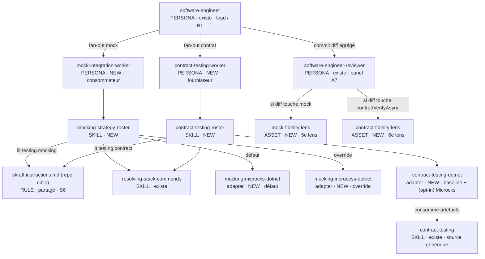
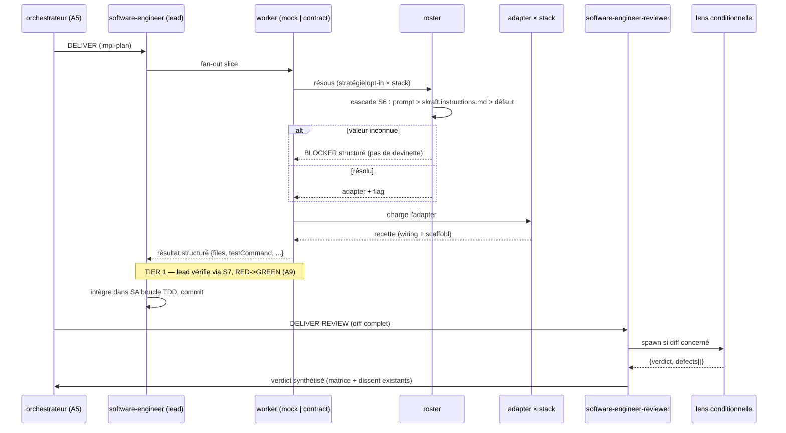
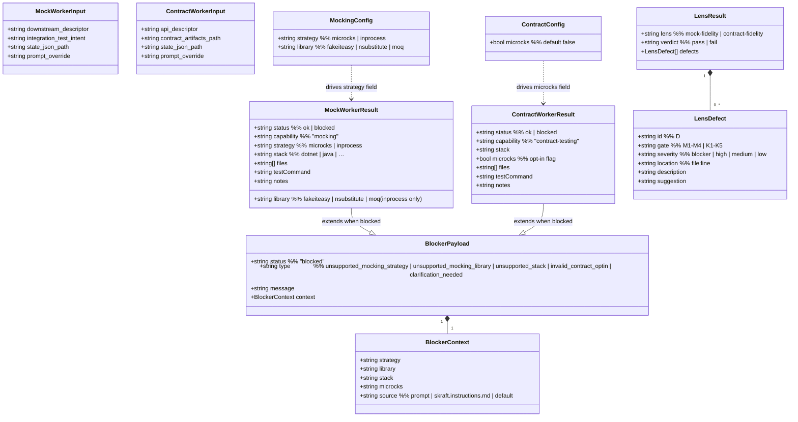

# Spec — Workers de test derrière software-engineer (mocking + contract-testing optionnel)

> Artefact de design Genesis (step 6, consolidé). Source de vérité unique pour
> les deux capacités. Toute refonte future repart de ce spec, pas des modules
> émis.
>
> **✅ APPROUVÉ par l'opérateur le 2026-06-09 — step 7b autorisé. Lenses acceptance-review-criteria passées (skippées sur décision opérateur).**

- Branche : `feat/contract-testing-agents`
- Cible déclarée : `common-only` (aucune syntaxe par-harness dans les personas/skills).
- Deux capacités distinctes (SoC), un seul spec :
  - **MOCKING** (consommateur) — remplacer un downstream que le SUT appelle.
  - **CONTRACT TESTING** (fournisseur) — vérifier que NOTRE API respecte le contrat.

## Contexte

Le repository `skraft-plugin` expose l'agent `software-engineer` (Outside-In TDD,
Clean Architecture) dispatché par `skraft-orchestrator` dans la phase DELIVER, et
revu par `software-engineer-reviewer` (panel A7 à 4 lenses). Le skill
`contract-testing` existe déjà mais sa partie DELIVER est codée en dur .NET.

Ce spec insère des **workers internes** derrière `software-engineer` (fan-out B1)
pour livrer le wiring de test, en isolant la divergence par-stack dans des
adapters — calque du pattern existant `resolving-stack-commands` →
`quality-gates-<tech>` (« ajouter un stack = +1 adapter +1 ligne, zéro edit
agent/orchestrateur »).

## Objectifs

1. Mocking : worker qui résout une stratégie (Microcks par défaut, surchargeable
   in-process) × stack et émet le wiring de mock + scaffold d'intégration.
2. Contract testing : worker qui émet toujours la baseline WAF+HttpClient et, en
   opt-in, ajoute la couche Microcks (`VerifyAsync`).
3. Configuration unifiée surchargeable via un seul fichier repo cible
   `.github/instructions/skraft.instructions.md` à namespaces disjoints.
4. Review sans nouvel agent : 2 lenses conditionnelles ajoutées au panel A7.
5. Extensibilité : ajouter un stack = +1 adapter +1 ligne de roster.

## Hors périmètre

- Piloter le cycle TDD métier (le lead `software-engineer` le garde).
- Toute nouvelle phase orchestrateur ou nouvel agent reviewer.
- L'émission des modules (step 7b) — gated par approbation opérateur.

## Patterns Genesis appliqués

| Pattern | Rôle |
|---|---|
| **A5 PIPELINE** | Les workers vivent dans la jambe DELIVER existante |
| **B1 FAN-OUT + SYNTHESIZER** | `software-engineer` fan-out vers les workers, fait la synthèse |
| **S6 RULE BRIDGE** | Lecture de l'override/opt-in depuis `skraft.instructions.md` |
| **S7 DETERMINISTIC TOOL BRIDGE** | Le lead vérifie le worker par commande de test réelle |
| **A9 SUPERVISED EXECUTION** | Gate TIER-1 du lead : plan → exécute → vérifie RED→GREEN |
| **A7 ADVERSARIAL REVIEW** | Panel existant + 2 lenses conditionnelles |
| **R3 EXTRACT** | Sortir le .NET DELIVER du skill `contract-testing` vers un adapter |

---

## Décisions verrouillées

### Communes
- **Topologie** : workers internes (`user-invocable: false`), dispatchés par
  `software-engineer` uniquement. Ils committent via le lead (one-writer rule) —
  ils rendent un résultat structuré, le lead intègre dans SA boucle TDD.
- **Vérification 2 étages** :
  - TIER 1 (lead) : exécute la commande de test résolue (S7) → RED→GREEN (A9).
    Ne fait pas confiance à la prose du worker.
  - TIER 2 (reviewer) : panel A7 existant + 1 lens conditionnelle par capacité.
- **Config unifiée** `.github/instructions/skraft.instructions.md` (repo cible) :

  ```yaml
  testing:
    mocking:
      strategy: microcks      # microcks (défaut surchargeable) | inprocess
      library: moq            # si inprocess : moq | fakeiteasy | nsubstitute
    contract:
      microcks: false         # add-on opt-in ; baseline WAF+HttpClient toujours
  ```

  Namespaces disjoints (SoC interne). Lecture par tool-call. Cascade :
  prompt explicite > fichier > défaut. Valeur inconnue = blocker structuré.

### Mocking (consommateur)
- **Défaut surchargeable** : Microcks ; override = lib in-process (Moq /
  FakeItEasy / NSubstitute). Choix EXCLUSIF d'une stratégie.
- **Frontière worker** : wiring de mock seulement (container Microcks OU
  enregistrement in-process) + scaffold `WebApplicationFactory` câblé sur l'URL mock.
- **Adapters** : un par couple (stratégie × stack) — `mocking-microcks-dotnet`
  (défaut), `mocking-inprocess-dotnet` (override). Deux axes orthogonaux.

### Contract testing (fournisseur)
- **Baseline inconditionnelle** : WAF + HttpClient TOUJOURS émise.
- **Microcks = couche additive opt-in** (`MicrocksBuilder` + `VerifyAsync`),
  empilée par-dessus, jamais en remplacement. Booléen additif.
- **Adapters** : un par STACK portant les DEUX couches —
  `contract-testing-dotnet`. L'opt-in est une branche booléenne interne.
- **Source générique** : le skill `contract-testing` existant (OpenAPI /
  `.apiexamples` / `.apimetadata`, déjà tech-agnostique) ; R3 EXTRACT du .NET.

---

## Architecture — diagramme de composants



## Architecture — séquence (livraison d'une slice)



## Composition (step 3.5)

| Box | Mode | Rationale |
|---|---|---|
| `mock-integration-worker` | LOCAL SIBLING (`plugins/skraft-framework/agents/`) | Interne, ship runtime |
| `contract-testing-worker` | LOCAL SIBLING (`plugins/skraft-framework/agents/`) | Interne, frère du précédent |
| `mocking-strategy-roster` | LOCAL SIBLING (`plugins/skraft-framework/skills/`) | Calque resolving-stack-commands |
| `contract-testing-roster` | LOCAL SIBLING (`plugins/skraft-framework/skills/`) | Idem, lit l'opt-in |
| `mocking-microcks-dotnet` | LOCAL SIBLING (`plugins/skraft-framework/skills/`) | Adapter (stratégie × stack) |
| `mocking-inprocess-dotnet` | LOCAL SIBLING (`plugins/skraft-framework/skills/`) | Adapter (stratégie × stack) |
| `contract-testing-dotnet` | LOCAL SIBLING (`plugins/skraft-framework/skills/`) | Adapter par stack, 2 couches |
| `mock-fidelity-lens` | LOCAL SIBLING (`plugins/skraft-framework/agents/reviewer-lenses/`) | 5e lens |
| `contract-fidelity-lens` | LOCAL SIBLING (`plugins/skraft-framework/agents/reviewer-lenses/`) | 6e lens |
| `contract-testing` (générique) | EXISTE | Source ; R3 EXTRACT du .NET |
| `resolving-stack-commands` | EXISTE | Détection stack + commande test (S7) |
| `skraft.instructions.md` | RULE (repo cible, runtime) | Template partagé, namespaces disjoints |

Aucun module externe. Aucun adapter module-system au step 7b. Pas de PHANTOM
DEPENDENCY (tous LOCAL SIBLINGS, liens markdown relatifs).

## Esquisse d'interface (par module)

- **`mock-integration-worker`** (FORCED, interne). In : cible downstream, intent
  test d'intégration, `state.json`, prompt. Out : `{strategy, stack, files[],
  testCommand}`, pas de commit. Dép : `mocking-strategy-roster`, parent.
- **`contract-testing-worker`** (FORCED, interne). In : descripteur API, artefacts
  contrat, `state.json`, prompt. Out : `{stack, microcks, files[], testCommand}`,
  pas de commit. Dép : `contract-testing-roster`, parent.
- **`mocking-strategy-roster`** (DISCOVERY). Résout `(stratégie × stack)` ou
  blocker. Cascade prompt > `testing.mocking.strategy` > défaut `microcks`.
- **`contract-testing-roster`** (DISCOVERY). Résout `(stack)` + flag opt-in ou
  blocker. Cascade prompt > `testing.contract.microcks` > défaut `false`.
- **`mocking-microcks-dotnet`** (DISCOVERY). Container Microcks + scaffold WAF sur URL mock.
- **`mocking-inprocess-dotnet`** (DISCOVERY). Double in-process (lib nommée) injecté dans la DI WAF.
- **`contract-testing-dotnet`** (DISCOVERY). TOUJOURS WAF+HttpClient ; SI flag : +TestEndpointAsync.
- **`mock-fidelity-lens`** (FORCED, conditionnelle). In : code+tests only. Audite
  stratégie/override respectés, URL mock câblée, pas d'appel réel downstream.
- **`contract-fidelity-lens`** (FORCED, conditionnelle). In : code+tests only.
  Audite baseline toujours présente, `TestEndpointAsync` non supprimé si opt-in,
  ProblemDetails/codes/headers conformes, pas d'appel réel downstream.

## Design de classes — contrats d'interface

Les modules sont des fichiers naturel-language (personas/skills), pas du code objet.
Le "class design" ci-dessous capture les **types de messages échangés** (contrats
d'entrée/sortie) et les **invariants** qui doivent être vérifiés à chaque frontière.



### Invariants de frontière

| Frontière | Invariant |
|-----------|-----------|
| `MockWorkerResult.status == ok` | `files[]` non vide, `testCommand` non vide, `strategy ∈ {microcks, inprocess}` |
| `MockWorkerResult.strategy == inprocess` | `library ∈ {fakeiteasy, nsubstitute, moq}` |
| `ContractWorkerResult.status == ok` | `files[]` non vide, `testCommand` non vide, `files` contient toujours le fichier baseline |
| `ContractWorkerResult.microcks == true` | `files` contient exactement deux fichiers (baseline + verification) |
| `BlockerPayload.status == blocked` | `type` dans l'enum autorisé, `context.source` défini |
| `LensDefect.gate` | `M[1-4]` pour mock-fidelity, `K[1-5]` pour contract-fidelity |
| `LensDefect.severity` | Strictement dans `{blocker, high, medium, low}` — rejet si hors enum |

## Findings de conformité — état de résolution

| Finding | Sévérité initiale | État |
|---------|-------------------|------|
| R3 EXTRACT `contract-testing` : DELIVER .NET déplacé vers `contract-testing-dotnet`, redirect note ajoutée, réf orchestrateur inchangée | HIGH | ✅ résolu |
| `software-engineer` : 2 triggers fan-out + TIER-1 gate (S7+A9) ajoutés | LOW | ✅ résolu |
| `software-engineer-reviewer` : 2 lignes de lens conditionnelles ajoutées | LOW | ✅ résolu |
| Nommage `mock-fidelity-lens` vs `contract-fidelity-lens` — distincts, conservés | MEDIUM | ✅ résolu (noms finaux) |
| `contract-testing-dotnet` : `VerifyAsync` remplacé par `TestEndpointAsync(OPEN_API_SCHEMA)` (provider-side correct) | — | ✅ résolu lors de l'implémentation |

## Plan d'evals

### Content evals (with_skill vs without_skill)
1. Mock, sans override → Microcks container + scaffold WAF (défaut).
2. Mock + `testing.mocking.strategy: inprocess` → double in-process, pas de container.
3. Mock + prompt « avec Moq » → chemin in-process Moq (prompt > défaut).
4. Contrat, sans opt-in → baseline WAF+HttpClient SEULE.
5. Contrat + `testing.contract.microcks: true` → baseline + VerifyAsync (ProblemDetails/codes/headers).
6. Contrat + prompt « vérifie avec Microcks » → couche opt-in ajoutée (prompt > défaut false).

### Trigger evals (par worker, 60/40 train/val, ~20 chacun)
- Mock SHOULD : « mock le downstream pour ce test d'intégration », « stub le
  service de paiement », « fake la dépendance HTTP externe », « utilise Moq ici »…
  SHOULD NOT : « unit test cette règle métier », « vérifie le contrat avec
  VerifyAsync » (fournisseur), « refactor l'agrégat »…
- Contrat SHOULD : « test de contrat pour cette API », « vérifie que l'endpoint
  respecte l'OpenAPI », « vérifie la forme ProblemDetails », « teste avec
  WebApplicationFactory »… SHOULD NOT : « mock le downstream que le SUT appelle »
  (consommateur), « unit test », « run mutation »…
- Gate : validation ≥ 0.5 should-trigger ET < 0.5 near-miss.

## Todo (step 7b — ✅ COMPLÉTÉ)

Fondations partagées :
1. [x] Template `assets/` `skraft.instructions.template.md` (namespaces `testing.mocking.*` + `testing.contract.microcks`).
2. [x] Edit `software-engineer.agent.md` : 2 triggers fan-out + vérif TIER-1 (S7+A9), batché.
3. [x] Edit `software-engineer-reviewer.agent.md` : 2 lignes de lens conditionnelles, batché.

Mocking :
4. [x] `plugins/skraft-framework/skills/mocking-strategy-roster/SKILL.md` (cascade override, schéma blocker).
5. [x] `plugins/skraft-framework/skills/mocking-microcks-dotnet/SKILL.md` (dép 4).
6. [x] `plugins/skraft-framework/skills/mocking-inprocess-dotnet/SKILL.md` (dép 4).
7. [x] `plugins/skraft-framework/agents/workers/mocking/mock-integration-worker.agent.md` (dép 4-6).
8. [x] `plugins/skraft-framework/agents/workers/mocking/mock-fidelity-lens.agent.md`.
9. [x] `evals/mock-integration-worker/{triggers.yml,content.yml}`.

Contract testing :
10. [x] `plugins/skraft-framework/skills/contract-testing-roster/SKILL.md` (stack + opt-in, schéma blocker).
11. [x] R3 EXTRACT : `plugins/skraft-framework/skills/contract-testing-dotnet/SKILL.md` (DELIVER .NET extrait ; générique redirige vers roster).
12. [x] `plugins/skraft-framework/agents/workers/contract-testing/contract-testing-worker.agent.md` (dép 10-11).
13. [x] `plugins/skraft-framework/agents/workers/contract-testing/contract-fidelity-lens.agent.md`.
14. [x] `evals/contract-testing-worker/{triggers.yml,content.yml}`.

Validation (step 8) :
15. [x] Interface conforme, regex `name`, `description` ≤ 1024, ASCII, common-only,
    indépendance des lenses, R3 n'a pas cassé la réf orchestrateur, raffinement sur tâche réelle.

## Note de séquencement

Les deux capacités partagent `skraft.instructions.md`, le pattern roster/worker et
les edits `software-engineer*`. En step 7b : émettre les fondations partagées
(items 1-3) AVANT les deux lots, pour ne pas double-toucher les mêmes fichiers.
