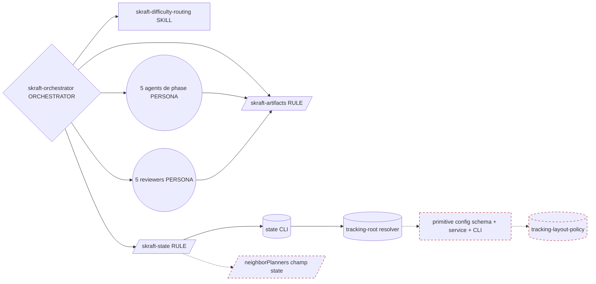
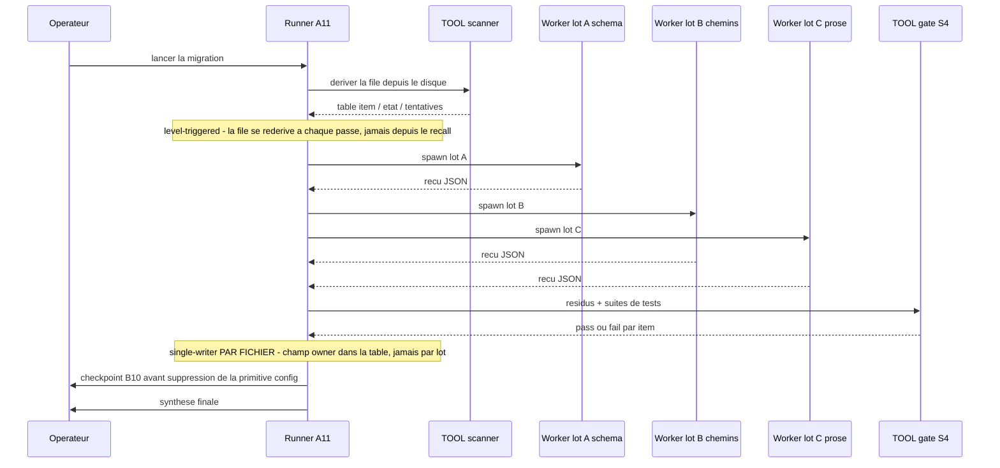
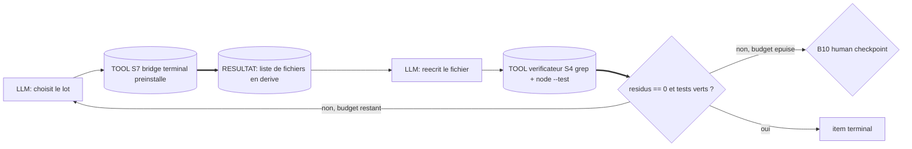
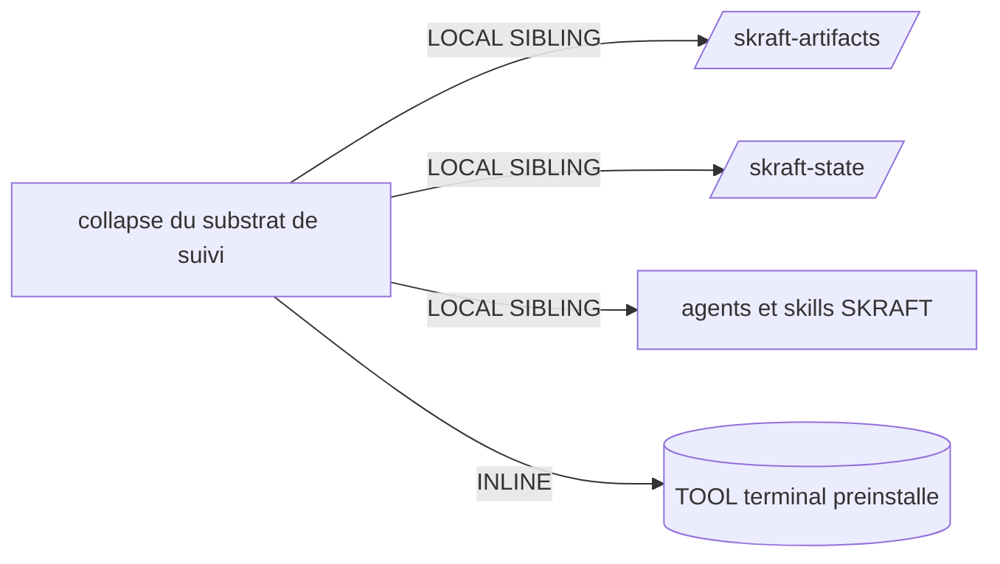

# Handoff packet — Collapse du substrat de suivi SKRAFT + prune HVE

> Produit par la skill `genesis` (design steps 1–6). **Le design s'arrête ici.**
> Aucun module en langage naturel n'est rédigé dans ce document.
> Ce fichier EST le plan (truth #5 / B4 PLAN MEMENTO) : le thread codeur le
> recharge avant chaque lot et après chaque retour de spawn.

- Date : 2026-08-26
- Stance coût déclarée : **frugal** (intention opérateur : « réduire le nombre de token inutile »)
- Cap coût : **non déclaré** → aucune règle de refus au step 6
- Cible déclarée : **`common-only`** (aucune syntaxe per-harness dans le design)
- Modules externes requis : **aucun** → le step 7b ne charge **pas** d'adaptateur de module-system

---

## Step 1 — Intention + périmètre

Effondrer le substrat de suivi du pipeline SKRAFT sur **une seule disposition
canonique enracinée dans `.copilot-tracking/`**, supprimer le cadran de
configuration `trackingLayout` et sa branche héritée `namespaced` /
`skraft-plans/{slug}/`, et élaguer les références HVE de la prose embarquée
jusqu'à ne garder que ce qui porte un comportement.

Déclencheurs : l'opérateur demande d'améliorer le SDLC, constate que la prose
référence HVE et un modèle de données de configuration périmé, et décide
d'abandonner l'ancien format.

**Frontière — ce que ce design ne fait PAS :**

- ne touche pas à l'ordre des phases, aux rôles d'agents, aux portes de revue,
  ni à la barre de qualité ;
- ne change pas la sémantique de `state.json` au-delà des champs d'interop HVE
  explicitement listés en D3 ;
- **ne fournit aucune migration** pour les dépôts utilisateurs existants — l'ancien
  format est abandonné par décision opérateur, pas déprécié ;
- ne touche pas au contrat de sortie « PRD format HVE » du parcours brownfield
  (→ décision ouverte **D4**, hors périmètre par défaut).

**Contrôle SRP.** Le paragraphe relie deux capacités par « et ». Elles ne se
scindent pas : la disposition `bare` n'a jamais existé que pour la convergence
HVE-RPI. Retirer le couplage HVE et retirer le cadran sont **le même changement,
pour la même raison**. Le déclencheur R1 DIVERGENT CHANGE CADENCE ne se déclenche
pas. Un seul design.

---

## Step 2 — Diagramme de composants



Légende : traits pleins = arêtes conservées. **Traits pointillés rouges = boîtes
supprimées** par ce design. Après collapse, `ROOT` résout un chemin unique sans
consulter aucun fichier de configuration.

**Table canonique unique.** Le tableau des chemins est aujourd'hui dupliqué dans
`skraft-artifacts`, `skraft-state`, l'orchestrateur, `solution-researcher` et le
README (déclencheur **R3 EXTRACT / DUPLICATED INLINE CONTENT**). Après collapse,
**une seule** table vit dans `skraft-artifacts` ; les autres la référencent
(S5 LAZY PROXY) au lieu de la restituer.

---

## Step 3 — Diagramme de threads (exécution de la migration)

Motif Tier 3 retenu : **A11 RECONCILIATION LOOP**. La formulation d'intention
contient « pour chaque fichier », « amener à l'état terminal », « reconcilier la
dérive » — c'est le déclencheur nominal d'A11. Ce n'est ni A8 (une seule cible),
ni A1 PANEL (pas de lentilles indépendantes), ni A2 PIPELINE (pas d'étapes
hétérogènes).



Interlock : le grain single-writer est **le fichier**, pas le lot. Deux workers
ne touchent jamais le même fichier. `skraft-orchestrator` et
`skraft-state.instructions` apparaissent dans deux catégories de dérive ; ils
sont assignés à **un seul** worker qui applique les deux catégories d'un coup
(sinon anti-pattern MULTI-WRITER PER ITEM).

Budget par item : **3 tentatives**, puis escalade B10.

### Frontière déterministe (S7)



« Quels fichiers référencent encore l'ancien chemin » est un **FAIT QUI DOIT
ÊTRE VRAI** → matrice tradeoffs §9, règle 2 → **tool-delegated**. Aucune passe
de détection ni de vérification n'est assertée en prose. Le vérificateur est
lui-même un outil, jamais le LLM (anti-pattern VERIFY-WITH-LLM-ONLY).

---

## Step 3.1 — Contrôle de tradeoff

Deux motifs se disputaient le créneau « exécution de la migration » : A11
RECONCILIATION LOOP et A2 PIPELINE.

- Matrice citée : **§4 threading topology** — travail parallèle, pas d'état
  partagé entre fichiers, mais interlock requis par item.
- Ligne retenue : parallèle + état par item → fan-out avec interlock par item.
- A2 PIPELINE rejeté : il suppose des étapes hétérogènes traversées par un
  artefact unique. Ici c'est **N items homogènes** ; couler 42+ fichiers dans un
  pipeline sérialise ce qui doit s'éventer (anti-pattern QUEUE-LEVEL INTERLOCK).

```
%% tradeoff: matrice #4 threading topology -> ligne parallele + interlock par item
%% tradeoff: matrice #9 execution doctrine -> detection et verification = tool-delegated
%% tradeoff: matrice #10 cost-shape -> ligne "fan-out across N similar items" -> A12
```

---

## Step 3.2 — Contrôle de coût

### Par module

| Module | Classe de rôle | Bande préfixe | Bande sortie | Tours | Surface d'outils |
|---|---|---|---|---|---|
| Runner A11 | planner | M | S | medium | terminal + spawn |
| Worker lot A (schéma + CLI + tests) | implementer | M | M | low | édition + terminal |
| Worker lot B (chemins `.md`) | implementer | M | M | low | édition |
| Worker lot C (prose HVE) | implementer | S | S | low | édition |
| Scanner + gate | *aucune* — substrat déterministe | — | — | — | terminal |
| Synthèse finale | planner | M | S | low | lecture |

**CLASS-UNIFORM GRAPH évité** : seuls le runner et la synthèse sont
planner-class ; les trois workers sont implementer-class. C'est **A12 GRADIENT
WORKFLOW** + **B12 MODEL ROUTER**.

### Ligne de matrice citée

- §10, ligne « Fan-out across N similar items » → bucket dominant = octets de
  sortie × N → amplificateur = classe de rôle lourde sur les workers → plus petit
  motif applicable = **A12 GRADIENT WORKFLOW (milieu = implementer)**. Appliqué.
- §10, ligne « Verbose persona / asset body » → bucket = octets de préfixe →
  amplificateur = prose bloat → **B14 PROMPT THRIFT**. C'est le **résultat**
  recherché par l'opérateur, pas le coût de la migration.

Aucun empilement : un motif par bucket (règle de sélection §10, point 1).

### Aucun invalidateur de cache introduit

Le collapse **retire** de la prose du préfixe ; il n'ajoute ni horodatage, ni
changement de catalogue d'outils en cours de session, ni bascule de modèle.
INVALIDATOR LEAK ne se déclenche pas.

---

## Step 3.5 — Décision de composition

| Boîte | Mode | Rationale |
|---|---|---|
| `skraft-artifacts` (règle) | LOCAL SIBLING | déjà dans l'arbre ; devient la **table de chemins canonique unique** |
| `skraft-state` (règle) | LOCAL SIBLING | déjà dans l'arbre ; perd le bloc de disposition et `neighborPlanners` |
| `skraft-orchestrator` (orchestrateur) | LOCAL SIBLING | déjà dans l'arbre ; perd la branche de disposition et l'analogie RPI |
| `skraft-difficulty-routing` (skill) | LOCAL SIBLING | déjà dans l'arbre ; l'énum de handoff est débrandée |
| 42 fichiers `.md` d'agents / skills | LOCAL SIBLING | réécriture de chemin uniquement |
| primitive config (schéma + service + CLI) | **SUPPRIMÉE** | R4 INLINE — plus aucun consommateur après D1 |
| `tracking-layout-policy` | **SUPPRIMÉE** | R4 INLINE — DEAD VARIATION, une seule variante survit |
| scanner de dérive | **INLINE** | commande terminal jetable ; la règle de trois ne se déclenche pas — ne pas créer de script |

**Modules externes requis : aucun.** Tout vit dans `plugins/skraft-framework/`.
Aucune frontière de distribution n'est franchie → le step 7b **ne charge aucun
adaptateur de module-system**, et PHANTOM DEPENDENCY ne peut pas se produire.



### Audience des artefacts émis

| Artefact | Audience | Mode |
|---|---|---|
| Briefs de spawn vers les workers | INTERNAL | CAVEMAN_FULL |
| Reçus des workers | INTERNAL | JSON_RECEIPT |
| Table d'état de la file | INTERNAL | JSON_RECEIPT |
| Ce packet (HUMAN_RATIONALE) | EXTERNAL | NORMAL |
| Message de commit / description de PR | EXTERNAL | NORMAL |
| Prose SDLC réécrite (fichiers embarqués) | EXTERNAL | NORMAL |

**La prose SDLC embarquée est EXTERNAL.** Elle est lue par des humains ET
chargée dans le contexte d'agents. Le prune retire de la prose *morte*, il ne
comprime **pas** la prose vivante en caveman. « moins de tokens » n'est pas une
justification suffisante pour une ligne EXTERNAL (matrice §11).

---

## Step 4 — Passe SoC + déclencheurs de refactor

| Déclencheur | Se déclenche ? | Action |
|---|---|---|
| R1 SPLIT | non | aucune conjonction de description, aucun corps multi-lentilles |
| R2 FUSE | non | aucune collision de dispatch entre frères |
| R3 EXTRACT — DUPLICATED INLINE CONTENT | **oui** | la table de disposition est répétée dans 5+ fichiers → une table canonique + références |
| R4 INLINE — DEAD VARIATION | **oui** | `trackingLayout` a 2 valeurs dont une héritée ; `tracking-layout-policy` devient une fonction constante |
| R4 INLINE — SINGLE-CALLER, SINGLE-CONTENT | **oui** | la primitive config n'existe que pour `trackingLayout` (`SETTABLE_KEYS` n'a qu'une clé) |
| R5 COST PRUNE — PROSE BLOAT | **oui** | chaque corps d'agent porte une table de chemins à deux branches sans capacité nouvelle |
| S7 requis ? | **oui** | détection de dérive + vérification = faits, pas du jugement |
| PREMATURE SPLIT | non | aucune scission proposée |

**Collision de dispatch** : la description de `skraft-difficulty-routing` change
(HVE → backlog amont). Vérifier qu'elle n'entre pas en collision avec
`backlog-discoverer` après réécriture. Sévérité HIGH si manqué.

---

## Step 5 — Contrôle de conformité

| Constat | Sévérité | État |
|---|---|---|
| Détection de dérive assertée en prose au lieu d'un appel outil | BLOCKER | **évité par construction** (S7 au step 3) |
| Vérification par le LLM au lieu d'un second outil | BLOCKER | **évité** (gate S4 déterministe) |
| Multi-writer sur un fichier apparaissant dans 2 catégories | BLOCKER | **évité** (assignation à un worker unique) |
| Boucle par item sans prédicat d'arrêt | BLOCKER | **évité** (résidus == 0 + tests verts) |
| Suppression de la primitive config sans accord humain | HIGH | **B10 checkpoint requis** — voir D2 |
| `handoffSource` débrandé sans casser la détection | HIGH | **ouvert** — à valider par test au step 8 |
| Description de `skraft-difficulty-routing` réécrite → risque de collision | HIGH | **ouvert** — à revoir au step 8 |
| Aucun chemin de migration pour les dépôts existants | MEDIUM | **accepté par l'opérateur** (« ancien format abandonné ») |
| Isolation multi-projets perdue avec `namespaced` | MEDIUM | **partiellement atténué** — voir ci-dessous |
| Collision de noms sur les artefacts DISCOVER non suffixés par slug | HIGH | **ouvert** — remède obligatoire, todo #6b |

### Isolation multi-projets — le détail qui compte

La plupart des artefacts portent déjà le slug dans leur **nom de fichier**, donc
aplatir le répertoire ne les fait pas entrer en collision :
`{slug}-research.md`, `{slug}-plan.instructions.md`, `{slug}-details.md`,
`{slug}-changes.md`, `{phase}-{slug}-review.md`, `features/{slug}.feature`.
L'état reste rangé par slug sous `.copilot-tracking/skraft/{slug}/`.

**Deux exceptions cassent la règle** et doivent être corrigées dans le même
changement, sinon deux projets du même workspace s'écrasent le même jour :

| Artefact actuel | Producteur | Nom corrigé |
|---|---|---|
| `research/{date}/triage-{date}.md` | `backlog-discoverer` | `research/{date}/{slug}-triage-{date}.md` |
| `research/{date}/sprint-proposal.md` | `backlog-discoverer`, `skraft-difficulty-routing` | `research/{date}/{slug}-sprint-proposal.md` |

À vérifier aussi : `triage-ingest-{date}.md` (chemin de handoff amont) et
`details/{date}/consistency-matrix-{story}.md` (indexé par `{story}`, pas par
`{slug}` — acceptable si `{story}` est unique par projet, à confirmer).

Aucun BLOCKER ouvert. Le design passe, sous réserve du todo #6b.

---

## Décisions

### D1 — Disposition de suivi : **effondrer sur une seule** (recommandé)

| Option | Description | Verdict |
|---|---|---|
| D1a | garder le cadran, basculer le défaut sur `bare`, déprécier `namespaced` | **rejeté** — laisse la table à deux branches dans chaque corps d'agent ; ne paie pas le prune |
| **D1b** | **supprimer le cadran ; une seule disposition** | **retenu** |

Disposition canonique après D1b :

```
.copilot-tracking/
  research/{YYYY-MM-DD}/     plans/{YYYY-MM-DD}/
  details/{YYYY-MM-DD}/      changes/{YYYY-MM-DD}/
  reviews/{YYYY-MM-DD}/      blockers/{YYYY-MM-DD}/
  features/
  skraft/{project-slug}/state.json
docs/adr/                     (inchangé, project-global, append-only)
```

Le terme `bare` disparaît aussi : c'était un terme de contraste, et son opposé
n'existe plus. On ne nomme plus la disposition — il n'y en a qu'une.

### D2 — Modèle de données de configuration : **supprimer la primitive** (recommandé, sous checkpoint B10)

Après D1b, `trackingLayout` disparaît. `depthTier` est déjà inerte (aucune
lecture dans `src/`). `difficulty` vit dans `state.json`. La qualité n'est pas
configurable par conception. **`skraft-config.json` n'a donc plus une seule clé
gouvernée.**

| Option | Description | Verdict |
|---|---|---|
| **D2a** | supprimer `skraft-config.json`, `config-schema`, `config-service`, la CLI `config`, `tracking-layout-policy` | **recommandé** — R4 INLINE, gain maximal |
| D2b | garder la primitive comme couture vide et extensible | repli si l'opérateur anticipe un cadran proche |

Sous D2a, le resolver se réduit à : `SKRAFT_TRACKING_ROOT` (échappatoire unique,
utilisée par les tests) sinon `<cwd>/.copilot-tracking/skraft`.
`plugins/skraft-framework/skraft-framework.config.json` (généré :
`phaseOrder` / `phaseAgents` / `agentSkills`) est un **autre fichier** et reste.

Blast radius plus large → **B10 HUMAN CHECKPOINT obligatoire avant exécution**.
Réversible au coût d'un fichier.

### D3 — Références HVE : trois traitements

Inventaire mesuré sur la surface embarquée : **58 occurrences / 15 fichiers**.

| Classe | Volume | Traitement | Impact comportemental |
|---|---|---|---|
| DÉCORATIF (provenance, analogie, titres de section) | ~11 | **supprimer** | aucun |
| VOCABULAIRE (nommage HVE d'un concept possédé par SKRAFT) | ~25 | **renommer en natif SKRAFT** | aucun |
| L1 — justification de disposition (« convergence HVE-RPI », « partagé RPI ») | ~8 | **meurt avec D1b** | aucun (la disposition survit, sa justification disparaît) |
| L2 — énum `handoffSource: hve-ado \| hve-jira \| hve-github` | 4 | **débrander → `ado \| jira \| github`** | capacité conservée à l'identique |
| L3 — `neighborPlanners.{security,rai,sssc}PlanFile` | ~5 | **supprimer le champ + sa section** | aucun consommateur : vérifié, aucune lecture/écriture dans `src/` |
| L4 — contrat « PRD format HVE » (brownfield) | ~7 | **hors périmètre** → D4 | contrat de sortie externe réel |

**L2 est le point délicat.** La capacité — sauter DISCOVER quand un backlog
amont existe déjà — est réelle et vaut son coût. Seul le *branding* de l'énum
part. La règle de détection, `skipPhases`, et les artefacts substituts
`triage-ingest-{date}.md` restent inchangés.

**L3 est le plus gros gain unitaire** dans le schéma d'état : un champ à trois
sous-clés, documenté sur plusieurs lignes, qu'aucun code ne lit.

### D4 — Contrat PRD brownfield (décision ouverte, hors périmètre)

`brownfield-analyst` et `compose-brownfield-prd` produisent un « PRD format HVE »
destiné à être consommé par des agents HVE externes. C'est un **contrat de sortie
avec un consommateur externe**, pas de la décoration. Le supprimer retire une
capacité visible par l'utilisateur.

Trois voies, **à trancher par l'opérateur avant de toucher ces deux fichiers** :

1. **Conserver tel quel** — le parcours brownfield reste explicitement
   interopérable ; on assume ~7 occurrences.
2. **Débrander en gardant la forme** — « PRD structuré pour import backlog » ;
   même format sur le disque, plus de nom d'écosystème.
3. **Abandonner** — le PRD devient purement SKRAFT ; rupture pour quiconque
   alimente un agent HVE en aval.

Recommandation : **(2)**, cohérente avec le traitement de L2. Non exécutée sans
accord.

---

## Esquisse d'interface par module modifié

| Module | Déclencheur / rôle | Entrées | Sorties | Dépendances |
|---|---|---|---|---|
| `skraft-artifacts` (RULE) | portée fichier sous `.copilot-tracking/` | phase, slug, date | **la** table de chemins canonique | aucune |
| `skraft-state` (RULE) | schéma d'état + protocole d'écriture | phase, verdicts, artefacts | schéma `state.json` sans `neighborPlanners` | `skraft-artifacts`, state CLI |
| `skraft-orchestrator` (ORCHESTRATOR) | entrée `/skraft` | tour utilisateur, état persisté | dispatchs, verdicts, transitions | les deux règles, les personas de phase |
| `skraft-difficulty-routing` (SKILL) | Phase 0 : difficulté + point d'entrée | dépôt, artefacts amont | `difficulty`, `entryPoint` | `skraft-state` |
| resolver de racine (substrat) | localise l'état sur disque | env, cwd | segments de chemin | aucune (après D2a) |
| 42 `.md` agents / skills | réécriture de chemin uniquement | — | — | `skraft-artifacts` |

Mode d'invocation : `skraft-orchestrator` = **BOTH** ;
`skraft-difficulty-routing` = **FORCED** (dispatché par l'orchestrateur en
Phase 0) ; les règles = auto-attachées par portée, hors dispatcher.

---

## PER-SPAWN DECLARATION TABLE

| Spawn # | Rôle / lentille | Audience | Tier | Mode brief | Mode reçu | Justification |
|---|---|---|---|---|---|---|
| 1 | Worker lot A — schéma, CLI, tests | INTERNAL | IMPLEMENTER | CAVEMAN_FULL | JSON_RECEIPT | tâche mécanique, critère d'arrêt déterministe |
| 2 | Worker lot B — chemins dans les `.md` | INTERNAL | IMPLEMENTER | CAVEMAN_FULL | JSON_RECEIPT | substitution bornée, aucun jugement |
| 3 | Worker lot C — prose HVE | INTERNAL | IMPLEMENTER | CAVEMAN_LITE | JSON_RECEIPT | jugement sur décoratif vs porteur → LITE, pas FULL |
| 4 | Synthèse finale | EXTERNAL | PLANNER | NORMAL | NORMAL_RECEIPT | sortie lue par un humain |

### SPAWN_BRIEF #1 — lot A (schéma + CLI + tests)

```caveman
ROLE: implementer. RESPOND CAVEMAN.
GOAL: one tracking layout. no config dial.
DELETE: trackingLayout key, TRACKING_LAYOUTS, DEFAULT_TRACKING_LAYOUT,
        resolveTrackingLayout, stateBaseSegments, stateDirSegments,
        config schema + service + config CLI, layout policy module.
KEEP: SKRAFT_TRACKING_ROOT env escape hatch. tests depend on it.
NEW RESOLVER: SKRAFT_TRACKING_ROOT else cwd + .copilot-tracking/skraft
DO NOT TOUCH: skraft-framework.config.json - different file, stays.
UPDATE TESTS: delete layout-dial tests. keep root-resolution tests.
STOP WHEN: node --test tests/skraft-framework/*.test.mjs green.
PRESERVE EXACT: file paths, env var names, error codes.
OUTPUT JSON ONLY. NO PROSE.
```

### RECEIPT_SCHEMA #1

```json
{"item":"<path>","state":"terminal|blocked","files_deleted":["<path>"],"tests":"green|red","residual":0,"note":"<caveman, <=20 words>"}
```

### SPAWN_BRIEF #2 — lot B (chemins)

```caveman
ROLE: implementer. RESPOND CAVEMAN.
REWRITE PATHS in assigned .md files.
OLD: .copilot-tracking/skraft-plans/{projectSlug}/<sub>
NEW: .copilot-tracking/<sub>
STATE FILE: .copilot-tracking/skraft/{projectSlug}/state.json
DELETE ANY two-layout table. point to skraft-artifacts instead.
DO NOT invent new dirs. dated subdirs unchanged.
docs/adr/ unchanged - project-global, outside tracking root.
SLUG FIX (flat layout collides otherwise):
  triage-{date}.md        -> {slug}-triage-{date}.md
  sprint-proposal.md      -> {slug}-sprint-proposal.md
  triage-ingest-{date}.md -> {slug}-triage-ingest-{date}.md
PRESERVE EXACT: dated subdir names, {slug} placeholders, other filenames.
STOP WHEN: grep -c skraft-plans on assigned files == 0.
OUTPUT JSON ONLY. NO PROSE.
```

### RECEIPT_SCHEMA #2

```json
{"item":"<path>","state":"terminal|blocked","residual":0,"note":"<caveman, <=20 words>"}
```

### SPAWN_BRIEF #3 — lot C (prose HVE)

```caveman
ROLE: implementer. RESPOND CAVEMAN.
CLASSIFY each HVE/RPI mention, then act:
  DECORATIVE (provenance, analogy, section title) -> DELETE line.
  VOCABULARY (HVE naming for SKRAFT concept) -> RENAME native.
  LOAD-BEARING -> apply rule below, never delete silently.
RULES:
  handoffSource enum -> ado | jira | github. keep detection logic.
  neighborPlanners field + its section -> DELETE. no code reads it.
  brownfield PRD "HVE-format" -> DO NOT TOUCH. out of scope.
UNSURE? mark blocked, return the line. do not guess.
PRESERVE EXACT: state.json field names, artifact filenames, phase names.
OUTPUT JSON ONLY. NO PROSE.
```

### RECEIPT_SCHEMA #3

```json
{"item":"<path>","state":"terminal|blocked","deleted":<int>,"renamed":<int>,"unsure":["<quoted line>"],"note":"<caveman, <=20 words>"}
```

### EXTERNAL_ARTIFACT_SPEC — spawn #4

Mode **NORMAL**. Prose française complète. Contenu : ce qui a changé, ce qui a
été supprimé, ce qui reste ouvert (D4), et la commande de vérification à rejouer.
Aucune compression — le lecteur n'est pas un sous-agent.

---

## Todo list

| # | Item | Dépend de | Gate |
|---|---|---|---|
| 0 | Trancher D2a vs D2b, et D4 — **checkpoint humain** | — | accord opérateur |
| 1 | Persister ce packet + créer la table d'état de la file | 0 | fichier présent |
| 2 | Passe scanner : dériver la file depuis le disque (appel outil) | 1 | inventaire non vide |
| 3 | Lot A — schéma, resolver, CLI, tests | 0, 2 | `node --test` vert |
| 4 | Lot B — chemins dans les 42 `.md` | 3 | résidus `skraft-plans` == 0 |
| 5 | Lot C — prose HVE (décoratif + vocabulaire + L2 + L3) | 3 | reçus sans `unsure` |
| 6 | Table de chemins canonique dans `skraft-artifacts` + références ailleurs | 4, 5 | une seule table subsiste |
| **6b** | **Suffixer par slug les artefacts DISCOVER** (`triage`, `sprint-proposal`, `triage-ingest`) | 6 | aucun nom d'artefact sans slug ni story |
| 7 | Re-scan + gate S4 complet | 3–6b | résidus == 0, suites vertes |
| 8 | Vérifier la description de `skraft-difficulty-routing` (collision de dispatch) | 5 | revue humaine |
| 9 | Rejouer la suite d'évaluation d'agents (régression) | 7 | pas de régression |
| 10 | Mettre à jour README + `docs/` + CHANGELOG | 7 | — |
| 11 | Synthèse EXTERNAL + commit signé | 7–10 | — |

Les fixtures d'évaluation sous `tests/skills/*/eval.yaml` et
`tests/agents/*/fixtures/` contiennent des chemins `skraft-plans` littéraux :
elles font partie du lot B, sinon les évals cassent silencieusement.

---

## EVALS PLAN

Ce design **n'ajoute aucune capacité** — il en retire du coût. L'éval correcte
est donc une **éval de régression** (« le comportement est-il inchangé ? »), pas
une éval de delta de valeur. Un `with_skill` / `without_skill` n'aurait rien à
mesurer ici.

**Portes de régression (déterministes, déjà présentes dans le dépôt) :**

1. `node --test tests/skraft-framework/*.test.mjs` — vert.
2. `node --test tests/dashboard/*.test.mjs` — vert.
3. `node plugins/skraft-framework/src/cli/build-config-bin.mjs --check` — vert.
4. `grep -r skraft-plans plugins/ tests/ docs/` — **0 résidu**.

**Éval comportementale (agent, payante) :** rejouer la suite réelle de
`skraft-orchestrator` via `eng/run-vally-evals.sh` avant / après, et comparer les
verdicts de phase. Budget : **12–15 essais** — en dessous, le test des signes ne
peut pas atteindre `p <= 0.05` et le résultat est non concluant par construction.
Ne **pas** activer `BASELINE_CACHE=1` : un bras mis en cache n'est pas
publiable.

**Éval de déclenchement (dispatch) :** uniquement pour
`skraft-difficulty-routing`, dont la description change. 8–10 requêtes qui
doivent déclencher, 8–10 quasi-manquées qui ne doivent pas, split 60/40.
Porte d'expédition : taux >= 0,5 sur le split de validation, < 0,5 sur les
quasi-manquées.

Conforme à `AGENTS.md` : **aucun test unitaire ne sera écrit sur un fichier
`eval.yaml`**.

---

## COST PROJECTION

### Gain à l'exécution (l'objectif réel de l'opérateur)

Mesuré sur les quatre fichiers les plus chauds de la surface de dispatch :

| Fichier | Taille | Lignes marquées | Chars sur lignes marquées |
|---|---|---|---|
| `skraft-state.instructions` | 23 679 ch. | 18 | 4 286 |
| `skraft-orchestrator` | 21 951 ch. | 11 | 2 907 |
| `skraft-artifacts.instructions` | 7 590 ch. | 15 | 3 021 |
| `skraft-difficulty-routing` | 6 898 ch. | 15 | 3 311 |
| **Total** | **60 118 ch.** | **59** | **13 525 ch.** |

Les « chars sur lignes marquées » sont un **plafond**, pas le retrait net :
certaines lignes sont réécrites, pas supprimées. Retrait net prudent estimé à
**8 000–10 000 caractères, soit ~2 000–2 500 tokens (estimé)** retirés du
préfixe de chaque session d'orchestrateur, plus la table à deux branches retirée
de 42 fichiers `.md` chargés individuellement par les sous-agents.

Ce préfixe est **cacheable et rechargé à chaque tour** : le gain se paie à
chaque tour de chaque session, pas une fois.

### Coût de la migration elle-même

| Scénario | Charge | Bande entrée | Bande sortie | Gamme (estimé) |
|---|---|---|---|---|
| S — trivial | valider D1/D2, un seul fichier | M | S | 1 tour planner |
| M — connu | lots A + C uniquement (schéma + prose) | M | M | ~6–10 spawns implementer |
| L — dépôt entier | A + B + C + tests + évals + docs | M | L | ~15–25 spawns implementer, 2 planner |

Aucun cap déclaré → aucun refus au step 6.

### Lignes de matrice citées

- §10 « Fan-out across N similar items » → **A12 GRADIENT WORKFLOW**.
- §10 « Verbose persona / asset body » → **B14 PROMPT THRIFT** (le résultat).
- §11 audience : ligne « Generated README / docs » → EXTERNAL, jamais comprimé.

### Checklist de coût pour le step 8

- [ ] aucun worker ne tourne en classe planner ;
- [ ] aucun invalidateur de cache introduit ;
- [ ] A12 et B12 matérialisés dans le dispatch réel ;
- [ ] stance frugal → B14 appliqué à la prose morte, **pas** à la prose vivante ;
- [ ] retrait net re-mesuré et comparé à la projection ci-dessus.

---

## HUMAN_RATIONALE

> **Ne jamais copier cette section dans un SPAWN_BRIEF.**

Le point de départ est une observation simple : SKRAFT a été conçu comme un
remplaçant compatible d'un agent d'un écosystème voisin, et cette généalogie est
restée gravée dans la prose embarquée longtemps après avoir cessé d'être utile.
La compatibilité était une **contrainte de conception** ; elle est devenue une
**taxe de contexte**. Chaque session d'orchestrateur paie encore aujourd'hui pour
expliquer, à un modèle qui n'en fera rien, pourquoi une disposition de fichiers
ressemble à celle d'un outil tiers.

Le cadran `trackingLayout` est le même phénomène sous forme de code. Il existe
pour offrir un choix entre « isolé du voisin » et « partagé avec le voisin ». Dès
lors que le voisin n'est plus dans l'équation, le choix n'a plus de contenu — mais
son coût, lui, reste intégralement payé : deux branches dans chaque table de
chemins, un schéma de configuration, un service, une CLI, un module de politique,
et une suite de tests qui protège la variation morte. C'est le cas d'école du
déclencheur R4 DEAD VARIATION.

La décision non triviale est la suppression complète de la primitive de
configuration. Elle est tentante parce qu'elle est correcte : après le collapse,
`skraft-config.json` ne gouverne plus rien — `depthTier` est déjà inerte, la
difficulté vit dans l'état, la qualité n'est pas négociable par conception. Mais
supprimer une couture d'extension est le genre de décision qui paraît évidente au
moment du refactor et coûteuse six mois plus tard. D'où le checkpoint B10 : ce
n'est pas une hésitation technique, c'est une décision de produit, et elle
appartient à l'opérateur. Le repli D2b coûte un fichier presque vide.

Le point le plus subtil concerne la classification des références restantes. Il
serait facile — et faux — de traiter « HVE » comme une chaîne à supprimer
partout. Trois d'entre elles portent un comportement réel. L'énum
`handoffSource` encode une capacité qui a de la valeur : sauter la phase de
découverte quand un backlog amont existe déjà. La capacité reste ; seul le
branding part, parce qu'un backlog ADO reste un backlog ADO indépendamment de
l'outil qui l'a produit. À l'inverse, `neighborPlanners` a l'apparence d'un
contrat mais n'en est pas un : le champ est documenté sur plusieurs lignes,
transporté fidèlement par le CLI d'état, et **lu par personne**. C'est le
meilleur ratio suppression/risque du lot. Enfin le PRD brownfield est un vrai
contrat de sortie vers un consommateur externe : le supprimer au nom du prune
serait retirer une capacité en croyant retirer du bruit. Il sort du périmètre par
défaut et attend une décision explicite.

Sur l'exécution : la tentation naturelle est de « faire un grand passage » sur
les fichiers. C'est précisément ce que le motif de réconciliation interdit. À 42
fichiers et plus, avec des substitutions que le modèle appliquera de façon
non déterministe, la seule discipline qui converge est de redériver la file
depuis le disque à chaque passe, de vérifier par un outil et non par une
assertion, et de plafonner les tentatives par item. La question « quels fichiers
sont encore en dérive ? » ne doit jamais recevoir une réponse de mémoire : c'est
un fait, et les faits passent par le pont déterministe.

Une inquiétude légitime mérite d'être nommée : la disposition héritée offrait une
isolation multi-projets dans un même workspace, et la disposition retenue
l'aplatit. La perte est plus petite qu'elle n'en a l'air, parce que le slug n'a
jamais vécu uniquement dans le chemin — il vit aussi dans les **noms de
fichiers**, et l'état reste rangé par slug. Mais l'inventaire a démenti la
version facile de cet argument : deux artefacts DISCOVER, le triage et la
proposition de sprint, ne portent **aucun** slug dans leur nom. Sous une
disposition plate, deux projets du même workspace s'écraseraient mutuellement le
même jour. Ce n'est pas une raison de renoncer au collapse, c'est une réparation
à faire dans le même changement — d'où le todo #6b, qui n'est pas optionnel.
C'est le genre de détail qu'un design qui se contente de raisonner sur les
répertoires ne voit jamais.

---

## Fin du design (step 6)

Le thread appelant reprend la main au **step 7a** (contrôle de portabilité).
Cible déclarée `common-only`, aucun module externe, donc le step 7b n'a besoin
d'aucun adaptateur — ni de module-system, ni per-harness.

**Porte préalable au step 7b : le checkpoint B10 du todo #0 (D2 et D4).**
