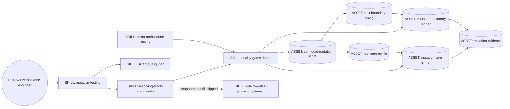
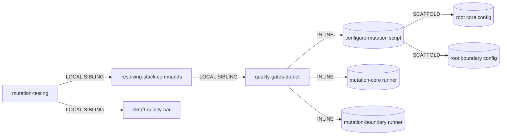

# .NET mutation gates and lean mutation skill -- Genesis handoff

## Step 1 -- intent, scope, cost stance

**Intent.** Make mutation testing mandatory through two durable, repository-root
Stryker.NET configurations: Domain plus Application at 100%, then API plus
Infrastructure at 80%. Each gate runs once in Stryker solution context and narrows the
mutated source files through its config's `mutate` globs. The same checked-in configs
are the local-debug and CI/CD interface; adapter scripts only scaffold, validate, run,
and capture evidence. Config creation delegates JSON schema and defaults to official
`dotnet stryker init` rather than rendering JSON in shell. The agent-facing mutation
skill keeps gate orchestration and survivor judgement; stack syntax, project discovery,
report capture, and fixed thresholds stay below the deterministic tool boundary.

**Standard .NET shape.** Automatic mapping recognizes:

```text
src/<Context>.Domain/
src/<Context>.Application/
src/<Context>.API/
src/<Context>.Infrastructure/
tests/<Context>.UnitTests/
tests/<Context>.IntegrationTests/
```

`UnitTests` covers Domain and Application. `IntegrationTests` enters through API and
covers Infrastructure. Solution context discovers all test projects and source-project
relationships. A non-standard BFF is not rejected and never guessed: callers provide
explicit core and boundary source globs when scaffolding. The two configs may target
different folders inside one monolithic BFF project while Stryker still receives the
whole solution.

**Execution boundary.** The shipped deterministic adapter remains .NET only. Frontend
JavaScript/TypeScript mutation remains an explicit capability of `mutation-testing`:
survivor classification and the core-before-boundary policy are shared, while runner
syntax, source mapping, report lifecycle, and evidence belong to a future
`quality-gates-javascript` adapter. Until that adapter exists, the stack resolver blocks
instead of translating .NET flags or running StrykerJS ad hoc. In particular, the future
adapter must prove that a fixed-path JSON report belongs to the current invocation before
parsing it. Mutation runner installation is not automated. Thresholds are fixed policy,
not runtime arguments. Existing historical plans and generated site output remain
unchanged.

**Dispatch description.** Use when a green test baseline must pass mandatory mutation
gates or a surviving mutant must be triaged before commit. Own survivor interpretation;
delegate stack commands, project discovery, thresholds, and evidence capture to the
matching quality-gates adapter. Stop for unsupported stacks rather than inventing a
runner.

**Invocation mode:** BOTH. `software-engineer` loads it explicitly in COMMIT; user
requests about mutation quality may discover it directly.

**Cost stance:** `balanced` (default). No cost cap.

## Step 2 -- component diagram



Solid boxes exist. `quality-gates-javascript` is a named future adapter, not implemented
by this .NET change. Work changes existing boundaries and contracts; it adds no shipped
primitive.

## Step 3 -- thread and execution sequence

Architectural pattern: **A9 SUPERVISED EXECUTION**. Mutation state is a fact that must
be true, so execution and verification cross S7 into scripts. B2 CONDITIONAL DISPATCH
selects automatic Clean Architecture discovery or explicit BFF mapping. B4 PLAN MEMENTO
and B8 ATTENTION ANCHOR are inherited from the active implementation plan and persisted
evidence; no child thread is added.

```mermaid
sequenceDiagram
    participant SE as software-engineer thread
    participant MT as mutation skill
    participant RSC as stack resolver
    participant CFG as root configs
    participant CORE as core runner
    participant STR as Stryker CLI
    participant BOUNDARY as boundary script
    participant EV as evidence store

    SE->>MT: green baseline, run mandatory mutation gates
    MT->>RSC: resolve mutation adapter
    alt supported .NET stack
      RSC-->>MT: .NET adapter and bundled scripts
      MT->>CFG: verify checked-in core and boundary configs
      MT->>CORE: run core config
      CORE->>STR: one solution run, Domain/Application globs, break at 100
      STR-->>CORE: aggregate native report and exit code
      CORE->>EV: stdout, exit, hash, manifest, native report
      CORE-->>MT: structured scope verdict
      Note over MT: boundary runs only after core passes
      MT->>BOUNDARY: run boundary config
      BOUNDARY->>STR: one solution run, API/Infrastructure globs, break at 80
      STR-->>BOUNDARY: aggregate native report and exit code
      BOUNDARY->>EV: stdout, exit, hash, manifest, native report
      BOUNDARY-->>MT: structured scope verdict
      MT-->>SE: pass, or survivor triage and scoped rerun
    else frontend JavaScript or TypeScript
      RSC-->>MT: unsupported_stack plus required adapter
      MT-->>SE: blocked; preserve frontend contract, invent no command
    end
```

Single writer per scope prefix. Core and boundary use distinct evidence prefixes.

## Step 3.1 -- tradeoff check

`pattern-tradeoffs.md` matrix 8, **R3 EXTRACT + depend** row, wins over R1 SPLIT.
Current mutation skill inlines stack commands already owned by `quality-gates-dotnet`.
Move those mechanics behind the existing adapter scripts while preserving one coherent
mutation workflow. Do not split triage from gate execution: they are consecutive states
of the same user intent, and another discovery signature would create dispatch
collision.

Execution-doctrine matrix 9 selects tool-delegated, lazy execution for Stryker runs and
report capture. LLM judgement remains only for classifying survivors as observable gaps
or genuine equivalent mutations. Deterministic rerun, not prose, confirms resolution.

## Step 3.2 -- cost check

| Module | Role class | Prefix | Output | Turns | Cost patterns |
| --- | --- | --- | --- | --- | --- |
| `mutation-testing` | implementer inherited from caller | S | S | low-medium | B13 stable prefix, B14 prompt thrift, S7 scripts |
| `resolving-stack-commands` | implementer inherited from caller | S | S | low | B13 |
| `quality-gates-dotnet` | implementer inherited from caller | S | S | low | B14; script owns verbose mechanics |
| core script | deterministic CPU, no model | none | structured S plus captured file | one tool call | S7 |
| boundary script | deterministic CPU, no model | none | structured S plus captured file | one tool call | S7 |

Cost-shape matrix 10, **Verbose persona / asset body -> B14 PROMPT THRIFT**, is the
primary row: moving commands and parsing recipes out of the mutation skill shrinks every
dispatch prefix without reducing deterministic behavior. No child model dispatch is
added.

Representative host-session ranges, inherited from the active Copilot model and billing
rather than bound by the skill:

| Workload | Input tokens attributable to mutation flow | Output tokens | Host turns | Added child premium requests |
| --- | --- | --- | --- | --- |
| S: standard shape, both gates pass | 1,500-3,000 | 100-400 | 2-4 | 0 |
| M: one scope fails, few survivors | 3,000-8,000 | 200-800 | 4-8 | 0 |
| L: several projects and survivors | 8,000-20,000 | 400-1,500 | 6-12 | 0 |

Billing unit is inherited Copilot premium-request accounting; scripts add no model
request. Exact active-model multiplier is intentionally not copied into this design
because the adapter requires live verification and it changes independently. Contract:
skill body stays below 500 output-oriented lines and does not introduce model switching,
timestamps, dynamic tool catalogues, or child dispatches.

## Step 3.5 -- composition decision



| Box | Mode | Rationale |
| --- | --- | --- |
| `mutation-testing` | LOCAL SIBLING primitive | Existing user-facing workflow; retains survivor judgement |
| `resolving-stack-commands` | LOCAL SIBLING | Existing stack router; prevents tool syntax in callers |
| `skraft-quality-bar` | LOCAL SIBLING | Existing sole policy source |
| `quality-gates-dotnet` | LOCAL SIBLING | Existing .NET adapter owns project and runner syntax |
| config scaffold and gate runners | INLINE assets in .NET adapter | Deterministic .NET-specific setup, validation, execution, and evidence capture |
| root Stryker configs | EXTERNAL repository assets | Version-controlled local and CI contract generated into consumer repositories |
| evidence artifacts | EXTERNAL audience output | Human/auditor-readable, normal prose or JSON; never caveman-compressed |

External modules required: none. No module-system adapter needed. Target:
`common-only`; the skill uses common module, lazy asset, terminal, and persistence
concepts. Bash and Stryker syntax remain inside the .NET adapter asset, not in the
harness-neutral mutation skill.

## Step 4 -- separation-of-concerns pass

- `mutation-testing` owns precondition, mandatory order, survivor meaning, and the
  kill-or-suppress decision.
- `skraft-quality-bar` alone authors 100% and 80%.
- `resolving-stack-commands` owns stack detection and unsupported-stack refusal.
- `quality-gates-dotnet` owns .NET project mapping, Stryker invocation, evidence paths,
  and script contracts.
- `clean-architecture-testing` owns canonical project placement and test-boundary
  meaning.
- Scaffold and runner scripts restate fixed thresholds because they must execute
  standalone; parity tests make those literals checked copies. Generated root configs
  are consumer-repository copies validated before each adapter-script run.
- No React commands or layout assumptions enter any module.

R3 fires on duplicated Stryker commands. R1 does not fire after extraction: mutation
execution plus survivor triage remains one workflow. R2/R4 do not fire. Consequential
execution and current reports cross S7 and are verified by exit code plus evidence
files.

## Step 5 -- compliance findings

| Finding | Severity | Action |
| --- | --- | --- |
| Existing scripts use test-project context and expand one logical gate into multiple runs | BLOCKER | Use Stryker solution context once per gate; scope source through root config `mutate` globs |
| Prior design generalized test-project context's one-source limit to all Stryker modes | BLOCKER | Correct the model: solution context discovers and mutates multiple testable source projects in one invocation |
| Skill-bundled scripts are not a natural CI/CD contract | BLOCKER | Scaffold two version-controlled root configs usable by local commands, GitHub Actions, and Azure DevOps |
| Boundary policy says 80%, current quality bar and script say 90% | BLOCKER | Change source of truth, checked literal, current docs, and parity expectations together |
| Standard auto-discovery could silently misclassify BFFs | HIGH | Auto-discover only canonical names; require explicit mapping for non-standard layouts |
| Existing skill embeds both .NET and frontend commands | HIGH | Remove tool syntax, but preserve JS/TS reporter and report-freshness distinctions as requirements for the named frontend adapter; unsupported frontend stops explicitly |
| Existing equivalent-mutant prose permits proceeding while runner still exits non-zero | HIGH | Require narrow supported suppression with rationale, then deterministic rerun |
| Hand-rendered JSON duplicates Stryker's configuration schema | HIGH | Use `dotnet stryker init` with CLI overrides; keep output path in runner/CI command |
| Stryker exits zero for a `NaN` score when every mutant is ignored | HIGH | Keep ignored mutants visible in JSON, require source-level suppression with rationale, and have adapter validation reject missing or mutant-free reports |
| Script assets need non-interactive help and structured stdout/stderr | HIGH | Preserve `--help`; emit one JSON verdict; write diagnostics to stderr and full runner output to evidence files |
| Canonical test-project names drift between singular and plural across skills | MEDIUM | Make `UnitTests` and `IntegrationTests` canonical; runner may recognize singular legacy suffixes without advertising them |

No unresolved BLOCKER after listed implementation tasks.

Canonical container check: skill name matches parent directory, description remains under
1,024 characters, body target remains under 500 lines and 5,000 tokens. Script contract
is non-interactive, has `--help`, emits structured stdout, and keeps diagnostics outside
stdout.

## Step 6 -- interface sketches

### `mutation-testing`

- **Type:** MODULE ENTRYPOINT / SKILL, existing.
- **Inputs:** green baseline; current repository; optional failed scope manifest.
- **Outputs:** two applicable scope exit verdicts; classified survivors; tests or narrow
  suppressions; deterministic rerun result.
- **Dependencies:** `skraft-quality-bar`, `resolving-stack-commands`, selected
  `quality-gates-<tech>` adapter.
- **Frontend continuity:** JS/TS survivor triage remains in scope; execution blocks until
  `quality-gates-javascript` owns runner-native configuration, source scopes, reporter
  syntax, current-run report proof, and evidence.
- **Does not own:** commands, thresholds, project layout discovery, evidence schema.

### `quality-gates-dotnet`

- **Type:** MODULE ENTRYPOINT / SKILL, existing stack adapter.
- **Inputs:** repo root, evidence directory, optional solution path and explicit BFF
  source globs.
- **Outputs:** root config scaffold, gate runner invocations, and evidence contract
  mapping.
- **Standard mapping:** `*.Domain`/`*.Application` source folders -> core config;
  `*.API`/`*.Infrastructure` source folders -> boundary config. Solution context owns
  test-project discovery.
- **BFF mapping:** explicit non-overlapping core and boundary source globs; no project
  layer names invented.

### config scaffold

- **Type:** executable INLINE asset, existing adapter.
- **Arguments:** `--root <dir>`, optional `--solution <sln|slnx>`, repeatable paired
  `--core-mutate <glob>` and `--boundary-mutate <glob>`, optional `--force`, `--help`.
- **Automatic mode:** discover exactly one solution and require canonical projects for
  every advertised layer.
- **Explicit mode:** use caller-provided source globs for a BFF/non-standard layout.
- **Output:** `stryker-config-core.json` and `stryker-config-boundary.json` at repository
  root, each created through `dotnet stryker init --config-file` with resolved options.
  Re-running is idempotent; differing existing files require `--force`.

### core and boundary runners

- **Type:** executable INLINE assets, existing.
- **Arguments:** `--root <dir>`, `--evidence <dir>`, optional `--config <json>`,
  `--help`; `--expected` explicitly refused.
- **Execution:** validate config policy, run `dotnet stryker --config-file` once from
  solution root, pass a unique output path, and fail on missing/mutant-free JSON report.
- **Evidence:** stdout/exit/hash, scope JSON manifest, one aggregate native report, one
  JSON verdict on stdout.
- **Exit:** 0 pass, 1 mutation/report failure, 2 usage/discovery error, 3 missing .NET or
  Stryker toolchain.

## Evals plan

### Content evals -- each runs with and without the skill

1. **Canonical solution:** request mandatory mutation validation for one context with
  four standard production projects and two standard test projects. Expected: scaffold
  two root configs; core then boundary; one solution-context invocation per gate;
  100/80 fixed; no threshold runtime argument.
2. **Monolithic BFF:** one production project, UnitTests and IntegrationTests. Expected:
  explicit core/boundary source globs in two configs; no invented layer projects and no
  silent skip.
3. **Equivalent survivor:** a 100% core run fails on an equivalent mutant. Expected:
   classify observability, apply only a narrowly supported suppression with rationale,
   rerun, and trust exit code; never waive the gate in prose.
4. **Frontend survivor:** a StrykerJS report names a surviving TypeScript conditional.
  Expected: use the same kill-or-prove-equivalent reasoning, preserve the distinction
  between StrykerJS and Stryker.NET reporter/report lifecycles, and return a structured
  unsupported-stack blocker until the frontend adapter exists; never substitute a raw
  `npx` command.

Quality delta sought: treatment uses two fixed adapter scripts and complete project
coverage; baseline is likely to issue one raw Stryker command, mutate only one project,
or judge a score in prose.

### Trigger evals -- 60/40 train/validation

| Split | Should trigger | Prompt |
| --- | --- | --- |
| train | yes | Run mandatory mutation checks before I commit this .NET feature |
| train | yes | Stryker reports a surviving boundary mutant; help kill it |
| train | yes | Prove these tests detect faults rather than only covering lines |
| train | yes | The core mutation gate failed at 99%; what happens next? |
| train | yes | Validate mutation quality in a Clean Architecture solution |
| train | yes | Triage equivalent mutants after a green baseline |
| train | yes | A TypeScript conditional survived StrykerJS; help me close the mutation gap |
| train | no | Decide whether this repository test belongs in unit or integration |
| train | no | Capture RED evidence for my next TDD cycle |
| train | no | Raise line coverage to 100% |
| train | no | Review dependency direction between Application and Infrastructure |
| train | no | Assemble the quality-gates evidence JSON from existing files |
| train | no | Add a React unit-test folder convention |
| validation | yes | Before merge, run both mutation scopes on my .NET BFF |
| validation | yes | Why did this comparison mutant survive my tests? |
| validation | yes | Confirm my new boundary test kills the reported mutant |
| validation | yes | Enforce Domain/Application and API/Infrastructure mutation bars |
| validation | no | Install the .NET SDK required by this solution |
| validation | no | Run ordinary unit tests after a refactor |
| validation | no | Choose FakeItEasy or NSubstitute for application tests |
| validation | no | Design a future JavaScript mutation adapter |

Validation gate: should-trigger activation rate at least 0.5; near-miss activation rate
below 0.5. Real paired execution is a separate measured eval run, not fabricated here.

## Per-spawn and artifact declarations

No child thread is introduced. PER-SPAWN DECLARATION TABLE, SPAWN_BRIEFS, and
RECEIPT_SCHEMAS: not applicable.

EXTERNAL_ARTIFACT_SPEC: script stdout is one compact JSON verdict; evidence manifests
are structured JSON; native reports remain unmodified; user-facing summary uses normal
prose. Full Stryker output stays on disk rather than entering model context.

## Todo order

1. Update fixed boundary bar from 90 to 80 and keep parity guard green.
2. Add failing script-contract tests for canonical solution discovery, root-config
  generation, BFF explicit globs, fixed thresholds, aggregate native reports, and
  failures.
3. Implement config scaffold and both solution-context runner contracts; make tests
  green.
4. Refactor `quality-gates-dotnet` G6 instructions around scripts and canonical layout.
5. Shrink `mutation-testing` to orchestration plus survivor triage while retaining the
  frontend JS/TS contract and its report-freshness requirement; name the missing adapter
  in `resolving-stack-commands`.
6. Align canonical .NET test-project names and current FR/EN references.
7. Run focused tests, full relevant test suite, docs validation, shell syntax checks, and
   static skill size/description checks.
8. Run one real-task dry run against a fixture with a fake Stryker executable; record
   before/after skill line and token counts.
9. Update the knowledge graph.

## HUMAN_RATIONALE -- never copy into a spawn brief

The critical defect is not the old boundary number. It is absence of a durable consumer
repository contract: skill-bundled commands cannot naturally power local debugging and
CI/CD, while the prior per-project expansion ignored Stryker.NET's distinct solution
context. The safe design gives Stryker the whole solution once per gate and constrains
only mutated source through checked-in root configs.

Moving config generation, canonical discovery, validation, output isolation, hashing,
and manifest assembly below S7 makes the agent skill materially smaller without
weakening behavior. The model keeps the task that needs judgement -- whether a survivor
changes observable behavior -- and loses tasks machines do better. BFF support follows
the same boundary model without pretending every codebase has four assemblies: explicit
source globs are safer than project-name heuristics. GitHub Actions and Azure DevOps call
the same root configs developers use locally, eliminating command drift.
