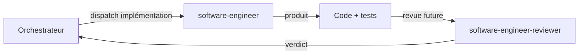

# Les agents `software-engineer` et `software-engineer-reviewer`

**Statut :** 📝 Partiel

Ce document est une **vue de contexte** du duo Engineer/Reviewer.
La description détaillée de l'agent implémenté et de ses skills est
centralisée dans :

- [`docs/agents/software-engineer.md`](./agents/software-engineer.md)

Le Reviewer n'est pas encore implémenté ; son backlog reste centralisé
dans :

- [`docs/roadmap.md`](./roadmap.md#reviewer)

---

## État actuel

| Composant | Statut | Référence |
|---|---|---|
| `software-engineer` | ✅ Implémenté | [`docs/agents/software-engineer.md`](./agents/software-engineer.md) |
| `software-engineer-reviewer` | 🚧 À venir | [`docs/roadmap.md#reviewer`](./roadmap.md#reviewer) |
| Hooks de gardiennage | 🚧 À venir | [`docs/roadmap.md#hooks`](./roadmap.md#hooks) |

---

## Workflow de haut niveau

---

## Références canoniques

- Agent implémenté : [`docs/agents/software-engineer.md`](./agents/software-engineer.md)
- Skills implémentés :
  - [`docs/skills/outside-in-tdd.md`](./skills/outside-in-tdd.md)
  - [`docs/skills/red-synthesize-green.md`](./skills/red-synthesize-green.md)
  - [`docs/skills/clean-architecture-testing.md`](./skills/clean-architecture-testing.md)
- Backlog non implémenté : [`docs/roadmap.md`](./roadmap.md)

---

## Règle de maintenance documentaire

Pour éviter les doublons :

- ce document reste **transverse** (contexte et navigation) ;
- la fiche [`docs/agents/software-engineer.md`](./agents/software-engineer.md)
  est la **source de vérité** pour le comportement et les skills de
  l'agent implémenté.
