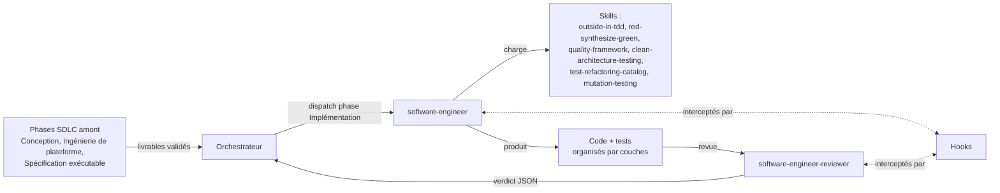
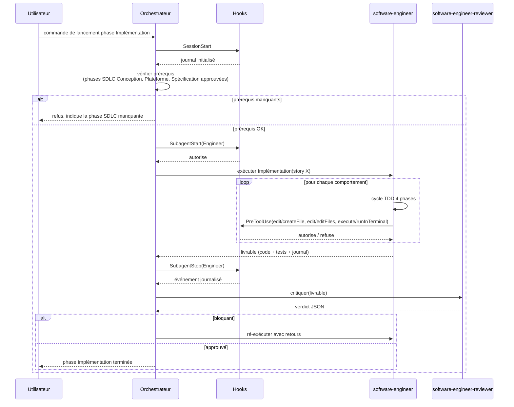
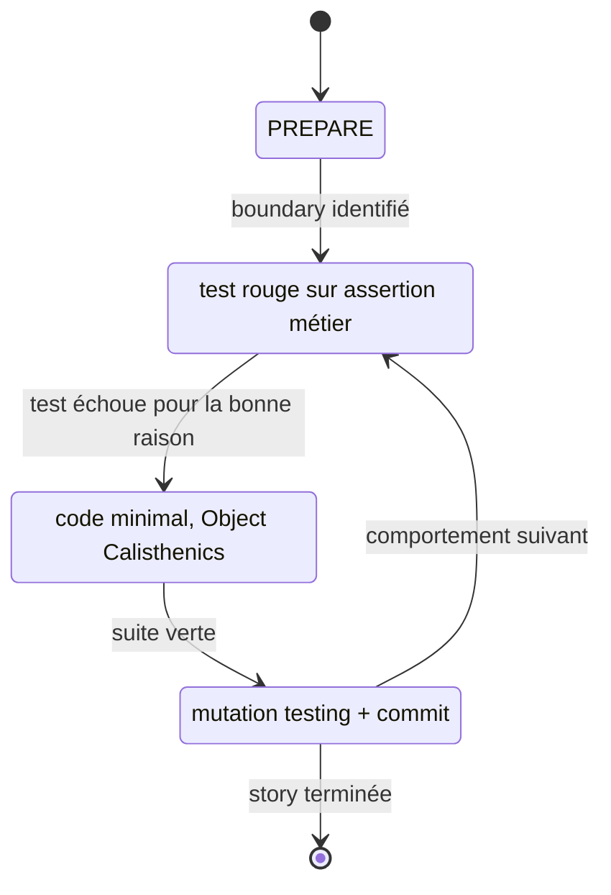
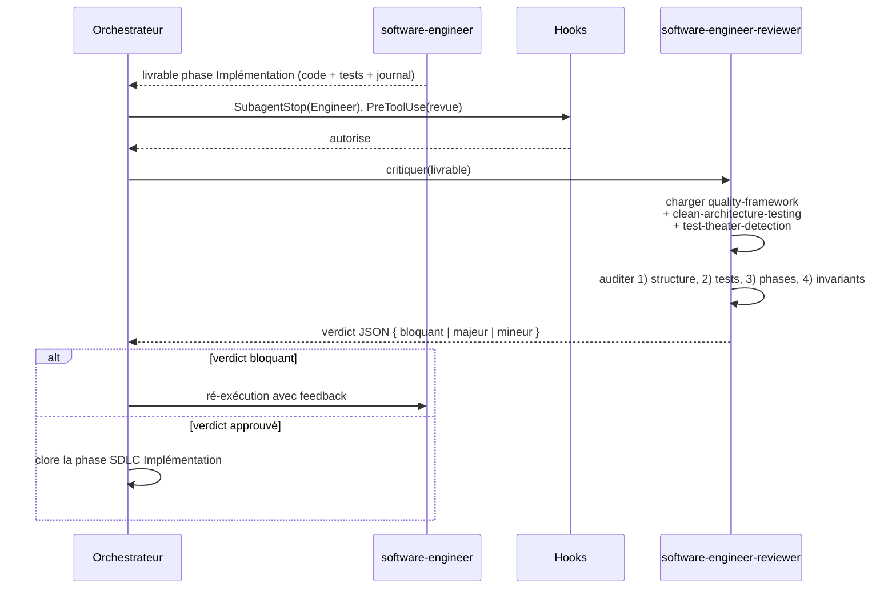
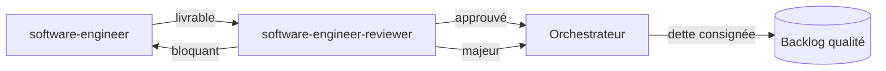

# Les agents `software-engineer` et `software-engineer-reviewer`

Ce document décrit en détail **l'agent d'implémentation** du plugin
skraft (`software-engineer`, défini dans
`plugins/agents/software-engineer.agent.md`) ainsi que son pendant de
relecture `software-engineer-reviewer` (**non encore implémenté**) :
comment ils sont déclenchés, ce qu'ils produisent, sous quelles
contraintes, et comment le Reviewer audite le travail. Le parti pris
est que *coder* est la dernière activité d'une chaîne SDLC longue : à
ce stade, tout est déjà décidé sauf le *comment* de la ligne de code.

Sauf précision, **Engineer** désigne le `software-engineer` et
**Reviewer** désigne le `software-engineer-reviewer`.

---

## 1. Vue d'ensemble



L'Engineer **n'invente ni les règles métier, ni l'architecture, ni les
tests d'acceptation**. Son entrée est un ensemble de livrables approuvés
par les phases SDLC précédentes :

| Phase SDLC amont | Livrable consommé par l'Engineer |
|---|---|
| Conception (architecture) | Architecture Clean (4 couches, règle de dépendance), interfaces de cas d'usage, ADR, éventuelles frontières CQRS |
| Ingénierie de plateforme | Plateforme prête, pipeline CI/CD, seuils de qualité configurés |
| Spécification exécutable | Tests d'acceptation Given-When-Then écrits mais *échouants* (rouges) |

L'Engineer réalise la phase SDLC d'**implémentation / codage** ; le
Reviewer réalise la phase SDLC de **revue de code**.

---

## 2. Qui déclenche l'Engineer ?

L'Engineer n'est **jamais déclenché par l'utilisateur directement sur
une idée** : il est déclenché par l'orchestrateur à l'entrée de la
phase SDLC d'implémentation, uniquement si toutes les conditions
d'entrée sont réunies.



### 2.1 Sources de déclenchement possibles

| Source | Condition | Effet |
|---|---|---|
| Commande explicite (`/…-deliver`) | L'utilisateur lance la phase Implémentation sur une story | L'orchestrateur valide les prérequis puis invoque l'Engineer |
| Enchaînement automatique en cycle SDLC complet | Les phases SDLC amont viennent d'être approuvées | L'orchestrateur invoque l'Engineer sans retour utilisateur |
| Re-exécution après rejet du Reviewer | Verdict `bloquant` rendu | L'orchestrateur ré-invoque l'Engineer avec le feedback |

### 2.2 Conditions d'entrée (prérequis durs)

L'orchestrateur **refuse de démarrer l'Engineer** si l'un de ces
éléments manque :

- architecture approuvée avec interfaces de frontière identifiées ;
- ADR présentes pour toute décision engageante (CQRS, dérogations) ;
- tests d'acceptation écrits par l'`acceptance-designer` et marqués
  comme *rouges* ;
- profil de rigueur sélectionné (`standard` ou `thorough`).

Ce gardiennage est implémenté côté orchestrateur **et** confirmé par un
hook `PreToolUse` qui inspecte le journal de phase SDLC.

### 2.3 Mode sub-agent — contrat d'interaction

L'Engineer tourne en **mode sub-agent** : pas de politesses, action
autonome, **aucune question** à l'utilisateur. Si un blocage survient,
il retourne un bloc JSON structuré au format GitHub Copilot :

```json
{
  "status": "blocked",
  "type": "clarification_needed | escalation_needed",
  "message": "Description du blocage",
  "context": {
    "questions_for_user": ["..."],
    "failing_test_path": "...",
    "approaches_attempted": ["..."]
  }
}
```

### 2.4 Exigence modèle

**Sonnet-class ou supérieur**. Le raisonnement multi-contraintes (Clean
Architecture + Object Calisthenics + Iron Rule + Mutation score) dépasse
les modèles low-tier (Haiku, Flash, mini) — ils sont explicitement **non
supportés**.

---

## 3. Ce que fait l'Engineer, étape par étape

L'Engineer applique le **cycle TDD outside-in à double boucle** (Freeman
& Pryce) décliné en **4 phases canoniques** — telles que définies dans
`software-engineer.agent.md` :



| Phase | Objectif | Règle non négociable |
|---|---|---|
| **PREPARE** | Identifier les boundaries d'entrée et les effets attendus à partir des AC. Cibler **une seule** scène comportementale. | Jamais de test double dans le cœur (domain + application) |
| **RED** | Écrire **un** test qui échoue sur une **assertion métier** (pas une erreur de compilation). | Stub juste ce qu'il faut pour compiler ; l'échec doit désigner le comportement manquant |
| **SYNTHESIZE-GREEN** | Écrire le minimum de code de production pour passer au vert. | Object Calisthenics appliqués ; **aucun refactor** pendant cette phase |
| **COMMIT & VERIFY** | Analyse statique, formatage, **mutation testing**, commit en conventional commits (`feat(<domain>): <behavior>`). | Tout test ne tuant aucun mutant est **supprimé** ; **pas de commit sur rouge** |

### 3.1 Skills chargés

Au démarrage (obligatoires, avant PREPARE) :

- [`outside-in-tdd`](../plugins/skills/outside-in-tdd/SKILL.md) — boucle double acceptance/unit ;
- [`red-synthesize-green`](../plugins/skills/red-synthesize-green/SKILL.md) — stratégie de passage au vert ;
- `quality-framework` — critères qualité globaux.

À la demande (trigger-based) :

| Skill | Déclencheur |
|---|---|
| `clean-architecture-testing` | Décider du niveau de test, placement des boundaries, politique de doubles |
| `test-refactoring-catalog` | Refacto de test (helpers, renommage, dédoublonnage) |
| `mutation-testing` | Entrée en phase COMMIT & VERIFY |

Si un skill manque : l'Engineer log `[SKILL MISSING] <name>` et continue.

### 3.2 Principes non négociables (tirés de l'agent)

1. **Clean Architecture stricte** : Domain → rien, Application → Domain, API/Infra → Application. Toute dépendance vers l'extérieur est un défaut fatal.
2. **Double-Loop TDD** : 1 test d'acceptation externe → N tests unitaires internes.
3. **Cycle 4 phases** : PREPARE → RED → SYNTHESIZE-GREEN → COMMIT. **Pas de commit sur rouge.**
4. **Iron Rule of Tests** : **jamais** modifier un test qui échoue pour le faire passer — on corrige l'implémentation. Après 3 tentatives infructueuses : revert au vert et escalade.
5. **No Test Theater** : un test doit tomber si le comportement change. Chaque test unitaire doit tuer un mutant unique. **Zéro mock** dans Domain/Application.
6. **Token Economy** : réponses concises, pas de docs ni fichiers non sollicités.

### 3.3 Mandats de design de tests

1. **Observable Behavioral Outcomes** — valider valeurs de retour, effets de bord sur ports, exceptions. Jamais de structure interne.
2. **Boundary-to-Boundary** — le Domain est exercé via l'Application (port d'entrée) et observé via les mocks de ports de sortie.
3. **Adapter Verification** — les adapters Infrastructure sont validés par de **vrais** tests d'intégration (mocker un adapter revient à tester le mock).
4. **Parametrize Variations** — les variantes d'un même comportement sont un seul `[Theory]` + `[InlineData]`, pas des méthodes dupliquées.

### 3.4 Anti-patterns rejetés (Testing Theater)

L'Engineer rejette et ne produit **jamais** :

1. **Tests tautologiques** (`Assert.NotNull(result)` seul, toujours vrai).
2. **Tests mock-dominés** — on teste le setup du mock, plus le comportement.
3. **Vérification circulaire** — la formule de prod copiée-collée dans le test.
4. **Implementation-Mirroring** — `mock.Verify(..., Times.Once)` sans assertion d'état.
5. **Fixture Theater** — le test passe parce que le setup crée l'état final attendu, pas le code de prod.

### 3.5 Journal d'exécution

À chaque cycle, l'Engineer imprime dans la console (**jamais** dans le
commit message) :

```markdown
### Cycle <N>: <Behavior>
**PREPARE**: Target boundary `<Class/Method>`.
**RED**: Wrote `<TestName>`. Failed because `<reason>`.
**GREEN**: Implemented `<Classes/Files>`. All green.
**COMMIT**: <Hash/Message>. Mutation score: 100%.
```

---

## 4. Ce que l'Engineer ne fait jamais

- Il ne change pas les **tests d'acceptation** ; s'ils doivent évoluer,
  l'`acceptance-designer` reprend la main (retour en phase SDLC
  Spécification exécutable).
- Il ne **prend pas** de décision d'architecture ; si l'architecture est
  inadéquate, il lève un blocage (JSON `escalation_needed`) et la
  phase SDLC Conception reprend la main.
- Il n'ajoute pas de dépendance externe sans **ADR**.
- Il ne **désactive, ne skippe, ne rend laxiste** aucun test pour
  passer. *« Un test modifié est pire qu'un test qui échoue. »*
- Il ne **commit pas** sur rouge.
- Il n'écrit pas hors du codebase applicatif : **ni CI/CD, ni IaC** sauf
  instruction explicite.
- Il ne prend pas de décisions d'architecture hors scope de la feature
  courante.

---

## 5. L'agent `software-engineer-reviewer` (à implémenter)



### 5.1 Principes directeurs

1. **Indépendance** — le Reviewer ne partage pas le contexte
   d'exécution de l'Engineer. Il relit à froid, à partir du diff, des
   tests, et du journal de cycle.
2. **Signal > Bruit** — pas de commentaire de style, de formatage, de
   préférence esthétique. Uniquement bugs, failles logiques, violations
   d'architecture, *test theater*.
3. **Charge de la preuve à l'Engineer** — si le Reviewer ne peut pas
   démontrer que le comportement est couvert, il rejette.
4. **Iron Rule symétrique** — un test modifié pour passer = rejet
   immédiat.
5. **Verdict actionnable** — pas de discussion ouverte, une sortie
   machine-readable.

### 5.2 Qui déclenche le Reviewer ?

Le Reviewer est **toujours déclenché par l'orchestrateur** immédiatement
après que l'Engineer a rendu son livrable. Il n'est pas optionnel :

| Profil de rigueur | Déclenchement du Reviewer |
|---|---|
| `standard` | Systématique, une passe |
| `thorough` | Systématique, double revue (reviewer modèle haut + reviewer modèle bas) |

Le Reviewer **n'a pas accès aux outils de modification** : il lit le
code, peut relancer la suite de tests et la mutation, mais **ne peut
pas éditer**. Cette contrainte est imposée par un hook `PreToolUse` qui
refuse toute écriture sollicitée par un Reviewer.

### 5.3 Ce qu'il audite précisément

| Dimension auditée | Critère bloquant |
|---|---|
| **Structure Clean Architecture** | Dépendance orientée vers l'extérieur (Domain → Infra, Application → API…) ⇒ bloquant |
| **Isolation du cœur** | Test double présent dans Domain ou Application ⇒ bloquant |
| **Discipline TDD 4 phases** | Commit sans RED préalable, ou journal de cycle incohérent ⇒ bloquant |
| **Iron Rule** | Un test modifié pour passer ⇒ bloquant |
| **Test Theater** | Tautologie, mock-dominated, circular verification, implementation-mirroring, fixture theater ⇒ bloquant |
| **Boundary testing** | Domain non exercé via l'Application, ou ports de sortie non observés ⇒ bloquant |
| **Adapter verification** | Adapter Infra testé avec des mocks au lieu d'intégration réelle ⇒ bloquant |
| **Paramétrisation** | Variantes d'un comportement dupliquées en N méthodes au lieu d'un `[Theory]` ⇒ majeur |
| **Object Calisthenics** | Violation (else, >1 indentation, primitifs non encapsulés) dans le cœur ⇒ majeur |
| **Mutation score** | < 100 % sur la logique métier ⇒ bloquant ; tests ne tuant aucun mutant non supprimés ⇒ bloquant |
| **Conventional commits** | Format `type(scope): description` non respecté ⇒ majeur |
| **Budget de tests** | > ~2× le nombre de comportements ⇒ majeur (suspicion de test theater) |

### 5.4 Format de verdict attendu

```json
{
  "status": "approved | changes_requested | rejected",
  "summary": "Synthèse en 1-2 phrases",
  "findings": [
    {
      "severity": "blocker | major | minor",
      "category": "architecture | tdd-discipline | test-theater | mutation | calisthenics | commit-format | boundary",
      "location": "path/to/file.cs:42",
      "evidence": "Extrait ou justification précise",
      "required_action": "Ce que l'Engineer doit faire"
    }
  ],
  "quality_gates": {
    "tests_green": true,
    "build_static_ok": true,
    "mutation_score_100_on_core": false,
    "no_mocks_in_core": true,
    "conventional_commits": true,
    "no_commit_on_red": true
  }
}
```

### 5.5 Règles de décision

- **Au moins un finding `blocker`** → `rejected` ou `changes_requested`.
- **Une quality gate à `false`** → jamais `approved`.
- **Aucun finding `blocker`/`major`** → `approved`.
- En cas de doute sur l'intention métier → `changes_requested` avec un
  bloc `question_for_author` (le Reviewer ne devine pas).

### 5.6 Verdicts et effet sur le flux

| Verdict | Effet |
|---|---|
| **`rejected` / `changes_requested` (bloquant)** | Phase SDLC Implémentation rouverte, l'Engineer ré-itère avec le feedback |
| **`approved` avec findings `major`** | Livrable accepté, un ticket de dette technique est ouvert |
| **`approved` avec findings `minor`** | Commentaire informatif, n'arrête rien |

### 5.7 Boucle de ré-exécution



La ré-exécution **réinjecte le feedback** dans le contexte de
l'Engineer : elle n'efface pas l'historique, elle reprend sur la phase
TDD pertinente (souvent un nouveau RED ciblé sur la faille détectée,
parfois SYNTHESIZE-GREEN ou COMMIT).

### 5.8 Ce que le Reviewer ne fait **jamais**

- Il ne modifie pas le code.
- Il ne réécrit pas les tests.
- Il ne commente ni le style ni le formatage.
- Il ne propose pas de refactos esthétiques.
- Il n'ouvre pas de discussion : son output est **actionnable** et
  **structuré**.

### 5.9 Skills pressentis (à créer lors de l'implémentation)

- `test-theater-detection` — catalogue d'anti-patterns avec exemples ;
- `architecture-dependency-audit` — analyse statique du sens des dépendances ;
- `mutation-evidence-review` — lecture critique des rapports de mutation testing ;
- Réutilisation de `quality-framework` et `clean-architecture-testing`
  (partagés avec l'Engineer).

### 5.10 Exigence modèle

Même contrainte que l'Engineer : **Sonnet-class ou supérieur**. Un
Reviewer à faible capacité de raisonnement laisse passer le *test
theater* subtil — ce qui vide le duo de sa valeur.

---

## 6. Rôle des hooks autour du duo

Les hooks sont le **dernier rempart**. Ils ne comprennent pas les
intentions, ils vérifient mécaniquement des invariants.

| Hook | Invariant gardé |
|---|---|
| **SessionStart** | Journal de phase SDLC initialisé, profil de rigueur chargé |
| **SubagentStart(Engineer)** | Prérequis de la phase SDLC Implémentation présents, sinon refus |
| **PreToolUse** (Engineer) | Refuse `edit/editFiles` sur un test d'acceptation (propriété de l'`acceptance-designer`) ; refuse `execute/runInTerminal` destructeur hors phase COMMIT |
| **PostToolUse** | Recalcule l'état de la phase TDD, met à jour le journal |
| **SubagentStop(Engineer)** | Vérifie la cohérence du journal avant de passer au Reviewer |
| **SubagentStart(Reviewer)** | **Refuse l'activation des outils de modification** pour le Reviewer |
| **PreToolUse** (Reviewer) | Refuse toute écriture, même sollicitée via `agent` |

Conséquence : même si l'Engineer tentait d'affaiblir un test ou de
commiter sans rouge préalable, le hook refuserait mécaniquement l'appel
d'outil correspondant.

---

## 7. Seuils de qualité à la sortie de l'Engineer

Le profil de rigueur fixe les seuils ; le Reviewer vérifie ; le hook
final clôt la phase SDLC seulement si tous sont verts.

| Couche | Seuil mutation (survivants) | Tolérance |
|---|---|---|
| `domain` | 0 | aucune |
| `application` | 0 | aucune |
| `api` | ≤ 10 % (≥ 90 % tués) | configurable par profil |
| `infrastructure` | ≤ 10 % (≥ 90 % tués) | configurable par profil |

Tests unitaires : **100 % verts**. Tests d'acceptation : **100 %
verts**. Build + analyse statique : **OK**. Coverage : **indicateur**
seulement, jamais une quality gate à elle seule.

La checklist que l'Engineer imprime en fin de phase — et que le
Reviewer re-vérifie — est la suivante :

- [ ] Tests d'acceptation et unitaires actifs au vert
- [ ] Build + analyse statique OK
- [ ] 100 % mutation score sur la logique métier prouvé
- [ ] Aucun mock utilisé dans Domain/Application
- [ ] Code committé en conventional commits

---

## 8. Interaction entre les deux agents — synthèse

1. L'orchestrateur (ou un utilisateur via `/…-deliver`) délègue une
   user story à l'Engineer après validation des prérequis des phases
   SDLC amont.
2. L'Engineer exécute son cycle 4-phases jusqu'à satisfaction des
   quality gates, imprime son journal d'exécution.
3. Le handoff vers le Reviewer transmet :
   - le diff ;
   - le journal d'exécution (cycles `PREPARE/RED/GREEN/COMMIT`) ;
   - la checklist des quality gates ;
   - les rapports de mutation testing.
4. Le Reviewer produit son verdict JSON.
5. Si `changes_requested`/`rejected`, le verdict revient à l'Engineer
   qui reprend au cycle utile.
6. Une fois `approved`, la phase SDLC Implémentation est close et
   l'intégration est débloquée.

---

## 9. Pourquoi ce duo ?

- **Pression de production** : l'Engineer est biaisé vers « faire passer
  le test ». Sans Reviewer, il peut glisser vers du *test theater*
  subtil.
- **Pression de qualité** : le Reviewer n'a aucune incitation à finir
  vite — sa métrique est la **détection**, pas la livraison.
- **Traçabilité** : le JSON du Reviewer devient une archive auditable du
  raisonnement qualité appliqué à chaque changement.

---

## 10. Résumé en une phrase

> **L'`software-engineer` est un exécutant discipliné** : il reçoit une
> architecture décidée, des tests d'acceptation rouges, un profil de
> rigueur, et produit du code qui passe tous les gates ; le
> **`software-engineer-reviewer`** est son pair adversarial, déclenché
> systématiquement, qui ne rend qu'un verdict ; les **hooks** rendent
> les invariants mécaniquement infranchissables.
