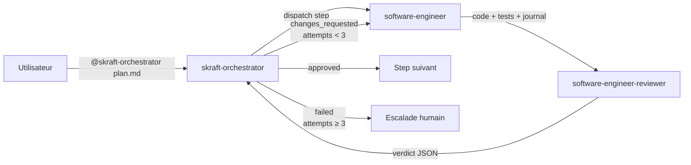

# Les agents `skraft-orchestrator`, `software-engineer` et `software-engineer-reviewer`

**Statut :** ✅ Complet

Ce document est une **vue de contexte** du trio Orchestrator/Engineer/Reviewer.
La description détaillée de chaque agent est centralisée dans :

- [`docs/agents/skraft-orchestrator.md`](./agents/skraft-orchestrator.md)
- [`docs/agents/software-engineer.md`](./agents/software-engineer.md)
- [`docs/agents/software-engineer-reviewer.md`](./agents/software-engineer-reviewer.md)

---

## État actuel

| Composant | Statut | Référence |
|---|---|---|
| `skraft-orchestrator` | ✅ Implémenté | [`docs/agents/skraft-orchestrator.md`](./agents/skraft-orchestrator.md) |
| `software-engineer` | ✅ Implémenté (subagent interne) | [`docs/agents/software-engineer.md`](./agents/software-engineer.md) |
| `software-engineer-reviewer` | ✅ Implémenté (subagent interne) | [`docs/agents/software-engineer-reviewer.md`](./agents/software-engineer-reviewer.md) |
| Hooks de gardiennage | 🚧 À venir | [`docs/roadmap.md#hooks`](./roadmap.md#hooks) |

---

## Workflow de haut niveau

**Règle d'accès :** Les agents `software-engineer` et `software-engineer-reviewer`
sont des sous-agents internes. Ils ne sont JAMAIS déclenchés directement par
l'utilisateur. Seul `skraft-orchestrator` les dispatche.

---

## Références canoniques

- Orchestrateur : [`docs/agents/skraft-orchestrator.md`](./agents/skraft-orchestrator.md)
- Agent Engineer : [`docs/agents/software-engineer.md`](./agents/software-engineer.md)
- Agent Reviewer : [`docs/agents/software-engineer-reviewer.md`](./agents/software-engineer-reviewer.md)
- Skills implémentés :
  - [`docs/skills/outside-in-tdd.md`](./skills/outside-in-tdd.md)
  - [`docs/skills/red-synthesize-green.md`](./skills/red-synthesize-green.md)
  - [`docs/skills/clean-architecture-testing.md`](./skills/clean-architecture-testing.md)
  - [`docs/skills/craft-discipline.md`](./skills/craft-discipline.md)
  - [`docs/skills/mutation-testing.md`](./skills/mutation-testing.md)
  - [`docs/skills/test-refactoring-catalog.md`](./skills/test-refactoring-catalog.md)
- Backlog non implémenté : [`docs/roadmap.md`](./roadmap.md)

---

## Règle de maintenance documentaire

Pour éviter les doublons :

- ce document reste **transverse** (contexte et navigation) ;
- chaque fiche agent (`docs/agents/<name>.md`) est la **source de vérité**
  pour le comportement et les skills de l'agent.
