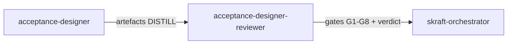

# Agent `acceptance-designer-reviewer`

**Statut :** ✅ Implémenté
**Source :** [`plugins/agents/acceptance-designer-reviewer.agent.md`](../../plugins/agents/acceptance-designer-reviewer.agent.md)
**Phase SDLC :** DISTILL

## Mission

Auditer les artefacts DISTILL (feature files, test plan, impl plan) pour valider couverture AC, alignement métier, testabilité et respect des boundaries.

## Quand l'utiliser

- Après `acceptance-designer`.
- En audit de scénarios Gherkin existants.

## Schéma de déclenchement

## Skill chargé

- [`acceptance-review-criteria`](../../plugins/skills/acceptance-review-criteria/SKILL.md)

## Lenses de revue

- Coverage (bijection AC <-> scénarios)
- Business alignment (langage métier, zéro détail technique)
- Testability (implémentabilité et séquencement)
- Boundary enforcement (entrée via use case Application)

## Gates (G1-G8)

- **G1 (BLOCKER)** : bijection AC ↔ scénarios (pas d'AC orpheline, pas de scénario orphelin).
- **G2 (HIGH)** : représentation des edge cases et cas limites métier.
- **G3 (HIGH)** : vocabulaire strictement métier dans les scénarios.
- **G4 (BLOCKER)** : absence totale de jargon technique dans Given/When/Then.
- **G5 (HIGH)** : étapes non ambiguës et implémentables sans clarification.
- **G6 (HIGH)** : complétude du plan d'implémentation (bijection scénarios ↔ impl-plan).
- **G7 (BLOCKER)** : conformité des boundaries (entrée par use case Application).
- **G8 (HIGH)** : couverture walking skeleton explicite pour les flux majeurs.

Voir les critères détaillés dans la skill : [`acceptance-review-criteria`](../../plugins/skills/acceptance-review-criteria/SKILL.md).

## Entrées / sorties

- Entrées principales :
  - `.skraft/sdlc/distill/{feature}.feature`
  - `.skraft/sdlc/distill/test-plan-{story}.md`
  - `.skraft/sdlc/distill/impl-plan-{story}.md`
- Sortie : verdict structuré avec findings par gate (G1-G8).

## Invariants

1. Lecture seule.
2. Application des 4 lenses en fan-out.
3. Toute gate BLOCKER force un rejet.
