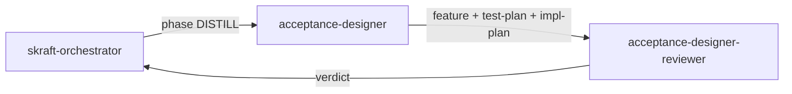

# Agent `acceptance-designer`

**Statut :** ✅ Implémenté
**Source :** [`plugins/agents/acceptance-designer.agent.md`](../../plugins/agents/acceptance-designer.agent.md)
**Phase SDLC :** DISTILL

## Mission

Transformer stories et décisions de design en scénarios BDD exécutables, plan de test et plan d'implémentation outside-in.

## Quand l'utiliser

- Après validation DESIGN.
- Avant toute écriture de code.

## Schéma de déclenchement

## Skills chargés

- [`bdd-methodology`](../../plugins/skills/bdd-methodology/SKILL.md)
- [`test-design-mandates`](../../plugins/skills/test-design-mandates/SKILL.md)

## Entrées / sorties

- Entrées principales :
  - `.skraft/sdlc/discuss/stories-{milestone}.md`
  - `.skraft/sdlc/discuss/ac-draft-{story}.md`
- Entrées recommandées : contracts/event models/ADR DESIGN.
- Sorties :
  - `.skraft/sdlc/distill/{feature}.feature`
  - `.skraft/sdlc/distill/test-plan-{story}.md`
  - `.skraft/sdlc/distill/impl-plan-{story}.md`

## Invariants

1. Ne jamais implémenter tests ni code.
2. Ne jamais corriger le design en direct.
3. Ne jamais raffiner les stories en dehors de DISCUSS.
4. Stop immédiat en cas de contradiction DISCUSS vs DESIGN.
