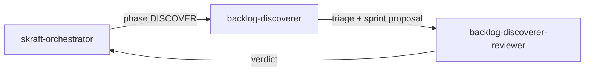

# Agent `backlog-discoverer`

**Statut :** ✅ Implémenté
**Source :** [`plugins/agents/backlog-discoverer.agent.md`](../../plugins/agents/backlog-discoverer.agent.md)
**Phase SDLC :** DISCOVER

## Mission

Découvrir, trier et prioriser les issues GitHub avant DISCUSS.
L'agent produit un rapport de triage et une proposition de sprint sans créer de nouvelles issues.

## Quand l'utiliser

- Démarrage de pipeline SDLC.
- Demande de triage backlog (`discover backlog`, `triage issues`, `what should I work on`).

## Schéma de déclenchement

## Skills chargés

- [`github-search-protocol`](../../plugins/skills/github-search-protocol/SKILL.md)
- [`issue-triage`](../../plugins/skills/issue-triage/SKILL.md)

## Entrées / sorties

- Entrées principales : issues GitHub ouvertes, milestones, historique git (mode artifact-driven).
- Sorties :
  - `.skraft/sdlc/discover/triage-{YYYY-MM-DD}.md`
  - `.skraft/sdlc/discover/sprint-proposal.md`

## Invariants

1. Ne jamais créer d'issue.
2. Ne jamais raffiner en user stories (travail DISCUSS).
3. Toujours faire un check de doublons.
4. Limiter le run à 20 issues triées pour préserver la qualité.
