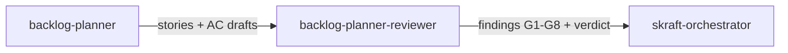

# Agent `backlog-planner-reviewer`

**Statut :** ✅ Implémenté
**Source :** [`plugins/agents/backlog-planner-reviewer.agent.md`](../../plugins/agents/backlog-planner-reviewer.agent.md)
**Phase SDLC :** DISCUSS

## Mission

Revoir les stories, drafts d'acceptance criteria et plan de sprint pour valider la qualité DISCUSS.

## Quand l'utiliser

- Après `backlog-planner`.
- En audit d'artefacts DISCUSS existants.

## Schéma de déclenchement

## Skill chargé

- [`planning-review-criteria`](../../plugins/skills/planning-review-criteria/SKILL.md)

## Lenses de revue

- INVEST + indépendance sprint
- Qualité des AC (complétude et non-ambiguïté)
- Cohérence planning (scope, DAG de dépendances)
- Conformité DoR + antipatterns

## Entrées / sorties

- Entrées principales :
  - `.skraft/sdlc/discuss/stories-{milestone}.md`
  - `.skraft/sdlc/discuss/ac-draft-{story}.md`
- Sortie : verdict structuré avec findings par gate (G1-G8).

## Invariants

1. Lecture seule.
2. Fan-out des lenses puis synthèse.
3. Toute gate BLOCKER force un rejet.
