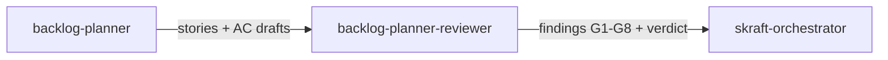

# Agent `backlog-planner-reviewer`

**Statut :** ✅ Implémenté
**Source :** [`plugins/agents/backlog-planner-reviewer.agent.md`](../../plugins/agents/backlog-planner-reviewer.agent.md)
**Phase SDLC :** DISCUSS

## Mission

Revoir les stories, drafts d'acceptance criteria et plan de sprint pour valider la qualité DISCUSS.

## Quand l'utiliser

- Après `backlog-planner`.
- En audit d'artefacts DISCUSS existants.

## Schéma de déclenchement

## Skill chargé

- [`planning-review-criteria`](../../plugins/skills/planning-review-criteria/SKILL.md)

## Lenses de revue

- INVEST + indépendance sprint
- Qualité des AC (complétude et non-ambiguïté)
- Cohérence planning (scope, DAG de dépendances)
- Conformité DoR + antipatterns

## Gates (G1-G8)

- **G1 (HIGH)** : conformité INVEST complète pour chaque story.
- **G2 (HIGH)** : stories indépendantes et graphe de dépendances cohérent.
- **G3 (HIGH)** : AC complètes (format métier, sans prescription d'implémentation).
- **G4 (BLOCKER)** : AC non ambiguës (une seule interprétation métier possible).
- **G5 (HIGH)** : cohérence du scope avec le milestone/sprint.
- **G6 (BLOCKER)** : absence de cycle dans le DAG de dépendances.
- **G7 (BLOCKER)** : conformité DoR (8/8 items) pour chaque story.
- **G8 (BLOCKER/HIGH)** : absence d'antipatterns critiques (BLOCKER) et majeurs (HIGH).

Voir les critères détaillés dans la skill : [`planning-review-criteria`](../../plugins/skills/planning-review-criteria/SKILL.md).

## Entrées / sorties

- Entrées principales :
  - `.skraft/sdlc/discuss/stories-{milestone}.md`
  - `.skraft/sdlc/discuss/ac-draft-{story}.md`
- Sortie : verdict structuré avec findings par gate (G1-G8).

## Invariants

1. Lecture seule.
2. Fan-out des lenses puis synthèse.
3. Toute gate BLOCKER force un rejet.
