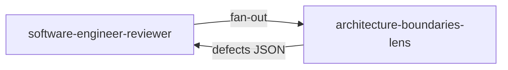

# Lens `architecture-boundaries-lens`

**Statut :** ✅ Implémenté
**Source :** [`plugins/agents/reviewer-lenses/architecture-boundaries-lens.agent.md`](../../../plugins/agents/reviewer-lenses/architecture-boundaries-lens.agent.md)
**Consommé par :** [`software-engineer-reviewer`](../software-engineer-reviewer.md)

## Mission

Vérifier les invariants structurels Clean Architecture et Object Calisthenics sur le code.

## Schéma de déclenchement

## Gates couvertes

- G4: pas de mocks Domain/Application
- G5: dépendances orientées vers l'intérieur
- G10: respect Object Calisthenics sur Domain

## Entrées / sorties

- Entrées: code de production (et inspection des tests pour G4 selon la spec du lens).
- Sortie: JSON `lens=architecture-boundaries` avec defects par gate.

## Invariants

1. Lecture seule.
2. Aucune proposition de fix dans le verdict.
3. Violations de dépendance = blocker.
