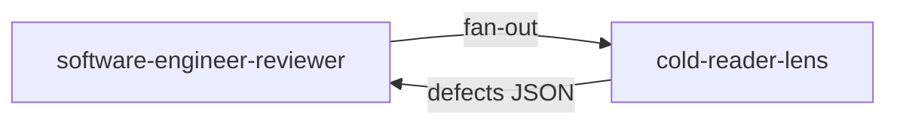

# Lens `cold-reader-lens`

**Statut :** ✅ Implémenté
**Source :** [`plugins/agents/reviewer-lenses/cold-reader-lens.agent.md`](../../../plugins/agents/reviewer-lenses/cold-reader-lens.agent.md)
**Consommé par :** [`software-engineer-reviewer`](../software-engineer-reviewer.md)

## Mission

Lire code et tests sans contexte de production pour évaluer clarté métier, nommage et intention.

## Schéma de déclenchement

## Gate couverte

- G11: langage métier dans les tests et lisibilité des intentions

## Entrées / sorties

- Entrées: code + tests uniquement (pas de journal, pas de checklist).
- Sortie: JSON `lens=cold-reader` avec defects de clarté.

## Invariants

1. Lecture seule.
2. Évalue la clarté, pas la correction fonctionnelle.
3. Sévérité maximale: `medium`.
