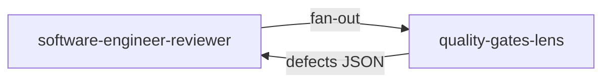

# Lens `quality-gates-lens`

**Statut :** ✅ Implémenté
**Source :** [`plugins/agents/reviewer-lenses/quality-gates-lens.agent.md`](../../../plugins/agents/reviewer-lenses/quality-gates-lens.agent.md)
**Consommé par :** [`software-engineer-reviewer`](../software-engineer-reviewer.md)

## Mission

Vérifier les gates factuelles basées sur preuves: tests, build, mutation score, commit conventionnel.

## Schéma de déclenchement

## Gates couvertes

- G1: acceptance tests green
- G2: unit tests green
- G3: build green
- G6: mutation score 100%
- G8: conventional commit

## Entrées / sorties

- Entrées: code, tests, journal TDD, checklist engineer.
- Sortie: JSON `lens=quality-gates` avec defects par gate.

## Invariants

1. Lecture seule.
2. Missing evidence = défaut, jamais un pass implicite.
3. Vérification strictement factuelle.
