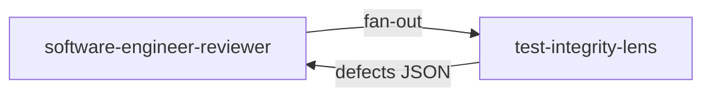

# Lens `test-integrity-lens`

**Statut :** ✅ Implémenté
**Source :** [`plugins/agents/reviewer-lenses/test-integrity-lens.agent.md`](../../../plugins/agents/reviewer-lenses/test-integrity-lens.agent.md)
**Consommé par :** [`software-engineer-reviewer`](../software-engineer-reviewer.md)

## Mission

Détecter le test theater et les violations de l'Iron Rule dans les tests.

## Schéma de déclenchement

## Gates couvertes

- G7: absence de test theater
- G9: respect de l'Iron Rule

## Entrées / sorties

- Entrées: tests + code de production.
- Sortie: JSON `lens=test-integrity` avec defects nommés par antipattern.

## Invariants

1. Lecture seule.
2. Chaque finding doit nommer l'antipattern.
3. Violations G7/G9 classées blocker.
