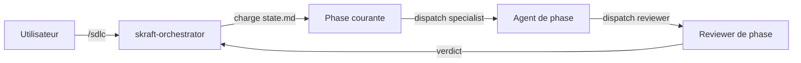

# Agent `skraft-orchestrator`

**Statut :** ✅ Implémenté
**Source :** [`plugins/agents/skraft-orchestrator.agent.md`](../../plugins/agents/skraft-orchestrator.agent.md)

---

## Mission

Orchestrer la pipeline SDLC complète `DISCOVER → DISCUSS → DESIGN → DISTILL → DELIVER`.
L'agent lit et maintient l'état persistant (`.skraft/sdlc/state.md`),
dispatche le spécialiste de phase puis son reviewer, applique la boucle
de retry et gère l'escalade.

**Point d'entrée unique** : `/sdlc`.

---

## Quand est-il déclenché ?

- Quand l'utilisateur lance `/sdlc`.
- Quand une pipeline existante doit reprendre depuis son dernier état.

## Schéma de déclenchement

---

## Genesis Patterns

| Pattern | Rôle dans l'orchestrateur |
|---------|---------------------------|
| A5 PIPELINE | Topology SDLC séquentielle en 5 phases |
| A4 STAFFED PLAN | Le plan `.md` est l'artifact vivant, mis à jour in-place |
| B4 PLAN MEMENTO | Re-lecture du plan avant chaque dispatch |
| B2 CONDITIONAL DISPATCH | Routing selon verdict (approved/retry/escalade) |
| S4 VALIDATION DECORATOR | Le reviewer est le gate obligatoire |
| B8 ATTENTION ANCHOR | Checklist anti-drift avant chaque action |

---

## Table de dispatch SDLC

| Phase | Spécialiste | Reviewer | Artefacts attendus |
|---|---|---|---|
| DISCOVER | `backlog-discoverer` | `backlog-discoverer-reviewer` | `.skraft/sdlc/discover/triage-*.md`, `sprint-proposal.md` |
| DISCUSS | `backlog-planner` | `backlog-planner-reviewer` | `.skraft/sdlc/discuss/stories-*.md` |
| DESIGN | `solution-architect` | `solution-architect-reviewer` | `.skraft/sdlc/design/adr-*.md`, `contracts-*.md` |
| DISTILL | `acceptance-designer` | `acceptance-designer-reviewer` | `.skraft/sdlc/distill/*.feature`, `impl-plan-*.md` |
| DELIVER | `software-engineer` | `software-engineer-reviewer` | Code commité + tests passants |

---

## Comportement de retry

| Verdict | Tentatives < 3 | Tentatives ≥ 3 |
|---------|----------------|----------------|
| `approved` | Avance à la phase suivante | — |
| `changes_requested` | Re-dispatche Engineer avec findings | Escalade + STOP |
| `rejected` | Re-dispatche Engineer avec findings | Escalade + STOP |

---

## Invariants

1. Ne jamais produire le contenu métier à la place des spécialistes.
2. Ne jamais skipper le reviewer de phase.
3. Recharger `state.md` avant chaque dispatch.
4. Exécution séquentielle (pas de parallélisme de phase).
5. Stop immédiat sur escalade ou `rejected`.

---

## Voir aussi

- Document transverse : [`software-engineer-and-reviewer.md`](./software-engineer-and-reviewer.md)
- Engineer : [`docs/agents/software-engineer.md`](./software-engineer.md)
- Reviewer : [`docs/agents/software-engineer-reviewer.md`](./software-engineer-reviewer.md)
