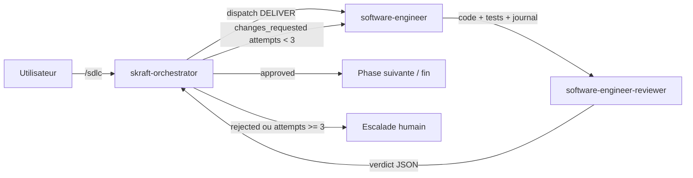

# Les agents `skraft-orchestrator`, `software-engineer` et `software-engineer-reviewer`

**Statut :** ✅ Complet

Ce document est une **vue transverse** centrée sur la phase DELIVER:
- qui déclenche quoi,
- dans quel ordre,
- et comment le verdict boucle sur l'exécution.

La description détaillée de chaque agent est centralisée dans :

- [`skraft-orchestrator`](./skraft-orchestrator.md)
- [`software-engineer`](./software-engineer.md)
- [`software-engineer-reviewer`](./software-engineer-reviewer.md)

---

## État actuel

| Composant | Statut | Référence |
|---|---|---|
| `skraft-orchestrator` | ✅ Implémenté | [`skraft-orchestrator`](./skraft-orchestrator.md) |
| `software-engineer` | ✅ Implémenté (subagent interne) | [`software-engineer`](./software-engineer.md) |
| `software-engineer-reviewer` | ✅ Implémenté (subagent interne) | [`software-engineer-reviewer`](./software-engineer-reviewer.md) |
| Hooks de gardiennage | 🚧 À venir | [`roadmap#hooks`](../roadmap.md#hooks) |

---

## Schéma de déclenchement

**Règle d'accès :** `software-engineer` et `software-engineer-reviewer`
restent des sous-agents internes. Seul `skraft-orchestrator` les dispatche.

---

## Références canoniques

- Orchestrateur : [`skraft-orchestrator`](./skraft-orchestrator.md)
- Agent Engineer : [`software-engineer`](./software-engineer.md)
- Agent Reviewer : [`software-engineer-reviewer`](./software-engineer-reviewer.md)
- Skills implémentés :
  - [`outside-in-tdd`](../skills/outside-in-tdd.md)
  - [`red-synthesize-green`](../skills/red-synthesize-green.md)
  - [`clean-architecture-testing`](../skills/clean-architecture-testing.md)
  - [`craft-discipline`](../skills/craft-discipline.md)
  - [`mutation-testing/SKILL.md`](../../plugins/skills/mutation-testing/SKILL.md)
  - [`test-refactoring-catalog/SKILL.md`](../../plugins/skills/test-refactoring-catalog/SKILL.md)
- Backlog restant (hooks de gardiennage) : [`roadmap`](../roadmap.md)

---

## Règle de maintenance documentaire

Pour éviter les doublons :

- cette page reste **transverse** (contexte, orchestration, navigation) ;
- chaque fiche agent (`docs/agents/<name>.md`) reste la **source de vérité**
  pour le comportement opérationnel détaillé.
