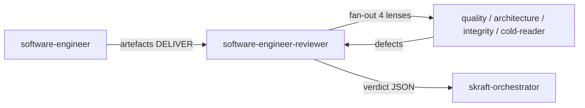

# Agent `software-engineer-reviewer`

**Status:** ✅ Implemented
**Source:** [`plugins/agents/software-engineer-reviewer.agent.md`](../../plugins/agents/software-engineer-reviewer.agent.md)

> This page is the **canonical reference** for the
> `software-engineer-reviewer` agent.

---

## Mission

Audit the `software-engineer`'s artifacts (code, tests, TDD journal,
checklist) adversarially, without modifying code. Render a structured
JSON verdict (`approved` / `changes_requested` / `rejected`).

## Schéma de déclenchement

---

## Architecture — Genesis A7

The reviewer uses the **A7 ADVERSARIAL REVIEW** pattern:
a fan-out (B1) of 4 independent lenses into a weighted synthesis.

Each lens runs in a **fresh context** (C3 THREAD SPAWN) to prevent
cross-contamination. The cold-reader receives zero producer context.

### Lenses

| Lens | Gates | Input |
|------|-------|-------|
| quality-gates | G1, G2, G3, G6, G8 | Code + tests + journal + checklist |
| architecture-boundaries | G4, G5, G10 | Code only |
| test-integrity | G7, G9 | Tests + code |
| cold-reader | G11 | Code + tests (NO producer context) |

### Quality Gates

| Gate | Verifies | Severity on failure |
|------|----------|---------------------|
| G1 | Acceptance test passes | blocker |
| G2 | Unit tests pass | blocker |
| G3 | Build passes | blocker |
| G4 | No mock in Domain/Application | blocker |
| G5 | Clean Architecture inward | blocker |
| G6 | Mutation score 100% | high |
| G7 | No test theater | blocker |
| G8 | Conventional commit | low |
| G9 | Iron Rule respected | blocker |
| G10 | Object Calisthenics (Domain) | medium |
| G11 | Business language | medium |

---

## Constraints

- **Read-only** — never modifies code.
- **Does not propose fixes** — reports findings only.
- **Mandatory dissent examination** — if 3/4 lenses pass and 1 fails,
  dissent is examined before any override.
- **Model**: Sonnet-class or above.

---

## Verdict

JSON format: `status`, `lens_results[]`, `dissent_analysis`, `summary`.

Severity matrix:
- ≥1 blocker → `rejected`
- ≥1 high → `changes_requested`
- medium only → `changes_requested`
- low only → `approved`

---

## Design Spec

[`docs/superpowers/specs/2026-05-07-reviewer-agent-genesis-a7-design.md`](../superpowers/specs/2026-05-07-reviewer-agent-genesis-a7-design.md)

---

## See Also

- Cross-cutting view: [`software-engineer-and-reviewer.md`](./software-engineer-and-reviewer.md)
- Engineer agent: [`docs/agents/software-engineer.md`](./software-engineer.md)
- Craft discipline skill: [`docs/skills/craft-discipline.md`](../skills/craft-discipline.md)
