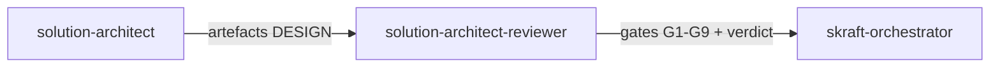

# Agent `solution-architect-reviewer`

**Statut :** ✅ Implémenté
**Source :** [`plugins/agents/solution-architect-reviewer.agent.md`](../../plugins/agents/solution-architect-reviewer.agent.md)
**Phase SDLC :** DESIGN

## Mission

Auditer les artefacts DESIGN (ADR, diagrammes, contrats) pour détecter les violations DDD/Clean Architecture et les incohérences de décision.

## Quand l'utiliser

- Après `solution-architect`.
- En audit de design existant.

## Schéma de déclenchement

## Skill chargé

- [`architecture-review-criteria`](../../plugins/skills/architecture-review-criteria/SKILL.md)

## Lenses de revue

- Cohérence inter-artefacts (ADR vs diagrammes vs contrats)
- Conformité architecture (règle de dépendance, interfaces, context map)
- Fitness produit (traçabilité story -> commandes/events, YAGNI)

## Entrées / sorties

- Entrées principales :
  - `.skraft/sdlc/design/adr-*.md`
  - `.skraft/sdlc/design/diagrams-{story}.md`
  - `.skraft/sdlc/design/contracts-{story}.md`
- Sortie : verdict structuré avec findings par gate (G1-G9).

## Invariants

1. Lecture seule.
2. Revue evidence-based (artefact + section + gate).
3. Toute violation BLOCKER force un rejet.
