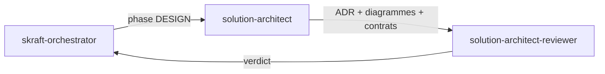

# Agent `solution-architect`

**Statut :** ✅ Implémenté
**Source :** [`plugins/agents/solution-architect.agent.md`](../../plugins/agents/solution-architect.agent.md)
**Phase SDLC :** DESIGN

## Mission

Transformer les stories DISCUSS en artefacts d'architecture exploitables (event model, context map, ADR, diagrammes, contrats).

## Quand l'utiliser

- Après validation de DISCUSS.
- Avant toute implémentation.

## Schéma de déclenchement

## Skills chargés

- [`architecture-patterns`](../../plugins/skills/architecture-patterns/SKILL.md)
- [`architecture-decisions`](../../plugins/skills/architecture-decisions/SKILL.md)

## Entrées / sorties

- Entrées principales :
  - `.skraft/sdlc/discuss/stories-{milestone}.md`
  - `.skraft/sdlc/discuss/ac-draft-{story}.md`
- Sorties :
  - `.skraft/sdlc/design/event-model-{story}.md`
  - `.skraft/sdlc/design/context-map.md`
  - `.skraft/sdlc/design/adr-{n}-{slug}.md`
  - `.skraft/sdlc/design/diagrams-{story}.md`
  - `.skraft/sdlc/design/contracts-{story}.md`

## Invariants

1. Ne jamais implémenter de code.
2. Ne jamais écrire les tests.
3. Ne jamais modifier les stories.
4. Toute décision structurelle doit être tracée par ADR.
