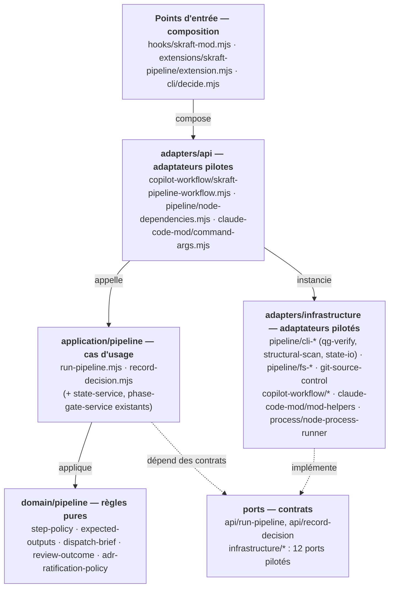
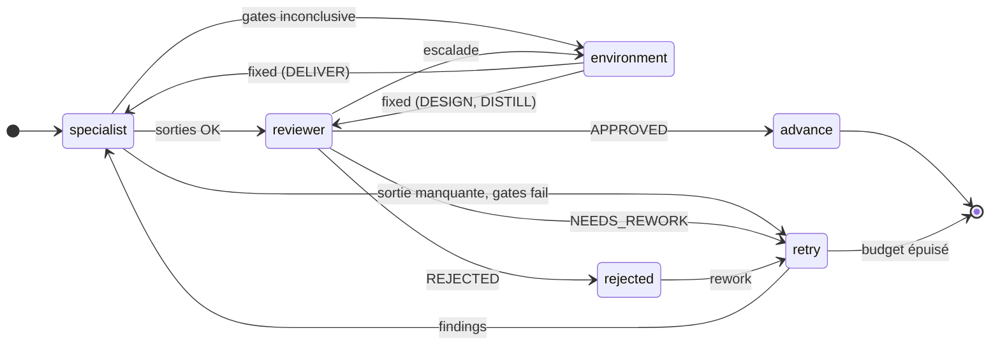
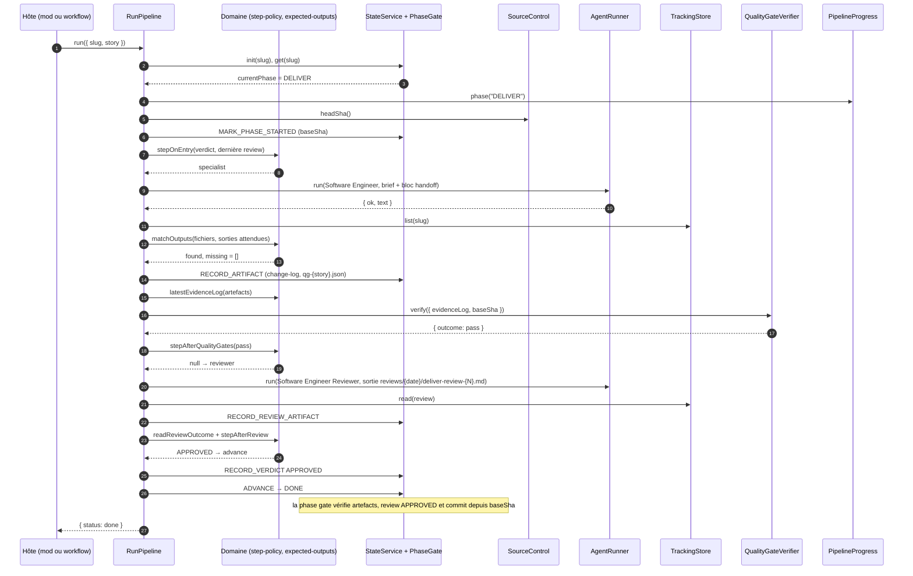
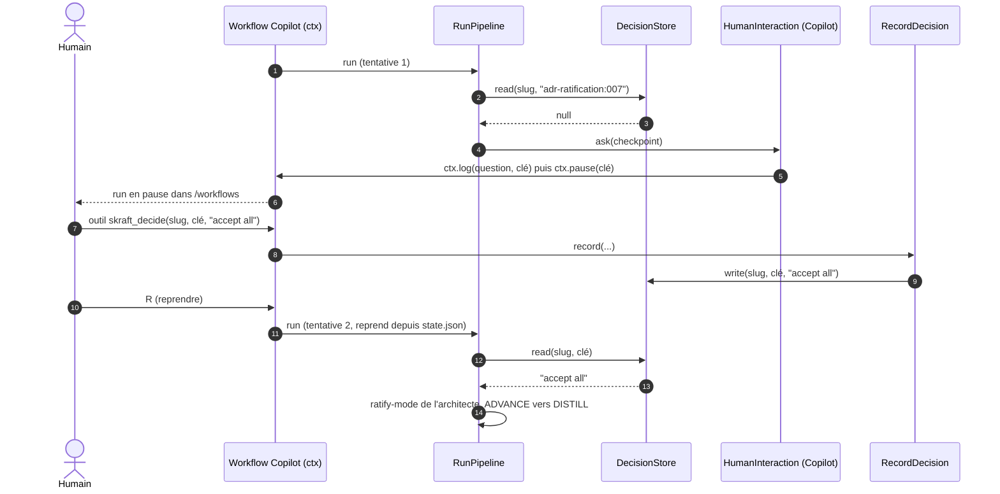

<!-- markdownlint-disable-file -->
# RunPipeline — l'orchestrateur SKRAFT en code

`RunPipeline` fait tourner le pipeline SKRAFT d'une story, RESEARCH → DESIGN → DISTILL →
DELIVER, à la place de l'agent orchestrateur en prose. Le même cas d'usage sert deux
hôtes : un **mod Claude Code** et un **workflow dynamique GitHub Copilot**. Chaque hôte ne
fait que brancher ses adaptateurs sur les ports ; toutes les décisions sont prises dans
le domaine et le cas d'usage.

> Fichier central : [`plugins/skraft-framework/src/application/pipeline/run-pipeline.mjs`](../plugins/skraft-framework/src/application/pipeline/run-pipeline.mjs)
> Contrat d'entrée : [`src/ports/api/run-pipeline.mjs`](../plugins/skraft-framework/src/ports/api/run-pipeline.mjs)

---

## 1. Ce qu'il fait

Pour une story identifiée par son `slug`, `RunPipeline` :

1. lit `state.json` et reprend à la phase en cours (ou crée l'état au premier passage) ;
2. pour chaque phase, envoie le **spécialiste** puis le **reviewer** de
   `skraft-framework.config.json` (RESEARCH n'a pas de reviewer) ;
3. vérifie sur disque que le spécialiste a laissé les sorties attendues ;
4. lit le verdict dans le **fichier de review**, jamais dans la réponse du sous-agent ;
5. renvoie les findings au spécialiste tant que le budget de retries le permet
   (`maxRetriesPerPhase`, 2 par défaut, soit 3 tentatives) ;
6. en DESIGN, lance le scan structurel avant l'architecte, puis la **ratification des ADR**
   avant de passer à DISTILL ;
7. en DELIVER, fait **vérifier les quality gates** (G1–G11) avant toute review ;
8. pose les questions au humain aux **checkpoints** (ADR, environnement, phase rejetée) ;
9. clôt chaque phase par l'événement `ADVANCE` : la machine à états et la phase gate
   (G4/G5) existantes restent les seules à décider si la phase peut se fermer.

Le résultat est l'un de ces trois statuts :

| `status` | Signification | Champs utiles |
|---|---|---|
| `done` | Les quatre phases sont approuvées, `currentPhase` vaut `DONE` | `reason` |
| `blocked` | Arrêt : budget de retries épuisé, review illisible, phase gate refusée, humain qui répond `stop` | `phase`, `reason`, `detail` (findings ou violations) |
| `awaiting-human` | Une question attend une réponse que personne ne peut donner maintenant | `phase`, `checkpoint.key`, `checkpoint.question`, `checkpoint.options` |

---

## 2. Fichiers d'entrée

| Hôte | Déclencheur | Fichier d'entrée (composition) | Adaptateur pilote |
|---|---|---|---|
| Claude Code (mod) | `/skraft <slug> [#issue] [titre]` | [`hooks/skraft-mod.mjs`](../plugins/skraft-framework/hooks/skraft-mod.mjs), hook `command.run` | [`adapters/api/claude-code-mod/command-args.mjs`](../plugins/skraft-framework/src/adapters/api/claude-code-mod/command-args.mjs) |
| Claude Code (mod) | outil `mcp__skraft__run_pipeline` appelé par l'agent principal | même fichier, hook `tool.call` | — |
| GitHub Copilot | « Run the skraft-pipeline dynamic workflow… » ou `copilot workflow run skraft-pipeline --args '{"slug":"checkout"}'` | [`com.github.copilot/extensions/skraft-pipeline/extension.mjs`](../plugins/skraft-framework/com.github.copilot/extensions/skraft-pipeline/extension.mjs) | [`adapters/api/copilot-workflow/skraft-pipeline-workflow.mjs`](../plugins/skraft-framework/src/adapters/api/copilot-workflow/skraft-pipeline-workflow.mjs) |
| GitHub Copilot | outil `skraft_decide` (réponse à un checkpoint) | même extension | même module, `createSkraftDecideTool` |
| Terminal | `node src/cli/decide.mjs --slug S --key K --answer A` | [`src/cli/decide.mjs`](../plugins/skraft-framework/src/cli/decide.mjs) | — (cas d'usage `RecordDecision`) |

Le mod et l'extension ne contiennent **aucune règle** : ils construisent les dépendances
et appellent `createRunPipeline(deps).run({ slug, story })`.

---

## 3. Où vit chaque morceau



Règle de dépendance ([ADR-002](adr/adr-002-hexagonal-architecture.md)), vérifiée par
[`tests/skraft-framework/architecture/pipeline-dependency-rule.test.mjs`](../tests/skraft-framework/architecture/pipeline-dependency-rule.test.mjs) :

- `domain/pipeline/` n'importe que `domain/` ;
- `application/pipeline/` n'importe que `domain/` et `application/` ; il ne nomme ni
  commande, ni chemin du plugin, ni `argv`, ni code de sortie, ni `process` ;
- les adaptateurs `adapters/infrastructure/` n'importent jamais un cas d'usage ;
- tout ce que charge le mod Claude Code est sans API Node (le runtime des mods n'en a pas).

| Couche | Fichier | Responsabilité |
|---|---|---|
| Domaine | `step-policy.mjs` | L'étape suivante d'une phase : spécialiste, reviewer, avancer, retry, environnement, rejet ; clés des checkpoints |
| Domaine | `expected-outputs.mjs` | Sorties attendues d'un agent (depuis `agentArtifacts`), sorties trouvées ou manquantes, log de preuves, chemin du scan |
| Domaine | `dispatch-brief.mjs` | Le prompt d'un dispatch : en-tête, bloc handoff (G9), addenda ; numéro `{N}` de la review |
| Domaine | `review-outcome.mjs` | Verdict et escalade lus dans un fichier de review |
| Domaine | `adr-ratification-policy.mjs` | ADR `Proposed` du `decisions-index.md`, lecture de la réponse humaine |
| Application | `run-pipeline.mjs` | Exécute les étapes contre les ports ; enchaîne les phases ; gère les checkpoints |
| Application | `record-decision.mjs` | Enregistre la réponse d'un humain à un checkpoint |

---

## 4. Les ports et leurs implémentations

Chaque contrat est décrit dans son fichier sous
[`src/ports/infrastructure/`](../plugins/skraft-framework/src/ports/infrastructure/).

| Port | Contrat | Node / Copilot | Mod Claude Code | Double de test |
|---|---|---|---|---|
| `StateReader` | `read(slug)` ; rejette `ENOENT` ou `CORRUPTED_STATE` | `json-state-reader.mjs` | `$.fs` (dans le mod) | `Map` |
| `StateWriter` | `write(slug, state)` → `Result` | `json-state-writer.mjs` (atomique) | `pipeline/cli-state-writer.mjs` → `cli/state-io.mjs` | `Map` |
| `TrackingStore` | `exists`, `read`, `list`, `write`, `prefix(slug)` | `pipeline/fs-tracking-store.mjs` | `$.fs` (dans le mod) | `Map` |
| `RepositoryReader` | `read(path)` → texte ou `null` | `pipeline/fs-repository-reader.mjs` | `$.fs` (dans le mod) | `Map` |
| `SourceControl` | `headSha()` | `pipeline/git-source-control.mjs` | `git rev-parse` via `$.process.run` | compteur |
| `AgentRunner` | `run({ agent, phase, role, label, prompt })` → `{ ok, text }` | `copilot-workflow/workflow-agent-runner.mjs` (`ctx.agent`) | `$.agent.spawn` + `turn.complete` (dans le mod) | LLM simulé |
| `QualityGateVerifier` | `verify({ slug, evidenceLog, baseSha })` → `{ outcome, findings }` | `pipeline/cli-quality-gate-verifier.mjs` → `cli/qg-verify.mjs` | le même adaptateur, avec `$.process.run` | file d'issues |
| `StructuralScanner` | `scan({ slug, outputPath })` → `{ ok, reason? }` | `pipeline/cli-structural-scanner.mjs` → `cli/structural-scan.mjs` | le même adaptateur, avec `$.process.run` | écrit `{}` |
| `HumanInteraction` | `ask({ key, question, options })` → réponse ou `null` | `copilot-workflow/workflow-human-interaction.mjs` (`ctx.pause`) | `$.ui.ask` (dans le mod) | réponses par clé |
| `DecisionStore` | `read(slug, key)`, `write(slug, key, answer, by)` | `pipeline/tracking-decision-store.mjs` | le même adaptateur | `Map` |
| `PipelineProgress` | `phase(title)`, `log(message)` | `copilot-workflow/workflow-progress.mjs` | atom `$.state` + pane + `$.ui.status` (dans le mod) | tableaux |
| `TimeProvider` | `now()`, `isoString()` | `system-time.mjs` | `system-time.mjs` | date fixe |

Les adaptateurs `cli-*` connaissent la ligne de commande et les codes de sortie
(`qg-verify` : 0 → `pass`, 1 → `fail`, 2 → `inconclusive`, autre → `error`). Ils ne
lancent rien eux-mêmes : ils reçoivent un `runProcess(argv, { timeoutMs, stdin })`.
Node le fournit avec `process/node-process-runner.mjs`, le mod avec `$.process.run`.

**Exception imposée par le runtime des mods.** Le moteur des mods ne suit `$` que dans
les fonctions du fichier `hooks/skraft-mod.mjs`, jamais à travers un import. Les
adaptateurs qui touchent `$` sont donc déclarés dans ce fichier (fonction
`pipelineDependencies`). Ils ne font que traduire un port vers `$` ; tout ce qui ne
touche pas `$` est importé depuis `adapters/infrastructure/`.

---

## 5. Comment ça marche

### 5.1 La boucle

`run({ slug, story })` initialise l'état puis appelle `runPhase` tant que
`currentPhase` n'est pas `DONE` (10 phases au plus). `runPhase` :

1. pose `MARK_PHASE_STARTED` avec le SHA de `HEAD` (base de DELIVER, idempotent en reprise) ;
2. en DESIGN, lance le scan structurel s'il n'est pas déjà enregistré sous RESEARCH ;
3. calcule l'étape d'entrée avec `stepOnEntry` à partir du verdict de la phase et de sa
   dernière review : c'est ce qui rend la reprise exacte ;
4. exécute les étapes une par une (50 au plus par phase) jusqu'à `ADVANCE` ou un arrêt.



Les règles de chaque transition sont dans
[`domain/pipeline/step-policy.mjs`](../plugins/skraft-framework/src/domain/pipeline/step-policy.mjs) :

| Après… | Fonction | Étape suivante |
|---|---|---|
| l'entrée dans la phase (ou une reprise) | `stepOnEntry` | `APPROVED` → avancer ; pas de verdict → spécialiste ; `CHANGES_REQUESTED` → selon la dernière review : `REJECTED` → rejet, `escalation: environment` → environnement, sinon spécialiste avec les findings |
| le spécialiste, sortie requise absente | `stepAfterMissingOutputs` | retry, sans dépenser de review |
| les quality gates (DELIVER) | `stepAfterQualityGates` | `pass` → reviewer ; `fail` → retry ; `inconclusive` ou `error` → environnement |
| la review | `stepAfterReview` | `APPROVED` → avancer ; `NEEDS_REWORK` → retry (ou environnement si escalade) ; `REJECTED` → rejet ; illisible → `blocked` |
| « fixed » | `stepAfterEnvironmentFixed` | DELIVER : ingénieur en re-gate ; DESIGN, DISTILL : reviewer seul |
| « rework » / « stop » | `stepAfterRejection` | retry, ou `blocked` |
| un retry | `reworkStep` | spécialiste avec les findings ; `RETRY_EXHAUSTED` → `blocked` |
| RESEARCH (pas de reviewer) | — | `CLOSE_PHASE` dès que les sorties sont là |

### 5.2 Une phase DELIVER, pas à pas



Les autres phases suivent le même schéma, sans quality gates. RESEARCH s'arrête après le
spécialiste (`CLOSE_PHASE`). DESIGN ajoute le scan structurel au début et la
ratification des ADR avant `ADVANCE`.

### 5.3 Les checkpoints humains

`RunPipeline` pose une question dans trois cas : des ADR `Proposed` après DESIGN
approuvé, un blocage d'environnement (review `escalation: environment`, ou quality gates
`inconclusive` / `error`), une phase `REJECTED`.

L'ordre est toujours le même : une réponse déjà enregistrée dans le `DecisionStore`
gagne ; sinon `HumanInteraction.ask` ; une réponse obtenue est enregistrée dans
`decisions/<clé>.json` ; pas de réponse → `awaiting-human`.

**Copilot : pause durable, puis reprise.**



Les `ctx.agent` déjà terminés ne sont pas relancés à la reprise : le SDK rejoue leur
résultat journalisé (même prompt et même `label`).

**Claude Code : boîte de dialogue.** `HumanInteraction` ouvre la question avec `$.ui.ask`.
La réponse est enregistrée, et le pipeline continue dans la même exécution. Sans
surface (session sans interface), la réponse vaut `null` : le run s'arrête en
`awaiting-human`. On répond alors avec `decide.mjs`, puis on relance `/skraft <slug>`.

Clés des checkpoints (stables à la reprise, distinctes à chaque occurrence) :

| Checkpoint | Clé | Réponses |
|---|---|---|
| Ratification ADR | `adr-ratification:007,008` | `accept all`, `reject all`, `pause`, ou `007 accept`, `008 amend "note"` |
| Phase rejetée | `rejected:DESIGN:2` (nombre de reviews) | `rework`, `stop` |
| Environnement | `environment:DELIVER:qg-verify:r0:t1:n1` (source, reviews, retries, occurrence) | `fixed`, `stop` |

---

## 6. Ce que le pipeline écrit

| Fichier | Écrit par | Quand |
|---|---|---|
| `{tracking}/{slug}/state.json` | `StateWriter` (via le state service) | à chaque événement |
| `{tracking}/{slug}/details/{date}/structural-scan.json` | `StructuralScanner` | avant le premier passage de l'architecte |
| `{tracking}/{slug}/reviews/{date}/{phase}-review-{N}.md` | le reviewer | `{N}` = nombre de reviews déjà enregistrées pour la phase + 1 |
| `{tracking}/{slug}/decisions/{clé}.json` | `DecisionStore` | à chaque réponse humaine : `{ key, answer, by, at }` |
| sorties des spécialistes | les agents | chemins de `agentArtifacts`, vérifiés par `matchOutputs` |

`{tracking}` vaut `SKRAFT_TRACKING_ROOT` s'il est défini, sinon
`.copilot-tracking/skraft-plans` à la racine du dépôt.

---

## 7. Tester

| Ce qui est testé | Fichier | Comment |
|---|---|---|
| Cas d'usage, tous les chemins (retries, gates, checkpoints, reprise) | `tests/skraft-framework/pipeline/run-pipeline.use-case.test.mjs` | doubles InMemory de chaque port, LLM simulé ([`fake-host.mjs`](../tests/skraft-framework/pipeline/fake-host.mjs)) |
| Règles du domaine | `pipeline-policies.unit.test.mjs`, `pipeline-domain.unit.test.mjs` | fonctions pures |
| Adaptateurs pilotés | `pipeline-adapters.unit.test.mjs` | `runProcess` enregistreur, dossiers temporaires, `ctx` simulé |
| Workflow Copilot de bout en bout | `copilot-workflow-adapter.integration.test.mjs` | vrai dépôt git, vrais `structural-scan` et `qg-verify`, `ctx` simulé |
| Mod Claude Code | `plugins/skraft-framework/hooks/skraft-mod.test.ts` | runtime réel des mods (`claude plugin test`) |
| Règle de dépendance | `tests/skraft-framework/architecture/pipeline-dependency-rule.test.mjs` | lecture des imports |

```bash
node --test tests/skraft-framework/pipeline/*.test.mjs tests/skraft-framework/architecture/*.test.mjs
claude plugin validate plugins/skraft-framework
claude plugin test plugins/skraft-framework
```

---

## 8. Ajouter un hôte

1. Écrire un adaptateur par port propre à l'hôte : en général `AgentRunner`,
   `HumanInteraction` et `PipelineProgress`. Les autres existent déjà pour Node.
2. Composer les dépendances dans le point d'entrée de l'hôte, sur le modèle de
   `runSkraftPipelineWorkflow`.
3. Appeler `createRunPipeline(deps).run({ slug, story })` et afficher le résultat.
4. Ajouter un test d'intégration avec un faux contexte d'hôte.

Aucune modification du domaine ni du cas d'usage n'est nécessaire.

---

## 9. Limites connues

- **Copilot** : workflows dynamiques et extensions sont en public preview (CLI lancée
  avec `--experimental`). L'identifiant d'agent attendu par `ctx.agent` (nom du
  `.agent.md`) n'a pas encore été vérifié sur une vraie CLI ; `args.agentIds` permet de
  le surcharger.
- **Mod** : `$.process.run` plafonne à 10 minutes ; un run de mutation complet reste
  dans le Bash de l'ingénieur.
- **Pas encore porté** : la clôture manuelle (`incr-rework`, `manual-close.md`),
  `scan-commits` en DELIVER, et le flux de reporting (`report.mjs`).
- **Décisions persistées** : une réponse enregistrée resservira si la même clé revient
  (même phase, mêmes compteurs). Supprimer `decisions/<clé>.json` force la question.
