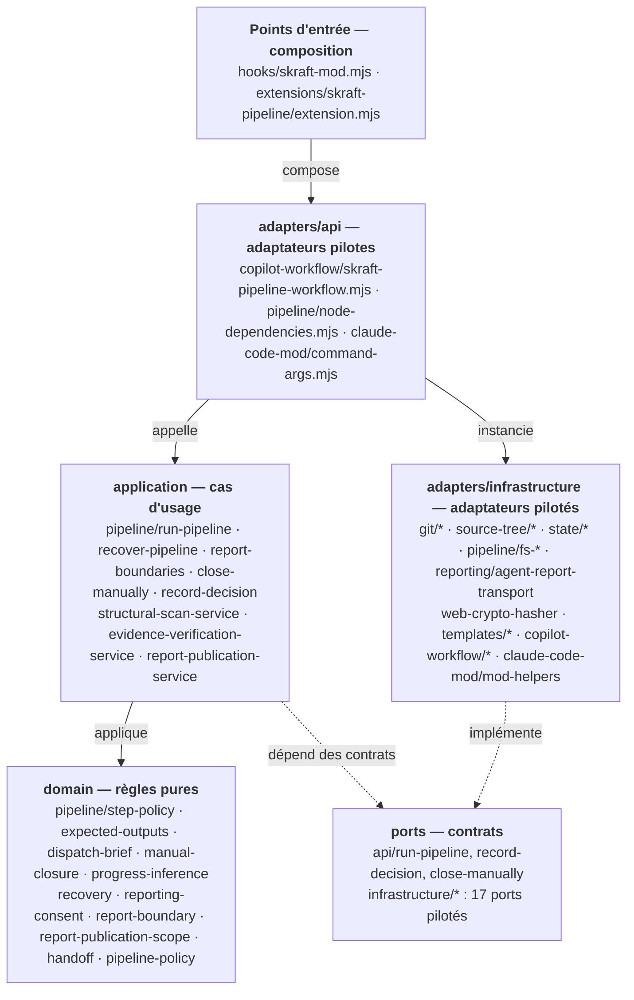
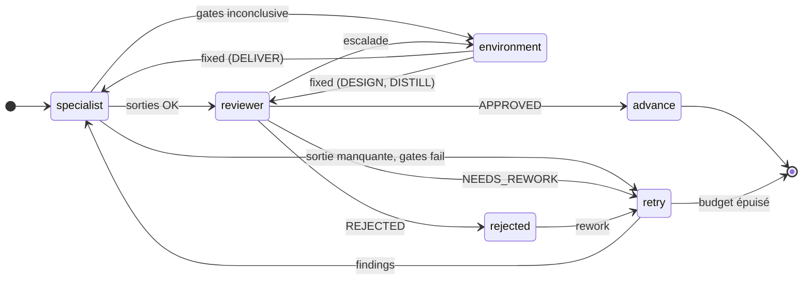
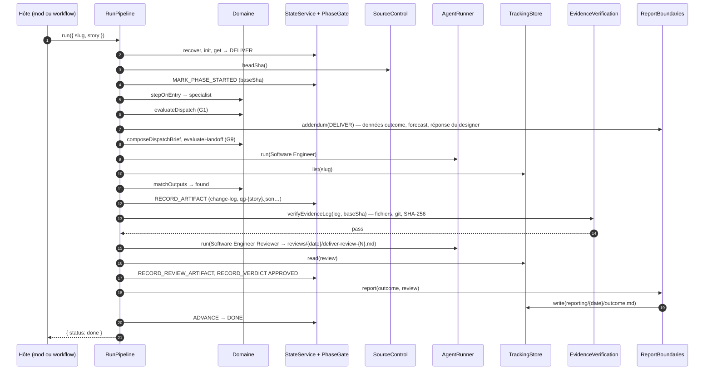
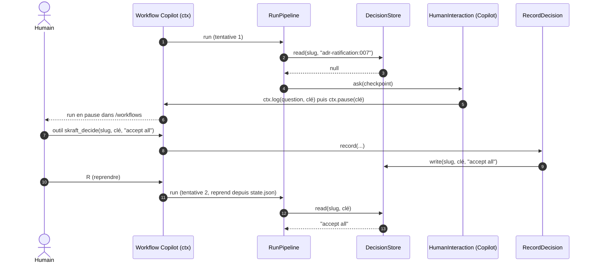
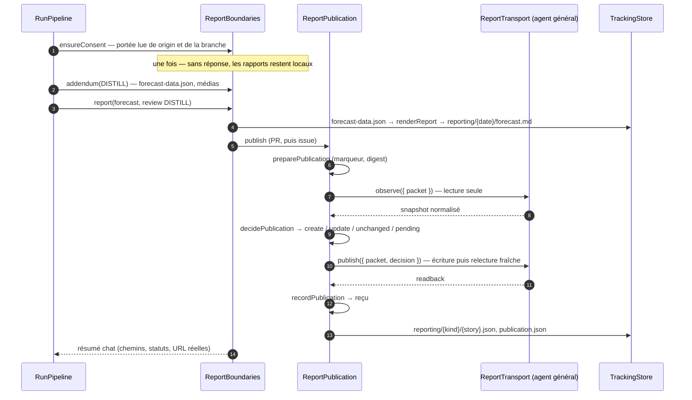

<!-- markdownlint-disable-file -->
# RunPipeline — l'orchestrateur SKRAFT en code

`RunPipeline` fait tourner le pipeline SKRAFT d'une story, RESEARCH → DESIGN → DISTILL →
DELIVER, à la place de l'agent orchestrateur en prose. Le même cas d'usage sert deux
hôtes : un **mod Claude Code** et un **workflow dynamique GitHub Copilot**. Chaque hôte ne
fait que brancher ses adaptateurs sur les ports ; toutes les décisions sont prises dans
le domaine et les cas d'usage ([ADR-010](adr/adr-010-pipeline-runs-as-code.md)).

> Fichier central : [`plugins/skraft-framework/src/application/pipeline/run-pipeline.mjs`](../plugins/skraft-framework/src/application/pipeline/run-pipeline.mjs)
> Contrats d'entrée : [`src/ports/api/`](../plugins/skraft-framework/src/ports/api/) — `run-pipeline`, `record-decision`, `close-manually`

L'agent `skraft-orchestrator` n'est plus qu'un **lanceur** : il appelle l'entrée de son
hôte et relaie les checkpoints. Sa prose (Phase 0, appels `state.mjs`, tableau des
verdicts, Report feedback) est **obsolète** ; la section 2 dit où chacune de ses
responsabilités vit maintenant.

---

## 1. Ce qu'il fait

Pour une story identifiée par son `slug`, `RunPipeline` :

1. **remet `state.json` d'aplomb** avant de partir : diagnostic, puis rollback, reset,
   budget de retries neuf, ou reconstruction depuis les fichiers (section 5.5) ;
2. demande une fois le **consentement de reporting** (où publier les rapports) ;
3. pour chaque phase, envoie le **spécialiste** puis le **reviewer** de
   `skraft-framework.config.json` (RESEARCH n'a pas de reviewer), après avoir vérifié
   l'**ordre des dispatchs** (G1) et la **complétude du handoff** (G9) ;
4. vérifie sur disque que le spécialiste a laissé les sorties attendues ;
5. lit le verdict dans le **fichier de review**, jamais dans la réponse du sous-agent ;
6. renvoie les findings au spécialiste tant que le budget de retries le permet
   (`maxRetriesPerPhase`, 2 par défaut, soit 3 tentatives) ;
7. en DESIGN, fait le **scan structurel** avant l'architecte, puis la **ratification des
   ADR** avant de passer à DISTILL ;
8. en DELIVER, **vérifie le log de preuves des quality gates** (G1–G11) avant toute
   review — en process, sans ligne de commande ;
9. après DISTILL, rend le **rapport forecast** ; après DELIVER (approuvé ou bloqué), le
   **rapport outcome** ; les publie selon le consentement, la partie distante déléguée à un
   agent ;
10. pose les questions au humain aux **checkpoints** ;
11. clôt chaque phase par `ADVANCE` : la machine à états et la phase gate (G4/G5) restent
    les seules à décider si la phase peut se fermer.

Le résultat est l'un de ces trois statuts :

| `status` | Signification | Champs utiles |
|---|---|---|
| `done` | Les quatre phases sont approuvées, `currentPhase` vaut `DONE` | `reason` |
| `blocked` | Arrêt : budget de retries épuisé, review illisible, phase gate refusée, dispatch refusé (G1/G9), humain qui répond `stop` | `phase`, `reason`, `detail` (findings ou violations) |
| `awaiting-human` | Une question attend une réponse que personne ne peut donner maintenant | `phase`, `checkpoint.key`, `checkpoint.question`, `checkpoint.options` |

Un second cas d'usage, **`CloseManually`**, clôt la phase ouverte après des reworks validés
par le humain (section 5.6).

---

## 2. Ce que faisait l'orchestrateur, et où c'est maintenant

| Responsabilité (prose de `skraft-orchestrator.md`) | Maintenant | Fichier |
|---|---|---|
| Phase 0 : créer ou relire l'état, reprendre | `stateService.init` + `stepOnEntry` | `application/pipeline/run-pipeline.mjs`, `domain/pipeline/step-policy.mjs` |
| Recovery : `diagnose`, `rollback`, `reset`, `resolve-stale`, reconstruire depuis les fichiers | `PipelineRecovery`, `recoveryStepOf`, `inferCompletedPhases` | `application/pipeline/recover-pipeline.mjs`, `domain/recovery-policy.mjs`, `domain/pipeline/progress-inference-policy.mjs` |
| `mark-phase-started` (base SHA) | `MARK_PHASE_STARTED` | `run-pipeline.mjs` |
| Coller le bloc `state.mjs handoff` dans chaque dispatch | `composeDispatchBrief` | `domain/pipeline/dispatch-brief.mjs` |
| G1 (ordre des dispatchs), G9 (handoff complet) — hooks PreToolUse | `evaluateDispatch`, `evaluateHandoff` avant chaque dispatch | `run-pipeline.mjs`, `domain/pipeline-policy.mjs`, `domain/handoff-policy.mjs` |
| Vérifier les artefacts, `record-artifact` | `matchOutputs` + `RECORD_ARTIFACT` | `domain/pipeline/expected-outputs.mjs` |
| Tableau des verdicts, retries, escalade environnement, rejet | `stepAfterReview`, `reworkStep`, checkpoints | `step-policy.mjs` |
| G6 (rappel PostToolUse des étapes à enregistrer) | supprimé : le code enregistre lui-même | — |
| Scan structurel (`structural-scan.mjs --out`) | `StructuralScan` en process | `application/structural-scan-service.mjs` |
| `qg-verify.mjs` avant la review DELIVER | `verifyEvidenceLog` en process | `application/evidence-verification-service.mjs` |
| Ratification des ADR | `ratifyAdrs` | `run-pipeline.mjs`, `domain/pipeline/adr-ratification-policy.mjs` |
| Manual closure : `incr-rework`, `scan-commits`, `manual-close.md`, `close-phase` | `CloseManually` | `application/pipeline/close-manually.mjs`, `domain/pipeline/manual-closure-policy.mjs` |
| Consentement de reporting (`report.mjs setup`) | `ensureConsent` | `application/pipeline/report-boundaries.mjs`, `domain/reporting-consent-policy.mjs` |
| Contexte de reporting des dispatchs DISTILL/DELIVER (données, médias, forecast, tests d'acceptation) | `reportingAddendum` | `domain/report-boundary-policy.mjs` |
| `report.mjs render` après DISTILL et DELIVER | `report` (lit les références d'abord, puis `renderReport`) | `report-boundaries.mjs` |
| `report.mjs prepare / decide / record`, reprise à DONE | `ReportPublication` | `application/report-publication-service.mjs` |
| Appels MCP de publication (lecture, écriture, relecture) | **délégués** à un agent général via le port `ReportTransport` | `adapters/infrastructure/reporting/agent-report-transport.mjs` |

Les sous-commandes de `state.mjs` que seule la prose utilisait (`init`, `select`,
`transition`, `record-*`, `mark-phase-started`, `incr-*`, `close-phase`, `set`,
`scan-commits`, `diagnose`, `rollback`, `reset`, `resolve-stale`) et `report.mjs`
restent pour une réparation manuelle et sont **marquées obsolètes** (un avis sur un
terminal). `state.mjs get`, `handoff` et `timeline`, que les agents de production et
les humains lisent, restent courants ; `qg-verify.mjs` et `structural-scan.mjs` restent,
devenus de minces adaptateurs pilotes des mêmes services, pour l'ingénieur et les
reviewers.

---

## 3. Fichiers d'entrée

| Hôte | Déclencheur | Fichier d'entrée (composition) | Cas d'usage |
|---|---|---|---|
| Claude Code (mod) | `/skraft <slug> [#issue] [titre]`, outil `mcp__skraft__run_pipeline` | [`hooks/skraft-mod.mjs`](../plugins/skraft-framework/hooks/skraft-mod.mjs) (`command.run`, `tool.call`) | `RunPipeline` |
| Claude Code (mod) | `/skraft decide <slug> <clé> <réponse>` | même fichier | `RecordDecision` |
| Claude Code (mod) | `/skraft close <slug> [findings]` | même fichier | `CloseManually` |
| GitHub Copilot | « Run the skraft-pipeline dynamic workflow… » ou `copilot workflow run skraft-pipeline --args '{"slug":"checkout"}'` | [`com.github.copilot/extensions/skraft-pipeline/extension.mjs`](../plugins/skraft-framework/com.github.copilot/extensions/skraft-pipeline/extension.mjs) | `RunPipeline` |
| GitHub Copilot | outils `skraft_decide`, `skraft_close_phase` | même extension | `RecordDecision`, `CloseManually` |

La ligne `/skraft` est découpée par [`adapters/api/claude-code-mod/command-args.mjs`](../plugins/skraft-framework/src/adapters/api/claude-code-mod/command-args.mjs) ;
les appels du SDK Copilot par [`adapters/api/copilot-workflow/skraft-pipeline-workflow.mjs`](../plugins/skraft-framework/src/adapters/api/copilot-workflow/skraft-pipeline-workflow.mjs).
Le mod et l'extension ne contiennent **aucune règle** : ils construisent les dépendances
et appellent un cas d'usage. Il n'y a plus de script hors de cette architecture :
`decide.mjs` et `state-io.mjs` ont disparu.

---

## 4. Où vit chaque morceau



Règle de dépendance ([ADR-002](adr/adr-002-hexagonal-architecture.md)), vérifiée par
[`tests/skraft-framework/architecture/pipeline-dependency-rule.test.mjs`](../tests/skraft-framework/architecture/pipeline-dependency-rule.test.mjs) :

- `domain/` n'importe que `domain/` ;
- `application/pipeline/` n'importe que `domain/` et `application/` ; il ne nomme ni
  commande, ni chemin du plugin, ni `argv`, ni code de sortie, ni `process` ;
- aucun adaptateur de `adapters/infrastructure/` n'importe un cas d'usage ;
- tout ce que charge le mod Claude Code est sans API Node (le runtime des mods n'en a pas).

| Couche | Fichier | Responsabilité |
|---|---|---|
| Domaine | `pipeline/step-policy.mjs` | L'étape suivante d'une phase ; clés des checkpoints |
| Domaine | `pipeline/expected-outputs.mjs` | Sorties attendues d'un agent, trouvées ou manquantes, log de preuves, chemin du scan |
| Domaine | `pipeline/dispatch-brief.mjs` | Le prompt d'un dispatch : en-tête, bloc handoff, addenda ; numéro `{N}` de la review |
| Domaine | `pipeline/review-outcome.mjs` | Verdict et escalade lus dans un fichier de review |
| Domaine | `pipeline/adr-ratification-policy.mjs` | ADR `Proposed`, lecture de la réponse humaine |
| Domaine | `pipeline/progress-inference-policy.mjs` | Phases que les fichiers montrent terminées, après une reconstruction |
| Domaine | `pipeline/manual-closure-policy.mjs` | Review de clôture manuelle, refus |
| Domaine | `recovery-policy.mjs` | Diagnostic → étape de recovery (`recoveryStepOf`) |
| Domaine | `reporting-consent-policy.mjs` | Portée lue de `origin`, question, interprétation de la réponse |
| Domaine | `report-boundary-policy.mjs` | Chemins des données et rapports, addendum de reporting, résumé chat |
| Domaine | `report-publication-scope.mjs` | Reçus encore dans la portée confirmée (partagé avec `report.mjs`) |
| Application | `pipeline/run-pipeline.mjs` | Exécute les étapes contre les ports ; enchaîne les phases |
| Application | `pipeline/checkpoint.mjs` | `Halt`, `ask` / `tryAsk` (DecisionStore d'abord) |
| Application | `pipeline/pipeline-state.mjs` | Le state service, avec la phase gate, de tous les cas d'usage |
| Application | `pipeline/recover-pipeline.mjs` | Étape de recovery au démarrage |
| Application | `pipeline/report-boundaries.mjs` | Consentement, addendum, rendu, publication, reprise |
| Application | `pipeline/close-manually.mjs` | Cas d'usage `CloseManually` |
| Application | `pipeline/record-decision.mjs` | Cas d'usage `RecordDecision` |
| Application | `structural-scan-service.mjs`, `evidence-verification-service.mjs`, `report-publication-service.mjs` | Services en process, partagés avec les commandes |

---

## 5. Les ports et leurs implémentations

Chaque contrat est décrit dans son fichier sous
[`src/ports/infrastructure/`](../plugins/skraft-framework/src/ports/infrastructure/).

| Port | Contrat | Node / Copilot | Mod Claude Code | Double de test |
|---|---|---|---|---|
| `StateReader` | `read(slug)` ; rejette `ENOENT` ou `CORRUPTED_STATE` | `json-state-reader.mjs` | `state/file-state-store.mjs` sur `$.fs` | `Map` |
| `StateWriter` | `write(slug, state)` → `Result` | `state/json-state-writer.mjs` (temp + rename) | `state/snapshot-state-writer.mjs` sur `$.fs` (sauvegarde à chaque changement de phase, relecture) | `Map` |
| `StateBackupReader` | `list(slug)` → `state.json.bak.*` | `state/json-state-backup-reader.mjs` | `state/file-state-store.mjs` | tableau |
| `StateArchive` | `setAside(slug)` → `state.json.invalid.*` | `state/json-state-archive.mjs` | `state/file-state-store.mjs` | tableau |
| `TrackingStore` | `exists`, `read`, `list`, `write`, `prefix(slug)` | `pipeline/fs-tracking-store.mjs` | `$.fs` (dans le mod) | `Map` |
| `RepositoryReader` | `read(path)` → texte ou `null` | `pipeline/fs-repository-reader.mjs` | `$.fs` (dans le mod) | `Map` |
| `SourceControl` | `headSha`, `parentOf`, `filesOf`, `commit`, `range`, `show`, `listRecent`, `currentBranch`, `remoteUrl` | `git/git-source-control.mjs` + `git/node-git-runner.mjs` | le même + `git/process-git-runner.mjs` sur `$.process.run` | dépôt simulé |
| `SourceTree` | `listFiles()`, `readSource(path, maxBytes)` | `source-tree/node-source-tree.mjs` | `source-tree/git-source-tree.mjs` sur `$.fs.stat/read` | liste fixe |
| `Hasher` | `sha256(text)`, `sha256Sync(text)` | `web-crypto-hasher.mjs` | le même | `node:crypto` |
| `TemplateReader` | `read(pluginRelativePath)` | `templates/node-template-reader.mjs` | `$.fs` sous `$.plugin.root` | fichier réel |
| `ActivePipeline` | `activate(slug)` | `pipeline/fs-active-pipeline.mjs` (`.active-slug`) | `$.fs.write` (dans le mod) | tableau |
| `AgentRunner` | `run({ agent, phase, role, label, prompt })` → `{ ok, text }` ; `agent: null` = agent général | `copilot-workflow/workflow-agent-runner.mjs` (`ctx.agent`) | `$.agent.spawn` + `turn.complete` (dans le mod) | LLM simulé |
| `ReportTransport` | `observe({ packet })`, `publish({ packet, decision })` | `reporting/agent-report-transport.mjs` sur `AgentRunner` | le même | GitHub simulé |
| `HumanInteraction` | `ask({ key, question, options })` → réponse ou `null` | `copilot-workflow/workflow-human-interaction.mjs` (`ctx.pause`) | `$.ui.ask` (dans le mod) | réponses par clé |
| `DecisionStore` | `read(slug, key)`, `write(slug, key, answer, by)` | `pipeline/tracking-decision-store.mjs` | le même | `Map` |
| `PipelineProgress` | `phase(title)`, `log(message)` | `copilot-workflow/workflow-progress.mjs` | atom `$.state` + pane + `$.ui.status` | tableaux |
| `TimeProvider` | `now()`, `isoString()` | `system-time.mjs` | `system-time.mjs` | date fixe |

**Le seul processus que lance le mod est `git`.** L'écriture de l'état, la vérification
des preuves, le scan et le rendu des rapports tournent dans le mod lui-même.

**Exception imposée par le runtime des mods.** Le moteur des mods ne suit `$` que dans
les fonctions du fichier `hooks/skraft-mod.mjs`, jamais à travers un import. Les
adaptateurs qui touchent `$` y sont déclarés (`pipelineDependencies`) et se limitent à
traduire un port vers `$` ; les adaptateurs hôte-neutres (git, état sur fonctions de
fichiers, hasher, transport) sont importés depuis `adapters/infrastructure/` et reçoivent
des fonctions bâties sur `$`.

---

## 6. Comment ça marche

### 6.1 La boucle

`run({ slug, story })` :

1. `recover(slug)` — section 6.5 ;
2. `stateService.init(slug)`, `ActivePipeline.activate(slug)` ;
3. `ensureConsent(slug, story)` — section 6.4 ;
4. tant que `currentPhase` n'est pas `DONE` (10 phases au plus) : `runPhase` ; à `DONE`,
   une publication restée en attente est retentée.

`runPhase` pose `MARK_PHASE_STARTED` avec le SHA de `HEAD`, fait le scan en DESIGN, calcule
l'étape d'entrée avec `stepOnEntry` (c'est ce qui rend la reprise exacte), puis exécute les
étapes une par une (50 au plus par phase) jusqu'à `ADVANCE` ou un arrêt.



| Après… | Fonction | Étape suivante |
|---|---|---|
| l'entrée dans la phase (ou une reprise) | `stepOnEntry` | `APPROVED` → avancer ; pas de verdict → spécialiste ; `CHANGES_REQUESTED` → selon la dernière review |
| le spécialiste, sortie requise absente | `stepAfterMissingOutputs` | retry, sans dépenser de review |
| les quality gates (DELIVER) | `stepAfterQualityGates` | `pass` → reviewer ; `fail` → retry ; `inconclusive` ou `error` → environnement |
| la review | `stepAfterReview` | `APPROVED` → avancer ; `NEEDS_REWORK` → retry (ou environnement) ; `REJECTED` → rejet ; illisible → `blocked` |
| « fixed » | `stepAfterEnvironmentFixed` | DELIVER : ingénieur en re-gate ; DESIGN, DISTILL : reviewer seul |
| « rework » / « stop » | `stepAfterRejection` | retry, ou `blocked` |
| un retry | `reworkStep` | spécialiste avec les findings ; `RETRY_EXHAUSTED` → `blocked` |
| RESEARCH (pas de reviewer) | — | `CLOSE_PHASE` dès que les sorties sont là |

Avant chaque dispatch : `evaluateDispatch` (G1 — l'agent appartient à la phase ouverte, le
reviewer seulement après un artefact) puis, sur le prompt composé, `evaluateHandoff` (G9 —
chaque entrée enregistrée est nommée). Un refus arrête le run en `blocked` : rien ne part.

### 6.2 Une phase DELIVER, pas à pas



Les autres phases suivent le même schéma, sans vérification des preuves. RESEARCH
s'arrête après le spécialiste. DESIGN ajoute le scan au début et la ratification des ADR
avant `ADVANCE` ; DISTILL rend le forecast avant `ADVANCE` et garde la réponse du
designer (`reporting/{date}/distill-handoff.md`) pour l'ingénieur. Un DELIVER bloqué rend
quand même son outcome ; un rapport ne change jamais un verdict ni ne fait échouer le run.

### 6.3 Les checkpoints humains

L'ordre est toujours le même (`checkpoint.mjs`) : une réponse déjà enregistrée dans le
`DecisionStore` gagne ; sinon `HumanInteraction.ask` ; une réponse obtenue est enregistrée
dans `decisions/<clé>.json` ; pas de réponse → `awaiting-human` (`ask`) ou on continue
sans (`tryAsk`, pour le consentement de reporting seulement).

**Copilot : pause durable, puis reprise.**



Les `ctx.agent` déjà terminés ne sont pas relancés à la reprise : le SDK rejoue leur
résultat journalisé (même prompt et même `label`).

**Claude Code : boîte de dialogue.** `HumanInteraction` ouvre la question avec `$.ui.ask`
et le pipeline continue dans la même exécution. Sans surface, la réponse vaut `null` : le
run s'arrête en `awaiting-human`. On répond avec `/skraft decide <slug> <clé> <réponse>`,
puis on relance `/skraft <slug>`.

| Checkpoint | Clé | Réponses |
|---|---|---|
| Consentement de reporting | `reporting:consent` | `local`, `chat`, `pr`, `issue`, combinés par `+` ; `pr=#N`, `issue=#N`, `media=N`, `draft` |
| Ratification ADR | `adr-ratification:007,008` | `accept all`, `reject all`, `pause`, ou `007 accept`, `008 amend "note"` |
| Phase rejetée | `rejected:DESIGN:2` (nombre de reviews) | `rework`, `stop` |
| Environnement | `environment:DELIVER:qg-verify:r0:t1:n1` | `fixed`, `stop` |
| Phase sans budget | `stale:DESIGN:t2:r3` (retries, reviews) | `relaunch`, `stop` |
| État reconstruit | `recovery:RESEARCH,DESIGN` (phases déduites) | `resume`, `restart` |

### 6.4 Le reporting



Seule la partie distante — appeler les outils MCP de l'hôte — est confiée à un agent : un
script ne peut pas les appeler. L'agent reçoit une tâche bornée et répond un seul objet
JSON ; le code garde tout le protocole (marqueur, digest, réconciliation, reçu). Une
réponse inexploitable laisse la destination en `pending`, avec sa raison ; la reprise a
lieu au prochain run, à `DONE` compris.

### 6.5 La recovery

| Diagnostic | Étape | Ce qui se passe |
|---|---|---|
| `HEALTHY` | `none` | rien |
| `MISSING_STATE` sans sauvegarde | `init` | état neuf ; si des fichiers montrent des phases terminées, checkpoint `recovery:…` |
| `MISSING_STATE`, `CORRUPTED_STATE`, `INVALID_STATE` avec sauvegarde saine | `rollback` | restaure la plus récente `state.json.bak.*` |
| `CORRUPTED_STATE`, `INVALID_STATE` sans sauvegarde | `reset` | l'état invalide est gardé (`.invalid.*`), état neuf, puis reconstruction confirmée |
| `STALE` | `resolve-stale` | checkpoint `stale:…` ; `relaunch` redonne un budget de retries à la phase |
| `IO_ERROR` | `halt` | `blocked` |

### 6.6 La clôture manuelle

`CloseManually.close({ slug, phase?, findings })` : refus si la phase n'a pas de reviewer,
n'est pas la phase ouverte, ou si le pipeline est `DONE` ; en DELIVER, refus tant qu'un des
20 derniers commits n'est pas `type(scope): subject` (renommer réécrit l'historique :
c'est au humain) ; puis `INCR_REWORK`, `reviews/{date}/manual-close.md` rendu depuis des
données avec le gabarit `review-verdict`, et `CLOSE_PHASE` à travers la phase gate.

---

## 7. Cohabitation avec les settings hooks

Restent dans `hooks/hooks.json` : la **provenance** des dispatchs, **G7/G8** (session guard :
`state.json` protégé, écritures DELIVER), **G2/G3** (SubagentStart/Stop, lectures de
SKILL.md) et le ménage de démarrage. **G1, G6 et G9 ont disparu** : RunPipeline vérifie
l'ordre et le handoff lui-même, et enregistre ce que les agents rendent.

Au démarrage, `RunPipeline` écrit `{tracking}/.active-slug` (`ActivePipeline`) : c'est le
pipeline contre lequel le session guard juge les écritures. Le journal d'audit est dans
`.git/skraft/skill-audit.jsonl` (ou `SKRAFT_AUDIT_LOG`).

---

## 8. Ce que le pipeline écrit

| Fichier | Écrit par | Quand |
|---|---|---|
| `{tracking}/{slug}/state.json` (+ `.bak.*`, `.invalid.*`, `.corrupted.*`) | `StateWriter`, `StateArchive`, `StateReader` | à chaque événement ; sauvegardes selon l'hôte |
| `{tracking}/.active-slug` | `ActivePipeline` | au démarrage de chaque run |
| `{tracking}/{slug}/details/{date}/structural-scan.json` | `StructuralScan` | avant le premier passage de l'architecte |
| `{tracking}/{slug}/reviews/{date}/{phase}-review-{N}.md` | le reviewer | `{N}` = reviews déjà enregistrées + 1 |
| `{tracking}/{slug}/reviews/{date}/manual-close.md` | `CloseManually` | clôture manuelle |
| `{tracking}/{slug}/decisions/{clé}.json` | `DecisionStore` | à chaque réponse humaine |
| `{tracking}/{slug}/reporting/{date}/{forecast,outcome}-data.json` | le designer, l'ingénieur | à leur dispatch |
| `{tracking}/{slug}/reporting/{date}/distill-handoff.md` | `ReportBoundaries` | après le designer |
| `{tracking}/{slug}/reporting/{date}/{forecast,outcome}.md` | `ReportBoundaries` | après DISTILL, après DELIVER |
| `{tracking}/{slug}/reporting/pending.json`, `{kind}/{story}.json`, `publication.json` | `ReportPublication` | à chaque publication |

`{tracking}` vaut `SKRAFT_TRACKING_ROOT` s'il est défini, sinon
`.copilot-tracking/skraft-plans` à la racine du dépôt.

---

## 9. Tester

| Ce qui est testé | Fichier | Comment |
|---|---|---|
| Cas d'usage, tous les chemins | `tests/skraft-framework/pipeline/run-pipeline.use-case.test.mjs` | doubles InMemory de chaque port, LLM simulé ([`fake-host.mjs`](../tests/skraft-framework/pipeline/fake-host.mjs)) |
| Recovery | `pipeline-recovery.use-case.test.mjs` | états corrompus, invalides, sans budget, reconstruits |
| Reporting | `reporting.use-case.test.mjs` | consentement, addendum, rendu, GitHub simulé, reprise |
| Clôture manuelle | `close-manually.use-case.test.mjs` | rejet puis clôture, commits non conventionnels |
| Règles du domaine | `pipeline-policies.unit.test.mjs`, `pipeline-domain.unit.test.mjs` | fonctions pures |
| Adaptateurs pilotés | `pipeline-adapters.unit.test.mjs`, `quality-gates/git-source-control.unit.test.mjs` | vrais dépôts git, dossiers temporaires, `ctx` simulé |
| Workflow Copilot de bout en bout | `copilot-workflow-adapter.integration.test.mjs` | vrai dépôt, consentement, ADR, forecast, preuves, hooks, clôture |
| Mod Claude Code | `plugins/skraft-framework/hooks/skraft-mod.test.ts` | runtime réel des mods (`claude plugin test`) |
| Règle de dépendance | `tests/skraft-framework/architecture/pipeline-dependency-rule.test.mjs` | lecture des imports |

```bash
node --test tests/skraft-framework/pipeline/*.test.mjs tests/skraft-framework/architecture/*.test.mjs
claude plugin validate plugins/skraft-framework
claude plugin test plugins/skraft-framework
```

---

## 10. Ajouter un hôte

1. Écrire un adaptateur par port propre à l'hôte : en général `AgentRunner`,
   `HumanInteraction` et `PipelineProgress` (le transport de reporting se bâtit sur
   `AgentRunner`). Les autres existent déjà, pour Node ou sur fonctions de fichiers.
2. Composer les dépendances dans le point d'entrée de l'hôte, sur le modèle de
   `runSkraftPipelineWorkflow`.
3. Appeler `createRunPipeline(deps).run({ slug, story })` et afficher le résultat ;
   exposer `RecordDecision` et `CloseManually`.
4. Ajouter un test d'intégration avec un faux contexte d'hôte.

---

## 11. Limites connues

- **Copilot** : workflows dynamiques et extensions sont en public preview (CLI lancée
  avec `--experimental`). L'identifiant d'agent attendu par `ctx.agent` n'a pas encore été
  vérifié sur une vraie CLI ; `args.agentIds` permet de le surcharger.
- **Mod** : `$.process.run` plafonne à 10 minutes et à 4 Mio de sortie (une sortie git
  coupée vaut absence) ; `$.fs` n'a ni rename ni delete : l'état est écrit en place, relu,
  et sauvegardé à chaque changement de phase ; `reporting/pending.json` terminé est vidé
  (`{}`), pas supprimé.
- **Reporting** : pas de création de PR (une cible sans numéro reste `pending`) ; le
  numéro de PR se donne dans la réponse au consentement (`pr=#N`).
- **Décisions persistées** : une réponse enregistrée resservira si la même clé revient.
  `/skraft decide` la remplace ; supprimer `decisions/<clé>.json` force la question.
