# Architecture

SKRAFT applies the CQS (Command-Query Separation) principle at the system level. The orchestrator dispatches commands to executor agents, who produce artifacts. Reviewer agents read those artifacts and emit verdicts — they never modify anything.

> « Asking a question should not change the answer. »
> — Meyer, B., *Object-Oriented Software Construction, 2nd ed.*, 1997.

## Overview

```mermaid
graph TB
    O[skraft-orchestrator] -->|dispatch| BD[backlog-discoverer]
    O -->|dispatch| BP[backlog-planner]
    O -->|dispatch| SA[solution-architect]
    O -->|dispatch| AD[acceptance-designer]
    O -->|dispatch| SE[software-engineer]
    
    BD -->|writes| A1[triage report]
    BP -->|writes| A2[refined stories]
    SA -->|writes| A3[ADRs + diagrams]
    AD -->|writes| A4[Gherkin scenarios]
    SE -->|writes| A5[tested code]
    
    A1 -.->|reads| BDR[backlog-discoverer-reviewer]
    A2 -.->|reads| BPR[backlog-planner-reviewer]
    A3 -.->|reads| SAR[solution-architect-reviewer]
    A4 -.->|reads| ADR[acceptance-designer-reviewer]
    A5 -.->|reads| SER[software-engineer-reviewer]
    
    BDR -->|verdict| O
    BPR -->|verdict| O
    SAR -->|verdict| O
    ADR -->|verdict| O
    SER -->|verdict| O
    
    O -.->|reads| S[(state.json)]
    
    style O fill:#2d5a3d,stroke:#4ed58a,stroke-width:2px
    style S fill:#1a2a3a,stroke:#7fd3ff
```

## Legend

| Arrow | Meaning |
|-------|---------|
| **Solid** orchestrator → executor | Command (CQS command side) |
| **Solid** executor → artifact | Write — the executor produces an artifact |
| **Dashed** artifact → reviewer | Read-only (CQS query side) |
| **Solid** reviewer → orchestrator | Verdict (PASS / FAIL + reasons) |
| **Dashed** orchestrator → state.json | CQRS read model |

## Strict separation

Executors **write** artifacts but never emit verdicts on their own work. Reviewers **read** artifacts and produce verdicts, but never modify code or documents. This separation guarantees that every artifact is validated by an independent eye.

The `state.json` file serves as the read model (CQRS): the orchestrator records phase progression and verdicts there, then consults it to decide the next action.

See [Core concepts](/en/concepts) for the theory behind CQS and CQRS.
