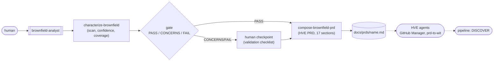

# Brownfield (upstream of the pipeline)

> The SKRAFT pipeline assumes two things a legacy codebase does not offer: an
> already-triaged backlog and code that is safe to change. The brownfield workflows
> manufacture both — upstream, on the human's request.

## Why — the pipeline assumes what brownfield lacks

The DISCOVER → DISCUSS → DESIGN → DISTILL → DELIVER pipeline starts from a backlog of
prioritized issues and from code that a testing discipline makes safe to evolve. A
legacy ("brownfield") system arrives with no product documentation and, often, no
test safety net. Dropping it into the pipeline as-is asks DISCOVER to triage a
backlog that does not exist, or DELIVER to change code whose real behavior nobody
knows.

SKRAFT answers with **two standalone workflows**, distinct from the pipeline: the
human invokes them directly, they are not orchestrator phases, and they never touch
its state. Each covers a need the pipeline presupposes.

## Two workflows, two needs

| Need | Workflow | What it produces |
|------|----------|------------------|
| **Understand** undocumented code | [`brownfield-analyst`]({{ "/en/reference/agents/brownfield-analyst" | relative_url }}) | an HVE-format PRD, consumed by HVE agents to create issues |
| **Secure then transform** a legacy | [`brownfield-harness-builder`]({{ "/en/reference/agents/brownfield-harness-builder" | relative_url }}) → [`brownfield-refactorer`]({{ "/en/reference/agents/brownfield-refactorer" | relative_url }}) | a characterization test safety net, then a refactor that keeps it green |

Both start **from scratch** (neither depends on the other) and stay governed by the
human at the moments that matter.

## Workflow 1 — from existing code to a PRD

[`characterize-brownfield`]({{ "/en/reference/skills/characterize-brownfield" | relative_url }})
reconstructs what the system does: stack, feature inventory, integration map,
existing API contracts, technical debt. Its central rule is **honesty about
confidence**: every claim is either a **fact** verified by a tool call, or an
**inference** tagged `High` / `Medium` / `Low`. A brownfield PRD built on false
certainty is worse than one that says "unknown." An optional **coverage
traceability** facet (adapted from test-architecture practice) rates each behavior
`FULL` / `PARTIAL` / `NONE` and feeds a **`PASS` / `CONCERNS` / `FAIL` gate**; below
the threshold, the human confirms or corrects before proceeding.

[`compose-brownfield-prd`]({{ "/en/reference/skills/compose-brownfield-prd" | relative_url }})
then maps that characterization onto the **exact HVE PRD format** (17 sections,
`FR-`/`NFR-` IDs, traceability). This PRD is not a dead end: it is the deliverable the
human hands to the **HVE agents** (GitHub Backlog Manager, `prd-to-wit`) that turn it
into issues and user stories — the backlog **DISCOVER** expects.

## Workflow 2 — secure then transform

The net first.
[`characterize-with-contracts`]({{ "/en/reference/skills/characterize-with-contracts" | relative_url }})
discovers (or reconstructs) the service's API contract, stands up Microcks mocks for
its dependencies, and writes **characterization tests** — a *golden master* that
locks in the **current** behavior, bugs included. A bug captured here is a documented
bug, not a test to fix. This net reuses the existing
[`contract-testing-roster`]({{ "/en/reference/skills/contract-testing-roster" | relative_url }})
and [`mocking-strategy-roster`]({{ "/en/reference/skills/mocking-strategy-roster" | relative_url }})
skills as-is (v1 targets .NET; the roster keeps the stack extensible). The
[`brownfield-harness-builder`]({{ "/en/reference/agents/brownfield-harness-builder" | relative_url }})
only clears its gate when the net is **green on unmodified code**: a red test before
any refactoring means the harness is wrong, not the code.

> « Code without tests is bad code. »
> — Feathers, M., *Working Effectively with Legacy Code*, 2004.

Once the net is green, the
[`brownfield-refactorer`]({{ "/en/reference/agents/brownfield-refactorer" | relative_url }})
**recommends** a strategy — never imposes it: a structural change this consequential
stays a human decision.

- [`mikado-method`]({{ "/en/reference/skills/mikado-method" | relative_url }}) —
  **change in place**. Attempt the change naively, record what breaks as prerequisite
  nodes in a graph, **revert** everything, then implement bottom-up from the leaves,
  each commit keeping the code green. The graph is the artifact; the experiment's code
  is throwaway.
- [`strangler-fig-method`]({{ "/en/reference/skills/strangler-fig-method" | relative_url }}) —
  **replace** behind a facade. The new implementation grows alongside the old, traffic
  cuts over slice by slice, and the same contract replayed against old and new
  **proves equivalence** before each cutover. The old is strangled away.

Each leaf (Mikado) or slice (Strangler) goes to a fresh-context
[`refactoring-worker`]({{ "/en/reference/workers/refactoring-worker" | relative_url }})
that returns a terminal `ADVANCE` / `EXPAND` / `DONE` / `BLOCKED` signal. The net is
the **sensor**: any behavioral regression at the API boundary becomes a red test — a
discovered Mikado prerequisite, or a Strangler slice that cannot cut over.

## How it feeds the pipeline

Both workflows sit **upstream** of the pipeline, not inside it:

- The *workflow 1* PRD crosses the boundary to the HVE agents, which fill the backlog
  that **DISCOVER** then triages.
- The code secured by *workflow 2* becomes ground where the **DELIVER** phase
  (Outside-In TDD, mutation) can evolve without breakage — the characterization net
  stays the guardrail beneath the new tests.

## What stays with the human

Nothing here is autonomous end to end. The human chooses the workflow, decides the
refactoring strategy, confirms gates below threshold, and — for Mikado — **runs the
graph**: the one step the method does not delegate, because deciding which
prerequisite to attack is judgment, not execution.

## Sources

- Feathers, M., *Working Effectively with Legacy Code*, 2004 — characterization
  tests, seams, a net before modifying.
- Ellnestam & Brolund, *The Mikado Method*, 2014 — naive experiment, prerequisite
  graph, revert discipline.
- Fowler, M., *Bliki: StranglerFigApplication*, 2004 — incremental replacement behind
  a facade.

Terms to know: **golden master**, **characterization**, **contract**, **facade** —
defined in the [glossary]({{ "/en/reference/glossary" | relative_url }}).
