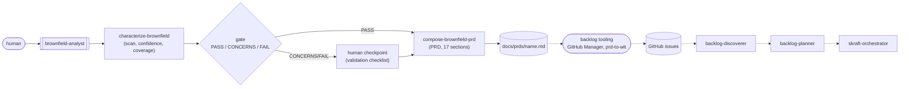
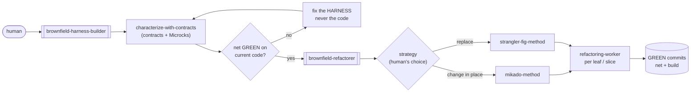
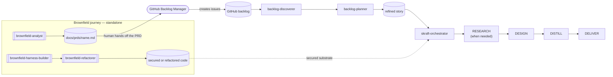

# Brownfield journey

> Brownfield is a top-level journey, sibling to the core journey. It starts from
> existing code rather than a refined story.

## When to choose this journey

Choose Brownfield when at least one of these conditions is true:

- code exists, but its product intent is not documented
- its real behavior or integrations remain uncertain
- missing tests make every change risky
- an incremental transformation must preserve live service

If a story is already refined and the code is sufficiently protected, select
`skraft-orchestrator` directly in the agent picker.

## Why this journey exists

The core journey starts either from issues prepared through DISCOVER then DISCUSS,
or directly from a refined story. `skraft-orchestrator` then transforms that story
through RESEARCH → DESIGN → DISTILL → DELIVER. A legacy system may arrive without
issues, explicit product intent, or a test safety net. The missing input must be
created, or the code must first become safe to change.

Brownfield answers with **two paths and three standalone roots**. The human selects
each agent directly. None is a `skraft-orchestrator` phase and none modifies its
state.

## Two paths, three roots

| Need | Workflow | What it produces |
|------|----------|------------------|
| **Understand** code without product documentation | [`brownfield-analyst`]({{ "/en/dashboard/" | relative_url }}#agent-brownfield-analyst) | a 17-section PRD, consumed by upstream backlog tooling to create issues |
| **Secure then transform** a legacy | [`brownfield-harness-builder`]({{ "/en/dashboard/" | relative_url }}#agent-brownfield-harness-builder) → [`brownfield-refactorer`]({{ "/en/dashboard/" | relative_url }}#agent-brownfield-refactorer) | a characterization test safety net, then a refactor that keeps it green |

The two paths can be chosen independently. In the second,
`brownfield-harness-builder` always precedes `brownfield-refactorer` so the
transformation is measured against reference behavior. The human remains the
decision maker at the moments that matter.

## Workflow 1 — from existing code to a PRD

[`characterize-brownfield`]({{ "/en/dashboard/" | relative_url }}#skill-characterize-brownfield)
reconstructs what the system does: stack, feature inventory, integration map,
existing API contracts, technical debt. Its central rule is **honesty about
confidence**: every claim is either a **fact** verified by a tool call, or an
**inference** tagged `High` / `Medium` / `Low`. A brownfield PRD built on false
certainty is worse than one that says "unknown." An optional **coverage
traceability** facet (adapted from test-architecture practice) rates each behavior
`FULL` / `PARTIAL` / `NONE` and feeds a **`PASS` / `CONCERNS` / `FAIL` gate**; below
the threshold, the human confirms or corrects before proceeding.

[`compose-brownfield-prd`]({{ "/en/dashboard/" | relative_url }}#skill-compose-brownfield-prd)
then maps that characterization onto the **17-section PRD format** (`FR-`/`NFR-`
IDs, traceability). This PRD is not a dead end: it is the deliverable the
human hands to the **upstream backlog tooling** (GitHub Backlog Manager, `prd-to-wit`) that turns it
into issues. `backlog-discoverer` triages them, then `backlog-planner` refines the
selected issue into a story for `skraft-orchestrator`.

## Workflow 2 — secure then transform

The net first.
[`characterize-with-contracts`]({{ "/en/dashboard/" | relative_url }}#skill-characterize-with-contracts)
discovers (or reconstructs) the service's API contract, stands up Microcks mocks for
its dependencies, and writes **characterization tests** — a *golden master* that
locks in the **current** behavior, bugs included. A bug captured here is a documented
bug, not a test to fix. This net reuses the existing
[`contract-testing-roster`]({{ "/en/dashboard/" | relative_url }}#skill-contract-testing-roster)
and [`mocking-strategy-roster`]({{ "/en/dashboard/" | relative_url }}#skill-mocking-strategy-roster)
skills as-is (v1 targets .NET. The roster keeps the stack extensible). The
[`brownfield-harness-builder`]({{ "/en/dashboard/" | relative_url }}#agent-brownfield-harness-builder)
only clears its gate when the net is **green on unmodified code**: a red test before
any refactoring means the harness is wrong, not the code.

> « Code without tests is bad code. »
> — Feathers, M., *Working Effectively with Legacy Code*, 2004.

Once the net is green, the
[`brownfield-refactorer`]({{ "/en/dashboard/" | relative_url }}#agent-brownfield-refactorer)
**recommends** a strategy — never imposes it: a structural change this consequential
stays a human decision.

- [`mikado-method`]({{ "/en/dashboard/" | relative_url }}#skill-mikado-method) —
  **change in place**. Attempt the change naively, record what breaks as prerequisite
  nodes in a graph, **revert** everything, then implement bottom-up from the leaves,
  each commit keeping the code green. The graph is the artifact; the experiment's code
  is throwaway.
- [`strangler-fig-method`]({{ "/en/dashboard/" | relative_url }}#skill-strangler-fig-method) —
  **replace** behind a facade. The new implementation grows alongside the old, traffic
  cuts over slice by slice, and the same contract replayed against old and new
  **proves equivalence** before each cutover. The old is strangled away.

Each leaf (Mikado) or slice (Strangler) goes to a fresh-context
[`refactoring-worker`]({{ "/en/dashboard/" | relative_url }}#worker-refactoring-worker)
that returns a terminal `ADVANCE` / `EXPAND` / `DONE` / `BLOCKED` signal. The net is
the **sensor**: any behavioral regression at the API boundary becomes a red test — a
discovered Mikado prerequisite, or a Strangler slice that cannot cut over.

## How the journey rejoins engineering

Both Brownfield paths remain outside `skraft-orchestrator`. They do not trigger it
or create any transition in its state. They prepare either its product input or
the code on which it can work.

- The **understand** path produces a PRD. Upstream backlog tooling derives issues from it,
  `backlog-discoverer` triages them, and `backlog-planner` refines the selected
  issue. The resulting story can then be handed to `skraft-orchestrator`.
- The **secure then transform** path acts on the technical substrate. It does not
  produce a story. Every new need must still be refined before selecting
  `skraft-orchestrator`.
- The characterization net stays active beneath new DELIVER tests. It detects
  behavioral regressions during subsequent changes.

## What stays with the human

Nothing here is autonomous end to end. The human chooses the workflow, decides the
refactoring strategy, confirms gates below threshold, and — for Mikado — **runs the
graph**: the one step the method does not delegate, because deciding which
prerequisite to attack is judgment, not execution.

## Sources

- Feathers, M., *Working Effectively with Legacy Code*, 2004 — characterization
  tests, seams, a net before modifying.
- Ellnestam & Brolund, *The Mikado Method*, 2014 — naive experiment, prerequisite
  graph, revert discipline.
- Fowler, M., *Bliki: StranglerFigApplication*, 2004 — incremental replacement behind
  a facade.

Terms to know: **golden master**, **characterization**, **contract**, **facade** —
defined in the [glossary]({{ "/en/reference/glossary" | relative_url }}).
