# L3 zoom: contract testing

> The [architecture]({{ "/en/explanation/architecture" | relative_url }}) view stops at
> L2. This page zooms into the sibling L3 fan-out: how DELIVER verifies that **our own**
> API behaves as its contract says.

## Why this zoom

The system-level diagram keeps `software-engineer` (L2) as a single box. Inside DELIVER
that agent **dispatches an internal sub-agent** (`contract-testing-worker`,
`user-invocable: false`) to wire the provider-side contract test. That is level **L3**,
hidden from the main diagram to keep it readable.

Unlike the [mocking fan-out]({{ "/en/explanation/deep-dive/mocking-microcks" | relative_url }})
(consumer-side, replaces what the service calls), this worker is **provider-side**: it
verifies our own API. The two never overlap.

## The L3 chain

```mermaid
graph LR
    SE[software-engineer<br/>L2 lead] -->|fan-out| CTW[contract-testing-worker<br/>L3]
    CTW -->|loads| RST[contract-testing-roster]
    RST -->|stack + opt-in| CTD[contract-testing-dotnet]
    CTW -->|Layer 1 always| BL[(WAF + HttpClient test)]
    CTW -->|Layer 2 iff opt-in| MC[(Microcks TestEndpointAsync)]
    BL -.if active.-> CFL[contract-fidelity-lens]
    MC -.if active.-> CFL
    CFL -->|verdict| SER[software-engineer-reviewer]

    style SE fill:#2d5a3d,stroke:#4ed58a,stroke-width:2px
    style CTW fill:#243a2e,stroke:#4ed58a
    style CFL fill:#3a2e1a,stroke:#d5a84e
```

The worker detects the stack and reads the Microcks opt-in through a cascade — prompt >
`skraft.instructions.md` `testing.contract.microcks` > default `false` — by tool call,
then the
`contract-testing-roster` skill
returns the adapter and the opt-in flag (or a blocker).

| Layer | When | What it wires |
| --- | --- | --- |
| Layer 1 — baseline | **always**, regardless of opt-in | a `WebApplicationFactory` + `HttpClient` integration test |
| Layer 2 — Microcks | only when the opt-in is `true` | a `TestEndpointAsync(OPEN_API_SCHEMA)` provider test, **added** to the baseline |

The Microcks layer is **additive** — it never replaces the baseline and is never
suppressed. The worker emits test wiring only and returns a structured result; it never
commits. The lead keeps the business TDD cycle and verifies the worker in **TIER-1**.

## How the fidelity lens audits it

When the reviewed diff touches a contract, a `VerifyAsync`/`TestEndpointAsync` call, or
a provider-side scaffold, the `contract-fidelity-lens` joins the adversarial panel of
the `software-engineer-reviewer` (conditional, not one of the four CORE lenses).

| Gate | What it checks | Severity |
| --- | --- | --- |
| K1 | The baseline WAF + HttpClient test is present | blocker |
| K2 | The Microcks layer matches the opt-in (present iff `true`) | high |
| K3 | The contract test result is asserted, not suppressed, when the opt-in is on | blocker |
| K4 | The response contract is actually asserted (codes, headers, ProblemDetails shape) | high |
| K5 | No real downstream call leaks | blocker |

## Why this practice

> « We grow working software, guided by tests, from the outside in. »
> — Freeman, S. & Pryce, N., *Growing Object-Oriented Software, Guided by Tests*, 2009.

A provider-side contract test pins the boundary of our own API so a consumer can trust
its shape without a live end-to-end environment.

## Pitfalls & anti-patterns

- **Dropping the baseline** when the Microcks opt-in is on — Layer 1 is always required
  (K1); Layer 2 is additive, never a replacement (K2 / K3).
- **Asserting only the status code** and ignoring headers or the ProblemDetails shape —
  the contract is under-verified (K4).
- **A live hostname** leaking into the provider test instead of the in-process host
  (K5).

## Going further

- [Architecture]({{ "/en/explanation/architecture" | relative_url }}) — the L1 + L2 view this page zooms out of.
- [L3 zoom: mocking (Microcks)]({{ "/en/explanation/deep-dive/mocking-microcks" | relative_url }}) — the sibling consumer-side fan-out.
- [DELIVER]({{ "/en/explanation/pipeline/deliver" | relative_url }}) — the phase that owns this fan-out.
- [Agentic catalogue]({{ "/en/dashboard/" | relative_url }}) — every agent, worker and lens. Unsure about a term? See the [glossary]({{ "/en/reference/glossary" | relative_url }}).

## Sources

- Freeman, S. & Pryce, N., *Growing Object-Oriented Software, Guided by Tests*, 2009.
