# L3 zoom: mocking (Microcks)

> The [architecture]({{ "/en/explanation/architecture" | relative_url }}) view stops at
> L2. This page zooms into one L3 fan-out: how DELIVER mocks a downstream dependency
> the service-under-test calls.

## Why this zoom

The system-level diagram keeps `software-engineer` (L2) as a single box so it stays
readable. But inside DELIVER that agent does not wire integration tests by hand — it
**dispatches an internal sub-agent** (`mock-integration-worker`, `user-invocable:
false`) to do it. That is level **L3**: a fan-out the main diagram intentionally hides.

This page makes the L3 chain explicit so you can reason about it without crowding the
top-level view.

## The L3 chain

```mermaid
graph LR
    SE[software-engineer<br/>L2 lead] -->|fan-out| MIW[mock-integration-worker<br/>L3]
    MIW -->|loads| RST[mocking-strategy-roster]
    RST -->|microcks default| MMD[mocking-microcks-dotnet]
    RST -->|inprocess override| MID[mocking-inprocess-dotnet]
    MIW -->|test wiring| A[(integration test)]
    A -.if active.-> MFL[mock-fidelity-lens]
    MFL -->|verdict| SER[software-engineer-reviewer]

    style SE fill:#2d5a3d,stroke:#4ed58a,stroke-width:2px
    style MIW fill:#243a2e,stroke:#4ed58a
    style MFL fill:#3a2e1a,stroke:#d5a84e
```

The worker is **consumer-side**: it replaces what the service-under-test calls, never
the service itself. It resolves the strategy through an override cascade — prompt >
`skraft.instructions.md` `testing.mocking.*` > default `microcks` — reads that
instruction file by tool call, detects the stack, then the
`mocking-strategy-roster` skill
returns the concrete adapter (or a blocker).

| Resolved strategy | Concrete wiring |
| --- | --- |
| `microcks` (default) | a Microcks container seeded from the downstream contract |
| `inprocess` (override) | an in-process double — `fakeiteasy`, `nsubstitute` or `moq` |

The worker emits **test wiring only** and returns a structured result — it never
commits. The lead keeps the business TDD cycle and verifies the worker in **TIER-1**
(the test fails first, then passes). The downstream is mocked; the service-under-test
is not.

## How the fidelity lens audits it

When the reviewed diff touches a mock or an integration test that uses one, the
`mock-fidelity-lens` joins the adversarial panel of the `software-engineer-reviewer`
(it is conditional, not one of the four CORE lenses).

| Gate | What it checks | Severity |
| --- | --- | --- |
| M1 | The resolved strategy was honored (no Microcks where in-process was in force, and vice-versa) | high |
| M2 | The mock is actually wired into the test host | blocker |
| M3 | No real downstream call leaks | blocker |
| M4 | It mocks the downstream, not the service-under-test | high |

## Why this practice

> « Only mock types that you own. »
> — Freeman, S. & Pryce, N., *Growing Object-Oriented Software, Guided by Tests*, 2009.

Mocking a downstream you own the contract for keeps the integration test fast and
deterministic while still exercising the real boundary the service depends on.

## Pitfalls & anti-patterns

- **Mocking the service-under-test** instead of its downstream — the test then proves
  nothing about real behaviour (M4).
- **A mock created but never injected** into the SUT's client — the test still calls
  the real dependency (M2 / M3).
- **Hardcoding `dotnet test`** instead of resolving the command from the stack — the
  worker resolves it so the lead can run the TIER-1 verify.

## Going further

- [Architecture]({{ "/en/explanation/architecture" | relative_url }}) — the L1 + L2 view this page zooms out of.
- [L3 zoom: contract testing]({{ "/en/explanation/deep-dive/contract-testing" | relative_url }}) — the sibling provider-side fan-out.
- [DELIVER]({{ "/en/explanation/pipeline/deliver" | relative_url }}) — the phase that owns this fan-out.
- [Agentic catalogue]({{ "/en/dashboard/" | relative_url }}) — every agent, worker and lens. Unsure about a term? See the [glossary]({{ "/en/reference/glossary" | relative_url }}).

## Sources

- Freeman, S. & Pryce, N., *Growing Object-Oriented Software, Guided by Tests*, 2009.
