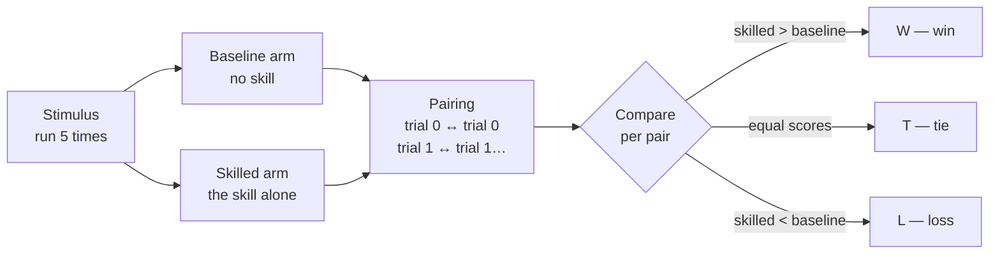
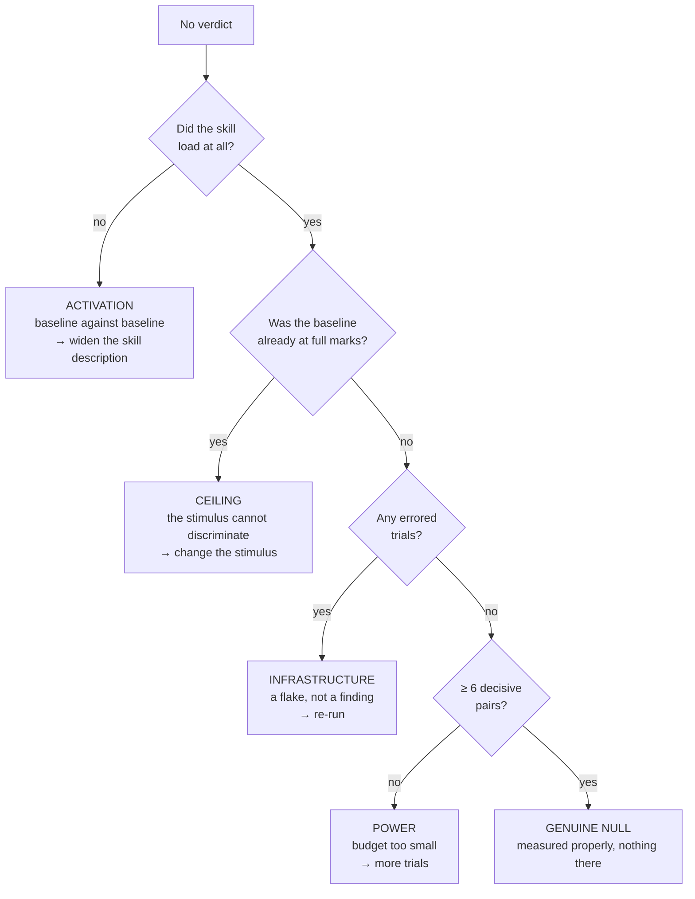

# Reading an evaluation verdict

> An evaluation verdict fits on one line: `9W/4T/2L (p=0.065)`. This page unfolds
> that line, number by number, on a real case from the repository.

---

## 1. The design: two arms, nothing else differs

Every stimulus runs **twice on the same input**: once with no skill mounted at
all, once with only the skill under test. Everything else is identical — same
model, same judge, same moment.



Pairing trial by trial is what makes the measurement usable: it cancels most of
the model's own variance. What remains is attributable to the skill.

---

## 2. From a batch of trials to three numbers

Take `adr-eligibility-gate`, measured over 3 stimuli × 5 trials = **15 pairs**:

> ℹ️ **9 wins · 4 ties · 2 losses**

---

## 3. Ties are thrown away — and that is the key move

A tie says **nothing about direction**. It is neither an argument for nor
against. The test sets those aside.

```
15 pairs to begin with

  W W W W W W W W W   T T T T   L L
  └───── 9 ─────┘   └── 4 ──┘  └2┘
                        ▲
                        │ discarded: no directional information
                        ▼
11 DECISIVE pairs remain  →  9 for, 2 against
```

The vocabulary matters: those 11 are the **discordant pairs**. They are the only
thing the sign test looks at.

---

## 4. The only question it asks

> **If the skill did nothing at all, each decisive pair would be a coin flip. How
> often does a fair coin tossed 11 times land at least as lopsided as 9 to 2?**

That is a counting exercise, not a formula. Across the 2¹¹ = **2048** equally
likely sequences:

```
 heads │ how many ways │ distribution
───────┼───────────────┼──────────────────────────────────────────────
     0 │       1       │ █                                    ← counted
     1 │      11       │ █                                    ← counted
     2 │      55       │ █████                                ← counted
     3 │     165       │ ███████████████
     4 │     330       │ ██████████████████████████████
     5 │     462       │ ██████████████████████████████████████████
     6 │     462       │ ██████████████████████████████████████████
     7 │     330       │ ██████████████████████████████
     8 │     165       │ ███████████████
     9 │      55       │ █████                                ← counted
    10 │      11       │ █                                    ← counted
    11 │       1       │ █                                    ← counted
───────┴───────────────┴──────────────────────────────────────────────
                              both tails: 134 out of 2048 = 0.065
```

**p = 0.065.** It reads: *"a coin that does nothing produces a result at least
this one-sided 6.5% of the time"*.

The threshold (the *alpha*) is **0.05**. 6.5% > 5% → not significant. Barely.

> ⚠️ **`p` is not the probability that the skill works.** And `1 − p` is not a
> confidence level. `p` answers one question only: *is this result hard to explain
> by chance?*

---

## 5. Why the floor sits at six decisive pairs

| Decisive pairs | `p` if **everything** is won | |
|---|---|---|
| 3 | 0.250 | ❌ |
| 4 | 0.125 | ❌ |
| 5 | 0.0625 | ❌ |
| **6** | **0.031** | ✅ |
| 7 | 0.016 | ✅ |
| 8 | 0.008 | ✅ |

With 5 decisive pairs, even a flawless **5W/0L** scores 0.0625 — above the
threshold. A coin lands heads five times running often enough that it proves
nothing.

> ℹ️ **Below six decisive pairs no result can conclude, however perfect.** That is why
> the verdict is `inconclusive` rather than "no improvement": the skill is not
> blamed for a trial budget that could never have concluded in either direction.

### What each loss costs

The table above assumes a flawless sweep. The moment one pair goes the other way
the bar rises — and it rises fast:

| Losses | Minimum wins | Decisive pairs | `p` reached |
|---|---|---|---|
| 0 | **6** | 6 | 0.031 |
| 1 | **8** | 9 | 0.039 |
| 2 | **10** | 12 | 0.039 |
| 3 | **12** | 15 | 0.035 |
| 4 | **13** | 17 | 0.049 |

```
   0 losses  ████████████ 6 wins
   1 loss    ████████████████ 8
   2 losses  ████████████████████ 10
   3 losses  ████████████████████████ 12
   4 losses  ██████████████████████████ 13
             └── each loss costs roughly two extra wins ──┘
```

**A loss is not cancelled by one win — it costs two.** That is the nature of the
test: a pair going the other way does not merely subtract from the count, it
makes the whole split less lopsided, and therefore less surprising for a coin.

`adr-eligibility-gate` had 9 wins and **2 losses**. The threshold at two losses
is 10 wins. **It fell exactly one win short** — one more pair in the right
direction and the verdict would have flipped.

---

## 6. The blind spot: magnitude

The sign test sees **direction only, never the size of the gap**.

```
A win by 0.001  ─┐
                 ├─→  both counted "W", indistinguishable
A win by 0.900  ─┘
```

Yet `adr-eligibility-gate` moved from **0.593 to 0.911** — one of the largest
movements measured. The sign test is blind to it.

That is what the **rank test** (Wilcoxon signed-rank) is for: it ranks pairs by
the size of their gap and weighs each one. On the same measurement it returns
**p = 0.012**, comfortably below the threshold.

| | Question asked | `adr` |
|---|---|---|
| **Sign test** | Does the skill win **often**? | p = 0.065 ❌ |
| **Rank test** | Does the skill win **by a lot**? | p = 0.012 ✅ |

Both must clear for a verdict to be credible. Requiring agreement rather than
either alone stops two shots at the same question from doubling the
false-positive rate on the field that gates a merge.

---

## 7. The other reasons a verdict does not conclude

An `inconclusive` is not always a budget problem. Four distinct causes, four
opposite actions:



**Adding trials only fixes the last branch.** On a skill that never activates,
doubling the budget simply doubles the number of discarded pairs.

---

## 8. The reading table

| Verdict | What it means | What to do |
|---|---|---|
| ✅ `pass` | Credible improvement: both tests clear, more wins than losses | Nothing — the skill earns its place |
| 🔴 `regression` | Credible harm | **Blocks the merge.** The only state that does |
| ➖ `no improvement` | Measured properly, the gap is indistinguishable from chance | Check magnitude and activation before concluding |
| ⚪ `inconclusive` | The measurement could not decide | Read the cause: errored trials, unmatched trials, or too small a budget |

A missing or fragile result is **never** displayed as a success.

---

## See also

- [Evaluating a skill]({{ "/en/how-to/evaluation" | relative_url }}) — the full procedure
- [Genesis & contributing]({{ "/en/how-to/contributing" | relative_url }}) — proposing a pattern
- [Dashboard]({{ "/dashboard/" | relative_url }}) — verdicts and their trend
