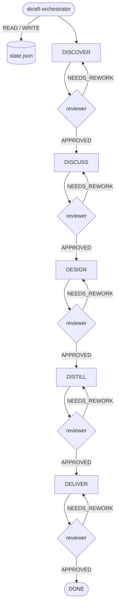

# The HVE-Core substrate

> SKRAFT is not autonomous: it runs on **HVE-Core**. This substrate carries the
> articulation of the phases in architecture — a shared memory (`state.json`), a turn
> protocol, and transitions gated by verdicts.

## Why a substrate

A 5-phase pipeline, with one agent and one reviewer per phase, needs a single source
of truth: where are we, what verdict was issued, how many retries happened. Without it,
each agent would improvise its own state and resuming after an interruption would be
impossible. HVE-Core provides that backbone, shared with the neighbour planners
(Security, RAI, SSSC).

## `state.json` — the pipeline memory

State persists as JSON at
`.copilot-tracking/skraft-plans/{project-slug}/state.json`. Key fields:

```json
{
  "currentPhase": "DISCOVER | DISCUSS | DESIGN | DISTILL | DELIVER | DONE",
  "phaseArtifacts": { "DESIGN": ["adrs/ADR-001-...md"], "...": [] },
  "reviewerVerdicts": { "DESIGN": "APPROVED | REJECTED | NEEDS_REWORK | null" },
  "retryCount": { "DESIGN": 0 },
  "userPreferences": {
    "autonomyTier": "full | partial | manual",
    "depthTier": "comprehensive",
    "maxRetriesPerPhase": 2
  },
  "neighborPlanners": { "securityPlanFile": null, "raiPlanFile": null, "ssscPlanFile": null }
}
```

- `currentPhase` advances **only** on an `APPROVED` verdict.
- `phaseArtifacts`, `reviewerVerdicts`, `retryCount` trace what each phase produced and
  how it was judged.
- `maxRetriesPerPhase` (default 2) bounds retries before human escalation.

## The six-step per-turn protocol

On **every turn**, before any user-facing output:

1. **READ** — load `state.json`.
2. **VALIDATE** — check the schema (otherwise run the recovery procedure).
3. **DETERMINE** — inspect `currentPhase`, the verdict and `retryCount` to decide the
   next concrete action.
4. **EXECUTE** — dispatch the phase agent, dispatch the reviewer, or request a human
   decision.
5. **UPDATE** — mutate state in memory (append-only on lists; `currentPhase` advances
   only on `APPROVED`; increment `retryCount` on retry).
6. **WRITE** — persist `state.json` before returning control.

## How the phases articulate

Each phase reads the state, writes its dated artifacts, then its reviewer writes a
verdict that gates the transition. The **orchestrator** is the single entry point.



On `REJECTED`/`NEEDS_REWORK`, the same phase is re-dispatched, `retryCount` increases,
and `currentPhase` does not move. When the retry threshold is reached without
`APPROVED`, the orchestrator escalates to the user.

## Neighbour planners

HVE-Core hosts other planners (Security, RAI, SSSC). SKRAFT references their plans via
`neighborPlanners.*` but **never writes** into their directory — each planner stays the
owner of its artifacts.

## See also

- [Traces & auditability](traces.html)
- [HVE → SKRAFT](hve-vs-skraft.html)
- [Architecture](architecture.html)
