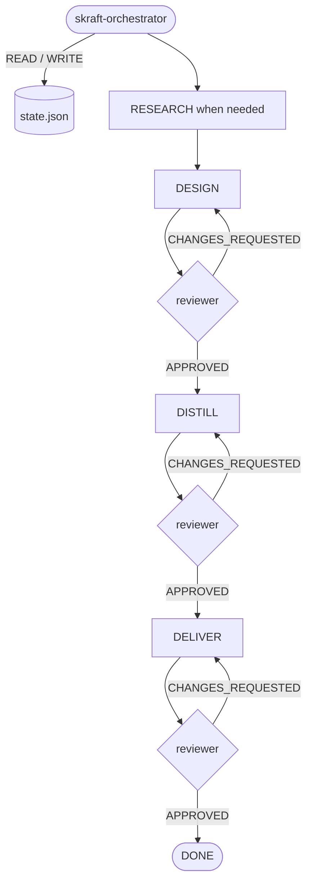

# The HVE-Core substrate

> HVE-Core gives the engineering pipeline durable memory (`state.json`), recovery
> after interruption, and transitions gated by verdicts.

## Why a substrate

The pipeline driven by `skraft-orchestrator` needs one source of truth: where
engineering stands, what verdict was issued, and how many retries happened. Without
it, every agent would improvise state and recovery after an interruption would be
impossible. DISCOVER, DISCUSS, and Brownfield roots remain standalone workflows.
They do not mutate this state.

## `state.json` — the pipeline memory

State persists as JSON at
`.copilot-tracking/skraft-plans/{project-slug}/state.json`. Its contract is the JSON Schema
`plugins/skraft-framework/src/domain/state.schema.json`. Key fields:

```json
{
  "currentPhase": "RESEARCH | DESIGN | DISTILL | DELIVER | DONE",
  "phaseArtifacts": { "DESIGN": ["adrs/ADR-001-...md"], "...": [] },
  "verdicts": { "DESIGN": "APPROVED | CHANGES_REQUESTED | null" },
  "retryCount": { "DESIGN": 0 },
  "userPreferences": { "maxRetriesPerPhase": 2 },
  "adrRatification": { "checkpointStatus": "none | awaiting_human | resolved", "pending": [], "ratified": [] }
}
```

- `currentPhase` advances **only** on an `APPROVED` verdict.
- `phaseArtifacts`, `verdicts`, `retryCount` trace what each phase produced and
  how it was judged.
- `maxRetriesPerPhase` (default 2) bounds retries before human escalation.
- `adrRatification` holds DESIGN until a human ratifies every proposed ADR.

The state CLI enforces that schema on every read and write. A field the schema does not
declare, or a value outside its shape, makes the state invalid: no older format is
migrated. A pipeline started with an earlier version therefore stops with
`INVALID_STATE`; `state.mjs diagnose` names the next command, and after `reset` the
orchestrator rebuilds the state from the artefacts on disk, with your confirmation.

The state carries **no quality dial**. Mutation and coverage thresholds, the four
adversarial review lenses, the Gherkin gate and the Outside-In double-loop TDD variant
are fixed once and for all by the `skraft-quality-bar` skill; they are the same on every
run, and nothing written into `state.json` can lower them.

## The write-through model

`state.json` is a safety snapshot, not a block reread on every turn:

1. **Rehydrate** — read and validate the snapshot once at session start.
2. **Execute** — decide from the last state the CLI printed, then dispatch an agent or request a human decision.
3. **Record** — apply each mutation through the deterministic `state.mjs` CLI, which prints the updated state.

## How the phases articulate

`skraft-orchestrator` is selected with a refined story. It sequences only
RESEARCH → DESIGN → DISTILL → DELIVER. RESEARCH may be skipped when a confirmed
upstream HVE handoff proves it already satisfied; it has no declared phase reviewer. The next three phases advance
according to verdicts from their dedicated reviewers.



On `CHANGES_REQUESTED`, the same phase is re-dispatched, `retryCount` increases,
and `currentPhase` does not move. When the retry budget is reached without
`APPROVED`, the orchestrator escalates to the user.

## See also

- [Traces & auditability](traces.html)
- [HVE → SKRAFT](hve-vs-skraft.html)
- [Architecture](architecture.html)
