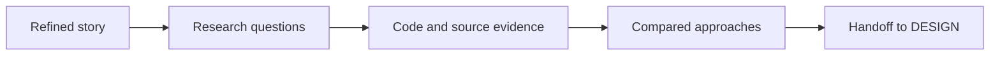



# RESEARCH — reduce uncertainty before design

> RESEARCH looks for evidence in code, conventions, and external sources. It recommends an approach without writing code or making the architecture decision.

## What enters / What exits

| What enters | What exits |
| --- | --- |
| Refined story, existing code, repository instructions | Cited research document with evaluated approaches, recommendation, and open questions for DESIGN |

The `solution-researcher` works in two stages: scope questions and gather sources,
then compare approaches. Every finding points to a source. DESIGN retains ownership
of ADRs and architecture.

☕ Running example — Starbucks <em>(illustrative)</em>

The “order a customised drink” story enters with its criteria. RESEARCH identifies
the existing payment provider, repository constraints, and integration options. It
hands DESIGN a sourced recommendation without choosing the ADR.

## Gates crossed here

RESEARCH has no declared phase reviewer. Its blocking contract is traceability: an
unsourced assertion is removed. Reviewers and gates for subsequent phases remain in
the [gates reference]({{ "/en/reference/gates" | relative_url }}).

## Source

This page reflects the
[`solution-researcher`]({{ "/en/dashboard/" | relative_url }}#agent-solution-researcher) descriptor.
